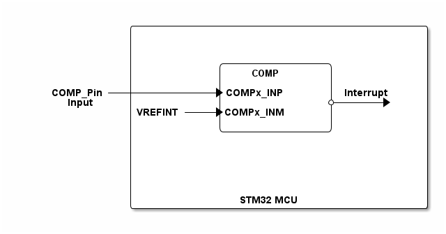

# __Example: *hal_comp_vref_it*__

**Example version:** 2.0.0

[](https://dev.st.com/stm32cube-docs/examples/arch-v1/en/index.html "An offline version is also available in the STM32Cube firmware package.")

How to use a comparator peripheral to compare a voltage level applied on COMP input pin to the internal voltage reference (VrefInt), in interrupt mode.


## __1. Detailed scenario__

__Initialization phase__: At main program start, the `mx_system_init()` function is called. It initializes the peripherals, nonvolatile memory (such as flash memory, NVM, or external memories), MPU regions (if applicable), the system clock, and the SysTick.

The application executes the following __example steps__:

__Step 1__: initialises the COMP instance.

__Step 2__: starts the comparator in interrupt mode.

__Step 3__: Switches to STOP mode. When the comparator input crosses (rising or falling edge)
            the internal reference voltage VrefInt, the comparator generates
            an interrupt and system wakes-up from Stop mode.

__Step 4__: waits for the wake up from Stop mode (through the EXTI line), then re-configures the clock.
            Restores the systick.

When the system is in stop mode. The LED is off. Once a rising or falling edge is detected. The system wakes up and the LED blinks once.

__End of example__: This example is repeated endlessly (step 3 to step 4 are executed in loop).


## __2. Example configuration__

[](https://dev.st.com/stm32cube-docs/examples/arch-v1/en/configure/config_toc.html "An offline version is also available in the STM32Cube firmware package.")

This example demonstrates the following peripheral(s):

- COMP

The comparator has configurable plus and minus inputs used for flexible voltage selection:

- The minus input of the comparator can be connected to the internal reference voltage, which is generated by a voltage scaler.
- The plus input can be connected to various sources, such as an external voltage supply.
- The interrupt generation capability of the comparator allows the system to wake-up from Stop modes through the EXTI controller.

- PWR

When calling the function to enter STOP mode, we need to specify the wake up parameter:

- HAL_PWR_LOWPOWER_MODE_WFI (Wait For Interrupt).

In this example, we have used the deepest Stop mode. But, the use case can work with any stop mode valid in the STM32 series.


## __3. Hardware environment and setup__

### __3.1. Generic Setup__

This section describes the hardware setup principles that apply to any board.

<!--
```
@startuml
@startditaa{doc/STMicroelectronics.example_hal_comp_vref_it.png}

                /------------------------------------------\
                |                                          |
                |                                          |
                |                                          |
                |            /---------------\             |
                |            |     COMP      |             |
                |            |               |             |
     COMP_Pin---+----------+->COMPx_INP      |Interrupt    |
       Input    |            |               *--+--+->     |
                |VREFINT---+->COMPx_INM      |             |
                |            |               |             |
                |            \---------------/             |
                |                                          |
                |                                          |
                |                                          |
                |                                          |
                |                                          |
                |                                          |
                |               STM32 MCU                  |
                \------------------------------------------/


@endditaa
@enduml
```
-->



### __3.2. Specific board setups__

Please find the exact hardware configurations of your project below.

<details>
  <summary>On STM32C5 series.</summary>
  <details>
    <summary>On board NUCLEO-C542RC.</summary>

  |  MCU pin  |  Signal name  |  User Label   |
  |:---------:|:-------------:|:-------------:|
  |    PA5    |     GPIO      | MX_STATUS_LED |
  |    PH0    |  RCC_OSC_IN   |    OSC_IN     |
  |    PH1    |  RCC_OSC_OUT  |    OSC_OUT    |

  </details>
  <details>
    <summary>On board NUCLEO-C562RE.</summary>

  |  MCU pin  |  Signal name  |  User Label   |
  |:---------:|:-------------:|:-------------:|
  |    PA5    |     GPIO      | MX_STATUS_LED |
  |    PH0    |  RCC_OSC_IN   |    OSC_IN     |
  |    PH1    |  RCC_OSC_OUT  |    OSC_OUT    |
  |    PB0    |  COMP1_INP2   |      PB0      |

  </details>
  <details>
    <summary>On board NUCLEO-C5A3ZG.</summary>

  |  MCU pin  |  Signal name  |  User Label   |
  |:---------:|:-------------:|:-------------:|
  |    PA5    |     GPIO      | MX_STATUS_LED |
  |    PH0    |  RCC_OSC_IN   |  PH0_OSC_IN   |
  |    PH1    |  RCC_OSC_OUT  |  PH1_OSC_OUT  |
  |    PB0    |  COMP1_INP2   |      PB0      |

  </details>
</details>

## __4. Troubleshooting__

[](https://dev.st.com/stm32cube-docs/examples/arch-v1/en/debug/debug_toc.html "An offline version is also available in the Cube Firmware package.")

Here are the points of attention for this specific example:

  1. Internal voltage reference (VrefInt)

  For precise information on the internal voltage reference(VrefInt), please consult the official STMicroelectronics datasheet for your MCU.
  In the datasheet, refer to the "Electrical Characteristics" section, where you will find details on VrefInt, including its typical value, tolerances, and operating conditions.

  2. Applying an external voltage

  There are two options:

    - Connection to a fixed voltage (3.3 V)
      Connect the GPIO pin directly to a 3.3 V source available on the board (for example, a 3.3 V pin from the board's power supply).
      This can be done using a jumper wire or a jumper.

    - Using an external power supply
      Connect an external power supply (for example, a laboratory power supply) to the configured GPIO pin.
      Make sure the applied voltage is within the valid range for the comparator and the GPIO pin (for example, from 0 V to 3.3 V).

  3. System clock after STOP mode

  When exiting from STOP mode, the system clock must be reconfigured (see the RCC peripheral section in the reference manual of your MCU).

  4. Wakeup sources from STOP mode

  - Any peripheral interrupt occurring when the AHB/APB clocks are present (if the peripheral vector is enabled in the NVIC) can wake up the system from STOP mode, not only EXTI.
  - For this reason, the SysTick interrupt is disabled before entering STOP mode.

  5. Floating COMP input

  - When no external signal is applied on the COMP pin, the input is floating.
  - This may cause random COMP triggers and unwanted system wakeup.


## __5. See Also__

[](https://dev.st.com/stm32cube-docs/examples/arch-v1/en/more/more_toc.html "An offline version is also available in the STM32Cube firmware package.")

More information about the STM32 Cube Drivers can be found in the drivers' user manual of the STM32 series you are using.

For instance for the STM32C5 series: [HAL documentation](https://dev.st.com/stm32cube-docs/stm32c5xx-hal-drivers/latest/en/index.html).

More information about the STM32 ecosystem can be found in the [STM32 MCU Developer Zone](https://www.st.com/content/st_com/en/stm32-mcu-developer-zone/embedded-software.html).


## __6. License__

Copyright (c) 2026 STMicroelectronics.

This software is licensed under terms that can be found in the LICENSE file in the root directory
of this software component.
If no LICENSE file comes with this software, it is provided AS-IS.
