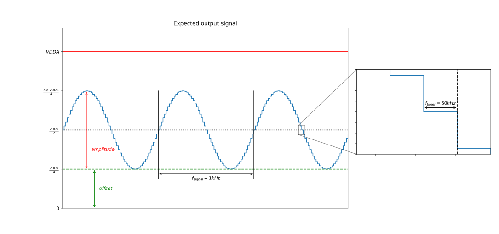

# __Example: *hal_dac_signal_generation_dma_silent_tim*__

**Example version:** 2.0.0

How to use the DAC HAL API to generate a sinusoidal signal using the DMA feature with a timer
trigger.

## __1. Detailed scenario__

__Initialization phase__: At main program start, the `mx_system_init()` function is called. It initializes the peripherals, nonvolatile memory (such as flash memory, NVM, or external memories), MPU regions (if applicable), the system clock, and the SysTick.

The application executes the following __example steps__:

__Step 1__: The DAC, DMA and TIM are initialized by app_init().

__Step 2__: Converts the data from millivolts to raw data because the DAC cannot handle directly millivolts data but only
raw data between 0 and the maximum DAC resolution.

__Step 3__: The DAC conversion is started using the DMA feature and the TIM to trigger the DAC conversion.

__End of example__: The DAC conversion is repeated endlessly. Thanks to a circular buffer, each time the TIMER triggers the
DAC, the DAC triggers the DMA to get a new value to convert.
The example status is reported via the variable **`ExecStatus`**,
and the status LED remains turned on in case of success.

  
The final output signal is a sine with a frequency of 1 kHz, an amplitude of VDDA/2 and an offset of VDDA/4.

  

## __2. Example configuration__

__DAC__: The peripheral is configured with specific parameters:

  - Timer trigger,
  - 12-bits DAC data are used with right alignment,
  - Output buffer enabled,
  - Circular buffer.
  The DAC uses the DMA feature to transfer data to be converted.

__DMA__: Configured to transfer data from the memory to the DAC each time the DAC conversion is triggered. Data is
stored as a buffer and the address of the element to be transferred is incremented after each transfer.

  *Note:* Data transferred to the DMA are in raw data to be used by the DAC. The macro LL_DAC_CALC_VOLTAGE_TO_DATA is used
  to convert data in voltage units to raw data.

__TIM__: Configured to trigger the DAC with the following parameters:

  - Timer update event is used as an output trigger (TRGO)
  - Parameters have been chosen to get a SIG_FREQ = 1 kHz signal in the output of the DAC.
  - The repetition counter (if present) is not used here.

  
The aim is to have a 1 kHz sine waveform.

  The buffer containing the sine waveform samples is BUFFER_SIZE long (60 samples).
  Therefore, each sample of the buffer signal should be transferred with a frequency of:
    > TRGO_freq = Sig_freq * BUFFER_SIZE = 60 kHz

  *Note:* This frequency corresponds to the timer frequency.

  To get this 60 kHz, the period should be configured according to the formula below:
    > TRGO_freq = Timer_clock_freq/((PRESCALER_VALUE + 1) * (PERIOD_VALUE + 1))

  *Note:* The "+1" used in formulas is needed because the registers values start from 0.

  Ideally the solution to the above equation should be found with a low PRESCALER_VALUE to have a better precision.
  The PERIOD_VALUE must not overflow the ARR register (16bits/32bits).

  > PERIOD_VALUE = (Timer_clock_freq/(TRGO_freq * (PRESCALER_VALUE + 1))) - 1

## __3. Hardware environment and setup__

### __3.1. Generic Setup__

The hardware setup of the timer counter applies to any board with the same clock tree.

  
On board with STM32C5xx MCUs

  
Common configuration

  Timer's counter clock configuration with prescalers and APB prescalers set to 1:

  - The AHB clock (HCLK) and system core clock are set to system clock (SYSCLK).
  - The timer's internal input clock (tim_ker_ck) is set to its respective APB clock (PCLK).

      tim_ker_ck = PCLK = HCLK = SYSCLK (system clock)

      So, tim_ker_ck = HCLK in Hz

  To obtain the timer's counter clock frequency (tim_cnt_ck), the timer prescaler register (TIM_PSC) is computed as follows:

      TIM_PSC = (HCLK / tim_cnt_ck ) - 1
<!---
@startuml
@startditaa{doc/stm32c5_peripherals_clocks.png}
 +---------+
  | clock   |
  | source  |
  | control |
 +---+-----+
  |
    ++-\
  --+  |
  |  |
  |  |
  --+  |           +---------------+        +--------------+
  |  |  SYSCLCK  |  AHB          |  HCLK  |  APBx        |  PCLKx
  |  +-----------+  PRESC        +----+---+  PRESC       +--------------------------------
  --+  |           |  / 1,2,...512 |    |   | / 1,2,4,8,16 |          To APBx peripherals
  |  |           +---------------+    |   +--------------+
  |  |                                |
  --+  |                                +---------------------------------------------------
  |  |                                                                          To TIMx
    +--/
@endditaa
@enduml
-->
  

In this configuration:

  - The HCLK is set to 144 MHz

  PERIOD_VALUE calculation with APB prescaler set to 1 and HCLK set to 144 MHz:
  > PERIOD_VALUE = (Timer_clock_freq/(TRGO_freq * (PRESCALER_VALUE + 1))) - 1

  This equation can be resolved with:
  > PRESCALER_VALUE = 0
  >
  > PERIOD_VALUE = (144 MHz / 60 kHz) - 1
  > PERIOD_VALUE = 2399

  

### __3.2. Specific board setups__

This section describes the exact hardware configurations of your project.

  
On STM32C5 series.

  

    
On board NUCLEO-C542RC.

  |  MCU pin  |  Signal name  |  User Label   |
  |:---------:|:-------------:|:-------------:|
  |    PA5    |     GPIO      | MX_STATUS_LED |
  |    PH0    |  RCC_OSC_IN   |    OSC_IN     |
  |    PH1    |  RCC_OSC_OUT  |    OSC_OUT    |
  |    PA4    |   DAC1_OUT1   |      PA4      |

  

  

    
On board NUCLEO-C562RE.

  |  MCU pin  |  Signal name  |  User Label   |
  |:---------:|:-------------:|:-------------:|
  |    PA5    |     GPIO      | MX_STATUS_LED |
  |    PH0    |  RCC_OSC_IN   |    OSC_IN     |
  |    PH1    |  RCC_OSC_OUT  |    OSC_OUT    |
  |    PA4    |   DAC1_OUT1   |      PA4      |

  

  

    
On board NUCLEO-C5A3ZG.

  |  MCU pin  |  Signal name  |  User Label   |
  |:---------:|:-------------:|:-------------:|
  |    PA5    |     GPIO      | MX_STATUS_LED |
  |    PH0    |  RCC_OSC_IN   |  PH0_OSC_IN   |
  |    PH1    |  RCC_OSC_OUT  |  PH1_OSC_OUT  |
  |    PA4    |   DAC1_OUT1   |      PA4      |

  

## __4. Troubleshooting__

Using the buffer feature of the DAC can impact its accuracy. To have further information about the DAC accuracy, you can
check the datasheet and the reference manual corresponding to your MCU.

## __5. See Also__

- [Application Note AN4566](https://www.st.com/content/ccc/resource/technical/document/application_note/6f/35/61/e9/8a/28/48/8c/DM00129215.pdf/files/DM00129215.pdf/jcr:content/translations/en.DM00129215.pdf): How to improve DAC performance in STM32 microcontrollers

- [Application Note AN3126](https://www.st.com/content/ccc/resource/technical/document/application_note/05/fb/41/91/39/02/4d/1e/CD00259245.pdf/files/CD00259245.pdf/jcr:content/translations/en.CD00259245.pdf): How to use DAC for audio and waveform generation in STM32 products.

- [Application Note AN4013](https://www.st.com/resource/en/application_note/dm00042534-stm32-cross-series-timer-overview-stmicroelectronics.pdf): How to configure the Timer

You can also refer to these other examples:

- examples_hal_tim_timebase: demonstrates TIM peripheral using the timebase feature

More information about the STM32Cube drivers can be found in the user manual of the drivers dedicated to the STM32
series you are using.

For instance for the STM32C5 series: [HAL documentation](https://dev.st.com/stm32cube-docs/stm32c5xx-hal-drivers/latest/en/index.html).

More information about the STM32 ecosystem can be found in the [STM32 MCU Developer Zone](https://www.st.com/content/st_com/en/stm32-mcu-developer-zone/embedded-software.html).

## __6. License__

Copyright (c) 2026 STMicroelectronics.

This software is licensed under terms that can be found in the LICENSE file in the root directory
of this software component.
If no LICENSE file comes with this software, it is provided AS-IS.
