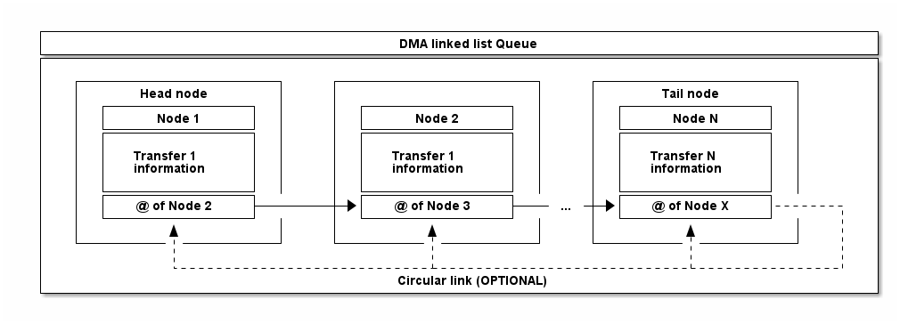

# __Example: *hal_dma_linked_list*__

**Example version:** 2.0.0

How to use a DMA peripheral to perform linked list transfers.
This example is based on the HAL DMA and HAL Q APIs.

## __1. Detailed scenario__

__Initialization phase__: At main program start, the `mx_system_init()` function is called. It initializes the peripherals, nonvolatile memory (such as flash memory, NVM, or external memories), MPU regions (if applicable), the system clock, and the SysTick.

The application executes the following __example steps__:

__Step 1__: Fill the DMA linkied list nodes with specifying the source address, the destination address and the data size in bytes for each node.

__Step 2__: Initialize the DMA linked list Queue object and build it using nodes filled in previously.

__Step 3__: Initialize the DMA channel in linked list mode and register transfer error and transfer complete user callbacks.

__Step 4__: Starts the DMA linked list Queue execution in interrupt mode.

__Step 5__: Enters sleep mode and waits for any DMA interrupt (transfer complete or transfer error).

__Step 6__: Checks DMA transfers for each DMA linked list node within the executed Queue.

__Step 7__: Deinitializes the DMA channel instance, the DMA channel handle object, deinitilize the DMA linked list Queue and unlink used nodes.

__End of example__: Reports the outcome of the data transfers via the variable **`ExecStatus`**,
and the **status LED** remains turned on in case of success.

## __2. Example configuration__

__DMA__:

Configured to execute linked list Queue in interrupt mode.

In contrast to direct mode, DMA operating in linked list mode manages data transfers through a sequence of linked descriptors known as nodes. Each node contains the parameters of a specific transfer block as well as a pointer to the subsequent node in the chain.
This sequence of nodes forms a linked list, commonly referred to as a "Queue" or "Q," which enables the DMA controller to autonomously perform multiple data transfers in a sequential manner without CPU intervention.
The linked list queue structure offers flexible and efficient handling of complex or non-contiguous memory transfers, thereby optimizing overall system performance by reducing CPU bandwidth usage.
The first node in the linked list queue is designated as the "Head" node, while the last node is known as the "Tail" node.
A DMA linked list queue can be configured in two ways

- __Linear__: The tail node does not link to any other node, marking the end of the queue (Finite transfers over time).

- __Circular__: The tail node links back to one of the preceding nodes within the queue, enabling continuous cyclic transfers (Infinite transfers over time).

<!--
@startuml
@startditaa{doc/ASCII_ditaa_linked_list.png}

  +---------------------------------------------------------------------------------------------+
  |                                     DMA linked list Queue                                   |
  +---------------------------------------------------------------------------------------------+
  |                                                                                             |
  |   +----------------------+     +----------------------+     +----------------------+        |
  |   |      Head node       |     |                      |     |      Tail node       |        |
  |   |  +----------------+  |     |  +----------------+  |     |  +----------------+  |        |
  |   |  |     Node 1     |  |     |  |     Node 2     |  |     |  |     Node N     |  |        |
  |   |  +----------------+  |     |  +----------------+  |     |  +----------------+  |        |
  |   |  |                |  |     |  |                |  |     |  |                |  |        |
  |   |  |   Transfer 1   |  |     |  |   Transfer 1   |  |     |  |   Transfer N   |  |        |
  |   |  |   information  |  |     |  |   information  |  |     |  |   information  |  |        |
  |   |  |                |  |     |  |                |  |     |  |                |  |        |
  |   |  +----------------+  |     |  +----------------+  |     |  +----------------+  |        |
  |   |  |  @ of Node 2   +--------+->+  @ of Node 3   +----...-+->+  @ of Node X   +-------+   |
  |   |  +----------------+  |     |  +----------------+  |     |  +----------------+  |    :   |
  |   |          ^           |     |          ^           |     |          ^           |    |   |
  |   +----------|-----------+     +----------|-----------+     +----------|-----------+    |   |
  |              |                            |                            |                |   |
  |              +----------------------------+----------------------------+----------------+   |
  |                                    Circular link (OPTIONAL)                                 |
  +---------------------------------------------------------------------------------------------+

@endditaa
@enduml
-->

## __3. Hardware environment and setup__

### __3.1. Generic Setup__

JTAG/SWD probe may be used to check variables.

### __3.2. Specific board setups__

This section describes the exact hardware configurations of your project.
This example can run without external setup.

On STM32C5 series.

On board NUCLEO-C542RC.

| Board pin | MCU pin | Signal name   | ARDUINO connector pin      |
| :-------: | :-----: | :-----------: | :------------------------: |
|     -     | PA5     | MX_STATUS_LED |            -               |

On board NUCLEO-C562RE.

| Board pin | MCU pin | Signal name   | ARDUINO connector pin      |
| :-------: | :-----: | :-----------: | :------------------------: |
| CN5-6     | PA5     | MX_STATUS_LED | ARDUINO CONNECTOR - D13    |

On board NUCLEO-C5A3ZG.

| Board pin | MCU pin | Signal name   | ARDUINO connector pin      |
| :-------: | :-----: | :-----------: | :------------------------: |
|     -     | PA5     | MX_STATUS_LED |             -              |

## __4. Troubleshooting__

Here are the points of attention for this specific example:

Take care of __data misalignment__:
Depending on the DMA data width used, source and destination addresses must respect data alignment.
For details, refer to the reference manual of your MCU.

Take care of __cache coherency issue__:
When the data cache memory is enabled, it is generally not in the path of DMA transfer, thus a cache coherency issue might
appear. It might be necessary to tackle cache coherency.
See H7 FAQ:
[DMA-is-not-working-on-STM32H7-devices](https://community.st.com/s/article/FAQ-DMA-is-not-working-on-STM32H7-devices).

Take care of __DMA ports__:
Depending on STM32 series, and DMA instance used (GPDMA/HPDMA/LPDMA) specific DMA ports constraints must be respected.
For details, refer to the reference manual of your MCU. You can also see the application note in the `__5. See Also` section.

## __5. See Also__

- [Application Note AN5593](https://www.st.com/resource/en/application_note/an5593-how-to-use-the-gpdma-for-stm32u5-series-microcontrollers-stmicroelectronics.pdf): How to use the GPDMA for STM32U5 Series microcontrollers

The documentation of the drivers of the relevant STM32 series contains more detailed information.

For instance for the STM32C5 series: [HAL documentation](https://dev.st.com/stm32cube-docs/stm32c5xx-hal-drivers/latest/en/index.html).

More information about the STM32 ecosystem can be found in the [STM32 MCU Developer Zone](https://www.st.com/content/st_com/en/stm32-mcu-developer-zone/embedded-software.html).

## __6. License__

Copyright (c) 2026 STMicroelectronics.

This software is licensed under terms that can be found in the LICENSE file in the root directory
of this software component.
If no LICENSE file comes with this software, it is provided AS-IS.
