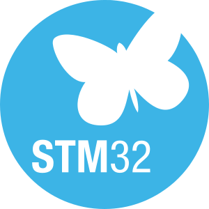
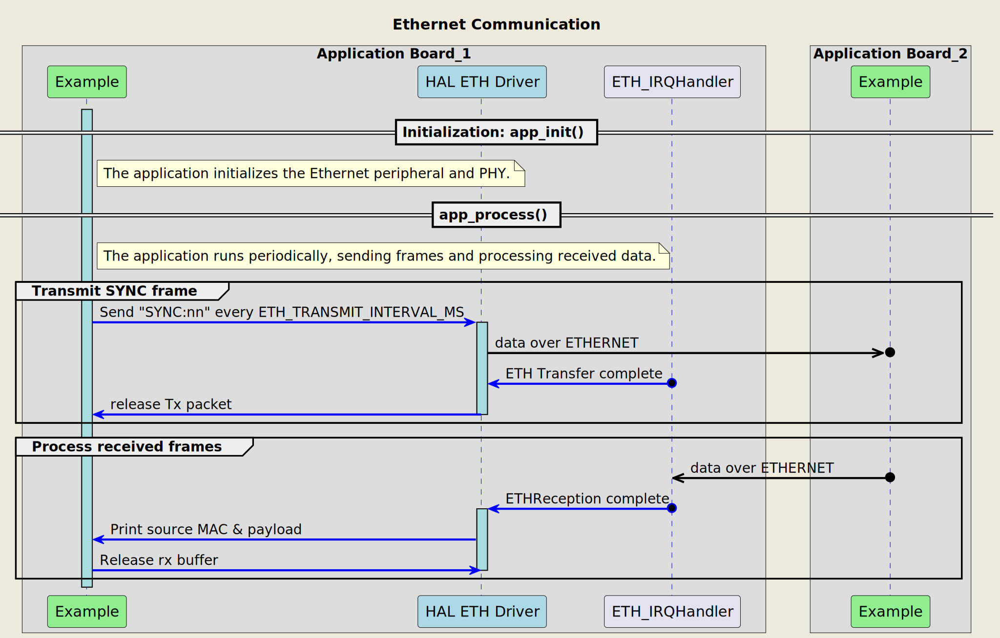

# __Example: *hal_eth_send_receive*__

**Example version:** 2.0.0

[](https://dev.st.com/stm32cube-docs/examples/arch-v1/en/index.html "An offline version is also available in the STM32Cube firmware package.")

How to implement a basic Ethernet communication application using the STM32 HAL Ethernet driver and the LAN8742 PHY.  
This example demonstrates initialization, periodic frame transmission, reception, and link state management.

The example implements a simple broadcast sender and a receiver logic (both roles can run on each board) relying on DMA aligned static buffers and link state supervision.


## __1. Detailed scenario__

This example demonstrates how to set up and use the STM32 HAL Ethernet driver with a LAN8742 PHY to send and receive Ethernet frames.
The application initializes the Ethernet peripheral, configures the PHY, and manages frame transmission and reception.
The main loop periodically sends a broadcast "SYNC" frame and processes any received frames, printing their source MAC address and payload.

__Initialization phase__: At the beginning of the `main()` function, the `mx_system_init()` function is called to initialize the peripherals, the flash interface, the system clock, and the SysTick.

The application executes the following __example steps__:

__Step 1__: Configures and initializes the Ethernet (ETH) instance and NVIC. Registers user callbacks for Ethernet events: Tx complete, Rx complete, data event and Rx allocation.

__Step 2__: Periodically (every 100 ms by default) prepares and transmits a broadcast Ethernet frame with a `SYNC:nn` payload, where `nn` is an ASCII frame counter that rolls over from 99 to 00.

__Step 3__: When a frame reception is indicated, the application dequeues a buffer from the FIFO of completed Rx operations, validates its length and EtherType (0x88B5), extracts the source MAC address and prints the payload string.

__Step 4__: Periodically (every 10 s by default) checks the Ethernet link state through the LAN8742 PHY. If a change in speed or duplex is detected while the link is up, the MAC configuration is updated accordingly. Returns to Step 2 indefinitely if no error occurs.

__End of example__: If the link remains up, frames are continuously sent and any received matching protocol frames are displayed. The loop is endless for demonstration purposes.


The example could be verified by examining the terminal logs, which show the initialization status, transmitted frame counters, and received frame details.

When USE_TRACE is enabled, the execution steps become visible in the terminal logs :
"```"
[INFO] Step 1: Device initialization COMPLETED.
Received Frame MAC Addr: xx:xx:xx:xx:xx:xx, message: SYNC:nn
...
"```"

__Steps 2 and 3 are detailed with the following sequence diagram:__




## __2. Example configuration__

[](https://dev.st.com/stm32cube-docs/examples/arch-v1/en/configure/config_toc.html "An offline version is also available in the STM32Cube firmware package.")

__Ethernet__:

- HAL Ethernet driver used with LAN8742 PHY abstraction.
- Static broadcast destination MAC (FF:FF:FF:FF:FF:FF); source MAC is filled before Tx.
- Custom EtherType `0x88B5` differentiates demo frames from other traffic.
- Frame payload starts with `SYNC:` followed by a two-digit counter.

__DMA__:

- Tx and Rx DMA descriptors placed in aligned static arrays sized from descriptor count macros.
- A static pool (default 50 buffers of 1518 bytes) provides deterministic memory for frame Tx/Rx.
- FIFO of received buffer tags decouples ISR context from application processing.

__Timing__:

- Transmit interval: 100 ms (macro `ETH_TRANSMIT_INTERVAL_MS`).
- Link check interval: 10 s (macro `ETH_LINK_CHECK_INTERVAL_MS`).

__Memory safety__:

- No dynamic allocation; pool managed by simple FREE/ALLOC state enum.
- Bounds and EtherType checks performed before printing payload.


## __3. Hardware environment and setup__

### __3.1. Generic Setup__

Two STM32 boards (or one plus a network capture device) connected through an Ethernet network (direct cable or switch) via RJ45. Each board flashes the same example; frames are visible on any listening host or the peer board.

### __3.2. Specific board setups__

Refer to your board reference manual for the Ethernet pinout and required clock configuration. Ensure proper PHY power and clock availability (RMII/MII strap options as applicable). The NUCLEO-C5A3ZG board is supported by default in this example generation.


## __4. Troubleshooting__

[](https://dev.st.com/stm32cube-docs/examples/arch-v1/en/debug/debug_toc.html "An offline version is also available in the STM32Cube firmware package.")

__No received frames printed__: Verify link is up (check PHY LEDs) and that the other board is running the example. Confirm the EtherType (0x88B5) is not filtered by your monitoring tool.

__Counter not incrementing__: Inspect sequence offset macro (`TX_SYNC_SEQ_OFFSET`); ensure buffer copy includes the payload region.

__Pool exhaustion errors__: Increase `POOL_SIZE` or reduce transmission frequency. Check for missed frees if custom modifications were added.

__Link speed/duplex not updating__: Confirm LAN8742 configuration and strap pins; verify periodic link check interval value.


## __5. See Also__

[](https://dev.st.com/stm32cube-docs/examples/arch-v1/en/more/more_toc.html "An offline version is also available in the STM32Cube firmware package.")

- STM32 HAL Ethernet driver user manual for the target series.
- LAN8742 PHY datasheet for link negotiation details.


## __6. License__

Copyright (c) 2026 STMicroelectronics.

This software is licensed under terms that can be found in the LICENSE file in the root directory
of this software component.
If no LICENSE file comes with this software, it is provided AS-IS.
