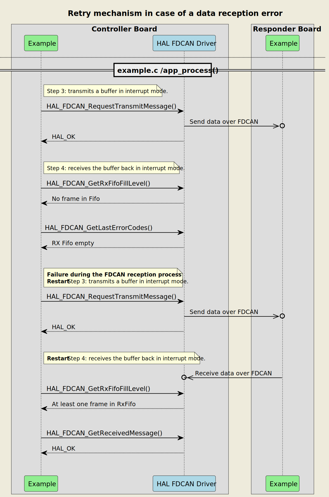
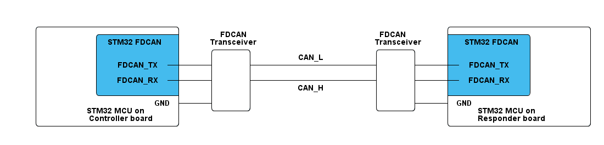

# __Example: *hal_fdcan_two_boards_com_it_responder*__

**Example version:** 2.0.0

[](https://dev.st.com/stm32cube-docs/examples/arch-v1/en/index.html "An offline version is also available in the STM32Cube firmware package.")

How to handle an infinite number of transmit-receive transactions between two boards based on the FDCAN-bus protocol with the HAL API, in interrupt mode.


## __1. Detailed scenario__

__Initialization phase__: At main program start, the `mx_system_init()` function is called. It initializes the peripherals, nonvolatile memory (such as flash memory, NVM, or external memories), MPU regions (if applicable), the system clock, and the SysTick.

The application executes the following __example steps__:

__Step 1__: configures and initializes the FDCAN instance.
              registers the user callbacks for FDCAN events: TX/RX transfer completed and transfer error.

__Step 2__: starts the communication and expects to receive a filtered message in interrupt mode, within a specific timeout period. A counter of attempts is reset when initiating the communication loop.

__Step 3__: sends back the message to the controller, in interrupt mode and continues to __Step2__ if no error occurs.

__End of example__: If no error occurs, the data is transferred indefinitely between the controller and the responder. If the maximum number of attempts is reached, the data transfer is stopped and an error status is reported.

If you enable **`USE_TRACE`**, you can follow these steps, in the nominal case of execution, in the terminal logs:

```text

[INFO] Step 1: Device initialization COMPLETED.
[INFO] [INFO] Responder - Message received and sent back.
[INFO] [INFO] Responder - Message received and sent back.
[INFO] [INFO] Responder - Message received and sent back.
```

The following **message sequence chart** is used to describe the FDCAN communication behavior between the controller board and the responder board.


<details>
<summary> Expand this tab to visualize the sequence chart diagram in case of a data reception error.</summary>


</details>


## __2. Example configuration__

[](https://dev.st.com/stm32cube-docs/examples/arch-v1/en/configure/config_toc.html "An offline version is also available in the STM32Cube firmware package.")

This example demonstrates the **FDCAN peripheral** configured as indicated below:

- The FDCAN standard (11 bits) frame format is selected.
- The FDCAN IP is configured to run at a 500kbds speed for nominal phase (sampling point at 75%) and 2Mbds for data phase (sampling point at 80%).
- The FDCAN-bus timings are directly generated by STM32CubeMX2 by referring to the FDCAN initialization section in the reference manual.
- The selected GPIO pins support the FDCAN alternate function. They are configured in push pull mode.
- The FDCAN filter is configured to:
  - store FDCAN_CONTROLLER_FRAME_ID frame in RX_FIFO_0 and reject all other standard frames.
  - store extended frames to RX_FIFO_1.
- The FDCAN Tx mode is configured FIFO mode.
  It can optionally be configured in Queue mode: Messages stored in the Tx queue will be transmitted starting with the message with the lowest message ID (highest priority) instead of First In First Out.


## __3. Hardware environment and setup__

### __3.1. Generic Setup__

This section describes the hardware setup principles that apply to any board.

The FDCAN/CAN bus works with two dedicated lines (CAN_H and CAN_L) at specific voltage level. So, a CAN/FDCAN transceiver is needed to interface FDCAN_TX and FDCAN_RX pins to a real FDCAN bus.

<!--
@startditaa{doc/example_hal_fdcan_2b_com_interrupt_responder-setup.png} -E -S
    /-------------------------\                                                /-------------------------\
    |          /--------------+       FDCAN                        FDCAN       +--------------\          |
    |          | STM32 FDCAN  |    Transceiver                   Transceiver   |  STM32 FDCAN |          |
    |          |              |     /------\                      /------\     |              |          |
    |          |              |     |      |        CAN_L         |      |     |              |          |
    |          |   FDCAN_TX --+-----+      +----------------------+      +-----+-- FDCAN_TX   |          |
    |          |              |     |      |                      |      |     |              |          |
    |          |   FDCAN_RX --+-----+      +----------------------+      +-----+-- FDCAN_RX   |          |
    |          |         c4BE |     |      |        CAN_H         |      |     |       c4BE   |          |
    |          \--------------+     |      |                      |      |     +--------------/          |
    |                     GND +-----+      |                      |      +-----+ GND                     |
    |        STM32 MCU on     |     \------/                      \------/     |     STM32 MCU on        |
    |       Controller board  |                                                |     Responder board     |
    \-------------------------/                                                \-------------------------/
@endditaa
-->



### __3.2. Specific board setups__

This section describes the exact hardware configurations of your project.

The FDCAN lines can be observed by connecting an oscilloscope or a logic analyzer to the corresponding board connectors.

On several ST boards, an FDCAN transceiver is already present.

<!-- YOUR BOARDS ADDED HERE BY README GENERATION -->
<details>
  <summary>On STM32C5 series.</summary>
  <details>
    <summary>On board NUCLEO-C542RC.</summary>

  |  MCU pin  |  Signal name  |  User Label   |
  |:---------:|:-------------:|:-------------:|
  |    PA5    |     GPIO      | MX_STATUS_LED |
  |    PH0    |  RCC_OSC_IN   |    OSC_IN     |
  |    PH1    |  RCC_OSC_OUT  |    OSC_OUT    |
  |    PA2    |   USART2_TX   |      PA2      |
  |    PB9    |   FDCAN1_TX   |      PB9      |
  |    PB8    |   FDCAN1_RX   |      PB8      |

  </details>
  <details>
    <summary>On board NUCLEO-C562RE.</summary>

  |  MCU pin  |  Signal name  |  User Label   |
  |:---------:|:-------------:|:-------------:|
  |    PA5    |     GPIO      | MX_STATUS_LED |
  |    PH0    |  RCC_OSC_IN   |    OSC_IN     |
  |    PH1    |  RCC_OSC_OUT  |    OSC_OUT    |
  |    PA2    |   USART2_TX   |      PA2      |
  |    PB9    |   FDCAN1_TX   |      PB9      |
  |    PB8    |   FDCAN1_RX   |      PB8      |

  </details>
</details>

## __4. Troubleshooting__

[](https://dev.st.com/stm32cube-docs/examples/arch-v1/en/debug/debug_toc.html "An offline version is also available in the STM32Cube firmware package.")

Here are the points of attention for this specific example:

The filters configuration must be done before starting the FDCAN peripheral.

As FDCAN frame length can be variable, you must prepare an Rx buffer with the maximum expected size (64 for FDCAN - 8 for CAN). You can get the size of any received frame thanks to its hal_fdcan_rx_fifo_header_t element.


## __5. See Also__

[](https://dev.st.com/stm32cube-docs/examples/arch-v1/en/more/more_toc.html "An offline version is also available in the STM32Cube firmware package.")

This [application note](https://www.st.com/resource/en/application_note/an5348-introduction-to-fdcan-peripherals-for-stm32-product-classes-stmicroelectronics.pdf)
explains in details CAN IP features and its applications.

This [application note](https://www.st.com/resource/en/product_training/STM32G4-Peripheral-Flexible_Datarate_Controller_Area_Network_FDCAN.pdf)
shows FDCAN additional features towards classical CAN protocol.

The documentation of the drivers of the relevant STM32 series contains more detailed information.

For instance for the STM32C5 series: [HAL documentation](https://dev.st.com/stm32cube-docs/stm32c5xx-hal-drivers/latest/en/index.html).

More information about the STM32 ecosystem can be found in the [STM32 MCU Developer Zone](https://www.st.com/content/st_com/en/stm32-mcu-developer-zone/embedded-software.html).


## __6. License__

Copyright (c) 2026 STMicroelectronics.

This software is licensed under terms that can be found in the LICENSE file in the root directory
of this software component.
If no LICENSE file comes with this software, it is provided AS-IS.
