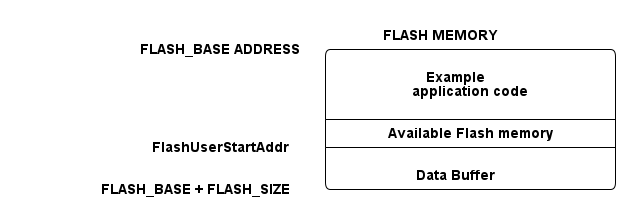

# __Example: *hal_flash_erase_program*__

**Example version:** 2.0.0

How to erase the internal flash memory block and program the data in a specific flash memory address, in polling mode.

## __1. Detailed scenario__

__Initialization phase__: At main program start, the `mx_system_init()` function is called. It initializes the peripherals, nonvolatile memory (such as flash memory, NVM, or external memories), MPU regions (if applicable), the system clock, and the SysTick.

The application executes the following __example steps__:

__Step 1__: Initializes the flash instance and unlocks the access to the flash control register.

__Step 2__: Erases a portion of the flash memory by specifying the address and size of the memory. If the portion to be erased is small, a full page or sector may be erased depending on the granularity of the physical flash memory.

__Step 3__: Reprograms the flash memory by specifying the address of the flash, the data to be programmed, and the size of this data in bytes.

__Step 4__: Locks the access to the flash control register and deinitializes the flash instance.

__End of example__: After __Step 4__, the example is completed.
The example status is reported via the variable **`ExecStatus`**, and the status LED remains turned on in case of success.
You can also check the contents of the memory after programming it.

 Expand this tab to visualize the architecture of the flash memory.

<!--
@startuml
@startditaa{doc/example_hal_flash_erase_program.png} -E -S
                                    FLASH MEMORY
           FLASH_BASE ADDRESS /----------------------------\
                              |                            |
                              |         Example            |
                              |      application code      |
                              |                            |
                              +----------------------------+
                              |   Available Flash memory   |
           FlashUserStartAddr +----------------------------+
                              |                            |
                              |       Data Buffer          |
      FLASH_BASE + FLASH_SIZE \----------------------------/
@endditaa
@endumldd
-->

## __2. Example configuration__

## __3. Hardware environment and setup__

### __3.1. Generic Setup__

No specific hardware setup is needed for this example.

### __3.2. Specific board setups__

This section describes the exact hardware configurations of your project.

  
On STM32C5 series.

  

  
ICACHE

    When initializing or modifying the contents of memory regions that are accessed through ICACHE (for example, programming code or data in flash), ICACHE must be disabled first and only re-enabled once these updates are complete. An enabled ICACHE detects write transactions to cacheable regions as errors.

    By default, the entire AHB address space is considered cacheable. For regions where caching is not permitted (such as OTP, read-only areas, or specific data regions), the MPU must be configured to mark them as non-cacheable. If ICACHE attempts to cache these regions, a HardFault is generated.
  

  

  
On board NUCLEO-C562RE.

  | Board connector   | MCU pin | Signal name      | ARDUINO pin |
  | :---:             | :---:   | :---:            | :---:       |
  | CN5-6             | PA5     | MX_STATUS_LED    | D13         |

  

## __4. Troubleshooting__

Here are the points of attention for this specific example:

1. It is important to note that flash memory should be used carefully to avoid unnecessary usage. Flash memory should not be written to or erased in loops, as this can quickly use up the limited number of write and erase cycles.

2. The compiled code is stored in the flash memory at the top of the memory space. So, the user flash area may be located in a different area of the flash memory. It is important to choose a separate area to store the user data to avoid overwriting the program code. In this example, the user flash area is at the end of the flash memory, where both the erasing and programming processes take place.

3. When erasing memory on an STM32 board, the entire page or sector is erased. If the address is at the start of a page or sector, erasing from that address works fine. However, if the address is in the middle of a page or sector, all memory from the start of the page or sector up to the address is erased, as well as any memory after the address.

4. When working with flash memory, it is important to know that the program granularity is the smallest size of data that can be written and to consider data alignment. Data alignment refers to the requirement that data be stored in memory at specific addresses that are multiples of the data size.

## __5. See Also__

Other application notes related to the [XXX](https://www.st.com/en/embedded-software/stm32-embedded-software.html?querycriteria=productId=SC961$$resourceCategory=technical_literature$$resourceType=application_note$$title=power#documentation)
feature are also available.

The documentation of the drivers of the relevant STM32 series contains more detailed information.

For instance for the STM32C5 series: [HAL documentation](https://dev.st.com/stm32cube-docs/stm32c5xx-hal-drivers/latest/en/index.html).

More information about the STM32 ecosystem can be found in the [STM32 MCU Developer Zone](https://www.st.com/content/st_com/en/stm32-mcu-developer-zone/embedded-software.html).

## __6. License__

Copyright (c) 2026 STMicroelectronics.

This software is licensed under terms that can be found in the LICENSE file in the root directory
of this software component.
If no LICENSE file comes with this software, it is provided AS-IS.
