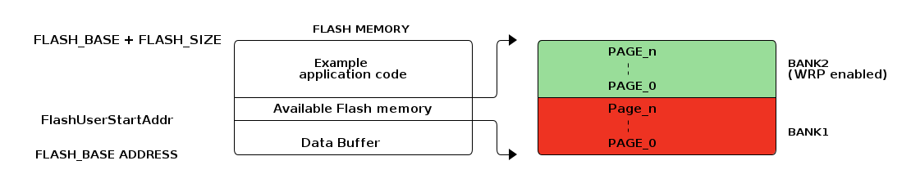

# __Example: *hal_flash_write_protection*__

**Example version:** 2.0.0

[](https://dev.st.com/stm32cube-docs/examples/arch-v1/en/index.html "An offline version is also available in the STM32Cube firmware package.")

How to use HAL FLASH write protection mechanism to protect the content of specified memory area against non-volatile data update or erase, in polling mode.


## __1. Detailed scenario__

__Initialization phase__: At the beginning of the main program, the `mx_system_init()` function is called to initialize the peripherals, the flash interface, the system clock, and the SysTick.

The application executes the following __example steps__:

__Step 1__: Initializes the flash instance, unlocks the flash programming interface, erase the desired flash sector, then unlocks the option byte.

__Step 2__: Enables page-level write protection for the desired pages, then program the option bytes.

__Step 3__: Programs the flash memory by specifying the address of the flash, the data to be programmed, and the size of this data in bytes and check that write operation is not allowed in those pages.

__Step 4__: Disables the flash write protection mechanism for the previous flash pages.

__Step 5__: Reprograms the flash memory, and lock option bytes and the flash interface programming.  Then check that data is written correctly in the chosen memory address.

__Step 6__: FLASH peripheral deinitialization.

__End of example__:

After __Step 6__, the example is completed.

The example status is reported via the variable **`ExecStatus`**, and the status LED remains turned on in case of success.

You can also check the contents of the memory after programming it.

If you enable `USE_TRACE`, you can follow these execution steps in the terminal logs:

```text
[INFO]  Step 1: Device initialization COMPLETED and the Flash access is UNLOCKED.
[ERROR] Step 1: Device initialization ERROR: Flash control operations are still LOCKED.
[INFO]  Step 2: Flash erase COMPLETED and write protection mechanism is ENABLED.
[INFO]  Step 3: Write protection is ENABLED and all write operation is not permitted.
[ERROR] Step 3: Write protection is DISABLED, please verify the current write protection settings.
[INFO]  Step 4: WRP are DISABLED for all pages in Bank 2, and option bytes were programmed.
[INFO]  Step 5: Flash programming COMPLETED.
[ERROR] Step 5: Flash programming ERROR.
[INFO]  Step 6: de-init.
...
```
<details>
<summary> Expand this tab to visualize the architecture of the flash memory.</summary>

<!--
@startuml
@startditaa{doc/example_hal_flash_write_protection.png} -E -S
                                    FLASH MEMORY
  FLASH_BASE + FLASH_SIZE /----------------------------\  /->  /----------------------------\
                          |                            |  |    |        PAGE_n              |
                          |         Example            |  |    |          :                 | BANK2
                          |      application code      |  |    | cGRE     :                 | (WRP enabled)
                          |                            |  |    |        PAGE_0              |
                          +----------------------------+--/    +----------------------------+
                          |   Available Flash memory   |       |        Page_n              |
  FlashUserStartAddr      +----------------------------+--\    |          :                 |
                          |                            |  |    | cRED     :                 | BANK1
                          |       Data Buffer          |  |    |        PAGE_0              |
  FLASH_BASE ADDRESS      \----------------------------/  \->  \----------------------------/
@endditaa
@endumldd
-->


</details>


## __2. Example configuration__

[](https://dev.st.com/stm32cube-docs/examples/arch-v1/en/configure/config_toc.html "An offline version is also available in the STM32Cube firmware package.")

Check and configure the Option Bytes:

- Connect device to *STM32CubeProgrammer*.
- Go to *Option bytes*.
- Uncheck *WRP* option of *BANK2*
- Go to "Read Out Protection".
- Set *RDP* value to *level 0, no protection*


## __3. Hardware environment and setup__

### __3.1. Generic Setup__

No specific hardware setup is needed for this example.

### __3.2. Specific board setups__

This section describes the exact hardware configurations of your project.

<details>
  <summary>On STM32C5 series.</summary>
  <details>
    <summary>On board NUCLEO-C542RC.</summary>

  |  MCU pin  |  Signal name  |  User Label   |
  |:---------:|:-------------:|:-------------:|
  |    PA5    |     GPIO      | MX_STATUS_LED |
  |    PH0    |  RCC_OSC_IN   |    OSC_IN     |
  |    PH1    |  RCC_OSC_OUT  |    OSC_OUT    |
  |    PA2    |   USART2_TX   |      PA2      |

  </details>

  <details>
    <summary>On board NUCLEO-C562RE.</summary>

  |  MCU pin  |  Signal name  |  User Label   |
  |:---------:|:-------------:|:-------------:|
  |    PA5    |     GPIO      | MX_STATUS_LED |
  |    PH0    |  RCC_OSC_IN   |    OSC_IN     |
  |    PH1    |  RCC_OSC_OUT  |    OSC_OUT    |
  |    PA2    |   USART2_TX   |      PA2      |

  </details>

  <details>
    <summary>On board NUCLEO-C5A3ZG.</summary>

  |  MCU pin  |  Signal name  |  User Label   |
  |:---------:|:-------------:|:-------------:|
  |    PA5    |     GPIO      | MX_STATUS_LED |
  |    PH0    |  RCC_OSC_IN   |  PH0_OSC_IN   |
  |    PH1    |  RCC_OSC_OUT  |  PH1_OSC_OUT  |
  |    PA2    |   USART2_TX   | DBGIN_VCP_TX  |

  </details>
</details>


## __4. Troubleshooting__

[](https://dev.st.com/stm32cube-docs/examples/arch-v1/en/debug/debug_toc.html "An offline version is also available in the STM32Cube firmware package.")

Here are the points of attention for this specific example:

__Check Read-Out Protection:__

  - If RDP is enabled (Level 1 or 2), external access may be blocked.
  - Lower RDP level (level 0) is required to handle this example.

__Check Option Bytes:__

  - Review the *Write Protection* settings for each sector/page using *STM32CubeProgrammer*.
  - Uncheck the protected sectors/pages.

__ICACHE:__

  - It is recommended to initialize or modify the main memory content (region to be later cached) with the ICACHE disabled, 
    and to enable the ICACHE only when this region remains unchanged (an enabled ICACHE detects cacheable write transactions as errors).


## __5. See Also__

[](https://dev.st.com/stm32cube-docs/examples/arch-v1/en/more/more_toc.html "An offline version is also available in the STM32Cube firmware package.")

The documentation of the drivers of the relevant STM32 series contains more detailed information.

For instance for the STM32C5 series: [HAL documentation](https://dev.st.com/stm32cube-docs/stm32c5xx-hal-drivers/latest/en/index.html).

More information about the STM32 ecosystem can be found in the [STM32 MCU Developer Zone](https://www.st.com/content/st_com/en/stm32-mcu-developer-zone/embedded-software.html).


## __6. License__

Copyright (c) 2026 STMicroelectronics.

This software is licensed under terms that can be found in the LICENSE file in the root directory
of this software component.
If no LICENSE file comes with this software, it is provided AS-IS.
