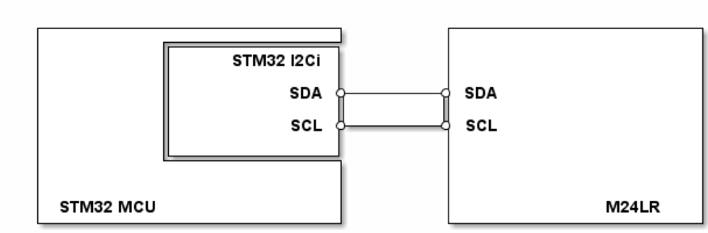

# __Example: *hal_i2c_eeprom_dma*__

**Example version:** 2.0.0

[](https://dev.st.com/stm32cube-docs/examples/arch-v1/en/read/read_toc.html "An offline version is also available in the Cube firmware package.")

How to use the M24128-D EEPROM over I2C using HAL read/write APIs with DMA support.
This example demonstrates how to write data to the EEPROM and read it back for verification.


## __1. Detailed scenario__

__Initialization phase__: At main program start, the `mx_system_init()` function is called. It initializes the peripherals, nonvolatile memory (such as flash memory, NVM, or external memories), MPU regions (if applicable), the system clock, and the SysTick.

__Step 1__: Configures and initializes the I2C instance.
            Registers the user callbacks for I2C events: TX/RX transfer completed and transfer error.

__Step 2__: Waits the EEPROM  to become ready for communication.

__Step 3__: Writes a data buffer to the EEPROM in DMA mode.

__Step 4__: Reads back the same data buffer from the EEPROM in DMA mode, then checks that it matches the buffer written in Step 3

__End of example__: After Step 4, the example is completed. The successful execution can be verified using the status LED indication and the `ExecStatus` variable.

If you enable `USE_TRACE`, you can follow these execution steps in the terminal logs:
```text
[INFO] Step 1: Device initialization COMPLETED.
[INFO] Step 2: EEPROM is READY for communication.
[INFO] Step 3: Write operation to the EEPROM is COMPLETED.
[INFO] Step 4: Read operation from the EEPROM is COMPLETED.
               READ/WRITE buffers are IDENTICAL.
```


## __2. Example configuration__

[](https://dev.st.com/stm32cube-docs/examples/arch-v1/en/index.html "An offline version is also available in the Cube firmware package.")


__I2C__: The I2C is configured with these specific parameters:

- The I2C addressing mode is set to "HAL_I2C_ADDRESSING_7BIT."
  - The device own address is set to 0x00U. Note that it is only used if the peripheral switches to the I2C responder mode.
  - The M24128-D eeprom address is set to 0xA2U. It can be configured by changing the value of the I2C_RESPONDER_ADDR_7BIT variable.
- The I2C timing should be calculated using "STM32CubeMX2".
- The event and error interrupts of the I2C instance are configured and enabled in the NVIC.
- The selected GPIO pins support the I2C alternate function. They are configured in open drain mode with internal pull-up activation.

__DMA__: is used to manage data transfers.

- Two DMA channels I2C Tx and I2C Rx are enabled and configured, respectively, as indicated below:
  - The DMA transmit channel is configured in memory to peripheral mode with an incremented source address and a fixed destination address.
    After each byte transfer, the DMA automatically increments the source address to copy the next byte from an SRAM area to the I2C transmit data register.
  - The DMA receive channel is configured in peripheral to memory mode with a fixed source address and an incremented destination address.
    The data is loaded from the I2C receive data register to an SRAM area incrementally.
- For each DMA channel (I2C Tx and Rx), the corresponding NVIC line is configured and enabled.


## __3. Hardware environment and setup__

### __3.1. Generic Setup__

This section describes the hardware setup principles that apply to any board.

<!--
@startuml
@startditaa{doc/example_hal_i2c_eeprom_dma-setup.png}
  +-------------------------+        +---------------------+
  |          +--------------+        |                     |
  |          |    STM32 I2Ci|        |                     |
  |          |              |        |                     |
  |          |          SDA *--------* SDA                 |
  |          |              |        |                     |
  |          |          SCL *--------* SCL                 |
  |          |              |        |                     |
  |          +--------------+        |                     |
  |                         |        |                     |
  |                         |        |                     |
  | STM32 MCU               |        |           M24128-D  |
  +-------------------------+        +---------------------+
@endditaa
@enduml
-->



### __3.2. Specific board setups__

<details>
  <summary>On STM32C5 series.</summary>
  <details>
    <summary>On board NUCLEO-C542RC.</summary>

  |  MCU pin  |  Signal name  |  User Label   |
  |:---------:|:-------------:|:-------------:|
  |    PA5    |     GPIO      | MX_STATUS_LED |
  |    PH0    |  RCC_OSC_IN   |    OSC_IN     |
  |    PH1    |  RCC_OSC_OUT  |    OSC_OUT    |
  |    PA2    |   USART2_TX   |      PA2      |
  |    PB6    |   I2C1_SCL    |      PB6      |
  |    PB7    |   I2C1_SDA    |      PB7      |

  </details>

  <details>
    <summary>On board NUCLEO-C562RE.</summary>

  |  MCU pin  |  Signal name  |  User Label   |
  |:---------:|:-------------:|:-------------:|
  |    PA5    |     GPIO      | MX_STATUS_LED |
  |    PH0    |  RCC_OSC_IN   |    OSC_IN     |
  |    PH1    |  RCC_OSC_OUT  |    OSC_OUT    |
  |    PA2    |   USART2_TX   |      PA2      |
  |    PB6    |   I2C1_SCL    |      PB6      |
  |    PB7    |   I2C1_SDA    |      PB7      |

  </details>

  <details>
    <summary>On board NUCLEO-C5A3ZG.</summary>

  |  MCU pin  |  Signal name  |  User Label   |
  |:---------:|:-------------:|:-------------:|
  |    PA5    |     GPIO      | MX_STATUS_LED |
  |    PH0    |  RCC_OSC_IN   |  PH0_OSC_IN   |
  |    PH1    |  RCC_OSC_OUT  |  PH1_OSC_OUT  |
  |    PA2    |   USART2_TX   | DBGIN_VCP_TX  |
  |    PB6    |   I2C1_SCL    |      PB6      |
  |    PB7    |   I2C1_SDA    |      PB7      |

  </details>
</details>


## __4. Troubleshooting__

[](https://dev.st.com/stm32cube-docs/examples/arch-v1/en/debug/debug_toc.html "An offline version is also available in the Cube firmware package.")


Here are the points of attention for this specific example:

  __No signal__: If there are no I2C signals observed, remember to check these points first:
     - The GND pins of the controller and responder boards are connected.
     - The internal pull-up resistors are activated for the selected I2C pins. This configuration is enabled by default.

  __Incorrect signals__: If the I2C signals observed do not comply with the I2C specification, especially at high frequencies, you can try the following tips:
     - Use the oscilloscope instead of the logic analyzer for a better measuring and viewing analog characteristics of the signals SCL and SDA. Check that the grounds of the instrument and the board are well wired.
     - Replace the internal pull-up resistors with external ones. The selected values of the resistors should be compliant with the I2C specification.

  __DMA data__: During the I2C transmission or reception operations, only the data are transferred with DMA. The transmitted responder address cannot be transferred with DMA.

  __DMA scope__: DMA requests are generated only for the data transfer. I2C interrupts manage all remaining events such as the 'transmit/receive end of transfer' or the transfer error.

  __Cache coherency__: Take care of cache coherency issue. When cache memory is enabled, it is generally not in the path of DMA transfer, thus a cache coherency issue might appear. It might be necessary to tackle cache coherency. See H7 FAQ:
  [DMA-is-not-working-on-STM32H7-devices](https://community.st.com/s/article/FAQ-DMA-is-not-working-on-STM32H7-devices).


## __5. See Also__

[](https://dev.st.com/stm32cube-docs/examples/arch-v1/en/more/more_toc.html "An offline version is also available in the Cube firmware package.")

- Find the application note AN10216-01 related to the I2C on the [i2c-bus.org](https://www.i2c-bus.org/specification/) website. This document goes further on some technical details of the I2C bus (such as external pull-up resistors calculation for example).

- ST wiki - "Getting started with I2C - stm32mcu" [here](https://wiki.st.com/stm32mcu/wiki/Getting_started_with_I2C).

- Find the M24128 datasheet [here](https://www.st.com/resource/en/datasheet/m24128-bf.pdf).


## __6. License__

Copyright (c) 2026 STMicroelectronics.

This software is licensed under terms that can be found in the LICENSE file in the root directory
of this software component.
If no LICENSE file comes with this software, it is provided AS-IS.
