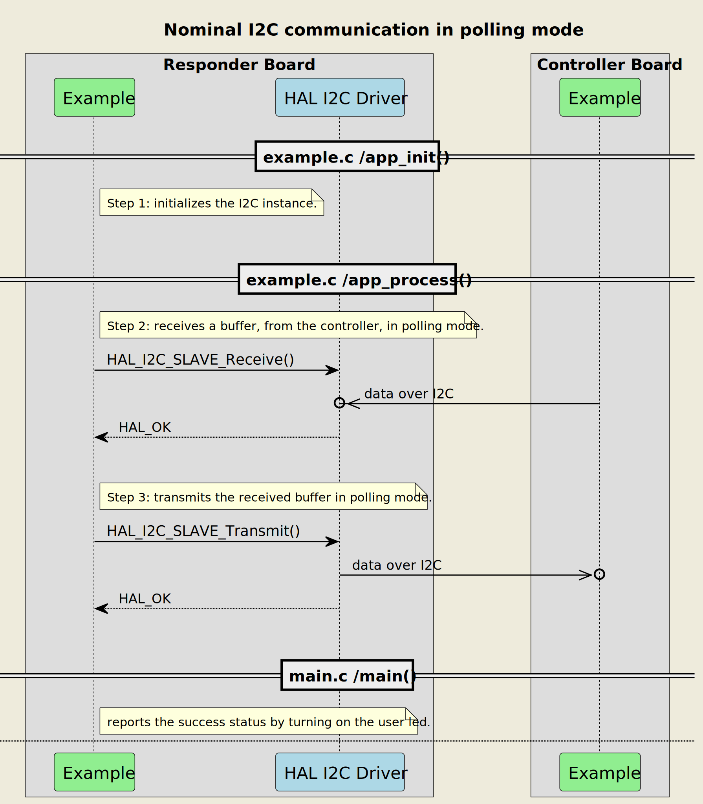
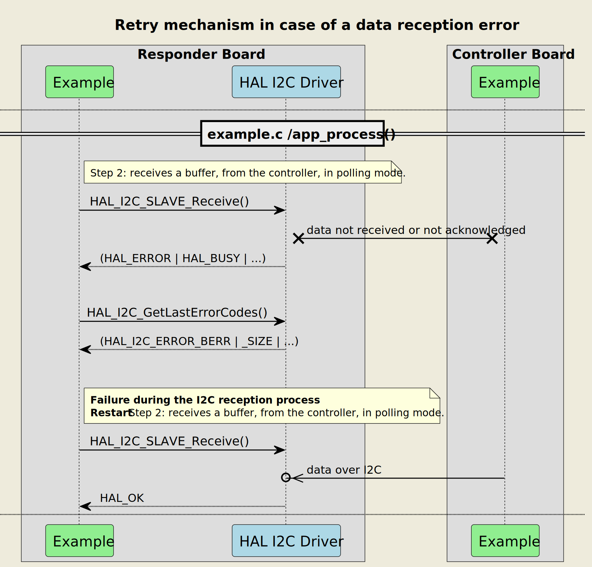
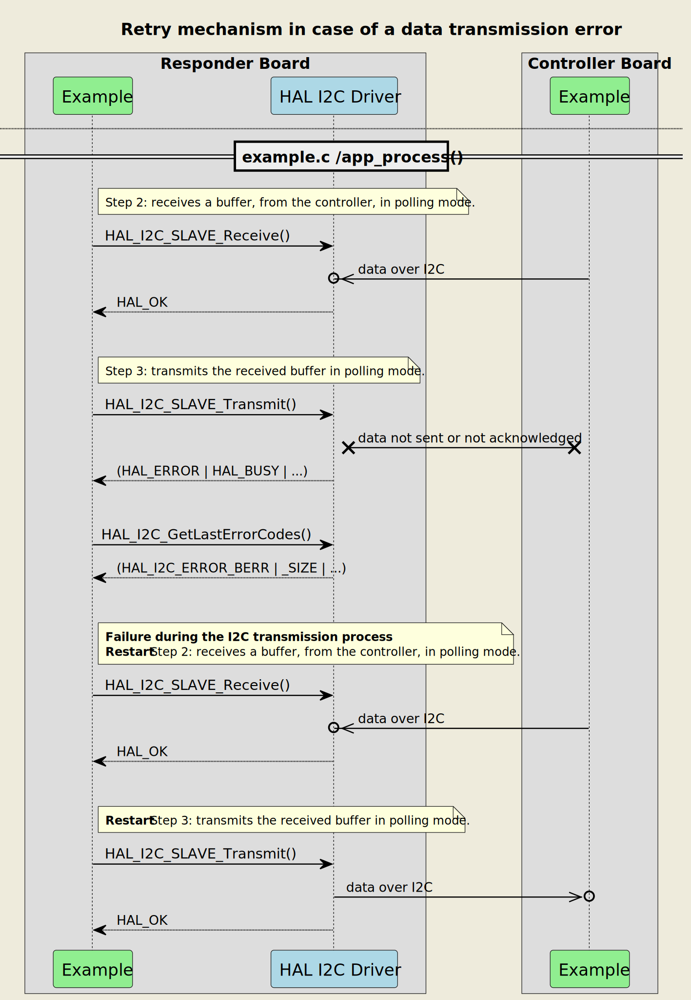
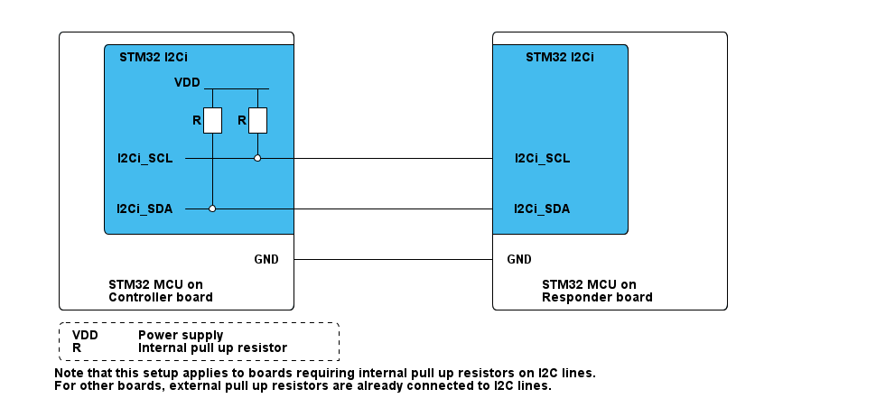

# __Example: *hal_i2c_two_boards_com_polling_responder*__

**Example version:** 2.0.0

[](https://dev.st.com/stm32cube-docs/examples/arch-v1/en/index.html "An offline version is also available in the STM32Cube firmware package.")

How to respond in a polling mode I2C communication, driven by the controller, using the HAL API.
The scenario consists of an infinite number of receive-transmit transactions of changing messages.

**Note that the terminology Controller/Responder characterizes the role taken by each device in the I2C communication, also known as I2C master and slave in legacy terminology.**


## __1. Detailed scenario__

__Initialization phase__: At main program start, the `mx_system_init()` function is called. It initializes the peripherals, nonvolatile memory (such as flash memory, NVM, or external memories), MPU regions (if applicable), the system clock, and the SysTick.

The application executes the following __example steps__:

__Step 1__: configures and initializes the I2C instance.

__Step 2__: The responder expects to receive a message as a null-terminated string from the controller board, in blocking mode, within a specific timeout period. A counter of attempts is reset when initiating the communication loop.

__Step 3__: The responder sends back the received message within the specified timeout period, in blocking mode.
              Returns to __Step2__ indefinitely if no error occurs.

> **_NOTE:_** when an error occurs in the reception or transmission process, the responder restarts the reception process. The error_handler() function is called when the maximum number of attempts is reached.

The communication status is reported via the status LED and the variable ExecStatus.

__End of example__: If no error occurs, the data is transferred infinitely between the controller and the responder. If the maximum number of attempts is reached, the data transfer is stopped and an error status is reported.


If you enable **`USE_TRACE`**, you can follow these steps, in the nominal case of execution, in the terminal logs:

```text
[INFO] Step 1: Device initialization COMPLETED.
[INFO] Responder - Message received and sent back: I2C Two Boards Communication - Message A
[INFO] Responder - Message received and sent back: I2C Two Boards Communication - Message B
[INFO] Responder - Message received and sent back: I2C Two Boards Communication - Message A
```


The following **message sequence chart** describes the I2C communication between the controller board and the responder board.



<details>
<summary> Expand this tab to visualize the sequence chart diagram in case of a data reception error.
</summary>


</details>

<details>
<summary> Expand this tab to visualize the sequence chart diagram in case of a data transmission error.
</summary>


</details>


## __2. Example configuration__

[](https://dev.st.com/stm32cube-docs/examples/arch-v1/en/configure/config_toc.html "An offline version is also available in the STM32Cube firmware package.")

__I2C__: is configured as indicated below:

- The 7-bit addressing mode is selected. The responder's own address is set to 0x3FU.
- The I2C IP is configured to run at the maximum supported speed to demonstrate its highest performance.

  See `__I2C maximum speed__` in section [3.2 Specific board setups](#32-specific-board-setups).

- The I2C-bus timings are calculated by STM32CubeMX2 in line with the I2C initialization section in the reference manual.
- The selected GPIO pins support the I2C alternate function. They are configured in open drain mode with no pull-up neither pull-down activation.

> **_NOTE:_** The I2C protocol standard requires to have a single pull-up resistor connected from each I2C line to the power supply to enable the communication.
> We have already pull-up resistors for the I2C pins on the controller's board side. That is why in this use-case, we do not apply this configuration on the responder's board side.


## __3. Hardware environment and setup__

### __3.1. Generic Setup__

The controller board is connected to the responder board through the two I2C lines and a common GND.

<!--
@startuml
@startditaa{doc/example_hal_i2c_two_boards_com_polling_responder-setup.png} -E -S
    /-------------------------\                     /-------------------------\
    |    /--------------------+                     +--------------\          |
    |    |STM32 I2Ci          |                     |  STM32 I2Ci  |          |
    |    |                    |                     |              |          |
    |    |      VDD _________ |                     |              |          |
    |    |           |    |   |                     |              |          |
    |    |          +++  +++  |                     |              |          |
    |    |         R| | R| |  |                     |              |          |
    |    |          +++  +++  |                     |              |          |
    |    |           |    |   |                     |              |          |
    |    |I2Ci_SCL---+----*---+---------------------+ I2Ci_SCL     |          |
    |    |           |        |                     |              |          |
    |    |           |   c4BE |                     |              |          |
    |    |           |        |                     |              |          |
    |    |I2Ci_SDA---*--------+---------------------+ I2Ci_SDA     |          |
    |    |               c4BE |                     |       c4BE   |          |
    |    \--------------------+                     +--------------/          |
    |                         |                     |                         |
    |                     GND +---------------------+ GND                     |
    |                         |                     |                         |
    |     STM32 MCU on        |                     |     STM32 MCU on        |
    |     Controller board    |                     |     Responder board     |
    \-------------------------/                     \-------------------------/

    /------------------------------\
    | VDD:  Power supply           |
    | R: Internal pull up resistor |
    \-=----------------------------+

    Note that this setup applies to boards requiring internal pull up resistors on I2C lines.
    For other boards, external pull up resistors are already connected to I2C lines.

@endditaa
@endumldd
-->



### __3.2. Specific board setups__

The I2C serial clock (SCL) and data (SDA) lines can be observed by connecting an oscilloscope or a logic analyzer to the corresponding board connectors.

This section describes the exact hardware configurations of your project.


<details>
  <summary>On STM32C5 series.</summary>
  <details>
    <summary>On board NUCLEO-C542RC.</summary>

  |  MCU pin  |  Signal name  |  User Label   |
  |:---------:|:-------------:|:-------------:|
  |    PA5    |     GPIO      | MX_STATUS_LED |
  |    PH0    |  RCC_OSC_IN   |    OSC_IN     |
  |    PH1    |  RCC_OSC_OUT  |    OSC_OUT    |
  |    PA2    |   USART2_TX   |      PA2      |
  |    PB6    |   I2C1_SCL    |      PB6      |
  |    PB7    |   I2C1_SDA    |      PB7      |

  </details>
  <details>
    <summary>On board NUCLEO-C562RE.</summary>

  |  MCU pin  |  Signal name  |  User Label   |
  |:---------:|:-------------:|:-------------:|
  |    PA5    |     GPIO      | MX_STATUS_LED |
  |    PH0    |  RCC_OSC_IN   |    OSC_IN     |
  |    PH1    |  RCC_OSC_OUT  |    OSC_OUT    |
  |    PA2    |   USART2_TX   |      PA2      |
  |    PB6    |   I2C1_SCL    |      PB6      |
  |    PB7    |   I2C1_SDA    |      PB7      |

  </details>
  <details>
    <summary>On board NUCLEO-C5A3ZG.</summary>

  |  MCU pin  |  Signal name  |  User Label   |
  |:---------:|:-------------:|:-------------:|
  |    PA5    |     GPIO      | MX_STATUS_LED |
  |    PH0    |  RCC_OSC_IN   |  PH0_OSC_IN   |
  |    PH1    |  RCC_OSC_OUT  |  PH1_OSC_OUT  |
  |    PA2    |   USART2_TX   | DBGIN_VCP_TX  |
  |    PB6    |   I2C1_SCL    |      PB6      |
  |    PB7    |   I2C1_SDA    |      PB7      |

  </details>
</details>

## __4. Troubleshooting__

[](https://dev.st.com/stm32cube-docs/examples/arch-v1/en/debug/debug_toc.html "An offline version is also available in the STM32Cube firmware package.")

Here are the points of attention for this specific example:

  __Buffer Size__: the example needs to ensure that the number of bytes expected by the responder is equal to the size of the message sent by the controller. Note that the size of the responder's Rx buffer can be adjusted by modifying the BUFFER_SIZE constant.

  __No visible signal__: if there are no I2C signals observed, remember to check these points first:
     - the GND pins of the controller and responder boards are connected.
     - the internal pull-up resistors are activated for the selected I2C pins on the controller side. This configuration is enabled by default in the controller example that we provide.

  __I2C signal quality__: if the I2C signals observed do not comply with the I2C specification, especially at high frequencies, you should try the following tips:
     - use the oscilloscope instead of the logic analyzer for a better measuring and viewing analog characteristics of the signals SCL and SDA. Check that the grounds of the instrument and the board are well wired.
     - check that internal pull-up resistors are replaced by external ones on the controller board.

  __Timeout period__: note that the selected I2C timeout period of 3 s ensures a stable communication between the two boards and a reliable synchronization in different cases of controller or responder reset. Be sure to adjust its value carefully when needed.


## __5. See Also__

[](https://dev.st.com/stm32cube-docs/examples/arch-v1/en/more/more_toc.html "An offline version is also available in the STM32Cube firmware package.")

- You can find the application note AN10216-01 related to the I2C MANUAL on the [i2c-bus.org](https://www.i2c-bus.org/specification/) website if you want to go further on some technical details of the I2C bus (such as external pull-up resistors calculation for example).

- You can refer to the *hal_i2c_two_boards_com_polling_controller* example pack to have a look at the controller's board application.

The documentation of the drivers of the relevant STM32 series contains more detailed information.

For instance for the STM32C5 series: [HAL documentation](https://dev.st.com/stm32cube-docs/stm32c5xx-hal-drivers/latest/en/index.html).

More information about the STM32 ecosystem can be found in the [STM32 MCU Developer Zone](https://www.st.com/content/st_com/en/stm32-mcu-developer-zone/embedded-software.html).


## __6. License__

Copyright (c) 2026 STMicroelectronics.

This software is licensed under terms that can be found in the LICENSE file in the root directory
of this software component.
If no LICENSE file comes with this software, it is provided AS-IS.
