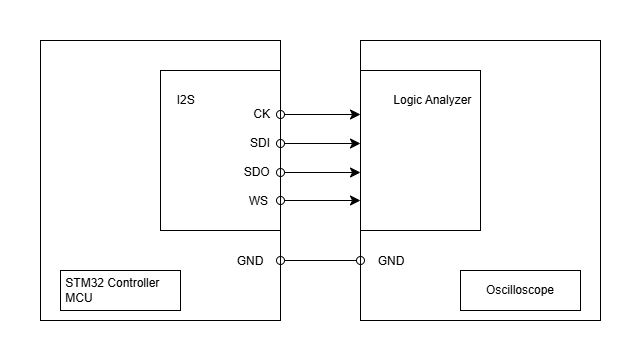

# __Example: *hal_i2s_transmit_com_dma_controller*__

**Example version:** 2.0.0

How to manage an I2S transmission in controller mode, using DMA and the HAL APIs.

## __1. Detailed scenario__

This example consists in transmitting an audio buffer in DMA mode to an oscilloscope.The transmitted buffer is taken from an excerpt of the audio sample (artofgardens-instr by Dan O'Connor).It is encoded in standard PCM Short with a data length 16bits and a frequency of 96kHz.

__Initialization phase__: At main program start, the `mx_system_init()` function is called. It initializes the peripherals, nonvolatile memory (such as flash memory, NVM, or external memories), MPU regions (if applicable), the system clock, and the SysTick.

The application executes the following __example steps__:

__Step 1__: Configures and initializes the I2S instance. Links the transmit DMA handle to the I2S handle. Register the user callbacks for I2S events: TX transfer completed and transfer error.

__Step 2__: Initiates the transmission to the oscilloscope using DMA.

__Step 3__: Waits for one of these I2S interrupts: transfer complete or transfer error.

On most boards, the LED shares its pin with the I2S CK. Therefore, this example does not have a status LED.

__End of example__:
Checks that there is activities on the I2S lines in the oscilloscope interface. If a logic analyzer is used and can decode I2S lines (I2S_CK, I2S_SDI, I2S_SDO and I2S_WS), the data decoded should be the same as in the buffer sent.

You can verify that the example runs properly via the `ExecStatus` variable.

## __2. Example configuration__

__I2S__:

The example uses I2S transmission on the lines clock signal, word select and serial data. It sends data, in DMA mode.
For this purpose, the I2S instance of the controller board should be configured as Master transmitter mode.
The I2S is also configured to use the standard PCM short, 16bits data length and a frequency of 96kHz.

## __3. Hardware environment and setup__

### __3.1. Generic Setup__

This section describes the hardware setup principles that apply to any board.

<!--
@startuml
@startditaa{doc/ASCII_i2s_one_board.png}
    +-------------------------+                     +-------------------------+
    |          +--------------+                     +--------------+          |
    |          |STM32 I2Si    |                     |Logic Analyzer|          |
    |          |              |                     |              |          |
    |          |      I2Si_CK *------------------+->*              |          |
    |          |              |                     |              |          |
    |          |     I2Si_SDI *------------------+->*              |          |
    |          |              |                     |              |          |
    |          |     I2Si_SDO *------------------+->*              |          |
    |          |              |                     |              |          |
    |          |      I2Si_WS *------------------+->*              |          |
    |          |              |                     |              |          |
    |          +--------------+                     +--------------+          |
    |                         |                     |                         |
    |                     GND *---------------------* GND                     |
    |                         |                     |                         |
    | STM32 Controller MCU    |                     |            Oscilloscope |
    +-------------------------+                     +-------------------------+
@endditaa
@enduml
-->

### __3.2. Specific board setups__

This section describes the exact hardware configurations of your project.

  
On STM32C5 series.

  

    
On board NUCLEO-C542RC.

  |  MCU pin  |  Signal name  |  User Label  |
  |:---------:|:-------------:|:------------:|
  |    PH0    |  RCC_OSC_IN   |    OSC_IN    |
  |    PH1    |  RCC_OSC_OUT  |   OSC_OUT    |
  |    PA2    |   USART2_TX   |     PA2      |
  |    PA5    |    I2S1_CK    |     PA5      |
  |   PA15    |    I2S1_WS    |   NetR16_2   |
  |    PA6    |   I2S1_SDI    |     PA6      |
  |    PA7    |   I2S1_SDO    |     PA7      |

  

  

    
On board NUCLEO-C562RE.

  |  MCU pin  |  Signal name  |  User Label  |
  |:---------:|:-------------:|:------------:|
  |    PH0    |  RCC_OSC_IN   |    OSC_IN    |
  |    PH1    |  RCC_OSC_OUT  |   OSC_OUT    |
  |    PA2    |   USART2_TX   |     PA2      |
  |    PA5    |    I2S1_CK    |     PA5      |
  |   PA15    |    I2S1_WS    |   NetR16_2   |
  |    PA6    |   I2S1_SDI    |     PA6      |
  |    PA7    |   I2S1_SDO    |     PA7      |

  

  

    
On board NUCLEO-C5A3ZG.

  |  MCU pin  |  Signal name  |  User Label  |
  |:---------:|:-------------:|:------------:|
  |    PH0    |  RCC_OSC_IN   |  PH0_OSC_IN  |
  |    PH1    |  RCC_OSC_OUT  | PH1_OSC_OUT  |
  |    PA2    |   USART2_TX   | DBGIN_VCP_TX |
  |    PA5    |    I2S1_CK    |     PA5      |
  |   PA15    |    I2S1_WS    |   NetR53_2   |
  |    PA6    |   I2S1_SDI    |     PA6      |
  |    PA7    |   I2S1_SDO    |     PA7      |

  

## __4. Troubleshooting__

Find below the points of attention for this specific example.

Tool configuration: When using a logic analyzer to check the transmitted data, its configuration must match the I2S configuration: PCM Short standard, 16-bit data length, and a sampling frequency of 96 kHz.

__LED twinkling__: Most boards have a LED connected to the same pin as I2S SCK from arduino connector. This LED can twinkle during I2S transmission.

## __5. See Also__

The documentation of the drivers of the relevant STM32 series contains more detailed information.

For instance for the STM32C5 series: [HAL documentation](https://dev.st.com/stm32cube-docs/stm32c5xx-hal-drivers/latest/en/index.html).

More information about the STM32 ecosystem can be found in the [STM32 MCU Developer Zone](https://www.st.com/content/st_com/en/stm32-mcu-developer-zone/embedded-software.html).

## __6. License__

Copyright (c) 2026 STMicroelectronics.

This software is licensed under terms that can be found in the LICENSE file in the root directory
of this software component.
If no LICENSE file comes with this software, it is provided AS-IS.
