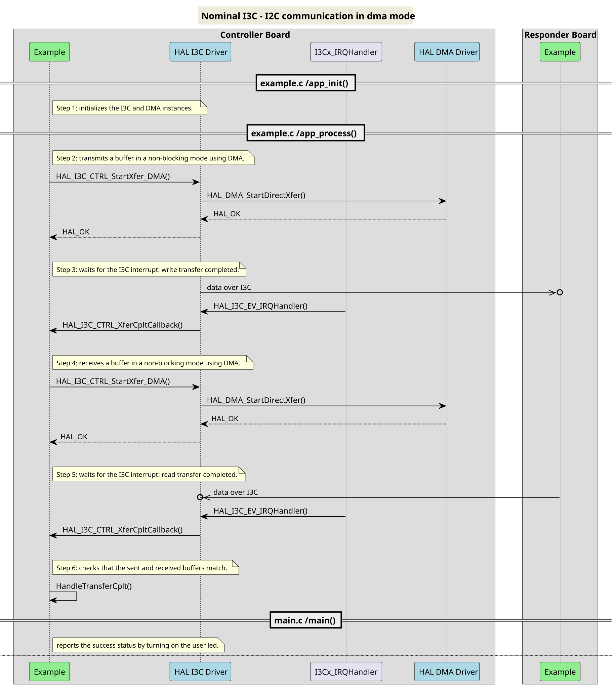
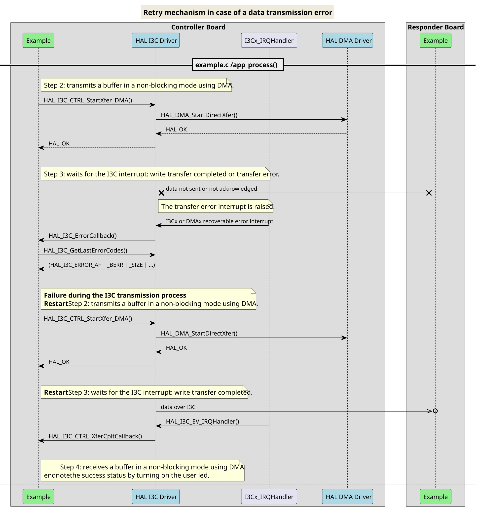
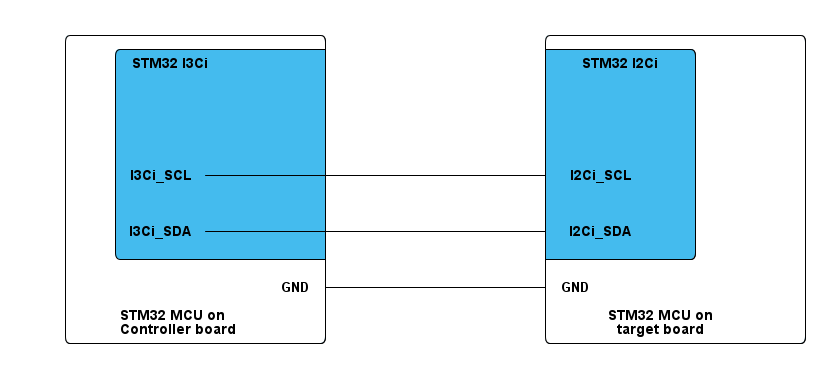

# __Example: *hal_i3c_private_i2c_dma_controller*__

**Example version:** 2.0.0

[](https://dev.st.com/stm32cube-docs/examples/arch-v1/en/index.html "An offline version is also available in the STM32Cube firmware package.")

How to handle an infinite number of transmit-receive transactions between two boards using the I3C and I2C bus protocols in private mode with the HAL API, utilizing DMA.

The example implements the controller's code.

**Note that the terminology Controller/target characterizes the role taken by each device in the I3C and I2C communication, corresponding respectively to the I3C master and I2C slave in legacy terminology.**


## __1. Detailed scenario__

In this example, the CPU and a DMA share a buffer to manage the data: `RxBuffer`.
On an STM32 device with data cache enabled, it is mandatory to ensure the buffer is never cached, as this scenario does not include data cache maintenance operations.
To do so, we place the buffer in the `.non_cacheable_variables` memory section and apply the appropriate MPU settings during system initialization in `mx_system_init()`.


__Initialization phase__: At main program start, the `mx_system_init()` function is called. It initializes the peripherals, nonvolatile memory (such as flash memory, NVM, or external memories), MPU regions (if applicable), the system clock, and the SysTick.

The application executes the following __example steps__:

__Step 1__: Configures and initializes the I3C instance, the NVIC, and the DMA channels.

  - Links the transmit and receive DMA handles to the I3C handle.
  - Registers the user callbacks for I3C events: transfer completed and transfer error.

__Step 2__: The controller initiates communication in DMA mode by simultaneously sending a null-terminated string message to the target and receiving data. The attempt counter is reset at the start of the communication loop.

__Step 3__: Waits for one of these I3C interrupts: read transfer complete or transfer error.

__Step 4__: The controller checks that the sent and received buffers match.
              Returns to __Step2__ indefinitely if no error occurs.

If the data transmit or receive operation fails or the exchanged buffers are different, the controller restarts the communication by sending again the same message. The error_handler() function is called when the maximum number of attempts is reached.

The communication status is reported via the status LED and the variable ExecStatus.

__End of example__: If no error occurs, the data is transferred infinitely between the controller and the target. If the maximum number of attempts is reached, the data transfer is stopped and an error status is reported.

If you enable **`USE_TRACE`**, you can follow these execution steps in the terminal logs:

```text
[INFO] Step 1: Device initialization COMPLETED.
[INFO] Controller - Tx/Rx Buffers IDENTICAL. Transfer COMPLETED of I2C Two Boards Communication - Message A
[INFO] Controller - Tx/Rx Buffers IDENTICAL. Transfer COMPLETED of I2C Two Boards Communication - Message B
[INFO] Controller - Tx/Rx Buffers IDENTICAL. Transfer COMPLETED of I2C Two Boards Communication - Message A
[INFO] Controller - Tx/Rx Buffers IDENTICAL. Transfer COMPLETED of I2C Two Boards Communication - Message B
```


The following **message sequence chart** describes the I3C and I2C communication between the controller board and the target board.



<details>
<summary> Expand this tab to visualize the sequence chart diagram in case of a data transmission error. </summary>



</details>


## __2. Example configuration__

[](https://dev.st.com/stm32cube-docs/examples/arch-v1/en/configure/config_toc.html "An offline version is also available in the STM32Cube firmware package.")

This example demonstrates the following peripherals.

__I3C__: is configured as indicated below:

- The bus usage, including the I3C bus, I2C bus, and their respective duty cycle timings, is calculated by STM32CubeMX2 in accordance with the I3C initialization section of the reference manual.
  - The bus is configured as an `I3C and I2C mixed bus`, enabling the use of both I3C and I2C protocols.

- The I3C and I2C buses are configured to run at the maximum supported speeds to demonstrate their highest performance.
  See `__I2C maximum speed__` and `__I3C maximum speed__` are section [3.2 Specific board setups](#32-specific-board-setups).

- The event and error interrupts of the I3C instance are configured and enabled in the NVIC.
- The selected GPIO pins support the I3C alternate function. They are configured in push-pull mode with internal pull-no activation.

__Private mode__:

- This is a mode where the I3C controller manages data transfers and control operations using a private context. It isolates the communication from other bus activities, allowing exclusive and controlled access to the bus for specific transactions.

__DMA__: is used to manage data transfers.

- Two DMA channels I3C Tx and I3C Rx are enabled and configured, respectively, as indicated below:
  - The DMA transmit channel is configured in memory to peripheral mode with an incremented source address and a fixed destination address.
    After each byte transfer, the DMA automatically increments the source address to copy the next byte from an SRAM area to the I3C transmit data register.
  - The DMA receive channel is configured in peripheral to memory mode with a fixed source address and an incremented destination address.
    The data is loaded from the I3C receive data register to an SRAM area incrementally.
- For each DMA channel (I3C Tx and Rx), the corresponding NVIC line is configured and enabled.

To test this example with the target, you can use the example_hal_i2c_two_boards_com_dma_responder and add the following line:
 `HAL_I2C_SLAVE_DisableClockStretching(&hI2Cx);` in the `mx_i2cx.c` file, immediately after the call to `HAL_I2C_SetConfig()`


## __3. Hardware environment and setup__

### __3.1. Generic Setup__

- The controller board is connected to the target board through the two I3C lines and a common GND.

<!--
@startuml
@startditaa{doc/example_hal_i3c_private_i2c_dma_controller-setup.png} -E -S
    /-------------------------\                     /-------------------------\
    |    /--------------------+                     +--------------\          |
    |    |STM32 I3Ci          |                     |  STM32 I2Ci  |          |
    |    |                    |                     |              |          |
    |    |                    |                     |              |          |
    |    |                    |                     |              |          |
    |    |                    |                     |              |          |
    |    |                    |                     |              |          |
    |    |                    |                     |              |          |
    |    |                    |                     |              |          |
    |    |I3Ci_SCL------------+---------------------+ I2Ci_SCL     |          |
    |    |                    |                     |              |          |
    |    |                    |                     |              |          |
    |    |                    |                     |              |          |
    |    |I3Ci_SDA------------+---------------------+ I2Ci_SDA     |          |
    |    |               c4BE |                     |       c4BE   |          |
    |    \--------------------+                     +--------------/          |
    |                         |                     |                         |
    |                     GND +---------------------+ GND                     |
    |                         |                     |                         |
    |     STM32 MCU on        |                     |     STM32 MCU on        |
    |     Controller board    |                     |     target board        |
    \-------------------------/                     \-------------------------/

@endditaa
@endumldd
-->



### __3.2. Specific board setups__

The I3C serial clock (SCL) and data (SDA) lines can be observed by connecting an oscilloscope or a logic analyzer to the corresponding board connectors.

This section describes the exact hardware configurations of your project.

<details>
  <summary>On STM32C5 series.</summary>
  <details>
    <summary>I3C maximum speed</summary>

  The maximum speed configured for these series is 12,5MHz.

  </details>
  <details>
    <summary>I2C maximum speed</summary>

  The maximum speed configured for these series is 1MHz.

  </details>
  <details>
    <summary>On board NUCLEO-C542RC.</summary>

  |  MCU pin  |  Signal name  |  User Label   |
  |:---------:|:-------------:|:-------------:|
  |    PA5    |     GPIO      | MX_STATUS_LED |
  |    PH0    |  RCC_OSC_IN   |    OSC_IN     |
  |    PH1    |  RCC_OSC_OUT  |    OSC_OUT    |
  |    PA2    |   USART2_TX   |      PA2      |
  |    PB6    |   I3C1_SCL    |      PB6      |
  |    PB7    |   I3C1_SDA    |      PB7      |

  </details>
  <details>
    <summary>On board NUCLEO-C562RE.</summary>

  |  MCU pin  |  Signal name  |  User Label   |
  |:---------:|:-------------:|:-------------:|
  |    PA5    |     GPIO      | MX_STATUS_LED |
  |    PH0    |  RCC_OSC_IN   |    OSC_IN     |
  |    PH1    |  RCC_OSC_OUT  |    OSC_OUT    |
  |    PA2    |   USART2_TX   |      PA2      |
  |    PB6    |   I3C1_SCL    |      PB6      |
  |    PB7    |   I3C1_SDA    |      PB7      |

  </details>
  <details>
    <summary>On board NUCLEO-C5A3ZG.</summary>

  |  MCU pin  |  Signal name  |  User Label   |
  |:---------:|:-------------:|:-------------:|
  |    PA5    |     GPIO      | MX_STATUS_LED |
  |    PH0    |  RCC_OSC_IN   |  PH0_OSC_IN   |
  |    PH1    |  RCC_OSC_OUT  |  PH1_OSC_OUT  |
  |    PA2    |   USART2_TX   | DBGIN_VCP_TX  |
  |    PB6    |   I3C1_SCL    |      PB6      |
  |    PB7    |   I3C1_SDA    |      PB7      |

  </details>
</details>

## __4. Troubleshooting__

[](https://dev.st.com/stm32cube-docs/examples/arch-v1/en/debug/debug_toc.html "An offline version is also available in the STM32Cube firmware package.")

Here are the points of attention for this specific example:

  1. The example ensures that the controller sends the exact number of bytes expected by the target.

  2. If there are no I3C signals observed, remember to check these points first:
     - The GND pins of the controller and target boards are connected.
     - Use short wire as possible between the boards or twist an independent ground wire on each I3C lines
       mean one GND twist around SCL and one GND twist around SDA to help communication.

  3. During the I3C transmission or reception operations, only the data are transferred with DMA. The transmitted target address cannot be transferred with DMA.

  4. DMA requests are generated only for the data transfer. All remaining events, such as the 'transmit/receive end of transfer' or the transfer error, are managed by I2C interrupts.

  6. Take care of data misalignment:
  Depending on the DMA data width used, source and destination addresses must respect data alignment.
  For details, refer to the reference manual of your MCU.

  7. Take care of cache coherency issue:
  When cache memory is enabled, it is generally not in the path of DMA transfer, thus a cache coherency issue might appear.
  It might be necessary to tackle cache coherency. See H7 FAQ:
  [DMA-is-not-working-on-STM32H7-devices](https://community.st.com/s/article/FAQ-DMA-is-not-working-on-STM32H7-devices).

  8. Take care of DMA ports:
  Depending on STM32 series, and DMA instance used (GPDMA/HPDMA/LPDMA) specific DMA ports constraints must be respected.
  For details, refer to the reference manual of your MCU. You can also see the application note in the `__5. See Also` section.


## __5. See Also__

[](https://dev.st.com/stm32cube-docs/examples/arch-v1/en/more/more_toc.html "An offline version is also available in the STM32Cube firmware package.")

- You can find the application note AN5879 related to the I3C MANUAL on the [AN5879](https://www.st.com/resource/en/application_note/an5879-introduction-to-i3c-for-stm32-mcus-stmicroelectronics.pdf) website if you want to go further on some technical details of the I3C bus

- You can refer to the *example_hal_i2c_two_boards_com_dma_responder* example pack to have a look at the target's board application.

- You can see the application note [AN5593](https://www.st.com/resource/en/application_note/an5593-how-to-use-the-gpdma-for-stm32-mcus-stmicroelectronics.pdf) to get further explanation about DMA port allocation.

The documentation of the drivers of the relevant STM32 series contains more detailed information.

For instance for the STM32C5 series: [HAL documentation](https://dev.st.com/stm32cube-docs/stm32c5xx-hal-drivers/latest/en/index.html).

More information about the STM32 ecosystem can be found in the [STM32 MCU Developer Zone](https://www.st.com/content/st_com/en/stm32-mcu-developer-zone/embedded-software.html).


## __6. License__

Copyright (c) 2026 STMicroelectronics.

This software is licensed under terms that can be found in the LICENSE file in the root directory
of this software component.
If no LICENSE file comes with this software, it is provided AS-IS.
