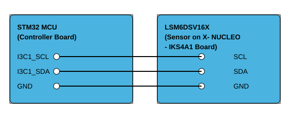

# __Example: *hal_i3c_sensor_direct_dma_controller*__

**Example version:** 2.0.0

[](https://dev.st.com/stm32cube-docs/examples/arch-v1/en/index.html "An offline version is also available in the STM32Cube firmware package.")

How to handle as Controller data buffer transmission/reception between a board and the sensor LSM6DSV16X present on X-NUCLEO-IKS01A3, in direct mode with the HAL API, using DMA mode.


## __1. Detailed scenario__

__Initialization phase__: At main program start, the `mx_system_init()` function is called. It initializes the peripherals, nonvolatile memory (such as flash memory, NVM, or external memories), MPU regions (if applicable), the system clock, and the SysTick.

The application executes the following __example steps__:

__Step 1__: The I3C peripheral is initially configured at 1 MHz as LSM6DSV16X start at reset, with user callbacks registered for controller events.

__Step 2__: The transfer context is set up and the controller send a CCC Broadcast command.

__Step 3__: The controller sends the direct `SETDASA` CCC to assign the target dynamic address, then reconfigures the I3C bus speed to 12.5 MHz.

__Step 4__: The controller repeatedly sends a list of direct CCC commands to the sensor in DMA mode, receives the associated data, displays the retrieved values on the STLink console, and updates the `SETMRL` and `SETMWL` values.
            Returns to Step 4 indefinitely if no error occurs.

__End of example__: This example runs endlessly, with the controller repeatedly acquiring and processing sensor data without a defined exit point.
You can verify that the example runs properly via the status LED and the `ExecStatus` variable.

If you enable `USE_TRACE`, you can follow these execution steps in the terminal logs:

```text
[INFO] Step 1: I3C initialized.
[INFO] Step 2: CCC Broadcast command sent.
[INFO] Step 3: Sensor is configured.
[INFO] ---------------- GETCCC retrieve value ----------------
[INFO] GETPID: 0x2807092b
[INFO] GETBCR: 0x7
[INFO] GETDCR: 0x44
[INFO] GETMWL: 0x04
[INFO] GETMRL: 0x04
[INFO] GETSTATUS: 0x00
[INFO] ----------------- SETMRL and SETMWL updated ---------------
```


## __2. Example configuration__

[](https://dev.st.com/stm32cube-docs/examples/arch-v1/en/configure/config_toc.html "An offline version is also available in the STM32Cube firmware package.")

This example demonstrates the following peripherals.

__I3C__: is configured as indicated below:

- The target address is set to 0x32U. It can be configured by changing the value of the DEVICE_TARGET_ADDR variable.

- The bus usage, including the I3C bus and its duty cycle timings, is calculated by STM32CubeMX2 in accordance with the I3C initialization section of the reference manual.

- While sensor initialization start in I2C mode, the bus is configured as an `I3C pure bus`.

- Set the Rx FIFO threshold to `4 bytes`.

- Enable DMA for the transmission/reception.

- The event and error interrupts of the I3C instance are configured and enabled in the NVIC.


## __3. Hardware environment and setup__

### __3.1. Generic Setup__

- Plug a X-NUCLEO-IKS01A3 ([X-NUCLEO-IKS01A3](https://www.st.com/en/evaluation-tools/x-nucleo-iks4a1.html)) expansion board on arduino connector.

<!--
@startuml
@startditaa{doc/example_hal_i3c_sensor_private_it_controller-setup.png} 
+-----------------------+     +-----------------------+
|  /--------------------+     +--------------------\  |
|  | STM32 MCU          |     |  LSM6DSV16X        |  |
|  | (Controller Board) |     |(Sensor on X- NUCLEO|  |
|  |                    |     |   -IKS4A1 Board)   |  |
|  |           c4BE     |     | c4BE               |  |
|  |                    |     |                    |  |
|  |                    |     |                    |  |
|  |                    |     |                    |  |
|  |I3C1_SCL  o---------+-----+---- SCL            |  |
|  |                    |     |                    |  |
|  |I3C1_SDA  o---------+-----+---- SDA            |  |
|  |                    |     |                    |  |
|  |   GND    o---------+-----+----  GND           |  |
|  \--------------------+     +--------------------/  |
|                       |     |                       |
|                       |     |                       |
+-----------------------+     +-----------------------+
@endditaa
@enduml
-->



### __3.2. Specific board setups__

The I3C serial clock (SCL) and data (SDA) lines can be observed by connecting an oscilloscope or a logic analyzer to the corresponding board connectors.

This section describes the exact hardware configurations of your project.

<details>
  <summary>On STM32C5 series.</summary>
  <details>
    <summary>I3C speed</summary>

  The speed configured for these series is 5MHz .

  </details>

  <details>
    <summary>On board NUCLEO-C542RC.</summary>

  |  MCU pin  |  Signal name  |  User Label   |
  |:---------:|:-------------:|:-------------:|
  |    PA5    |     GPIO      | MX_STATUS_LED |
  |    PH0    |  RCC_OSC_IN   |    OSC_IN     |
  |    PH1    |  RCC_OSC_OUT  |    OSC_OUT    |
  |    PA2    |   USART2_TX   |      PA2      |
  |    PB6    |   I3C1_SCL    |      PB6      |
  |    PB7    |   I3C1_SDA    |      PB7      |

  </details>

  <details>
    <summary>On board NUCLEO-C562RE.</summary>

  |  MCU pin  |  Signal name  |  User Label   |
  |:---------:|:-------------:|:-------------:|
  |    PA5    |     GPIO      | MX_STATUS_LED |
  |    PH0    |  RCC_OSC_IN   |    OSC_IN     |
  |    PH1    |  RCC_OSC_OUT  |    OSC_OUT    |
  |    PA2    |   USART2_TX   |      PA2      |
  |    PB6    |   I3C1_SCL    |      PB6      |
  |    PB7    |   I3C1_SDA    |      PB7      |

  </details>

  <details>
    <summary>On board NUCLEO-C5A3ZG.</summary>

  |  MCU pin  |  Signal name  |  User Label   |
  |:---------:|:-------------:|:-------------:|
  |    PA5    |     GPIO      | MX_STATUS_LED |
  |    PH0    |  RCC_OSC_IN   |  PH0_OSC_IN   |
  |    PH1    |  RCC_OSC_OUT  |  PH1_OSC_OUT  |
  |    PA2    |   USART2_TX   | DBGIN_VCP_TX  |
  |    PB6    |   I3C1_SCL    |      PB6      |
  |    PB7    |   I3C1_SDA    |      PB7      |

  </details>
</details>


## __4. Troubleshooting__

[](https://dev.st.com/stm32cube-docs/examples/arch-v1/en/debug/debug_toc.html "An offline version is also available in the STM32Cube firmware package.")

Here are the points of attention for this specific example:

  1. Note that the sensor is directly plugged into the Nucleo board via the Arduino-compatible connectors, ensuring a reliable hardware connection.

  2. Ensure that the sensor (target) is configured to handle the exact number of bytes expected from the controller during private command transaction.

  3. Verify that the sensor has received and acknowledged its dynamic address assignment before any private command transaction.

  4. Monitor for not acknowledged or unexpected responses during communication, and implement appropriate error handling or retries as needed.


## __5. See Also__

[](https://dev.st.com/stm32cube-docs/examples/arch-v1/en/more/more_toc.html "An offline version is also available in the STM32Cube firmware package.")

- You can find the application note AN5879 related to the I3C MANUAL on the [AN5879](https://www.st.com/resource/en/application_note/an5879-introduction-to-i3c-for-stm32-mcus-stmicroelectronics.pdf) website if you want to go further on some technical details of the I3C bus

The documentation of the drivers of the relevant STM32 series contains more detailed information.

For instance for the STM32C5 series: [HAL documentation](https://dev.st.com/stm32cube-docs/stm32c5xx-hal-drivers/latest/en/index.html).

More information about the STM32 ecosystem can be found in the [STM32 MCU Developer Zone](https://www.st.com/content/st_com/en/stm32-mcu-developer-zone/embedded-software.html).


## __6. License__

Copyright (c) 2026 STMicroelectronics.

This software is licensed under terms that can be found in the LICENSE file in the root directory
of this software component.
If no LICENSE file comes with this software, it is provided AS-IS.

