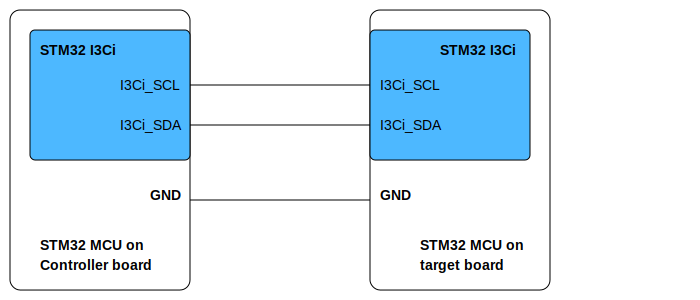

# __Example: *hal_i3c_switch_to_target*__

**Example version:** 2.0.0

[](https://dev.st.com/stm32cube-docs/examples/arch-v1/en/index.html "An offline version is also available in the STM32Cube firmware package.")


How to handle an I3C switching role from controller to target.

The example implements the controller's code, using interrupts (IT).

**Note that the terminology Controller/Target characterizes the role taken by each device in the I3C communication, corresponding respectively to the I3C master and I3C slave in legacy terminology.**


## __1. Detailed scenario__

In this example, the controller and target exchange notifications, information, interrupt-driven (IT) I3C communication.

Error handling is managed by the `HandleTransferError` function, which prints an error message, waits, and retries the operation if needed.

__Initialization phase__: At main program start, the `mx_system_init()` function is called. It initializes the peripherals, nonvolatile memory (such as flash memory, NVM, or external memories), MPU regions (if applicable), the system clock, and the SysTick.


The application executes the following __example steps__:

__Step 1__: Initialization of the I3C peripheral and configuration of the transfer context and registers all user callbacks for controller events.

__Step 2__: Initiates and manages the Dynamic Address Assignment (DAA) process for the controller. The DAA process is executed only once per power-up in app_process.

__Step 3__: Configures device-specific parameters for each assigned target, including controller role request (CRR) acknowledgments and IBI (In-Band Interrupt) settings.

__Step 4__: Activates Controller Role Request notification and waits for completion. Verifies that the dynamic address received matches the expected value.

__Step 5__: Performs a direct read of the GETACCCR Common Command Code (CCC) from all assigned targets. This reads device characteristics after address assignment, using the transfer context and buffers defined in the code.

The communication status is reported via the status LED and the variable ExecStatus.

__End of example__: After step 5, the example is completed. You can verify that the example runs properly via the status LED and the `ExecStatus` variable.

If you enable **`USE_TRACE`**, you can follow these execution steps in the terminal logs:

```text
[INFO] Step 1: Device initialization COMPLETED.
[INFO] Step 2: DAA process COMPLETED.
[INFO] Step 3: Device configuration COMPLETED.
[INFO] Step 4: CRR notification RECEIVED.
[INFO] Step 5: GETACCCR data reception completed.
```


## __2. Example configuration__

[](https://dev.st.com/stm32cube-docs/examples/arch-v1/en/configure/config_toc.html "An offline version is also available in the STM32Cube firmware package.")

This example demonstrates the following peripherals.


__I3C__: is configured as indicated below:

- The target address is set to 0x32U. It can be configured by changing the value of the DEVICE_TARGET_ADDR variable.

- The bus usage, including the I3C bus, and their respective duty cycle timings, is calculated by STM32CubeMX2 in accordance with the I3C initialization section of the reference manual.
- The bus is configured as an `I3C_PURE_I3C_BUS`, enabling the use of I3C protocol.

- The I3C bus is configured to run at the maximum supported speeds to demonstrate the highest performance.
  See `__I3C maximum speed__` in section [3.2 Specific board setups](#32-specific-board-setups).
- The event and error interrupts of the I3C instance are configured and enabled in the NVIC.


## __3. Hardware environment and setup__

### __3.1. Generic Setup__

- The controller board is connected to the target board through the two I3C lines and a common GND.

<!--
@startuml
@startditaa{doc/setup.svg} -E -S
    /-------------------------\                     /-------------------------\
    |    /--------------------+                     +--------------\          |
    |    |STM32 I3Ci          |                     |  STM32 I3Ci  |          |
    |    |                    |                     |              |          |
    |    |                    |                     |              |          |
    |    |                    |                     |              |          |
    |    |                    |                     |              |          |
    |    |                    |                     |              |          |
    |    |                    |                     |              |          |
    |    |                    |                     |              |          |
    |    |I3Ci_SCL------------+---------------------+ I3Ci_SCL     |          |
    |    |                    |                     |              |          |
    |    |                    |                     |              |          |
    |    |                    |                     |              |          |
    |    |I3Ci_SDA------------+---------------------+ I3Ci_SDA     |          |
    |    |               c4BE |                     |       c4BE   |          |
    |    \--------------------+                     +--------------/          |
    |                         |                     |                         |
    |                     GND +---------------------+ GND                     |
    |                         |                     |                         |
    |     STM32 MCU on        |                     |     STM32 MCU on        |
    |     Controller board    |                     |     target board        |
    \-------------------------/                     \-------------------------/

@endditaa
@endumldd
-->




### __3.2. Specific board setups__

The I3C serial clock (SCL) and data (SDA) lines can be observed by connecting an oscilloscope or a logic analyzer to the corresponding board connectors.

This section describes the exact hardware configurations of your project.

<details>
  <summary>On STM32C5 series.</summary>
  <details>
    <summary>I3C maximum speed</summary>

  The maximum speed configured for these series is 12.5MHz.

  </details>

  <details>
    <summary>On board NUCLEO-C542RC.</summary>

  |  MCU pin  |  Signal name  |  User Label   |
  |:---------:|:-------------:|:-------------:|
  |    PA5    |     GPIO      | MX_STATUS_LED |
  |    PH0    |  RCC_OSC_IN   |    OSC_IN     |
  |    PH1    |  RCC_OSC_OUT  |    OSC_OUT    |
  |    PA2    |   USART2_TX   |      PA2      |
  |    PB6    |   I3C1_SCL    |      PB6      |
  |    PB7    |   I3C1_SDA    |      PB7      |

  </details>

  <details>
    <summary>On board NUCLEO-C562RE.</summary>

  |  MCU pin  |  Signal name  |  User Label   |
  |:---------:|:-------------:|:-------------:|
  |    PA5    |     GPIO      | MX_STATUS_LED |
  |    PH0    |  RCC_OSC_IN   |    OSC_IN     |
  |    PH1    |  RCC_OSC_OUT  |    OSC_OUT    |
  |    PA2    |   USART2_TX   |      PA2      |
  |    PB6    |   I3C1_SCL    |      PB6      |
  |    PB7    |   I3C1_SDA    |      PB7      |

  </details>

  <details>
    <summary>On board NUCLEO-C5A3ZG.</summary>

  |  MCU pin  |  Signal name  |  User Label   |
  |:---------:|:-------------:|:-------------:|
  |    PA5    |     GPIO      | MX_STATUS_LED |
  |    PH0    |  RCC_OSC_IN   |  PH0_OSC_IN   |
  |    PH1    |  RCC_OSC_OUT  |  PH1_OSC_OUT  |
  |    PA2    |   USART2_TX   | DBGIN_VCP_TX  |
  |    PB6    |   I3C1_SCL    |      PB6      |
  |    PB7    |   I3C1_SDA    |      PB7      |

  </details>
</details>


## __4. Troubleshooting__

[](https://dev.st.com/stm32cube-docs/examples/arch-v1/en/debug/debug_toc.html "An offline version is also available in the STM32Cube firmware package.")

Here are the points of attention for this specific example:

  1. If there are no I3C signals observed, check the following:
     - The GND pins of the controller and target boards are connected.
     - Use the shortest possible wires between the boards to improve signal integrity.

  2. For correct synchronization, always run the target application before running the controller. This ensures the target is ready to respond to the controller's I3C communication requests.

  3. The example relies on interrupt-driven callbacks for all address assignment and data transfer events. If the expected callbacks are not triggered, verify the NVIC configuration and that interrupts are enabled for the I3C peripheral.

  4. If repeated communication errors are logged (see terminal output), check the physical connection and ensure both boards are powered and properly initialized before starting the scenario.

  5. The In-Band Interrupt setting needs to be set to its default value to allow proper passing of the complete device configuration structure.

  6. The software needs to issue a GETACCCR (Get Accept Controller Role) Common Command Code as part of the controller-role hand-off procedure, after the hardware indicates that the controller-role request has been acknowledged and completed.


## __5. See Also__

[](https://dev.st.com/stm32cube-docs/examples/arch-v1/en/more/more_toc.html "An offline version is also available in the STM32Cube firmware package.")

- You can find the application note AN5879 related to the I3C MANUAL on the [AN5879](https://www.st.com/resource/en/application_note/an5879-introduction-to-i3c-for-stm32-mcus-stmicroelectronics.pdf) website if you want to go further on some technical details of the I3C bus

The documentation of the drivers of the relevant STM32 series contains more detailed information.

For instance for the STM32C5 series: [HAL documentation](https://dev.st.com/stm32cube-docs/stm32c5xx-hal-drivers/latest/en/index.html).

More information about the STM32 ecosystem can be found in the [STM32 MCU Developer Zone](https://www.st.com/content/st_com/en/stm32-mcu-developer-zone/embedded-software.html).


## __6. License__

Copyright (c) 2026 STMicroelectronics.

This software is licensed under terms that can be found in the LICENSE file in the root directory
of this software component.
If no LICENSE file comes with this software, it is provided AS-IS.


