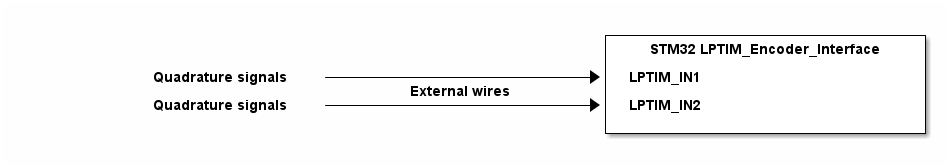

# __Example: *hal_lptim_encoder*__

**Example version:** 2.0.0

[](https://dev.st.com/stm32cube-docs/examples/arch-v1/en/index.html "An offline version is also available in the STM32Cube firmware package.")

How to configure the Low-Power Timer (LPTIM) peripheral in encoder mode to determine the rotation direction with minimal energy consumption.


## __1. Detailed scenario__

__Initialization phase__: At program start, the `mx_system_init()` function is called. It initializes peripherals, nonvolatile memory (flash, NVM, or external memories), MPU regions (if applicable), the system clock, and SysTick.

The application executes the following __example steps__:

__Step 1__: The application code initializes the LPTIM peripheral.

__Step 2__: Start the low-power timer encoder interface.

__End of example__: After step 2, the example is completed. However, the LPTIM encoder interface remains enabled and continues running autonomously.

You can verify that the example runs properly via the status LED and the `ExecStatus` variable.

If you enable `USE_TRACE`, you can follow these execution steps in the terminal logs:

```text
[INFO] Step 1: Device initialization COMPLETED.
[INFO] Step 2: LPTIM encoder interface started.
...
```

To visualize the rotation direction, you need to provide a quadrature signal on `LPTIM_IN1` and `LPTIM_IN2`. (Optional functional: if no encoder hardware is available, you can generate a quadrature pattern by manually toggling two GPIO pins with a 90 phase shift.)

<!--
@startuml
@startditaa{doc/STMicroelectronics.example_hal_lptim_encoder-setup.png}

                                                          +-------------------------------+
                                                          | STM32 LPTIM_Encoder_Interface |
                                                          |                               |
           Quadrature signals -------------------------+->+ LPTIM_IN1                     |
                                     External wires       |                               |
           Quadrature signals -------------------------+->+ LPTIM_IN2                     |
                                                          |                               |
                                                          +-------------------------------+
@endditaa
@enduml
-->



## __2. Example configuration__

[](https://dev.st.com/stm32cube-docs/examples/arch-v1/en/configure/config_toc.html "An offline version is also available in the STM32Cube firmware package.")

### __2.1. LPTIM configuration__

The encoder interface *LPTIM* is configured as follows:

- Encoder (quadrature) mode on IN1/IN2.
- External counter source; edges on inputs drive count (up or down) autonomously.
- Period set to 0xFFFF (full 16-bit range).

**_NOTE:_** LPTIM encoder mode detects transitions on both input channels to infer direction.


## __3. Hardware environment and setup__

### __3.1. Generic Setup__

No specific hardware setup needed for this example.

### __3.2. Specific board setups__

This section describes the exact hardware configurations of your project.

<details>
  <summary>On STM32C5 series.</summary>
  <details>
    <summary>On board NUCLEO-C542RC.</summary>

  | Board pin  | MCU pin | Signal name      | ARDUINO pin |
  | :---:      | :---:   | :---:            | :---:       |
  | CN5-6      | PA5     | MX_STATUS_LED    | -           |
  | -          | PA1     | LPTIM_IN1        | CN12-26     |
  | -          | PD11    | LPTIM_IN2        | CN12-13     |

  </details>
  <details>
    <summary>On board NUCLEO-C562RE.</summary>

  | Board pin  | MCU pin | Signal name      | ARDUINO pin |
  | :---:      | :---:   | :---:            | :---:       |
  | CN5-6      | PA5     | MX_STATUS_LED    | -           |
  | -          | PA1     | LPTIM_IN1        | CN12-26     |
  | -          | PD11    | LPTIM_IN2        | CN12-13     |

  </details>
  <details>
    <summary>On board NUCLEO-C5A3ZG.</summary>

  | Board pin  | MCU pin | Signal name      | ARDUINO pin |
  | :---:      | :---:   | :---:            | :---:       |
  | CN5-6      | PA5     | MX_STATUS_LED    | -           |
  | -          | PA1     | LPTIM_IN1        | CN12-26     |
  | -          | PD11    | LPTIM_IN2        | CN12-13     |

  </details>
</details>

## __4. Troubleshooting__

[](https://dev.st.com/stm32cube-docs/examples/arch-v1/en/debug/debug_toc.html "An offline version is also available in the STM32Cube firmware package.")

Here are the points of attention for this specific example:

__System clock__: Ensure the system clock is configured correctly to provide accurate timing for the encoder interface.

__HAL_Delay()__: Care must be taken when using HAL_Delay(), as it relies on the SysTick interrupt. Ensure the SysTick interrupt has a higher priority than the peripheral interrupt.


## __5. See Also__

[](https://dev.st.com/stm32cube-docs/examples/arch-v1/en/more/more_toc.html "An offline version is also available in the STM32Cube firmware package.")

This [General-purpose timer cookbook for STM32 microcontrollers (ref. AN4776)](https://www.st.com/content/ccc/resource/technical/document/application_note/group0/91/01/84/3f/7c/67/41/3f/DM00236305/files/DM00236305.pdf/jcr:content/translations/en.DM00236305.pdf) provides a simple and clear description of the basic features and operating modes of the STM32 general-purpose timer peripherals.

This [STM32 cross-series timer overview (ref. AN4013)](https://www.st.com/content/ccc/resource/technical/document/application_note/54/0f/67/eb/47/34/45/40/DM00042534.pdf/files/DM00042534.pdf/jcr:content/translations/en.DM00042534.pdf) presents an overview of the timer peripherals for the STM32 product series.

More information about the STM32Cube Drivers can be found in the drivers' user manual of the STM32 series you are using.

For instance for the STM32C5 series: [HAL documentation](https://dev.st.com/stm32cube-docs/stm32c5xx-hal-drivers/latest/en/index.html).

For a similar implementation using a general-purpose timer, see the hal_tim_encoder example. It demonstrates the same encoder principle and shows how to emulate a quadrature (encoder).

More information about the STM32 ecosystem can be found in the [STM32 MCU Developer Zone](https://www.st.com/content/st_com/en/stm32-mcu-developer-zone/embedded-software.html).


## __6. License__

Copyright (c) 2026 STMicroelectronics.

This software is licensed under terms that can be found in the LICENSE file in the root directory of this software component. If no LICENSE file comes with this software, it is provided AS-IS.
