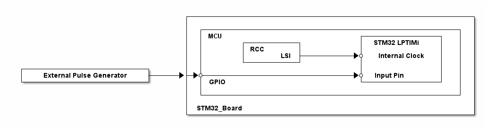

# __Example: *hal_lptim_pulse_counter*__

**Example version:** 2.0.0

How to configure the LPTIM (Low-Power Timer) to count external pulses through the LPTIM HAL API.

## __1. Detailed scenario__

__Initialization phase__: At main program start, the `mx_system_init()` function is called. It initializes the peripherals, nonvolatile memory (such as flash memory, NVM, or external memories), MPU regions (if applicable), the system clock, and the SysTick.

The application executes the following __example steps__:

__Step 1__: Initializes the LPTIM instance. Registers the callback for the autoreload match interruption and starts the LPTIM in interrupt mode.

__Step 2__: The device goes in stop mode and waits for an interrupt.

__Step 3__: Each time the LPTIM counter reaches the number of pulses to be counted, an interrupt is generated and wakes the MCU up.

__End of example__: If no error occurs, the device enters in stop mode indefinitely and each time the timer counts the defined number of pulses, the status LED is toggled.

## __2. Example configuration__

__LPTIM__: The LPTIM is configured with these specific parameters:

  - external synchronous clock
  - continuous mode
  - period to 1000

The *LPTIM* is configured to count 1000 pulses on its input. Its internal clock is configured to be the LSI. To avoid missing any events, the frequency of changes on the external Input1 signal should never exceed the frequency of the internal clock provided to LPTIM.

The *LPTIM* may need additional clock configuration to be able to function in low-power mode.

- The RCC is configured to keep the LPTIM internal clock while in Stop mode.

## __3. Hardware environment and setup__

### __3.1. Generic Setup__

This section describes the hardware setup principles that apply to any board.

<!--
@startuml
@startditaa{doc/example_hal_lptim_pulse_counter-setup.png}
                                     +------------------------------------------------------------+
                                     |                                                            |
                                     |  +------------------------------------------------------+  |
                                     |  | MCU                             +----------------+   |  |
                                     |  |        +-----------+            | STM32 LPTIMi   |   |  |
                                     |  |        | RCC       |            |                |   |  |
                                     |  |        |       LSI +---------+->* Internal Clock |   |  |
                                     |  |        +-----------+            |                |   |  |
  +--------------------------+       |  |                                 |                |   |  |
  | External Pulse Generator +----+->+->*------------------------------+->* Input Pin      |   |  |
  +--------------------------+       |  | GPIO                            +----------------+   |  |
                                     |  |                                                      |  |
                                     |  +------------------------------------------------------+  |
                                     |                                                            |
                                     | STM32_Board                                                |
                                     +------------------------------------------------------------+
@endditaa
@enduml
-->

### __3.2. Specific board setups__

This section describes the exact hardware configurations of your project.

  
On STM32C5 series.

  

    
On board NUCLEO-C542RC.

  |  MCU pin  |  Signal name  |  User Label   |
  |:---------:|:-------------:|:-------------:|
  |    PA5    |     GPIO      | MX_STATUS_LED |
  |    PH0    |  RCC_OSC_IN   |    OSC_IN     |
  |    PH1    |  RCC_OSC_OUT  |    OSC_OUT    |
  |    PA1    |  LPTIM1_IN1   |      PA1      |

  

  

    
On board NUCLEO-C562RE.

  |  MCU pin  |  Signal name  |  User Label   |
  |:---------:|:-------------:|:-------------:|
  |    PA5    |     GPIO      | MX_STATUS_LED |
  |    PH0    |  RCC_OSC_IN   |    OSC_IN     |
  |    PH1    |  RCC_OSC_OUT  |    OSC_OUT    |
  |    PA1    |  LPTIM1_IN1   |      PA1      |

  

  

    
On board NUCLEO-C5A3ZG.

  |  MCU pin  |  Signal name  |  User Label   |
  |:---------:|:-------------:|:-------------:|
  |    PA5    |     GPIO      | MX_STATUS_LED |
  |    PH0    |  RCC_OSC_IN   |  PH0_OSC_IN   |
  |    PH1    |  RCC_OSC_OUT  |  PH1_OSC_OUT  |
  |   PB10    |  LPTIM1_IN1   |     PB10      |

  

## __4. Troubleshooting__

Here are the points of attention for this specific example:

__External Input Limitation__: In this example, the LPTIM clock source is the LSI, so the external input is sampled with the LSI clock. If the external input has a higher frequency than the LSI, events might be missed and pulse counter will be incorrect.

__Source Clock__: The LPTIM instance registers are clocked by internal synchronous clock (LSI).
External asynchronous clock can also be used. In that case, the signal injected on the LPTIM external input1 is used as system clock for the LPTIM. Consequently, the external clock must be present during the whole LPTIM configuration step. If not, write operations to the LPTIM_ARR and the LPTIM_CMP registers will fail.

__Clock after Stop mode__: When exiting from STOP mode, the system clock must be reconfigured (see the RCC peripheral section in the reference manual of your MCU).

__Systick interruption__: Any peripheral interrupt occurring when the AHB/APB clocks are present (if peripheral vector enabled in the NVIC) can wake up the system from STOP mode (not only EXTI). That is the reason why the SysTick interrupt is switched off before entering in STOP mode.

## __5. See Also__

This [application note](https://www.st.com/content/ccc/resource/technical/document/application_note/group0/bd/16/1d/53/4a/ef/4e/0e/DM00290631/files/DM00290631.pdf/jcr:content/translations/en.DM00290631.pdf)
explains common LPTIM usages, including asynchronous pulse counter.

You can also refer to this other example:

- hal_pwr_stop0: demonstrates the STOP0 mode

The documentation of the drivers of the relevant STM32 series contains more detailed information.

For instance for the STM32C5 series: [HAL documentation](https://dev.st.com/stm32cube-docs/stm32c5xx-hal-drivers/latest/en/index.html).

More information about the STM32 ecosystem can be found in the [STM32 MCU Developer Zone](https://www.st.com/content/st_com/en/stm32-mcu-developer-zone/embedded-software.html).

## __6. License__

Copyright (c) 2026 STMicroelectronics.

This software is licensed under terms that can be found in the LICENSE file in the root directory
of this software component.
If no LICENSE file comes with this software, it is provided AS-IS.
