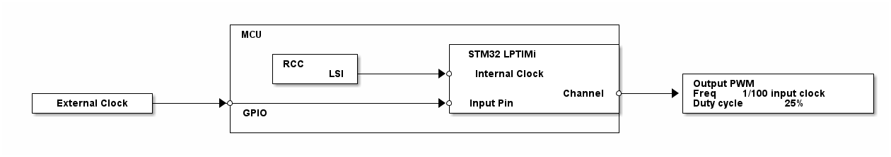

# __Example: *hal_lptim_pwm_external_clock*__

**Example version:** 2.0.0

How to configure the LPTIM (Low-Power Timer) to generate a PWM using an external clock in low power mode, through the HAL LPTIM API.

## __1. Detailed scenario__

__Initialization phase__: At main program start, the `mx_system_init()` function is called. It initializes the peripherals, nonvolatile memory (such as flash memory, NVM, or external memories), MPU regions (if applicable), the system clock, and the SysTick.

The application executes the following __example steps__:

__Step 1__: Initializes the LPTIM instance and starts the LPTIM peripheral.

__Step 2__: The device goes in stop mode. The PWM output signal is generated while in STOP mode depending on the external clock provided.

__End of example__: If no error occurs, the example stays in low-power mode in the *app_process()* function. The status LED is turned on before entering low-power mode.

> **_NOTE:_** If the example exits low-power mode, it is considered as an error and the example goes in *error_handler()*.
> **_NOTE:_** The example uses external clock as reference to generate the PWM, so a clock must be provided on the LPTIM input pin to get the expected behavior.

## __2. Example configuration__

__LPTIM__: The LPTIM is configured with these specific parameters:

  - the external clock is configured as the counter source
  - the LSI is configured to be the internal clock, it is used to sample the external clock.
  - the period value is set to get a PWM output frequency 100 times lower than external clock input
  - the compare value is set to get a PWM of a 25% duty cycle

The *LPTIM* may need additional clock configuration to be able to function in low-power mode.

- The RCC is configured to keep the LPTIM internal clock active while in Stop mode.

  
Period value calculation details

  The Auto-Reload Register (ARR) value is determined using the following calculation:
  > PWM frequency = Input frequency / (ARR + 1)
  > ARR = (Input frequency / PWM frequency) - 1

  With PWM output frequency 100 times slower than input frequency:
  > ARR = 100 - 1
  > ARR = 99

  
Compare value calculation details

  The Capture and Compare Register (CCR) value is determined using the following calculation:
  > duty_cycle = ( (ARR + 1) - (CCR + 1) ) / (ARR + 1)
  > duty_cycle = 1 - (CCR + 1) / (ARR + 1)
  > CCR = (1 - duty_cycle) * (ARR + 1) - 1

  With PWM output of a 25% duty cycle:
  > CCR = (1 - 25 / 100) * 100 - 1
  > CCR = 74

## __3. Hardware environment and setup__

### __3.1. Generic Setup__

This section describes the hardware setup principles that apply to any board.

<!--
@startuml

@startditaa{doc/example_hal_lptim_pwm_external_clock-setup.png}

                              +------------------------------------------------------+
                              | MCU                                                  |
                              |                              +-----------------------+
                              |     +-----------+            | STM32 LPTIMi          |
                              |     | RCC       |            |                       |
                              |     |       LSI +---------+->* Internal Clock        |        +--------------------------+
                              |     +-----------+            |                       |        | Output PWM               |
  +----------------+          |                              |               Channel *-----+->+ Freq = 1/100 input clock |
  | External Clock +-------+->*---------------------------+->* Input Pin             |        | Duty cycle = 25%         |
  +----------------+          | GPIO                         +-----------------------+        +--------------------------+
                              |                                                      |
                              +------------------------------------------------------+

NOTE: An external clock must be provided on the input pin of the LPTIM.

@enduml
-->

### __3.2. Specific board setups__

This section describes the exact hardware configurations of your project.

  
On STM32C5 series.

  

    
On board NUCLEO-C542RC.

  |  MCU pin  |  Signal name  |  User Label   |
  |:---------:|:-------------:|:-------------:|
  |    PA5    |     GPIO      | MX_STATUS_LED |
  |    PH0    |  RCC_OSC_IN   |    OSC_IN     |
  |    PH1    |  RCC_OSC_OUT  |    OSC_OUT    |
  |    PA1    |  LPTIM1_IN1   |      PA1      |
  |    PB4    |  LPTIM1_CH2   |      PB4      |

  

  

    
On board NUCLEO-C562RE.

  |  MCU pin  |  Signal name  |  User Label   |
  |:---------:|:-------------:|:-------------:|
  |    PA5    |     GPIO      | MX_STATUS_LED |
  |    PH0    |  RCC_OSC_IN   |    OSC_IN     |
  |    PH1    |  RCC_OSC_OUT  |    OSC_OUT    |
  |    PA1    |  LPTIM1_IN1   |      PA1      |
  |    PB4    |  LPTIM1_CH2   |      PB4      |

  

  

    
On board NUCLEO-C5A3ZG.

  |  MCU pin  |  Signal name  |  User Label   |
  |:---------:|:-------------:|:-------------:|
  |    PA5    |     GPIO      | MX_STATUS_LED |
  |    PH0    |  RCC_OSC_IN   |  PH0_OSC_IN   |
  |    PH1    |  RCC_OSC_OUT  |  PH1_OSC_OUT  |
  |   PB10    |  LPTIM1_IN1   |     PB10      |
  |    PB4    |  LPTIM1_CH2   |      PB4      |

  

## __4. Troubleshooting__

Here are the points of attention for this specific example:

__Clock after Stop mode__: If the MCU wakes up unexpectedly from STOP mode, the system clock must be reconfigured (see the RCC peripheral section in the reference manual of your MCU).

__Systick interruption__: Any peripheral interrupt occurring when the AHB/APB clocks are present (if peripheral vector enabled in the NVIC) can wake up the system from STOP mode (not only EXTI). That is the reason why the SysTick interrupt is switched off before entering in STOP mode.

## __5. See Also__

- The application note [AN4865](https://www.st.com/resource/en/application_note/an4865-lowpower-timer-lptim-applicative-use-cases-on-stm32-mcus-and-mpus-stmicroelectronics.pdf) shows some use cases for the LPTIM peripheral.

You can also refer to this other example:

- hal_pwr_stop0: demonstrates the STOP0 mode

The documentation of the drivers of the relevant STM32 series contains more detailed information.

For instance for the STM32C5 series: [HAL documentation](https://dev.st.com/stm32cube-docs/stm32c5xx-hal-drivers/latest/en/index.html).

More information about the STM32 ecosystem can be found in the [STM32 MCU Developer Zone](https://www.st.com/content/st_com/en/stm32-mcu-developer-zone/embedded-software.html).

## __6. License__

Copyright (c) 2026 STMicroelectronics.

This software is licensed under terms that can be found in the LICENSE file in the root directory
of this software component.
If no LICENSE file comes with this software, it is provided AS-IS.
