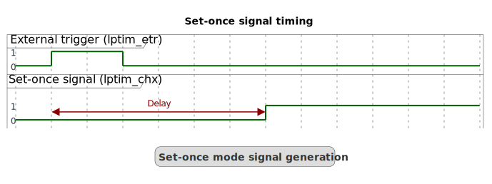

# __Example: *hal_lptim_set_once_it*__

**Example version:** 2.0.0

How to implement single delayed high pulse for low-power event signaling using the Low-Power Timer (LPTIM), through the HAL LPTIM API.

## __1. Detailed scenario__

__Initialization phase__: At main program start, the `mx_system_init()` function is called. It initializes the peripherals, nonvolatile memory (such as flash memory, NVM, or external memories), MPU regions (if applicable), the system clock, and the SysTick.

The application executes the following __example steps__:

__Step 1__: Initializes the LPTIM instance. Registers the callback for the compare match interruption and starts the LPTIM channel 1 in interrupt mode and starts the LPTIM.

__Step 2__: The device enters Stop mode and waits for a Compare Match interrupt. The counter starts on the first rising edge detected on the ETR input. When the timer counter reaches the value stored in the compare register, a Compare Match interrupt is triggered, waking the system from Stop mode.

__End of example__: If no error occurs, the device exits Stop mode after a delay of tDELAY following the detection of a rising edge on the external trigger input, and then the status LED is toggled.

## __2. Example configuration__

__LPTIM__: The LPTIM is configured with these specific parameters:

  - Internal clock source.
  - Operating mode is set to set-once mode. In set-once mode, the LPTIM counter starts counting **only once** upon the very first external trigger event. Unlike repetitive modes, subsequent trigger events do not restart the counter until the timer is explicitly reset or reconfigured.
  - Period counter value must be greater than the pulse value
  - LPTIM Channel x (LPTIM_CHx) is configured in output mode with the output polarity set to HIGH. This means that the output signal remains LOW initially and transitions to HIGH when the timer counter value matches the programmed compare register value.
  - Pulse value is set to have a 500 microseconds delay.
  - The external trigger signal is connected to the LPTIM_ETR pin (configured as a GPIO) and is sensitive to rising edges.

The timing relationship between the external trigger and the LP-Timer output is illustrated below:

  

- **lptim_etr:** External trigger rising edge that initiates the timer.
- **lptim_chx:** Output channel x, initially LOW, transitions HIGH after a delay of 500 microseconds.
- **delay:** The interval between the trigger event and the output rising edge, determined by the compare register and clock frequency.

The LPTIM uses the following features:

  - external trigger input on rising edge to use a GPIO as trigger to start the LPTIM counter.

The *LPTIM* may need additional clock configuration to be able to function in low-power mode.

- The RCC is configured to keep the LPTIM internal clock while in Stop mode.
- When the STM32 series supports it, the RCC is configured in autonomous mode to allow the LPTIM to wake up from Stop mode.

  

    
Pulse calculation details

      delay = CMP / LPTIM_CLK
      CMP = delay * LPTIM_CLK

  

## __3. Hardware environment and setup__

### __3.1. Generic Setup__

Please find below the hardware setup principle that applies to any board.

<!--
@startuml
@startditaa{doc/example_hal_lptim_set_once_it-setup.png}

                            +------------------------------------------------------+
                            | MCU                             +----------------+   |
                            |        +-----------+            | STM32 LPTIMi   |   |
                            |        | RCC       |            |                |   |
                            |        |       LSI +---------+->* Internal Clock |   |
                            |        +-----------+            |                |   |
  +------------------+      |                                 |                |   |
  | External Trigger +---+->*------------------------------+->* LPTIM_ETR pin  |   |
  +------------------+      |                                 +----------------+   |
                            |                                                      |
                            +------------------------------------------------------+

@endditaa
@enduml
-->

### __3.2. Specific board setups__

This section describes the exact hardware configurations of your project.

  
On STM32C5 series.

 **Compare register numerical application**:

  The LPTIM is clocked by the LSI which is equal to 32 kHz for the STM32C5 series. The purpose is to get a 500 microseconds delay, so:

    CMP = delay * LPTIM_CLK
    CMP = 0.0005s * 32000 Hz
    CMP = 16
  

    
On board NUCLEO-C542RC.

  |  MCU pin  |  Signal name  |  User Label   |
  |:---------:|:-------------:|:-------------:|
  |    PA5    |     GPIO      | MX_STATUS_LED |
  |    PH0    |  RCC_OSC_IN   |    OSC_IN     |
  |    PH1    |  RCC_OSC_OUT  |    OSC_OUT    |
  |   PA15    |  LPTIM1_ETR   |   NetR16_2    |
  |   PB13    |  LPTIM1_CH1   |     PB13      |

  

  

    
On board NUCLEO-C562RE.

  |  MCU pin  |  Signal name  |  User Label   |
  |:---------:|:-------------:|:-------------:|
  |    PA5    |     GPIO      | MX_STATUS_LED |
  |    PH0    |  RCC_OSC_IN   |    OSC_IN     |
  |    PH1    |  RCC_OSC_OUT  |    OSC_OUT    |
  |   PA15    |  LPTIM1_ETR   |   NetR16_2    |
  |   PB13    |  LPTIM1_CH1   |     PB13      |

  

  

    
On board NUCLEO-C5A3ZG.

  |  MCU pin  |  Signal name  |  User Label   |
  |:---------:|:-------------:|:-------------:|
  |    PA5    |     GPIO      | MX_STATUS_LED |
  |    PH0    |  RCC_OSC_IN   |  PH0_OSC_IN   |
  |    PH1    |  RCC_OSC_OUT  |  PH1_OSC_OUT  |
  |   PA15    |  LPTIM1_ETR   |   NetR53_2    |
  |   PB13    |  LPTIM1_CH1   |     PB13      |

  

## __4. Troubleshooting__

Here are the points of attention for this specific example:

__Clock after Stop mode__: When exiting from STOP mode, the system clock must be reconfigured (see the RCC peripheral section in the reference manual of your MCU).

__Systick interruption__: Any peripheral interrupt occurring when the AHB/APB clocks are present (if peripheral vector enabled in the NVIC) can wake up the system from STOP mode (not only EXTI). That is the reason why the SysTick interrupt is switched off before entering Stop mode.

__Clock accuracy__: The LPTIM may use the LSI clock as input clock. If used, the accuracy of this one can impact the real timeout value.

## __5. See Also__

This [application note](https://www.st.com/content/ccc/resource/technical/document/application_note/group0/bd/16/1d/53/4a/ef/4e/0e/DM00290631/files/DM00290631.pdf/jcr:content/translations/en.DM00290631.pdf)
explains common LPTIM usages, including timeout.

You can also refer to this other example:

- hal_pwr_stop0: demonstrates the STOP0 mode

The documentation of the drivers of the relevant STM32 series contains more detailed information.

For instance for the STM32C5 series: [HAL documentation](https://dev.st.com/stm32cube-docs/stm32c5xx-hal-drivers/latest/en/index.html).

More information about the STM32 ecosystem can be found in the [STM32 MCU Developer Zone](https://www.st.com/content/st_com/en/stm32-mcu-developer-zone/embedded-software.html).

## __6. License__

Copyright (c) 2026 STMicroelectronics.

This software is licensed under terms that can be found in the LICENSE file in the root directory
of this software component.
If no LICENSE file comes with this software, it is provided AS-IS.
