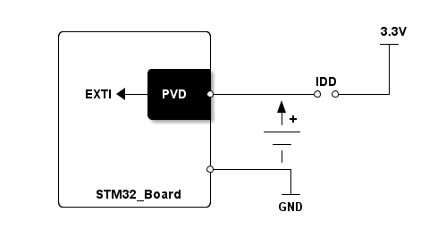

# __Example: *hal_pwr_pvd*__

**Example version:** 2.0.0

[](https://dev.st.com/stm32cube-docs/examples/arch-v1/en/index.html "An offline version is also available in the Cube firmware package.")

How to configure the PVD with the HAL API.

The PVD (Programmable voltage detector) is a feature that triggers interrupts based on the MCU power supply voltage.
It uses an "internal" EXTI line. As an example, it can perform emergency shutdown tasks.


## __1. Detailed scenario__

__Initialization phase__: At the beginning of the `main()` function, the `mx_system_init()` function is called to initialize all the peripherals, the flash interface, the system clock, and the SysTick.
In the `app_init()` function, `mx_example_pvd_irq_init()` is called to enable the EXTI line linked to the PVD.

The application executes the following __example steps__:

__Step 1__: configures the PVD and its interrupt.

__Step 2__: waits for the PVD interrupt.

__Step 3__: triggers the PVD interrupt when the power supply of the MCU decreases.
              If the voltage is still sufficient, the MCU continues to work.
              If it is too low, the MCU turns off and the application terminates.

__Step 4__: deinitializes the PVD (with its interrupt).

__End of example__:
This example is a one-shot application. It terminates once the PVD IRQ is triggered.

If you enable `USE_TRACE`, you can follow these execution steps in the terminal logs:
```text
[INFO] Step 1: Device initialization COMPLETED.
[INFO] Step 2: Waiting for the configured PVD interrupt.
[INFO] Step 3: PVD Interrupt detected.
[INFO] Step 4: Device deinitialization COMPLETED.
```


## __2. Example configuration__

[](https://dev.st.com/stm32cube-docs/examples/arch-v1/en/configure/config_toc.html "An offline version is also available in the Cube firmware package.")

This example demonstrates the following peripherals:

__PVD__ accepts different voltage thresholds and it depends on boards.
The voltage values are given in the [Hardware environment and setup](#3-hardware-environment-and-setup) section.

__EXTI__ can be configured to trigger an interrupt if the voltage exceeds or falls below the configured threshold.
When configuring the EXTI line, check the reference manual to use the correct trigger (falling or rising edge).


## __3. Hardware environment and setup__

### __3.1. Generic Setup__

This section describes the hardware setup principles that apply to any board.

To use this example, you need to decrease the MCU power supply voltage.

On ST boards, you can use the IDD jumper to do it :
  1. Unplug the IDD jumper.
  2. Connect a variable power supply to the MCU VCC pin.
  3. Set the initial value according to the specific board setup table.
  4. Decrease the voltage below the PVD threshold value.
     - Do not decrease too much to avoid MCU complete switch-off or a potential BOR (brownout reset) action.

<!--
@startditaa doc/STMicroelectronics.example_hal_pwr_pvd-setup.png
    /----------------\                  3.3V
    |                |                  -+-
    |                |                   |
    |         /------+                   |
    |         |      |           IDD     |
    |  EXTI<--+ PVD  +-----------* *-----+
    |         |cBLK  |       ^
    |         \------+       |+
    |                |     -----
    |                |      ---
    |                |       |
    |                +--------+
    |                |        |
    |   STM32_Board  |       -+-
    \----------------/       GND
@endditaa
-->



 ### __3.2. Specific board setups__

This section describes the exact hardware configurations of your project.

<details>
  <summary>On STM32C5 series.</summary>

 - VCC initial value: 3.3V
- PVD threshold value: 2.7V

  | Board name     | IDD jumper name |
  | :---:          | :---:           |
  | NUCLEO-C542RC  | JP5             |
  | NUCLEO-C562RE  | JP5             |
  | NUCLEO-C5A3ZG  | JP5             |
  <details>
    <summary>On board NUCLEO-C542RC.</summary>

  |  MCU pin  |  Signal name  |  User Label   |
  |:---------:|:-------------:|:-------------:|
  |    PA5    |     GPIO      | MX_STATUS_LED |
  |    PH0    |  RCC_OSC_IN   |    OSC_IN     |
  |    PH1    |  RCC_OSC_OUT  |    OSC_OUT    |
  |    PA2    |   USART2_TX   |      PA2      |

  </details>

  <details>
    <summary>On board NUCLEO-C562RE.</summary>

  |  MCU pin  |  Signal name  |  User Label   |
  |:---------:|:-------------:|:-------------:|
  |    PA5    |     GPIO      | MX_STATUS_LED |
  |    PH0    |  RCC_OSC_IN   |    OSC_IN     |
  |    PH1    |  RCC_OSC_OUT  |    OSC_OUT    |
  |    PA2    |   USART2_TX   |      PA2      |

  </details>

  <details>
    <summary>On board NUCLEO-C5A3ZG.</summary>

  |  MCU pin  |  Signal name  |  User Label   |
  |:---------:|:-------------:|:-------------:|
  |    PA5    |     GPIO      | MX_STATUS_LED |
  |    PH0    |  RCC_OSC_IN   |  PH0_OSC_IN   |
  |    PH1    |  RCC_OSC_OUT  |  PH1_OSC_OUT  |
  |    PA2    |   USART2_TX   | DBGIN_VCP_TX  |

  </details>
</details>
<details>
  <summary>On STM32U5 series</summary>

 The power voltage values for HAL_PWR_PVD_LEVEL_3 are :

- VCC initial value: 3.3V
- PVD threshold value: 2.5V

  | Board name    | IDD jumper name |
  | :---:         | :---:    |
  | DISCO-BU585I  | JP3      |
  | NUCLEO-U575I  | JP5      |
</details>


## __4. Troubleshooting__

[](https://dev.st.com/stm32cube-docs/examples/arch-v1/en/debug/debug_toc.html "An offline version is also available in the Cube firmware package.")

Find below the points of attention for this specific example.

__PVD IRQ__: Once the PVD IRQ is detected, clear the PVD IRQ pending flag not to stay stuck in the IRQ handling.


## __5. See Also__

[](https://dev.st.com/stm32cube-docs/examples/arch-v1/en/more/more_toc.html "An offline version is also available in the Cube firmware package.")

This [application note](https://www.st.com/content/ccc/resource/training/technical/product_training/group0/62/71/4f/2a/5d/25/4c/c7/STM32F7_System_EXTI/files/STM32F7_System_EXTI.pdf/jcr:content/translations/en.STM32F7_System_EXTI.pdf) gives information about the STM32 Extended Interrupts and events controller.

This [application note](https://www.st.com/content/ccc/resource/technical/document/application_note/0d/1d/ae/7f/f9/e8/41/65/DM00206898.pdf/files/DM00206898.pdf/jcr:content/translations/en.DM00206898.pdf) gives information about PVD usage over a VBAT system.

This [application note](https://www.st.com/content/ccc/resource/technical/document/application_note/a2/9c/07/d9/2a/b2/47/dc/CD00004479.pdf/files/CD00004479.pdf/jcr:content/translations/en.CD00004479.pdf) gives information about PVD usage with electromagnetic compatibility troubles.

More information about the HAL flow can be found [here](https://wiki.st.com/stm32mcu/wiki/Getting_started_with_EXTI#HAL_Library_workflow_summary)

The documentation of the drivers of the relevant STM32 series contains more detailed information.

For instance for the STM32C5 series: [HAL documentation](https://dev.st.com/stm32cube-docs/stm32c5xx-hal-drivers/latest/en/index.html).

More information about the STM32 ecosystem can be found in the [STM32 MCU Developer Zone](https://www.st.com/content/st_com/en/stm32-mcu-developer-zone/embedded-software.html).


## __6. License__

Copyright (c) 2026 STMicroelectronics.

This software is licensed under terms that can be found in the LICENSE file in the root directory
of this software component.
If no LICENSE file comes with this software, it is provided AS-IS.
