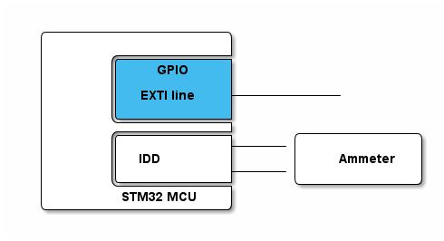

# __Example: *hal_pwr_sleep*__

**Example version:** 2.0.0

How to enter and exit the Sleep mode through an EXTI interrupt using the LL API.

## __1. Detailed scenario__

We illustrate this by switching the MCU from the Run to Sleep mode and waking the MCU up using an EXTI interrupt.

__Initialization phase__: At main program start, the `mx_system_init()` function is called. It initializes the peripherals, nonvolatile memory (such as flash memory, NVM, or external memories), MPU regions (if applicable), the system clock, and the SysTick.

The application executes the following __example steps__:

__Step 1__: At startup, the application configures the system to reach lowest power consumption while the system is in Sleep mode and configures the system wake-up source.

__Step 2__: The example stays in RUN mode with LED on during 2s, then entering Sleep mode. At this point, the device power consumption can be measured until the user push button connected to the EXTI line is pressed to wake up the system.

__End of example__: This example loops indefinitely, if no error occurs (the step 2 is executed in a loop).

The MCU enters low-power modes by executing the WFI (wait for interrupt), or WFE (wait for event) instructions, or when the SLEEPONEXIT bit in the Cortex system control register is set on return from ISR. Entering into a low-power mode through WFI or WFE is executed only if no interrupt is pending or no event is pending.

## __2. Example configuration__

This example demonstrates the following peripheral:

__PWR__:

The Cortex supports two power states: Sleep and Deep-sleep. Sleep mode is a sleep mode of the MCU, so it is entered with the Cortex in sleep state.

In Sleep mode, the Cortex and most clocks are stopped, while SRAM and register contents are retained.

Exiting Sleep mode requires configuring a wake-up source. A GPIO in EXTI interrupt mode is configured within this example.

Exiting Sleep mode does not reset the MCU. After wake-up, execution resumes where it stopped.

Any modification to the configuration used in this example can impact the typical power consumption.

## __3. Hardware environment and setup__

### __3.1. Generic Setup__

The application needs only an external signal to wake the MCU up.
For this example, we used a GPIO pin in EXTI mode connected to the user button.

Use the IDD pin to measure the MCU's power consumption by connecting an ammeter in series.

<!--
@startditaa doc/STMicroelectronics.example_hal_pwr_sleep-setup.png
  /--------------------\
  |                    |
  |       /------------+
  |       |    GPIO    |
  |       |            |
  |       | EXTI line  +------------
  |       |  c4BE      |
  |       \------------+
  |       /------------+      /-------------\
  |       |            +------|             |
  |       |  IDD       |      |    Ammeter  |
  |       |            +------|             |
  |       \------------+      \-------------/
  |        STM32 MCU   |
  \--------------------/
@endditaa
-->

### __3.2. Specific board setups__

This section describes the exact hardware configurations of your project.

The following power typical consumption values for this example are measured under these conditions:

- VDD_MCU is set to 3 V.
- Temperature is 25 degrees Celsius.
- The STLink V3 PWR is used.

Measurement procedure:

- Program the example code.
- Connect the STLink V3 PWR to the VDD_MCU pin.
- Configure the STLink V3 PWR to supply 3 V.
- Wait until the LED turns off to ensure that the system enters low power mode.
- Start the measurement.

  
On STM32C5 series.

  

    
On board NUCLEO-C542RC.

  |  MCU pin  |  Signal name  |  User Label              |
  |:---------:|:-------------:|:------------------------:|
  |    PH0    |  RCC_OSC_IN   |    OSC_IN                |
  |    PH1    |  RCC_OSC_OUT  |    OSC_OUT               |
  |    PA5    |     GPIO      | MX_STATUS_LED            |
  |   PC13    |     GPIO      | MX_EXTIX_EXTI_LINE       |

  |       Mode      | Typical consumption |
  |:---------------:|:-------------------:|
  |    Sleep Mode   |       889 uA        |

  

  

    
On board NUCLEO-C562RE.

  |  MCU pin  |  Signal name  |  User Label              |
  |:---------:|:-------------:|:------------------------:|
  |    PH0    |  RCC_OSC_IN   |    OSC_IN                |
  |    PH1    |  RCC_OSC_OUT  |    OSC_OUT               |
  |    PA5    |     GPIO      | MX_STATUS_LED            |
  |   PC13    |     GPIO      | MX_EXTIX_EXTI_LINE       |

  |       Mode      | Typical consumption |
  |:---------------:|:-------------------:|
  |    Sleep Mode   |       918 uA        |

  

  

    
On board NUCLEO-C5A3ZG.

  |  MCU pin  |  Signal name  |  User Label              |
  |:---------:|:-------------:|:------------------------:|
  |    PH0    |  RCC_OSC_IN   |    OSC_IN                |
  |    PH1    |  RCC_OSC_OUT  |    OSC_OUT               |
  |    PA5    |     GPIO      | MX_STATUS_LED            |
  |   PC13    |     GPIO      | MX_EXTIX_EXTI_LINE       |

  |       Mode      | Typical consumption |
  |:---------------:|:-------------------:|
  |    Sleep Mode   |       1083 uA       |

  

## __4. Troubleshooting__

Here are the points of attention for this specific example:

__Status LED__: This example does not follow the standard status LED pattern. When the LED is on, the system is in Run mode, otherwise it is in Sleep mode.

__IOs__: In Sleep mode, all I/O pins keep the same state as in the Run mode.

__Wake-up events__: All wake-up sources that can wake up the system from Sleep mode are described in the reference manual.

__Memory retention__: When exiting from Sleep mode, all register contents are preserved. All memory content is retained. Refer to the reference manual of the MCU in use.

__BOR__: The BOR is always available in Sleep mode.

__Debugging low-power modes__: This example targets the lowest power consumption for Sleep mode, and debugging can interfere. If you need to debug behavior around entry/exit of low-power modes, use the MCU debug features described in the reference manual (DBGMCU or SBS according products).

__Power measurement__: When flashing the example binary with an integrated development environment (IDE), some IDEs activate the low power debug feature integrated within DBGMCU or SBS peripherals, depending on the product. In most cases, debug features are cleared only after a power on reset. Therefore, perform a power on reset after flashing the example and before measuring power consumption.

__Pins in analog mode__: The lowest power consumption for GPIO pins is achieved when they are configured in analog mode. By default, pins located on analog capable IOs are configured in analog mode, with the exception of debug pins. In this example, debug pins are intentionally left in their default configuration to preserve debugging capabilities and are not switched to analog mode. Refer to the reference manual of the MCU in use for debug pins list.

## __5. See Also__

[Application Note 4991](https://www.st.com/resource/en/application_note/an4991-how-to-wake-up-an-stm32xx-series-microcontroller-from-lowpower-mode-with-the-usart-or-the-lpuart-stmicroelectronics.pdf): How to wake up an STM32 microcontroller from low-power mode with the USART or the LPUART

[Getting Started with PWR](https://wiki.st.com/stm32mcu/wiki/Getting_started_with_PWR): This article explains low-power modes, and provides code examples.

More information about the STM32 ecosystem can be found in the [STM32 MCU Developer Zone](https://www.st.com/content/st_com/en/stm32-mcu-developer-zone/embedded-software.html).

More information about the STM32 current consumption measurement procedure using STLINK v3 PWR can be found in the https://www.youtube.com/watch?v=9B1tVAj0VAU&t=803s

More information about the typical consumption values in different low power mode can be found in the datasheet of the STM32 series you are using.

## __6. License__

Copyright (c) 2026 STMicroelectronics.

This software is licensed under terms that can be found in the LICENSE file in the root directory
of this software component.
If no LICENSE file comes with this software, it is provided AS-IS.
