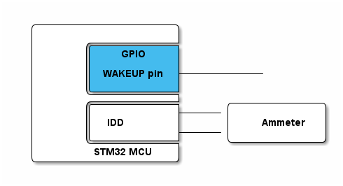

# __Example: *hal_pwr_standby*__

**Example version:** 2.0.0

How to enter and exit the Standby mode through a wake-up pin using the HAL API.

## __1. Detailed scenario__

We illustrate this by switching the MCU from the Run to Standby mode and waking the MCU up using a wake-up pin.

__Initialization phase__: At main program start, the `mx_system_init()` function is called. It initializes the peripherals, nonvolatile memory (such as flash memory, NVM, or external memories), MPU regions (if applicable), the system clock, and the SysTick.

The application executes the following __example steps__:

__Step 1__: At startup (first boot or returning from a standby reset), the application configures the system to reach lowest power consumption while the system is in Standby mode and configures the system wake-up source.

__Step 2__: The example stays in RUN mode with LED on during 2s, then clears the pending flags before entering Standby mode. At this point, the device power consumption can be measured until the user push button connected to the wake-up pin is pressed to wake up the system.

__End of example__: This example loops indefinitely, if no error occurs.

The MCU enters low-power modes by executing the WFI (wait for interrupt), or WFE (wait for event) instructions, or when the SLEEPONEXIT bit in the Cortex system control register is set on return from ISR. Entering into a low-power mode through WFI or WFE is executed only if no interrupt is pending or no event is pending.

## __2. Example configuration__

This example demonstrates the following peripheral:

__PWR__:

The Cortex supports two power states: Sleep and Deep-sleep. Standby mode is a deep-sleep mode of the MCU, so it is entered with the Cortex in Deep-sleep state.

In Standby mode, the system domain is powered down, and only the backup domain (VBAT) remains supplied.

Exiting Standby mode requires configuring a wake-up source. The PWR wake-up pin is configured within this example.

Exiting Standby mode causes a reset of the MCU (a Standby reset), and after wake-up the Cortex behaves as after a normal reset, starting execution from the reset vector.

To distinguish a Standby reset from any other reset, the Standby flag and the Standby reset indication can be checked. These indicators can be cleared either by software or by a power-on reset.

Any modification to the configuration used in this example can impact the typical power consumption.

## __3. Hardware environment and setup__

### __3.1. Generic Setup__

The application needs only an external signal to wake the MCU up.
On most of ST boards, the user button is connected to the wake-up pin.

Use the IDD pin to measure the MCU's power consumption by connecting an ammeter in series.

<!--
@startditaa doc/STMicroelectronics.example_hal_pwr_standby-setup.png
  /--------------------\
  |                    |
  |       /------------+
  |       |    GPIO    |
  |       |            |
  |       | WAKEUP pin +------------
  |       |  c4BE      |
  |       \------------+
  |       /------------+      /-------------\
  |       |            +------|             |
  |       |  IDD       |      |    Ammeter  |
  |       |            +------|             |
  |       \------------+      \-------------/
  |        STM32 MCU   |
  \--------------------/
@endditaa
-->

### __3.2. Specific board setups__

This section describes the exact hardware configurations of your project.

The following power typical consumption values for this example are measured under these conditions:

- VDD_MCU is set to 3 V.
- Temperature is 25 degrees Celsius.
- The STLink V3 PWR is used.

Measurement procedure:

- Program the example code.
- Connect the STLink V3 PWR to the VDD_MCU pin.
- Configure the STLink V3 PWR to supply 3 V.
- Wait until the LED turns off to ensure that the system enters low power mode.
- Start the measurement.

  
On STM32C5 series.

  

    
On board NUCLEO-C542RC.

  |  MCU pin  |  Signal name  |  User Label   |
  |:---------:|:-------------:|:-------------:|
  |    PH0    |  RCC_OSC_IN   |    OSC_IN     |
  |    PH1    |  RCC_OSC_OUT  |    OSC_OUT    |
  |    PA5    |     GPIO      | MX_STATUS_LED |
  |    PC13   |     GPIO      | PWR_WKUP4     |

  |       Mode      | Typical consumption |
  |:---------------:|:-------------------:|
  |   Standby Mode  |       3.0 uA        |

  

  

    
On board NUCLEO-C562RE.

  |  MCU pin  |  Signal name  |  User Label   |
  |:---------:|:-------------:|:-------------:|
  |    PH0    |  RCC_OSC_IN   |    OSC_IN     |
  |    PH1    |  RCC_OSC_OUT  |    OSC_OUT    |
  |    PA5    |     GPIO      | MX_STATUS_LED |
  |    PC13   |     GPIO      | PWR_WKUP4     |

  |       Mode      | Typical consumption |
  |:---------------:|:-------------------:|
  |   Standby Mode  |       3.1 uA        |

  

  

    
On board NUCLEO-C5A3ZG.

  |  MCU pin  |  Signal name  |  User Label   |
  |:---------:|:-------------:|:-------------:|
  |    PH0    |  RCC_OSC_IN   |    OSC_IN     |
  |    PH1    |  RCC_OSC_OUT  |    OSC_OUT    |
  |    PA5    |     GPIO      | MX_STATUS_LED |
  |    PC13   |     GPIO      | PWR_WKUP4     |

  |       Mode      | Typical consumption |
  |:---------------:|:-------------------:|
  |   Standby Mode  |       3.2 uA        |

  

## __4. Troubleshooting__

Here are the points of attention for this specific example:

__Status LED__: This example does not follow the standard status LED pattern. When the LED is on, the system is in Run mode, otherwise it is in Standby mode.

__IOs__: In Standby mode, the I/Os are by default in floating state.

__Wake-up events__: Only the wake-up line, external RESET, watchdog, and RTC/TAMPER events can wake up the system from Standby mode.

__Memory retention__: When exiting from Standby mode, the application restarts. The SRAMs and register contents are lost except for registers in the Backup domain and Standby circuitry. However, it is possible to enable the memory retention of some specific RAM areas. Refer to the reference manual of the MCU in use.

__BOR__: The BOR is always available in Standby mode.

__Wake-up flag__: Before entering Standby mode, we have to clear the wake-up flag when it is pending.

__Debugging low-power modes__: This example targets the lowest power consumption for Standby mode, and debugging can interfere. If you need to debug behavior around entry/exit of low-power modes, use the MCU debug features described in the reference manual (DBGMCU or SBS according products).

__Standby system checks__: It is possible to check if the system was in Standby mode using the HAL_PWR_GetPreviousSystemPowerMode() function. And it is possible to check if a Standby mode reset is generated using the HAL_RCC_GetResetSource() function.

__Power measurement__: When flashing the example binary with an integrated development environment (IDE), some IDEs activate the low power debug feature integrated within DBGMCU or SBS peripherals, depending on the product. In most cases, debug features are cleared only after a power on reset. Therefore, perform a power on reset after flashing the example and before measuring power consumption.

__Pins in analog mode__: The lowest power consumption for GPIO pins is achieved when they are configured in analog mode. By default, pins located on analog capable IOs are configured in analog mode, with the exception of debug pins. In this example, debug pins are intentionally left in their default configuration to preserve debugging capabilities and are not switched to analog mode. Refer to the reference manual of the MCU in use for debug pins list.

## __5. See Also__

[Application Note 4991](https://www.st.com/resource/en/application_note/an4991-how-to-wake-up-an-stm32xx-series-microcontroller-from-lowpower-mode-with-the-usart-or-the-lpuart-stmicroelectronics.pdf): How to wake up an STM32 microcontroller from low-power mode with the USART or the LPUART

[Getting Started with PWR](https://wiki.st.com/stm32mcu/wiki/Getting_started_with_PWR): This article explains low-power modes, and provides code examples.

More information about the STM32 ecosystem can be found in the [STM32 MCU Developer Zone](https://www.st.com/content/st_com/en/stm32-mcu-developer-zone/embedded-software.html).

More information about the STM32 current consumption measurement procedure using STLINK v3 PWR can be found in the https://www.youtube.com/watch?v=9B1tVAj0VAU&t=803s

More information about the typical consumption values in different low power mode can be found in the datasheet of the STM32 series you are using.

## __6. License__

Copyright (c) 2026 STMicroelectronics.

This software is licensed under terms that can be found in the LICENSE file in the root directory
of this software component.
If no LICENSE file comes with this software, it is provided AS-IS.
