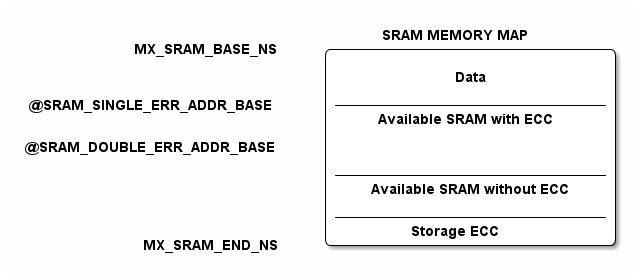

# __Example: *hal_ramcfg_ecc_error_generation*__

**Example version:** 2.0.0

[](https://dev.st.com/stm32cube-docs/examples/arch-v1/en/index.html "An offline version is also available in the Cube Firmware package.")

How to configure and use the RAMCFG HAL APIs to demonstrate the RAMCFG ECC (Error Code Correction) monitoring in interrupt mode.
This monitoring supports the single error detection and correction and double error detection.


## __1. Detailed scenario__

__Initialization phase__: At main program start, the `mx_system_init()` function is called. It initializes the peripherals, nonvolatile memory (such as flash memory, NVM, or external memories), MPU regions (if applicable), the system clock, and the SysTick.


The application executes the following __example steps__:

- __Step 1__: configures and initializes the RAMCFG instance and the NVIC. Registers the user callbacks for RAMCGF error detection.
- __Step 2__: erases the given SRAM memory and writes known data with ECC enabled. The ECC is calculated for this memory region during write accesses.
- __Step 3__: disables ECC.
- __Step 4__: fills memory with single and double error data.
- __Step 5__: enables ECC.
- __Step 6__: reads memory content and checks that single and double ECC errors are generated.
- __Step 7__: disables and stop the ECC monitoring of the selected RAMCFG instance before leaving the scenario.
__End of example__: after step 7, the example is completed. You can check its status via the variable ExecStatus and the **status LED** remains turned on in case of success.


If you enable **`USE_TRACE`**, you can follow these steps, in the nominal case of execution, in the terminal logs:

```text
[INFO] Step 1: Device initialization COMPLETED.
[INFO] Step 2: Memory erasing and write known data with ECC on COMPLETED.
[INFO] Step 3: ECC disabled.
[INFO] Step 4: Memory filled with single and double error data.
[INFO] Step 5: ECC enabled.
[INFO] Step 6: Single and double ECC errors checked successfully.
[INFO] Step 7: de-init.
```


## __2. Example configuration__

[](https://dev.st.com/stm32cube-docs/examples/arch-v1/en/configure/config_toc.html "An offline version is also available in the STM32Cube firmware package.")

This example demonstrates the following peripheral:

__RAMCFG__:
RAMCFG is the abbreviation of RAM configuration controller. In this example, the RAMCFG interrupt is configured and enabled in the NVIC to handle:

  - Single errors detection and correction event.
  - Double errors detection event.


## __3. Hardware environment and setup__

### __3.1. Generic Setup__

<details>
<summary> Expand this tab to visualize the architecture of the SRAM memory map.</summary>

<!--
@startuml
@startditaa{doc/sram_memory_map.png}
                                    SRAM MEMORY MAP
           MX_SRAM_BASE_NS    /----------------------------\
                              |                            |
                              |            Data            |
                              |                            |
@SRAM_SINGLE_ERR_ADDR_BASE    |----------------------------|
                              |  Available SRAM with ECC   |
                              |                            |
@SRAM_DOUBLE_ERR_ADDR_BASE    |                            |
                              |                            |
                              |----------------------------|
                              | Available SRAM without ECC |
                              |                            |
                              |----------------------------|
                              |       Storage ECC          |
            MX_SRAM_END_NS    \----------------------------/
@endditaa
@endumldd
-->

> **_NOTE:_** The SRAM_SINGLE_ERR_ADDR_BASE and SRAM_DOUBLE_ERR_ADDR_BASE must support the ECC.


</details>

### __3.2. Specific board setups__

<details>
  <summary>On STM32C5 series.</summary>
  <details>
    <summary>Additional info</summary>

  The ECC is supported by SRAM2 when enabled with the SRAM2_ECC user option bits.
  Seven ECC bits are added per 32 bits of SRAM, allowing 2-bit error detection and 1-bit error
  correction on memory read access.
  As the ECC is calculated and checked for a 32-bit word, byte and half-word write accesses
  are managed by the SRAM interface by first reading the whole word, then write the word
  again with the new byte/half-word value. ECC double errors are also detected during these
  bytes or half-word AHB write accesses (read/modify/write done by interface). The byte or
  half-word write access latency is two AHB clock cycles.

  </details>

  <details>
    <summary>On board NUCLEO-C542RC.</summary>

  |  MCU pin  |  Signal name  |  User Label   |
  |:---------:|:-------------:|:-------------:|
  |    PA5    |     GPIO      | MX_STATUS_LED |
  |    PH0    |  RCC_OSC_IN   |    OSC_IN     |
  |    PH1    |  RCC_OSC_OUT  |    OSC_OUT    |
  |    PA2    |   USART2_TX   |      PA2      |

  </details>

  <details>
    <summary>On board NUCLEO-C562RE.</summary>

  |  MCU pin  |  Signal name  |  User Label   |
  |:---------:|:-------------:|:-------------:|
  |    PA5    |     GPIO      | MX_STATUS_LED |
  |    PH0    |  RCC_OSC_IN   |    OSC_IN     |
  |    PH1    |  RCC_OSC_OUT  |    OSC_OUT    |
  |    PA2    |   USART2_TX   |      PA2      |

  </details>

  <details>
    <summary>On board NUCLEO-C5A3ZG.</summary>

  |  MCU pin  |  Signal name  |  User Label   |
  |:---------:|:-------------:|:-------------:|
  |    PA5    |     GPIO      | MX_STATUS_LED |
  |    PH0    |  RCC_OSC_IN   |  PH0_OSC_IN   |
  |    PH1    |  RCC_OSC_OUT  |  PH1_OSC_OUT  |
  |    PA2    |   USART2_TX   | DBGIN_VCP_TX  |

  </details>
</details>


## __4. Troubleshooting__

[](https://dev.st.com/stm32cube-docs/examples/arch-v1/en/debug/debug_toc.html "An offline version is also available in the STM32Cube firmware package.")

Here are some important points for this example:

__NMI__: When we use the HAL_RAMCFG_ECC_Start_IT() API instead of HAL_RAMCFG_ECC_Start_IT_Opt, the NMI should be configured.

__Correction__: Only single errors are corrected. Double errors are only detected.

 __Errors count__: At high optimization levels, the compiler may emit multiword load instructions(`LDM`). The interrupt fires fewer times than there are erroneous words, causing the ISR error counter to be lower than expected. Using a function level optimization pragma on `ReadMemory()` forces the compiler to emit one distinct `LDR` instruction per word regardless of the optimization level. This pragma is added only for event counting in this example and is not a functional requirement for ECC operation.


## __5. See Also__

[](https://dev.st.com/stm32cube-docs/examples/arch-v1/en/more/more_toc.html "An offline version is also available in the STM32Cube firmware package.")

You can also refer to these other examples demonstrating how to secure access violation SRAM or with different HAL RAMCFG setups:

- example_hal_rif_internal_sram_protection
- example_hal_ramcfg_write_protection

The documentation of the drivers of the relevant STM32 series contains more detailed information.

For instance for the STM32C5 series: [HAL documentation](https://dev.st.com/stm32cube-docs/stm32c5xx-hal-drivers/latest/en/index.html).

More information about the STM32 ecosystem can be found in the [STM32 MCU Developer Zone](https://www.st.com/content/st_com/en/stm32-mcu-developer-zone/embedded-software.html).


## __6. License__

Copyright (c) 2026 STMicroelectronics.

This software is licensed under terms that can be found in the LICENSE file in the root directory
of this software component.
If no LICENSE file comes with this software, it is provided AS-IS.
