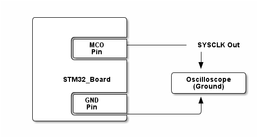

# __Example: *hal_rcc_clock_switch_max_default*__

**Example version:** 2.0.0

[](https://dev.st.com/stm32cube-docs/examples/arch-v1/en/index.html "An offline version is also available in the STM32Cube firmware package.")

How to configure the system clock (SYSCLK) and update clock source in run mode using RCC HAL APIs.


## __1. Detailed scenario__

The system clock (SYSCLK) is the main clock source for the microcontroller. This example shows how to switch between max clock frequency, and default clock. When the system clock is set to its max, the clock is outputted on the MCO pin.

__Initialization phase__: At main program start, the `mx_system_init()` function is called. It initializes the peripherals, nonvolatile memory (such as flash memory, NVM, or external memories), MPU regions (if applicable), the system clock, and the SysTick.

The application executes the following __example steps__:

__Step 1__: At startup, SYSCLK is configured to the maximum clock source frequency by the applicative code. The SYSCLK signal is provided on the MCO pin.

__Step 2__: Switches the clock source from Max to Default during 1s (there is no more clock on the MCO).

__Step 3__: Switches the clock source from Default to Max indefinitely (clock is outputted again on the MCO pin).

__End of example__: After step 4, the example terminates. You can verify that the example runs properly via the status LED and the `ExecStatus` variable.

If you enable `USE_TRACE`, you can follow these execution steps in the terminal logs:
(Here is an example with the NUCLEO-C562RE settings, the frequencies may differ for another board)

```text
[INFO] Step 1: Output SYSCLK (144000kHz) to MCO pin, with a 10 divider (MCO freq: 14400kHz).
[INFO] Step 2: Default settings are used to generate SYSCLK at 48000kHz, (MCO freq: 4800kHz).
[INFO] Step 3: Max settings are used to generate SYSCLK at 144000kHz, (MCO freq: 14400kHz).
```


## __2. Example configuration__

[](https://dev.st.com/stm32cube-docs/examples/arch-v1/en/configure/config_toc.html "An offline version is also available in the STM32Cube firmware package.")

This example demonstrates the following peripheral:

__RCC__:

Use different clock source to generate the SYSCLK.

There is no specific configuration for this IP.


## __3. Hardware environment and setup__

### __3.1. Generic Setup__

No specific hardware setup is needed for this example.
Nevertheless, an oscilloscope may also be used to monitor the system clock value on the MCO pin.

<!--
@startditaa doc/example_hal_rcc_clock_switch_max_default.png
    /------------------\
    |                  |
    |                  |
    |       /----------+
    |       |   MCO    +------------ SYSCLK Out
    |       |   Pin    |              |
    |       \----------+              |
    |                  |              v
    |                  |        /--------------\
    |     STM32_Board  |        | Oscilloscope |
    |                  |        |   (Ground)   |
    |       /----------+        \--------------/
    |       |  GND     |              ^
    |       |  Pin     |              |
    |       \----------+--------------/
    \------------------/
@endditaa
-->



### __3.2. Specific board setups__

This section describes the exact hardware configurations of your project.

<details>
  <summary>On STM32C5 series.</summary>
  <details>
    <summary>On board NUCLEO-C542RC.</summary>

  |  MCU pin  |  Signal name  |  User Label   |
  |:---------:|:-------------:|:-------------:|
  |    PA5    |     GPIO      | MX_STATUS_LED |
  |    PH0    |  RCC_OSC_IN   |    OSC_IN     |
  |    PH1    |  RCC_OSC_OUT  |    OSC_OUT    |
  |    PA8    |   RCC_MCO1    |      PA8      |
  |    PA2    |   USART2_TX   |      PA2      |

  </details>

  <details>
    <summary>On board NUCLEO-C562RE.</summary>

  |  MCU pin  |  Signal name  |  User Label   |
  |:---------:|:-------------:|:-------------:|
  |    PA5    |     GPIO      | MX_STATUS_LED |
  |    PH0    |  RCC_OSC_IN   |    OSC_IN     |
  |    PH1    |  RCC_OSC_OUT  |    OSC_OUT    |
  |    PA8    |   RCC_MCO1    |      PA8      |
  |    PA2    |   USART2_TX   |      PA2      |

  </details>

  <details>
    <summary>On board NUCLEO-C5A3ZG.</summary>

  |  MCU pin  |  Signal name  |  User Label   |
  |:---------:|:-------------:|:-------------:|
  |    PA5    |     GPIO      | MX_STATUS_LED |
  |    PH0    |  RCC_OSC_IN   |  PH0_OSC_IN   |
  |    PH1    |  RCC_OSC_OUT  |  PH1_OSC_OUT  |
  |    PA8    |   RCC_MCO1    |      PA8      |
  |    PA2    |   USART2_TX   | DBGIN_VCP_TX  |

  </details>
</details>


## __4. Troubleshooting__

[](https://dev.st.com/stm32cube-docs/examples/arch-v1/en/debug/debug_toc.html "An offline version is also available in the STM32Cube firmware package.")

__Logs__: To keep console output and baud rate stable during clock switching, ensure the console is clocked from a stable, always-on source and keep it enabled (for example, an internal RC oscillator or the peripheral clock). This ensures all `PRINTF` statements work correctly when `USE_TRACE` is enabled.


## __5. See Also__

[](https://dev.st.com/stm32cube-docs/examples/arch-v1/en/more/more_toc.html "An offline version is also available in the STM32Cube firmware package.")

You can find more information on the reference manual of your chosen MCU, in the *reset and clock control (RCC)* section.
For example, here is the [STM32U575/585 Reference Manual](https://www.st.com/resource/en/reference_manual/rm0456-stm32u575585-armbased-32bit-mcus-stmicroelectronics.pdf).

The documentation of the drivers of the relevant STM32 series contains more detailed information.

More information about the STM32 ecosystem can be found in the [STM32 MCU Developer Zone](https://www.st.com/content/st_com/en/stm32-mcu-developer-zone/embedded-software.html).


## __6. License__

Copyright (c) 2026 STMicroelectronics.

This software is licensed under terms that can be found in the LICENSE file in the root directory
of this software component.
If no LICENSE file comes with this software, it is provided AS-IS.
