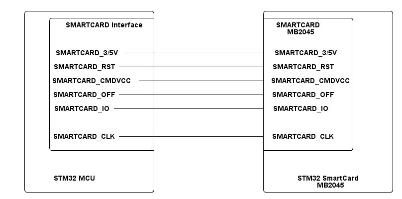

# __Example: *hal_smartcard_com_dma*__

**Example version:** 2.0.0

[](https://dev.st.com/stm32cube-docs/examples/arch-v1/en/index.html "An offline version is also available in the STM32Cube firmware package.")


How to handle a communication between STM32 board and a SmartCard based on the SMARTCARD interface with HAL API, in DMA mode.

This example implements communication between STM32 board and Smartcard using DMA mode.


## __1. Detailed scenario__

__Initialization phase__: At main program start, the `mx_system_init()` function is called. It initializes the peripherals, nonvolatile memory (such as flash memory, NVM, or external memories), MPU regions (if applicable), the system clock, and the SysTick.


The application executes the following __example steps__:

__Step 1__: configures and initializes the SMARTCARD instance.
            Registers the user callbacks for SMARTCARD interrupts: TX/RX transfer completed and transfer error.

__Step 2__: Perform card power-up and reset procedure, then transmit ADPU command to the card and wait for answer to reset (ATR) message.

__Step 3__: Send a command to the smartcard to read two bytes from the selected file stored in the smartcard.

__Step 4__: Waits for the acknowledge byte from the smartcard.

__Step 5__: Receive two bytes from the smartcard and store them in a dedicated buffer.
            Then compare expected results to the received data.

__Step 6__: Deinitializes the smartcard.

If the data transmit or receive operation fails or the exchanged buffers are different, the `error_handler()` function is called.

The communication status is reported via the status LED and the variable ExecStatus.

__End of example__:

After __Step 5__, the example is completed.

If you enable **`USE_TRACE`**, you can follow these execution steps in the terminal logs:

```text
[INFO] Step 1 : Device initialization COMPLETED.
[INFO] Step 2 : Cold reset COMPLETED and ATR message RECEIVED.
[INFO] Step 3 : File select instruction SENT to the SmartCard.
[INFO] Step 4 : ACK RECEIVED.
[INFO] Step 5 : Data received as EXPECTED.
[ERROR] Step 5: Data received ERROR.  
```


## __2. Example configuration__

[](https://dev.st.com/stm32cube-docs/examples/arch-v1/en/configure/config_toc.html "An offline version is also available in the STM32Cube firmware package.")

This example demonstrates the following peripherals.


__SMARTCARD__: is configured as indicated below:

- The baud rate is set to 10752.
- The word length is set to 8 bits.
- Stop bits are set to 1.5 bit.
- Parity is set to EVEN.
- Clock polarity is set to LOW.
- Clock phase is set to 1 EDGE.
- Clock output is set to ENABLED.
- The factor of the source clock frequency SCLK_PRESCALER is set to HAL_SMARTCARD_SCLK_PRESC_DIV24 (it is calculated regarding the USART kernel frequency and the STARTING_BAUDRATE = 4MHZ : (hal_smartcard_source_clock_prescaler_t)((HAL_RCC_USART_GetKernelClkFreq(USARTx) / STARTING_BAUDRATE) / 2))

More details about baudrate and ETU values are outlined in the ISO 7816 standard.

__DMA__: is used to manage data transfers.

- Two DMA channels USART Tx and USART Rx are enabled and configured, respectively, as indicated below:
  - The DMA transmit channel is configured in memory to peripheral mode with an incremented source address and a fixed destination address.
    After each byte transfer, the DMA automatically increments the source address to copy the next byte from an SRAM area to the USART transmit data register.
  - The DMA receive channel is configured in peripheral to memory mode with a fixed source address and an incremented destination address.
    The data is loaded from the USART receive data register to an SRAM area incrementally.
- For each DMA channel (USART Tx and Rx), the corresponding NVIC line is configured and enabled.


## __3. Hardware environment and setup__

### __3.1. Generic Setup__

- This section describes the hardware setup principles that apply to any board.

<!--
@startuml
@startditaa{doc/example_hal_smartcard_com_dma-setup.png} -E -S
    /-------------------------\                     /-------------------------\
    |    /--------------------+                     +-----------------\       |
    |    | SMARTCARD Interface|                     |  SMARTCARD      |       |
    |    |                    |                     |    MB2045       |       |
    |    |                    |                     |                 |       |
    |    |                    |                     |                 |       |
    |    |SMARTCARD_3/5V------+---------------------+ SMARTCARD_3/5V  |       |
    |    |                    |                     |                 |       |
    |    |SMARTCARD_RST-------+---------------------+ SMARTCARD_RST   |       |
    |    |                    |                     |                 |       |
    |    |SMARTCARD_CMDVCC ---+---------------------+ SMARTCARD_CMDVCC|       |
    |    |                    |                     |                 |       |
    |    |SMARTCARD_OFF-------+---------------------+ SMARTCARD_OFF   |       |
    |    |                    |                     |                 |       |
    |    |SMARTCARD_IO--------+---------------------+ SMARTCARD_IO    |       |
    |    |                    |                     |                 |       |
    |    |                    |                     |                 |       |
    |    |                    |                     |                 |       |
    |    |SMARTCARD_CLK-------+---------------------+ SMARTCARD_CLK   |       |
    |    |                    |                     |                 |       |
    |    \--------------------+                     +-----------------/       |
    |                         |                     |                         |
    |                         |                     |                         |
    |                         |                     |                         |
    |     STM32 MCU           |                     |     STM32 SmartCard     |
    |                         |                     |          MB2045         |
    \-------------------------/                     \-------------------------/

@endditaa
@endumldd
-->




### __3.2. Specific board setups__

This section describes the exact hardware configurations of your project.

<details>
  <summary>On STM32C5 series.</summary>
  <details>
    <summary>On board NUCLEO-C562RE.</summary>

  |  MCU pin  |  Signal name  |  User Label   |
  |:---------:|:-------------:|:-------------:|
  |    PA5    |     GPIO      | MX_STATUS_LED |
  |    PH0    |  RCC_OSC_IN   |    OSC_IN     |
  |    PH1    |  RCC_OSC_OUT  |    OSC_OUT    |
  |    PA2    |   USART2_TX   |      PA2      |
  |    PA8    |   USART1_CK   |      PA8      |
  |    PA6    |   USART1_TX   |      PA6      |
  |    PA0    |     GPIO      |       -       |
  |    PA4    |     GPIO      |       -       |
  |    PB0    |     GPIO      |       -       |
  |    PC5    |     GPIO      |       -       |

  </details>
</details>


## __4. Troubleshooting__

[](https://dev.st.com/stm32cube-docs/examples/arch-v1/en/debug/debug_toc.html "An offline version is also available in the STM32Cube firmware package.")

Here are the points of attention for this specific example:

__No signal__: If there are no signals observed, remember to check these points first:
   - The Tx pin of the SmartCard shield is connected to SMARTCARD_IO pin of the MCU.
   - The CK pin of the SmartCard shield is connected to SMARTCARD_CLK pin of the MCU.
   Note that the SmartCard shield is directly plugged into the Nucleo board via the Arduino-compatible connectors, ensuring a reliable hardware connection.

__Cache coherency__: Take care of cache coherency issue. When cache memory is enabled, it is generally not in the path of DMA transfer, thus a cache coherency issue might appear. It might be necessary to tackle cache coherency. See H7 FAQ:
  [DMA-is-not-working-on-STM32H7-devices](https://community.st.com/s/article/FAQ-DMA-is-not-working-on-STM32H7-devices).


## __5. See Also__

[](https://dev.st.com/stm32cube-docs/examples/arch-v1/en/more/more_toc.html "An offline version is also available in the STM32Cube firmware package.")

- You can find the application note AN2598 related to the SMARTCARD MANUAL on the [AN2598](https://www.st.com/resource/en/application_note/an2598-smartcard-interface-with-stm32f10x-and-stm32l1xx-microcontrollers-stmicroelectronics.pdf) website if you want to go further on some technical details of the SMARTCARD interface.

The documentation of the drivers of the relevant STM32 series contains more detailed information.

For instance for the STM32C5 series: [HAL documentation](https://dev.st.com/stm32cube-docs/stm32c5xx-hal-drivers/latest/en/index.html).

More information about the STM32 ecosystem can be found in the [STM32 MCU Developer Zone](https://www.st.com/content/st_com/en/stm32-mcu-developer-zone/embedded-software.html).


## __6. License__

Copyright (c) 2026 STMicroelectronics.

This software is licensed under terms that can be found in the LICENSE file in the root directory
of this software component.
If no LICENSE file comes with this software, it is provided AS-IS.
