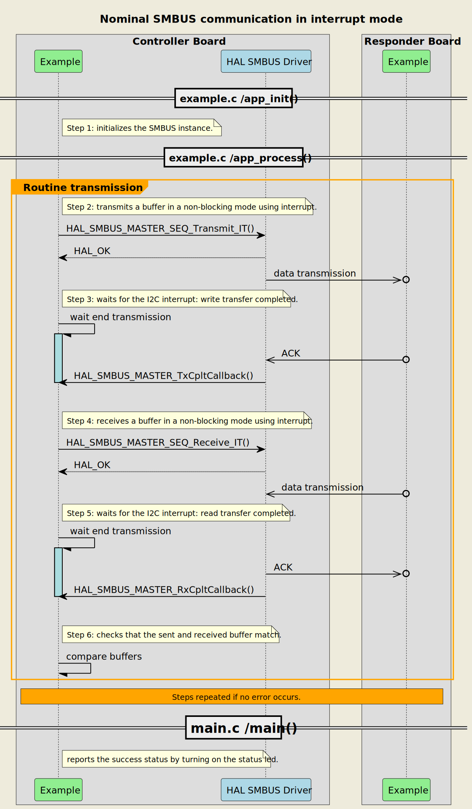
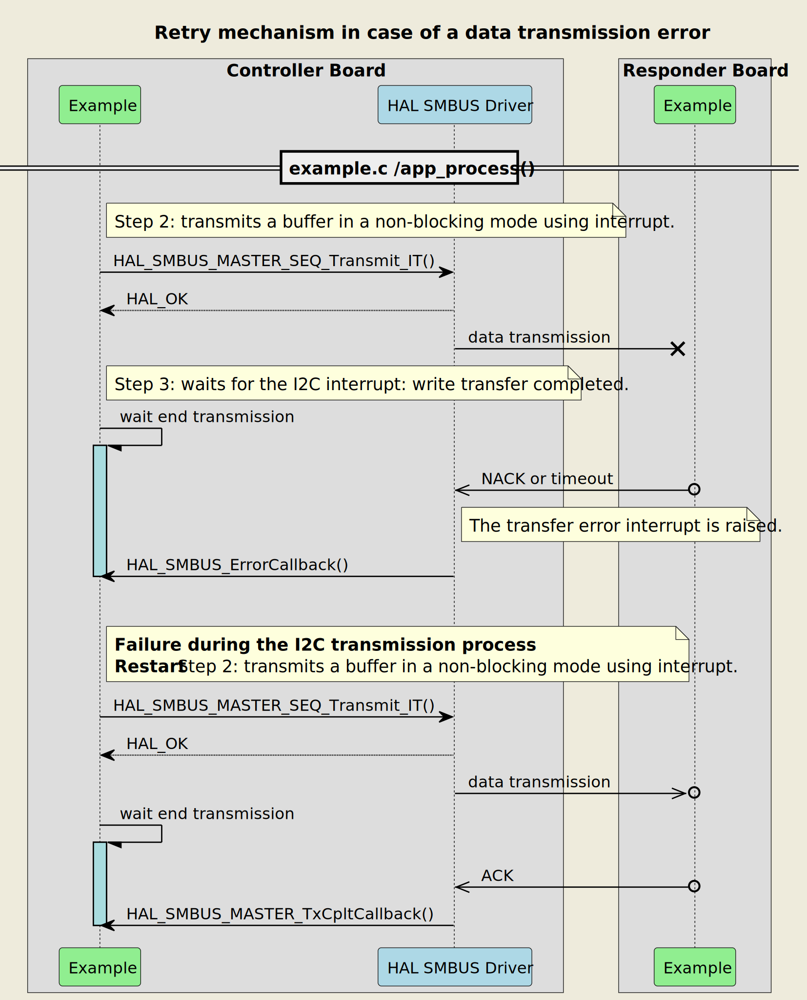
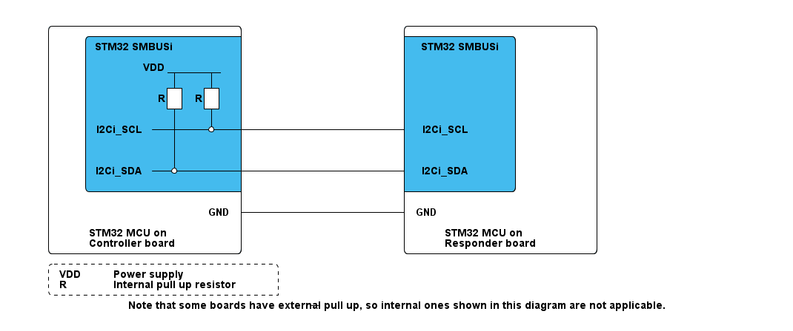

# __Example: *hal_smbus_two_boards_com_it_responder*__

**Example version:** 2.0.0

[](https://dev.st.com/stm32cube-docs/examples/arch-v1/en/index.html "An offline version is also available in the Cube Firmware package.")

How to handle a transmit-receive transactions between two boards based on the System Management Bus (SMBUS) protocol with the HAL API, using interrupts. The example implements the responder's code.

**Note that the terminology Controller/Responder characterizes the role taken by each device in the SMBUS communication, also known as SMBUS master and slave in legacy terminology.**


## __1. Detailed scenario__

__Initialization phase__: At main program start, the `mx_system_init()` function is called. It initializes the peripherals, nonvolatile memory (such as flash memory, NVM, or external memories), MPU regions (if applicable), the system clock, and the SysTick.

The application executes the following __example steps__:

- __Step 1__: Configures and initializes the SMBUS instance and the NVIC.
              Registers the user callbacks for SMBUS responder events: TX/RX transfer completed, transfer error, address match and listen complete.
- __Step 2__: Initiates the receive sequence in interrupt mode. The responder expects a buffer containing a null-terminated string using SMBUS. The received message contains the PEC byte.
- __Step 3__: Waits for one of these SMBUS interrupts: read transfer complete or transfer error.
- __Step 4__: Initiates the transmit sequence in interrupt mode. The responder sends back the received buffer, containing a null-terminated string using SMBUS. The transmission uses the SMBUS PEC feature.
- __Step 5__: Waits for one of these I2C interrupts: write transfer complete or transfer error.
              Returns to __Step2__ indefinitely if no error occurs.

If the data transmit or receive operation fails or the exchanged buffers are different, the responder restarts the reception process. The error_handler() function is called when the maximum number of attempts is reached.

__End of example__: If no error occurs, the data is transferred infinitely between the controller and the responder. If the maximum number of attempts is reached, the data transfer is stopped and an error status is reported.

If you enable `USE_TRACE`, you can follow these execution steps in the terminal logs:

```text
[INFO] Step 1: Device initialization COMPLETED.
[INFO] Responder - Message received and sent back: SMBUS Two Boards Communication - Message A
[INFO] Responder - Message received and sent back: SMBUS Two Boards Communication - Message B
[INFO] Responder - Message received and sent back: SMBUS Two Boards Communication - Message A
[INFO] Responder - Message received and sent back: SMBUS Two Boards Communication - Message B
...
```

The following **message sequence chart** is used to describe the SMBUS communication behavior between the controller board and the responder board and their environment by means of message interchange.



<details>
<summary> Expand this tab to visualize the sequence chart diagram in case of a data transmission error. </summary>



</details>


## __2. Example configuration__

[](https://dev.st.com/stm32cube-docs/examples/arch-v1/en/configure/config_toc.html "An offline version is also available in the Cube Firmware package.")

__SMBUS__: is configured as indicated below:

  > **_NOTE:_** The SMBUS is a two-wire interface based on I2C principles of operation

  - The 7-bit addressing mode is selected. The responder's own address is set to 0x3FU (7bits).
  - The SMBUS IP is configured to run at the maximum supported speed in order to demonstrate its highest performance (see board specific setup section).
  - The device is initialized in Slave mode.
  - The analog filter is enabled.
  - The Packet Error Check (PEC) feature is enabled.
  - The SMBUS timings are directly calculated by STM32CubeMX2 by referring to the I2C initialization section in the Reference Manual.
  - The event and error interrupts of the SMBUS instance are configured and enabled in the NVIC.
  - The selected GPIO pins support the I2C alternate function. They are configured in open drain mode with no pull-up neither pull-down activation.
    > **_NOTE:_** The I2C protocol standard requires to have a single pull-up resistor connected from each I2C line to the power supply to enable the communication. The pull-up resistors for the I2C pins already exist on the controller's board side. That is why in this use-case, we do not apply this configuration on the responder's board side.


## __3. Hardware environment and setup__

### __3.1. Generic Setup__

Please find below the hardware setup principle that applies to any board.

<!--
```
@startuml
@startditaa{doc/example_hal_smbus_two_boards_com_it_responder-setup.png} -E -S
    /-------------------------\                     /-------------------------\
    |    /--------------------+                     +--------------\          |
    |    |STM32 SMBUSi        |                     | STM32 SMBUSi |          |
    |    |                    |                     |              |          |
    |    |      VDD _________ |                     |              |          |
    |    |           |    |   |                     |              |          |
    |    |          +++  +++  |                     |              |          |
    |    |         R| | R| |  |                     |              |          |
    |    |          +++  +++  |                     |              |          |
    |    |           |    |   |                     |              |          |
    |    |I2Ci_SCL---+----*---+---------------------+ I2Ci_SCL     |          |
    |    |           |        |                     |              |          |
    |    |           |   c4BE |                     |              |          |
    |    |           |        |                     |              |          |
    |    |I2Ci_SDA---*--------+---------------------+ I2Ci_SDA     |          |
    |    |               c4BE |                     |       c4BE   |          |
    |    \--------------------+                     +--------------/          |
    |                         |                     |                         |
    |                     GND +---------------------+ GND                     |
    |                         |                     |                         |
    |     STM32 MCU on        |                     |     STM32 MCU on        |
    |     Controller board    |                     |     Responder board     |
    \-------------------------/                     \-------------------------/

    /------------------------------\
    | VDD:  Power supply           |
    | R: Internal pull up resistor |
    \-=----------------------------+

Note that some boards have external pull-up, so internal ones shown in this diagram are not applicable.

@endditaa
@endumldd
 ```
-->



### __3.2. Specific board setups__

The I2C serial clock (SCL) and data (SDA) lines can be observed by connecting an oscilloscope or a logic analyzer to the corresponding board connectors.

Please find the exact hardware configurations of your project below.


<details>
  <summary>On STM32C5 series.</summary>
  <details>
    <summary>On board NUCLEO-C542RC.</summary>

  |  MCU pin  |  Signal name  |  User Label   |
  |:---------:|:-------------:|:-------------:|
  |    PA5    |     GPIO      | MX_STATUS_LED |
  |    PH0    |  RCC_OSC_IN   |    OSC_IN     |
  |    PH1    |  RCC_OSC_OUT  |    OSC_OUT    |
  |    PA2    |   USART2_TX   |      PA2      |
  |    PB6    |   I2C1_SCL    |      PB6      |
  |    PB7    |   I2C1_SDA    |      PB7      |
  |   PA15    |   I2C1_SMBA   |   NetR16_2    |

  </details>

  <details>
    <summary>On board NUCLEO-C562RE.</summary>

  |  MCU pin  |  Signal name  |  User Label   |
  |:---------:|:-------------:|:-------------:|
  |    PA5    |     GPIO      | MX_STATUS_LED |
  |    PH0    |  RCC_OSC_IN   |    OSC_IN     |
  |    PH1    |  RCC_OSC_OUT  |    OSC_OUT    |
  |    PA2    |   USART2_TX   |      PA2      |
  |    PB6    |   I2C1_SCL    |      PB6      |
  |    PB7    |   I2C1_SDA    |      PB7      |
  |    PA9    |   I2C1_SMBA   |      PA9      |

  </details>

  <details>
    <summary>On board NUCLEO-C5A3ZG.</summary>

  |  MCU pin  |  Signal name  |  User Label   |
  |:---------:|:-------------:|:-------------:|
  |    PA5    |     GPIO      | MX_STATUS_LED |
  |    PH0    |  RCC_OSC_IN   |  PH0_OSC_IN   |
  |    PH1    |  RCC_OSC_OUT  |  PH1_OSC_OUT  |
  |    PA2    |   USART2_TX   | DBGIN_VCP_TX  |
  |    PB6    |   I2C1_SCL    |      PB6      |
  |    PB7    |   I2C1_SDA    |      PB7      |
  |    PA9    |   I2C1_SMBA   |      PA9      |

  </details>
</details>


## __4. Troubleshooting__

[](https://dev.st.com/stm32cube-docs/examples/arch-v1/en/debug/debug_toc.html "An offline version is also available in the Cube Firmware package.")

  __Buffer Size__: the example needs to ensure that the number of bytes expected by the responder is equal to the size of the message sent by the controller. Note that the size of the responder's Rx buffer can be adjusted by modifying the BUFFER_SIZE constant.

  __No visible signal__: if there are no I2C signals observed, remember to check these points first:
     - the GND pins of the controller and responder boards are connected.
     - the internal pull-up resistors are activated for the selected I2C pins. This configuration is enabled by default.

  __I2C signal quality__ if the I2C signals observed do not comply with the I2C specification, especially at high frequencies, you should try the following tips:
     - use the oscilloscope instead of the logic analyzer for a better measuring and viewing analog characteristics of the signals SCL and SDA. Check that the grounds of the instrument and the board are well wired.
     - replace the internal pull-up resistors with external ones. The selected values of the resistors should be compliant with the I2C specification.


## __5. See Also__

[](https://dev.st.com/stm32cube-docs/examples/arch-v1/en/more/more_toc.html "An offline version is also available in the Cube Firmware package.")

- You can find the SMBUS specification on the [smbus.org](http://smbus.org/specs/) website if you want more details about the SMBUS protocol.

- You can refer to the *hal_smbus_two_boards_com_it_controller* example pack to have a look at the controller's board application.

- The following application note [AN4502](https://www.st.com/resource/en/application_note/an4502-stm32-smbuspmbus-expansion-package-for-stm32cube-stmicroelectronics.pdf) describes how to implement a SMBUS firmware stack.

More information about the STM32Cube Drivers can be found in the drivers' user manual of the STM32 series you are using.

For instance for the STM32C5 series: [HAL documentation](https://dev.st.com/stm32cube-docs/stm32c5xx-hal-drivers/latest/en/index.html).

More information about the STM32 ecosystem can be found in the [STM32 MCU Developer Zone](https://www.st.com/content/st_com/en/stm32-mcu-developer-zone/embedded-software.html).


## __6. License__

Copyright (c) 2026 STMicroelectronics.

This software is licensed under terms that can be found in the LICENSE file in the root directory
of this software component.
If no LICENSE file comes with this software, it is provided AS-IS.
