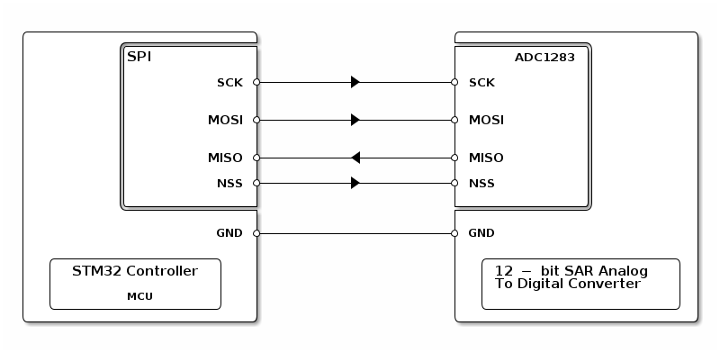

# __Example: *hal_spi_adc_com_polling*__

**Example version:** 2.0.0

[](https://dev.st.com/stm32cube-docs/examples/arch-v1/en/index.html "An offline version is also available in the STM32Cube firmware package.")

How to manage a full duplex synchronous SPI communication as controller with an external ADC, in polling mode, using the HAL API.


## __1. Detailed scenario__

The scenario consists of retrieving input voltage of external ADC1283 through SPI transmit-receive transaction.


__Initialization phase__: At main program start, the `mx_system_init()` function is called. It initializes the peripherals, nonvolatile memory (such as flash memory, NVM, or external memories), MPU regions (if applicable), the system clock, and the SysTick.

The application executes the following __example steps__:

__Step 1__: Configures and initializes the SPI instance.

__Step 2__: Initiates communication in full duplex blocking mode. The controller exchanges data (transmitting and receiving) with the external ADC within a specific timeout period.

__Step 3__: After a successful data exchange, the received data is processed (e.g., converting the received ADC value to millivolts) and the result is displayed. The process repeats as long as communication is successful and the maximum number of attempts is not reached.

On most boards, the LED shares its pin with the SPI SCK. Therefore, this example does not have a status LED.

__End of example__: If no error occurs, the data is transferred indefinitely between the controller and external ADC.

If you enable **`USE_TRACE`**, you can follow these steps, in the nominal case of execution, in the terminal logs:

```text
[INFO] Step 1: Device initialization COMPLETED.
[INFO] Controller - Transfer COMPLETED. Input voltage is 3300 mV.
[INFO] Controller - Transfer COMPLETED. Input voltage is 0 mV. 
```


## __2. Example configuration__

[](https://dev.st.com/stm32cube-docs/examples/arch-v1/en/configure/config_toc.html "An offline version is also available in the STM32Cube firmware package.")

The example demonstrates the following peripheral:

__SPI__:

The example uses SPI full-duplex synchronous transfers on four lines (MOSI, MISO, NSS and the clock signal) to send and receive data simultaneously between the controller and the responder.
For this purpose, the SPI instance of the controller board should be configured to the 'Master' mode, and the direction should be set to two lines.

In addition, it is necessary to set the clock polarity to HIGH according to sensor datasheet and the clock phase to the second clock transition.


## __3. Hardware environment and setup__

### __3.1. Generic Setup__

- Plug an Arduino Click SHIELD into the Arduino connector and then attach the ADC 1283 Click board on top of the shield.

<!--
@startuml
@startditaa{doc/example_hal_spi_adc_com_polling-setup.png}
    /-------------------------\                     /--------------------------\
    |          /--------------+                     +--------------\           |
    |          |SPI           |                     |      ADC1283 |           |
    |          |              |                     |              |           |
    |          |          SCK *--------+->----------* SCK          |           |
    |          |              |                     |              |           |
    |          |              |                     |              |           |
    |          |         MOSI *--------+->----------* MOSI         |           |
    |          |              |                     |              |           |
    |          |              |                     |              |           |
    |          |         MISO *----------<----------* MISO         |           |
    |          |              |                     |              |           |
    |          |          NSS *--------+->----------* NSS          |           |
    |          |              |                     |              |           |
    |          \--------------+                     +--------------/           |
    |                         |                     |                          |
    |                     GND *---------------------* GND                      |
    |                         |                     |                          |
    |  /------------------\   |                     |  /---------------------\ |
    |  | STM32 Controller |   |                     |  | 12 -bit SAR Analog  | |
    |  |                  |   |                     |  | To Digital Converter| |
    |  |        MCU       |   |                     |  |                     | |
    |  \------------------/   |                     |  \---------------------/ |
    \-------------------------/                     \--------------------------/
@endditaa
@enduml
-->



### __3.2. Specific board setups__

This section describes the exact hardware configurations of your project.


<details>
  <summary>On STM32C5 series.</summary>
  <details>
    <summary>On board NUCLEO-C542RC.</summary>

  |  MCU pin  |  Signal name  |  User Label  |
  |:---------:|:-------------:|:------------:|
  |    PH0    |  RCC_OSC_IN   |    OSC_IN    |
  |    PH1    |  RCC_OSC_OUT  |   OSC_OUT    |
  |    PA2    |   USART2_TX   |     PA2      |
  |    PA5    |   SPI1_SCK    |     PA5      |
  |    PA6    |   SPI1_MISO   |     PA6      |
  |    PA7    |   SPI1_MOSI   |     PA7      |
  |    PA4    |   SPI1_NSS    |     PA4      |

  </details>

  <details>
    <summary>On board NUCLEO-C562RE.</summary>

  |  MCU pin  |  Signal name  |  User Label  |
  |:---------:|:-------------:|:------------:|
  |    PH0    |  RCC_OSC_IN   |    OSC_IN    |
  |    PH1    |  RCC_OSC_OUT  |   OSC_OUT    |
  |    PA2    |   USART2_TX   |     PA2      |
  |    PA5    |   SPI1_SCK    |     PA5      |
  |    PA6    |   SPI1_MISO   |     PA6      |
  |    PA7    |   SPI1_MOSI   |     PA7      |
  |    PA4    |   SPI1_NSS    |     PA4      |

  </details>

  <details>
    <summary>On board NUCLEO-C5A3ZG.</summary>

  |  MCU pin  |  Signal name  |  User Label  |
  |:---------:|:-------------:|:------------:|
  |    PH0    |  RCC_OSC_IN   |  PH0_OSC_IN  |
  |    PH1    |  RCC_OSC_OUT  | PH1_OSC_OUT  |
  |    PA2    |   USART2_TX   | DBGIN_VCP_TX |
  |    PA5    |   SPI1_SCK    |     PA5      |
  |    PA6    |   SPI1_MISO   |     PA6      |
  |    PA7    |   SPI1_MOSI   |     PA7      |
  |    PA4    |   SPI1_NSS    |     PA4      |

  </details>
</details>


## __4. Troubleshooting__

[](https://dev.st.com/stm32cube-docs/examples/arch-v1/en/debug/debug_toc.html "An offline version is also available in the STM32Cube firmware package.")

Find below the points of attention for this specific example.

__Pins alignment__: When connecting the pins of the controller board to the ones of the responder board, the MOSI and MISO lines should not be crossed. So, the MISO line of the controller is connected to the MISO line of the responder, and the same goes for the MOSI line.

__Initial synchronization__: If the responder board is not prepared to exchange messages with the controller, the controller transmits and receives data. However, the reception buffer is empty in this case. This leads to an error during the check of the buffers. If **`USE_TRACE`** is enabled, you can see errors messages on the terminal.


## __5. See Also__

[](https://dev.st.com/stm32cube-docs/examples/arch-v1/en/more/more_toc.html "An offline version is also available in the STM32Cube firmware package.")

You can also refer to these examples to go further with the SPI peripheral:

- hal_spi_full_duplex_two_boards_com_dma_controller: full duplex synchronous SPI communication of the controller with the responder, in polling mode.
- hal_spi_full_duplex_two_boards_com_polling_responder: full duplex synchronous SPI communication of the responder with the controller, in polling mode.


More information about the STM32Cube Drivers can be found in the drivers' user manual of the STM32 series you are using.

For instance for the STM32C5 series: [HAL documentation](https://dev.st.com/stm32cube-docs/stm32c5xx-hal-drivers/latest/en/index.html).

More information about the STM32 ecosystem can be found in the [STM32 MCU Developer Zone](https://www.st.com/content/st_com/en/stm32-mcu-developer-zone/embedded-software.html).


## __6. License__

Copyright (c) 2026 STMicroelectronics.

This software is licensed under terms that can be found in the LICENSE file in the root directory
of this software component.
If no LICENSE file comes with this software, it is provided AS-IS.
