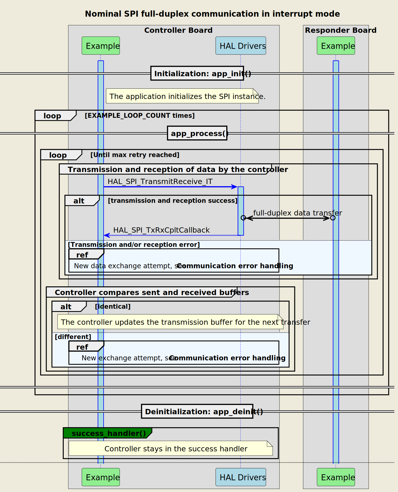
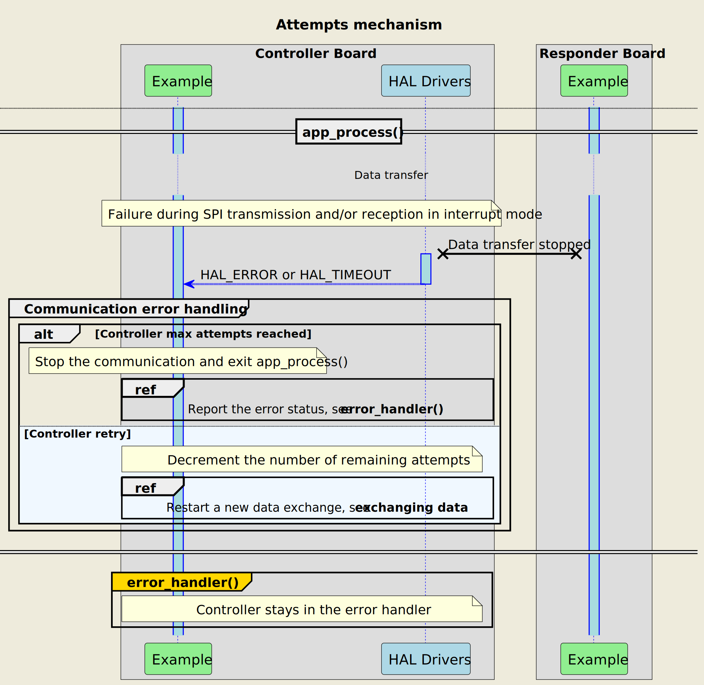
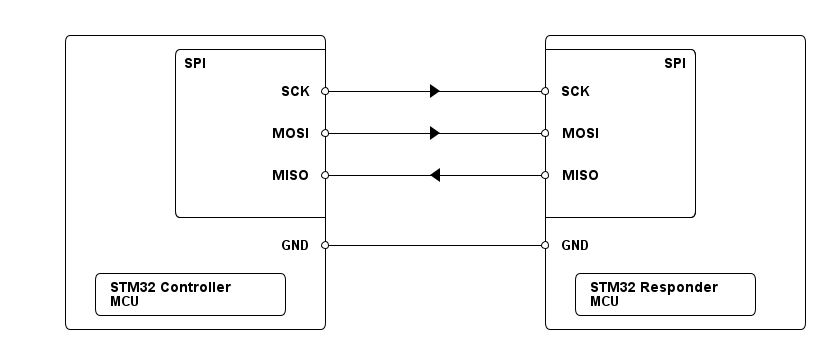

# __Example: *hal_spi_full_duplex_two_boards_com_it_controller*__

**Example version:** 2.0.0

[](https://dev.st.com/stm32cube-docs/examples/arch-v1/en/index.html "An offline version is also available in the STM32Cube firmware package.")

How to manage a full-duplex synchronous SPI communication as controller, in interrupt mode, using the HAL API.


## __1. Detailed scenario__

The scenario consists of a limited number of transmit-receive transactions of changing messages.

Although the transmission buffers of the controller and responder are constructed independently, they must have the same length.
To simplify the demonstration, identical buffers are used for transmission.

__Initialization phase__: At main program start, the `mx_system_init()` function is called. It initializes the peripherals, nonvolatile memory (such as flash memory, NVM, or external memories), MPU regions (if applicable), the system clock, and the SysTick.

The application executes the following __example steps__:

__Step 1__: configures and initializes the SPI instance. Registers the user callbacks for SPI events: TX/RX transfer completed and transfer error.

__Step 2__: initiates the communication with the responder in a full duplex mode, using interrupts, by sending and receiving data simultaneously. The SPI messages exchanged are null-terminated strings. A counter of attempts is reset when initiating the communication loop.

__Step 3__: waits for one of these SPI interrupts: write-read transfer complete or transfer error.

__Step 4__: checks that the sent and received buffers match.
            Processes this loop 10 times, waiting for 100ms then returning to step 2 until `EXAMPLE_LOOP_COUNT` is reached or an error occurs.

On most boards, the LED shares its pin with the SPI SCK. Therefore, this example does not have a status LED.

__End of example__: While no error occurs, the data is transferred 10 times between the controller and the responder. In case of failure or the maximum number of attempts is reached, the data transfer is stopped and an error status is reported to the `main()` function.

If the data transmit or receive operation fails or the exchanged buffers are different, the controller restarts the communication by sending again the same message. The `error_handler()` function is called when the maximum number of attempts is reached.

If you enable **`USE_TRACE`**, you can follow these steps, in the nominal case of execution, in the terminal logs:

```text
[INFO] Step 1: Device initialization COMPLETED.
[INFO] Controller - Tx/Rx Buffers IDENTICAL. Transfer COMPLETED of SPI Full Duplex Two Boards Communication - Message A
[INFO] Controller - Tx/Rx Buffers IDENTICAL. Transfer COMPLETED of SPI Full Duplex Two Boards Communication - Message B
[INFO] Controller - Tx/Rx Buffers IDENTICAL. Transfer COMPLETED of SPI Full Duplex Two Boards Communication - Message A
[INFO] Controller - Tx/Rx Buffers IDENTICAL. Transfer COMPLETED of SPI Full Duplex Two Boards Communication - Message B
```

The following **message sequence chart** is used to describe the SPI communication behavior between the controller board and the responder board.



<details>
<summary> Expand this tab to visualize the sequence chart diagram of the communication attempts' mechanism. </summary>



</details>


## __2. Example configuration__

[](https://dev.st.com/stm32cube-docs/examples/arch-v1/en/configure/config_toc.html "An offline version is also available in the STM32Cube firmware package.")

The example demonstrates the following peripheral:

__SPI__:

The example uses SPI full-duplex synchronous transfers on three lines (MOSI, MISO, and the clock signal). It sends and receives data simultaneously, in interrupt mode, between the controller and the responder.
For this purpose, the SPI instance of the controller board should be configured to the 'Master' mode, and the direction should be set to two lines.

In addition, it is necessary to set the clock polarity as either LOW or HIGH.
Also configure the clock phase to:

- Either one edge if the first clock transition corresponds to the first data capture edge,
- Or two edges if the second clock transition represents the first data capture edge.

For the current project, the clock polarity is set to LOW, while the clock phase is configured as one edge.


## __3. Hardware environment and setup__

### __3.1. Generic Setup__

This section describes the hardware setup principles that apply to any board.

<!--
@startuml
@startditaa{doc/ASCII_spi_two_boards.png} -E -S

    /-------------------------\                     /-------------------------\
    |          /--------------+                     +--------------\          |
    |          |SPI           |                     |           SPI|          |
    |          |              |                     |              |          |
    |          |          SCK *--------+->----------* SCK          |          |
    |          |              |                     |              |          |
    |          |              |                     |              |          |
    |          |         MOSI *--------+->----------* MOSI         |          |
    |          |              |                     |              |          |
    |          |              |                     |              |          |
    |          |         MISO *----------<----------* MISO         |          |
    |          |              |                     |              |          |
    |          |              |                     |              |          |
    |          \--------------+                     +--------------/          |
    |                         |                     |                         |
    |                     GND *---------------------* GND                     |
    |                         |                     |                         |
    |  /------------------\   |                     |  /-----------------\    |
    |  | STM32 Controller |   |                     |  | STM32 Responder |    |
    |  | MCU              |   |                     |  | MCU             |    |
    |  \------------------/   |                     |  \-----------------/    |
    \-------------------------/                     \-------------------------/

@endditaa
@enduml
-->



### __3.2. Specific board setups__

This section describes the exact hardware configurations of your project.


<details>
  <summary>On STM32C5 series.</summary>

 SPI GPIO pins are configured in medium speed to support high frequency.
Refer to application note AN4899 in case of issues.
  <details>
    <summary>On board NUCLEO-C542RC.</summary>

  |  MCU pin  |  Signal name  |  User Label  |
  |:---------:|:-------------:|:------------:|
  |    PH0    |  RCC_OSC_IN   |    OSC_IN    |
  |    PH1    |  RCC_OSC_OUT  |   OSC_OUT    |
  |    PA2    |   USART2_TX   |     PA2      |
  |    PA5    |   SPI1_SCK    |     PA5      |
  |    PA6    |   SPI1_MISO   |     PA6      |
  |    PA7    |   SPI1_MOSI   |     PA7      |

  </details>
  <details>
    <summary>On board NUCLEO-C562RE.</summary>

  |  MCU pin  |  Signal name  |  User Label  |
  |:---------:|:-------------:|:------------:|
  |    PH0    |  RCC_OSC_IN   |    OSC_IN    |
  |    PH1    |  RCC_OSC_OUT  |   OSC_OUT    |
  |    PA2    |   USART2_TX   |     PA2      |
  |    PA5    |   SPI1_SCK    |     PA5      |
  |    PA6    |   SPI1_MISO   |     PA6      |
  |    PA7    |   SPI1_MOSI   |     PA7      |

  </details>
  <details>
    <summary>On board NUCLEO-C5A3ZG.</summary>

  |  MCU pin  |  Signal name  |  User Label  |
  |:---------:|:-------------:|:------------:|
  |    PH0    |  RCC_OSC_IN   |  PH0_OSC_IN  |
  |    PH1    |  RCC_OSC_OUT  | PH1_OSC_OUT  |
  |    PA2    |   USART2_TX   | DBGIN_VCP_TX |
  |    PA5    |   SPI1_SCK    |     PA5      |
  |    PA6    |   SPI1_MISO   |     PA6      |
  |    PA7    |   SPI1_MOSI   |     PA7      |

  </details>
</details>

## __4. Troubleshooting__

[](https://dev.st.com/stm32cube-docs/examples/arch-v1/en/debug/debug_toc.html "An offline version is also available in the STM32Cube firmware package.")

Find below the points of attention for this specific example.

__Pins alignment__: When connecting the pins of the controller board to the ones of the responder board, the MOSI and MISO lines should not be crossed. So, the MISO line of the controller is connected to the MISO line of the responder, and the same goes for the MOSI line.

__GPIO speed__: The GPIO slew rate is an important parameter that affects the performance of high-frequency signals. Refer to application note AN4899 in case of issues.
[AN4899](https://www.st.com/resource/en/application_note/an4899-stm32-microcontroller-gpio-hardware-settings-and-lowpower-consumption-stmicroelectronics.pdf)

__Initial synchronization__: If the responder board is not prepared to exchange messages with the controller, the controller transmits and receives data. However, the reception buffer is empty in this case. This leads to an error during the check of the buffers. If **`USE_TRACE`** is enabled, you can see errors messages on the terminal.

__LED twinkling__: Most boards have a LED connected to the same pin as SPI SCK from arduino connector. This LED can twinkle during SPI communications.


## __5. See Also__

[](https://dev.st.com/stm32cube-docs/examples/arch-v1/en/more/more_toc.html "An offline version is also available in the STM32Cube firmware package.")

[Application Note AN4899](https://www.st.com/resource/en/application_note/an4899-stm32-microcontroller-gpio-hardware-settings-and-lowpower-consumption-stmicroelectronics.pdf): STM32 microcontroller GPIO hardware settings and low-power consumption

You can also refer to these examples to go further with the SPI peripheral:

- hal_spi_full_duplex_two_boards_com_it_responder: full duplex synchronous SPI communication of the responder with the controller, in interrupt mode.

More information about the STM32Cube Drivers can be found in the drivers' user manual of the STM32 series you are using.

For instance for the STM32C5 series: [HAL documentation](https://dev.st.com/stm32cube-docs/stm32c5xx-hal-drivers/latest/en/index.html).

More information about the STM32 ecosystem can be found in the [STM32 MCU Developer Zone](https://www.st.com/content/st_com/en/stm32-mcu-developer-zone/embedded-software.html).


## __6. License__

Copyright (c) 2026 STMicroelectronics.

This software is licensed under terms that can be found in the LICENSE file in the root directory
of this software component.
If no LICENSE file comes with this software, it is provided AS-IS.
