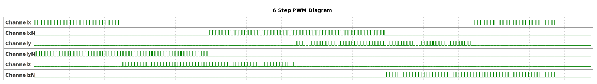

# __Example: *hal_tim_6_step_pwm*__

**Example version:** 2.0.0

How to configure the TIM peripheral to generate 6 steps.
A 6-step timer is a control mechanism used to manage the sequential operation of a three-phase motor. This type of motor requires precise timing to switch between its three phases to ensure smooth and efficient operation.

## __1. Detailed scenario__

This scenario demonstrates to configure the TIM peripheral to generate 6 Steps.

__Initialization phase__: At main program start, the `mx_system_init()` function is called. It initializes the peripherals, nonvolatile memory (such as flash memory, NVM, or external memories), MPU regions (if applicable), the system clock, and the SysTick.

The application executes the following __example steps__:

__Step 1__: Initializes the timer's input clock, counter clock, output clock. Sets the output channel's duty cycles, and the GPIO pins.

__Step 2__: Starts the timer as a 6 step PWM generation.

__End of example__: If no error occurs, the PWM signal is generated indefinitely.

## __2. Example configuration__

### __2.1. Timer configuration__

The goal is to use TIM to generate 6 step PWM signals on output channels.

The *TIM* is configured as follows:

The ARR value is selected to achieve a PWM frequency of 30 kHz, as indicated below:

    PWM period = tim_cnt_ck period * (ARR + 1)
    PWM frequency = tim_cnt_ck frequency / (ARR + 1)
    ARR = (tim_cnt_ck frequency / PWM frequency) - 1

- The timer counter is configured in up counting mode.
- The timer prescaler is configured to set the timer counter clock to 1 MHz.
- The 6 channels are composed of 3 channels and their complementary.
- The PWM duty cycle is configured at 50% for the first two channels CHx and CHxN, 25% for the second two channels CHy and CHyN and 12.5% for the last two channels CHz and CHzN.

The PWM duty cycle, expressed as a percentage, is calculated as the ratio of the output active state to the PWM period, multiplied by 100:

    duty_cycle_percent = (CCR / (ARR + 1)) * 100
    CCR = (duty_cyle_percent * (ARR + 1)) / 100

  
Numerical calculations

  The timer's counter clock is set to 1MHz (see prescaler computation in section [Hardware environment and setup](#3-hardware-environment-and-setup)).

  To set a PWM output frequency to 30 kHz with a 1 MHz timer counter clock:

    ARR = (1 MHz / 30 kHz) - 1
    ARR = (1000000 / 30000) - 1 = 32.33
    ARR = 32 (integer rounded down to fit into the register)

   To set the channel x's PWM duty cycle to 50%:

    CCRx = (50 / 100) * 33 = 16.5
    CCRx = 16 (integer rounded down to fit into the register)

   To set the channel y's PWM duty cycle to 25%:

    CCRy = (25 / 100) * 33 = 8.25
    CCRy = 8 (integer rounded down to fit into the register)

   To set the channel z's PWM duty cycle to 12.5%:

    CCRz = (12.5 / 100) * 33 = 4.125
    CCRz = 4 (integer rounded down to fit into the register)

  > **_NOTE:_** Registers like CCR (Capture Compare Register) and ARR (Auto-Reload Register) are of integer type. In all calculations, the result is truncated. Therefore, the theoretical period and duty cycle must be recalculated using the actual ARR and CCR values.

If we recalculate them with this configuration:

- The PWM output frequency is _1MHz / 33 = 30,303 kHz_
- The channel x PWM output duty cycle is _16 / 33 = 48.48%_
- The channel y PWM output duty cycle is _8 / 33 = 24.24%_
- The channel z PWM output duty cycle is _4 / 33 = 12.12%_

The TIM (Timer) peripheral in microcontrollers allows for advanced timing operations by enabling the pre-programming and simultaneous updating of all channel configurations using a COM (commutation) event.
This ensures precise synchronization and predictable timing sequences, which are crucial for applications like motor control.

The TIM peripheral can be configured to set up the next step's behavior in advance. When a COM event occurs, it updates the configuration of all its channels simultaneously, maintaining synchronization across all outputs.
A COM event can be generated either by software, by setting the COM bit in the TIM_EGR (Timer Event Generation Register), or by hardware, based on specific conditions like the rising edge of a trigger signal (TRC).

In the provided example, a software COM event is generated every 1 ms using the SysTick timer. The SysTick timer is configured to generate an interrupt every 1 ms.
Within the SysTick interrupt service routine (ISR), the COM bit in the TIM_EGR register is set, generating a COM event.
This event triggers the TIM peripheral to update its configuration for the next step, ensuring all channels are updated simultaneously and the next step in the sequence is executed precisely.

This setup ensures synchronization by updating all timer channels at the same time, which is essential for applications requiring precise timing sequences. It also provides predictability and flexibility by allowing the next step's configuration to be programmed in advance.

The following Table describes the TIM Channels states:

    Variation of the logical levels of the channels depending on the example's steps
                     -----------------------------------------------
                    | Step1 | Step2 | Step3 | Step4 | Step5 | Step6 |
          ----------------------------------------------------------
         |Channelx  | 1(PWM)|   0   |   0   |   0   |   0   |1(PWM) |
          ----------------------------------------------------------
         |ChannelxN |   0   |   0   |1(PWM) |1(PWM) |   0   |   0   |
          ----------------------------------------------------------
         |Channely  |   0   |   0   |   0   |1(PWM) |1(PWM) |   0   |
          ----------------------------------------------------------
         |ChannelyN |1(PWM) |1(PWM) |   0   |   0   |   0   |   0   |
          ----------------------------------------------------------
         |Channelz  |   0   |1(PWM) |1(PWM) |   0   |   0   |   0   |
          ----------------------------------------------------------
         |ChannelzN |   0   |   0   |   0   |   0   |1(PWM) |1(PWM) |
          -----------------------------------------------------------

  

Note that the timer configuration depends on the timer peripheral input clock, which is derived from the system clock tree.
So, it is required to define the system clock configuration and to determine the timer input clock before defining the timer configuration.

The system clock configuration is specific to each STM32 MCU (see section [Hardware environment and setup](#3-hardware-environment-and-setup)).

### __2.2. GPIO configuration__

6 pins must be configured, one for each PWM signal: [see the specific boards setups](#32-specific-board-setups)

The GPIO pins are configured in:

- Alternate function as a timer output channel of its respective timer instance.
- Push-pull mode with pull-down resistors activated to eliminate the noise after each commutation.

## __3. Hardware environment and setup__

### __3.1. Generic Setup__

The PWM signals generated by the timer channels can be displayed by connecting an oscilloscope to the corresponding board connectors.

### __3.2. Specific board setups__

  
On STM32C5 series.

  

    
Common configuration.

  Timer's counter clock configuration with prescalers and APB prescalers set to 1:

  - The AHB clock (HCLK) and system core clock are set to system clock (SYSCLK).
  - The timer's internal input clock (tim_ker_ck) is set to its respective APB clock (PCLK).

      tim_ker_ck = PCLK = HCLK = SYSCLK (system clock)

      So, tim_ker_ck = HCLK in Hz

  To obtain the timer's counter clock frequency (tim_cnt_ck), the timer prescaler register (TIM_PSC) is computed as follows:

      TIM_PSC = (HCLK / tim_cnt_ck ) - 1

  Standard STM32C5xx MCUs' peripheral clocks diagram:
    <!--
@startuml
@startditaa{doc/stm32c5_peripherals_clocks.png}
 +---------+
  | clock   |
  | source  |
  | control |
 +---+-----+
  |
    ++-\
  --+  |
  |  |
  |  |
  --+  |           +---------------+        +--------------+
  |  |  SYSCLCK  |  AHB          |  HCLK  |  APBx        |  PCLKx
  |  +-----------+  PRESC        +----+---+  PRESC       +--------------------------------
  --+  |           |  / 1,2,...512 |    |   | / 1,2,4,8,16 |          To APBx peripherals
  |  |           +---------------+    |   +--------------+
  |  |                                |
  --+  |                                +---------------------------------------------------
  |  |                                                                          To TIMx
    +--/
@endditaa
@enduml
-->
  

In this configuration:

- The HCLK is set to 144MHz.
- The timer counter clock is set to 1 MHz.

To obtain a timer counter clock at 1MHz with the APB prescaler set to 1 and the HCLK set to 144MHz, the timer prescaler must be:

      timer_prescaler = (144 MHz / 1 MHz) - 1 = 143

  

  

    
On board NUCLEO-C542RC.

  |  MCU pin  |  Signal name  |  User Label   |
  |:---------:|:-------------:|:-------------:|
  |    PA5    |     GPIO      | MX_STATUS_LED |
  |    PH0    |  RCC_OSC_IN   |    OSC_IN     |
  |    PH1    |  RCC_OSC_OUT  |    OSC_OUT    |
  |    PA8    |   TIM1_CH1    |      PA8      |
  |    PA9    |   TIM1_CH2    |      PA9      |
  |   PA10    |   TIM1_CH3    |     PA10      |
  |   PB13    |   TIM1_CH1N   |     PB13      |
  |   PB14    |   TIM1_CH2N   |     PB14      |
  |   PB15    |   TIM1_CH3N   |     PB15      |

  

  

    
On board NUCLEO-C562RE.

  |  MCU pin  |  Signal name  |  User Label   |
  |:---------:|:-------------:|:-------------:|
  |    PA5    |     GPIO      | MX_STATUS_LED |
  |    PH0    |  RCC_OSC_IN   |    OSC_IN     |
  |    PH1    |  RCC_OSC_OUT  |    OSC_OUT    |
  |    PA8    |   TIM1_CH1    |      PA8      |
  |    PA9    |   TIM1_CH2    |      PA9      |
  |   PA10    |   TIM1_CH3    |     PA10      |
  |   PB13    |   TIM1_CH1N   |     PB13      |
  |   PB14    |   TIM1_CH2N   |     PB14      |
  |   PB15    |   TIM1_CH3N   |     PB15      |

  The selected timer is TIM1, with:

  - TIM1_CH1 for channelx
  - TIM1_CH1N for channelxN
  - TIM1_CH2 for channely
  - TIM1_CH2N for channelyN
  - TIM1_CH3 for channelz
  - TIM1_CH3N for channelzN

  

  

    
On board NUCLEO-C5A3ZG.

  |  MCU pin  |  Signal name  |  User Label   |
  |:---------:|:-------------:|:-------------:|
  |    PA5    |     GPIO      | MX_STATUS_LED |
  |    PH0    |  RCC_OSC_IN   |  PH0_OSC_IN   |
  |    PH1    |  RCC_OSC_OUT  |  PH1_OSC_OUT  |
  |    PA8    |   TIM1_CH1    |      PA8      |
  |    PA9    |   TIM1_CH2    |      PA9      |
  |   PA10    |   TIM1_CH3    |     PA10      |
  |   PB13    |   TIM1_CH1N   |     PB13      |
  |   PB14    |   TIM1_CH2N   |     PB14      |
  |   PB15    |   TIM1_CH3N   |     PB15      |

  

## __4. Troubleshooting__

Here are the points of attention for this specific example:

__System clock__: The timer clock depends on the system clock configuration. Changing the CPU clock or the peripheral bus' clock affects the PWM frequency and duty cycle.

## __5. See Also__

You can also refer to this other example:

- hal_tim_pwm_output: demonstrates how to use the TIM peripheral to measure the frequency and duty cycle of a signal.

This [General-purpose timer cookbook for STM32 microcontrollers (ref. AN4776)](https://www.st.com/content/ccc/resource/technical/document/application_note/group0/91/01/84/3f/7c/67/41/3f/DM00236305/files/DM00236305.pdf/jcr:content/translations/en.DM00236305.pdf) provides a simple and clear description of the basic features and operating modes of the STM32 general-purpose timer peripherals.

This [STM32 cross-series timer overview (ref. AN4013)](https://www.st.com/content/ccc/resource/technical/document/application_note/54/0f/67/eb/47/34/45/40/DM00042534.pdf/files/DM00042534.pdf/jcr:content/translations/en.DM00042534.pdf) presents an overview of the timer peripherals for the STM32 product series.

You can also refer this manual that explain the purpose of the 6-step: [Motor Control 6 Step](https://wiki.st.com/stm32mcu/wiki/STM32MotorControl:6-step_Firmware_Examples_User_Manual)

More information about the STM32Cube Drivers can be found in the drivers' user manual of the STM32 series you are using.

For instance for the STM32C5 series: [HAL documentation](https://dev.st.com/stm32cube-docs/stm32c5xx-hal-drivers/latest/en/index.html).

More information about the STM32 ecosystem can be found in the [STM32 MCU Developer Zone](https://www.st.com/content/st_com/en/stm32-mcu-developer-zone/embedded-software.html).

## __6. License__

Copyright (c) 2026 STMicroelectronics.

This software is licensed under terms that can be found in the LICENSE file in the root directory
of this software component.
If no LICENSE file comes with this software, it is provided AS-IS.
