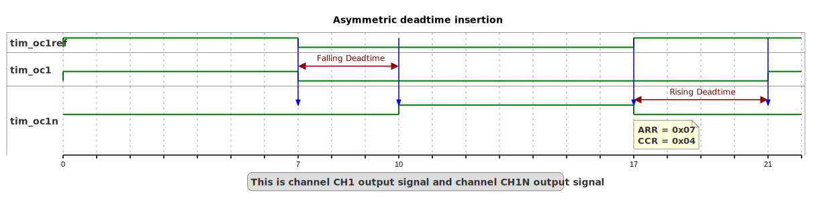

# __Example: *hal_tim_asymmetric_deadtime_insertion*__

**Example version:** 2.0.0

How to configure the TIM peripheral to generate two complementary PWM (Pulse Width Modulation) signals with asymmetric deadtime insertion.

## __1. Detailed scenario__

This scenario demonstrates how to configure the TIM peripheral to generate two complementary PWM (Pulse Width Modulation) signals with asymmetric deadtime insertion. Deadtime is a short period inserted between the switching of the high and low signals to prevent short circuits and reduce switching losses in power electronics.

__Initialization phase__: At main program start, the `mx_system_init()` function is called. It initializes the peripherals, nonvolatile memory (such as flash memory, NVM, or external memories), MPU regions (if applicable), the system clock, and the SysTick.

The application executes the following __example steps__:

__Step 1__: Initializes the timer peripheral with asymmetric deadtime insertion feature.

__Step 2__: Starts the timer peripheral to generate a PWM with deadtime insertion.

__End of example__: If no error occurs, the PWM signal is generated indefinitely.

## __2. Example configuration__

### __2.1. Timer configuration__

The goal is to use TIMx to generate a asymmetric PWM signal with deadtime insertion on channel CHy and its complementary channel CHyN.

The *TIM* is configured as follows:

- The timer is configured as a PWM generator in up-counting mode.
- The timer is configured with asymmetrical deadtime.
- The deadtime value is set to 3.7 microseconds for the falling edge.
- The deadtime value is set to 6.3 microseconds for the rising edge.
- The timer prescaler is configured to set the timer counter clock to 64 kHz.
- The PWM duty cycle is initially configured at 50% for both channels. However, the real duty cycle is lower due to deadtime insertion, resulting in an actual duty cycle of 45% for channel CHy and 47% for channel CHyN.
- The PWM frequency is configured at 8 kHz.

To obtain 8kHz as PWM frequency, the ARR value is chosen as indicated below:

    PWM period = tim_cnt_ck period * (ARR + 1)
    PWM frequency = tim_cnt_ck frequency / (ARR + 1)
    ARR = (tim_cnt_ck frequency / PWM frequency) - 1
    ARR = (64 kHz / 8 kHz) - 1
    ARR = 7

The PWM duty cycle, expressed as a percentage, is calculated as the ratio of the output active state to the PWM period, multiplied by 100:

    duty_cycle_percent = (CCR / (ARR + 1)) * 100
    CCR = (duty_cyle_percent * (ARR + 1)) / 100
    CCR = (50 * (7 + 1)) / 100
    CCR = 4

For channel CHyN, to obtain a duty cycle of 47% after accounting for deadtime falling edge:

    PWM period = 1 / PWM frequency
    PWM period = 1 / 8 kHz = 125 us
    Initial_pulse_duration = 50% of 125 us
    Effective pulse duration = Initial_pulse_duration - deadtime value
    Effective_pulse_duration = 62.5 us - 3.7 us = 58.8 us.
    Actual_duty_cycle = ( Effective_pulse_duration / Period ) * 100.
    Actual_duty_cycle = ( 58.8 us / 125 us ) * 100
    Actual_duty_cycle = 47 %

For channel CHy, to obtain a duty cycle of 45% after accounting for deadtime rising edge:

    PWM period = 1 / PWM frequency
    PWM period = 1 / 8 kHz = 125 us
    Initial_pulse_duration = 50% of 125 us
    Effective pulse duration = Initial_pulse_duration - deadtime value
    Effective_pulse_duration = 62.5 us - 6.3 us = 56.2 us.
    Actual_duty_cycle = ( Effective_pulse_duration / Period ) * 100.
    Actual_duty_cycle = ( 56.2 us / 125 us ) * 100
    Actual_duty_cycle = 45 %

In this example, the timer is configured with asymmetrical deadtime. The deadtime value is 3.7us for falling edge and 6.3us for rising edge. This configuration is applied to the PWM signal on channel CHy and its complementary channel CHyN.

The deadtime value configured with function HAL_TIM_SetDeadtime() correspond to DTG bitfield of TIMx_BDTR register for rising edge and DTGF bitfield of TIMx_DTR2 register for falling edge. This value, which is not a time unit, can be computed as described below in the hardware environment and setup section.

**_NOTE:_** the LL_TIM_CALC_DEADTIME() macro can be used for runtime computation of this DTG/DTGF value.

The system clock configuration is specific to each STM32 MCU (see section [Hardware environment and setup](#3-hardware-environment-and-setup)).

### __2.2. GPIO configuration__

Two pins must be configured, one for each PWM signal: [see the specific boards setups](#32-specific-board-setups)

The GPIO pins are configured in:

- Alternate function as a timer channel of the same timer instance.
- Push-pull mode with no pull-up or pull-down resistors activated.

## __3. Hardware environment and setup__

### __3.1. Generic Setup__

The PWM signals generated by the timer channels can be displayed by connecting an oscilloscope to the corresponding board connectors.

### __3.2. Specific board setups__

  
On STM32C5 series.

  

    
Common configuration.

  Timer's counter clock configuration with prescalers and APB prescalers set to 1:

  - The AHB clock (HCLK) and system core clock are set to system clock (SYSCLK).
  - The timer's internal input clock (tim_ker_ck) is set to its respective APB clock (PCLK).

      tim_ker_ck = PCLK = HCLK = SYSCLK (system clock)

      So, tim_ker_ck = HCLK in Hz

  To obtain the timer's counter clock frequency (tim_cnt_ck), the timer prescaler register (TIM_PSC) is computed as follows:

      TIM_PSC = (HCLK / tim_cnt_ck ) - 1
    <!--
@startuml
@startditaa{doc/stm32c5_peripherals_clocks.png}
 +---------+
  | clock   |
  | source  |
  | control |
 +---+-----+
  |
    ++-\
  --+  |
  |  |
  |  |
  --+  |           +---------------+        +--------------+
  |  |  SYSCLCK  |  AHB          |  HCLK  |  APBx        |  PCLKx
  |  +-----------+  PRESC        +----+---+  PRESC       +--------------------------------
  --+  |           |  / 1,2,...512 |    |   | / 1,2,4,8,16 |          To APBx peripherals
  |  |           +---------------+    |   +--------------+
  |  |                                |
  --+  |                                +---------------------------------------------------
  |  |                                                                          To TIMx
    +--/
@endditaa
@enduml
-->
  

In this configuration:

- The HCLK is set to 144MHz.
- The timer counter clock is set to  64kHz.

To obtain a timer counter clock at 1MHz with the APB prescaler set to 1 and the HCLK set to 64MHz, the timer prescaler must be:

      timer_prescaler = (144 MHz / 64 kHz) - 1 = 2249

For this example, with a deadtime value of 3.7 microseconds for the falling edge, the encoded value 0xE2 is obtained as follows:

      DTG[7:5]=0b0xx -&gt; DT=  DTG[7:0] x tdtg       with tdtg=tDTS.
      DTG[7:5]=0b10x -&gt; DT= (64+DTG[5:0]) x tdtg   with Tdtg=2xtDTS.
      DTG[7:5]=0b110 -&gt; DT= (32+DTG[4:0]) x tdtg   with Tdtg=8xtDTS.
      DTG[7:5]=0b111 -&gt; DT= (32+DTG[4:0]) x tdtg   with Tdtg=16xtDTS.

- tDTS Calculation:

      tTIM_KER_CK = 1/144 MHz (since timer clock division is set to 1)
      tDTS = 1 * tTIM_KER_CK = 0.00694 us

- DTG[7:5] Calculation:

For this example:

      DTG[7:5]=0b0xx -&gt;     0ns   &lt;= DT &lt;=  881.38ns  (127 * 6.94ns)
      DTG[7:5]=0b10x -&gt;   800ns   &lt;= DT &lt;= 1762.76ns ((64 + 63) * 2 * 6.94ns)
      DTG[7:5]=0b110 -&gt;  1600ns   &lt;= DT &lt;= 3497.76ns ((32 + 31) * 8 * 6.94ns)
      DTG[7:5]=0b111 -&gt;  3200ns   &lt;= DT &lt;= 6995.52ns ((32 + 31) * 16 * 6.94ns)

To achieve a deadtime of 3.7us, we need to use `DTG[7:5]=111`

- tDTG Calculation:

      DTG[7:5] = 0b111 (which is 7 in decimal)
      tDTG = 16 * tDTS = 0.11104 us

- DTG[4:0] Calculation:

      - DT = (32 + DTG[4:0]) * tDTG
      - DTG[4:0] = ( 3.7 / tDTG ) - 32
      - DTG[4:0] = 2

Finally, `DTG[4:0] = 0b00010` and `DTG[7:5] = 0b111`, resulting in `DTG[7:0] = 0b11100010`, which is equivalent to 0xE2 in hexadecimal.

Therefore, a deadtime value of 3.7 microseconds for the falling edge gives the encoded value 0xE2.

For this example, with a deadtime value of 6.3 microseconds for the rising edge, the encoded value 0xF9 is obtained as follows:

      DTG[7:5]=0b0xx -&gt; DT=  DTG[7:0] x tdtg       with tdtg=tDTS.
      DTG[7:5]=0b10x -&gt; DT= (64+DTG[5:0]) x tdtg   with Tdtg=2xtDTS.
      DTG[7:5]=0b110 -&gt; DT= (32+DTG[4:0]) x tdtg   with Tdtg=8xtDTS.
      DTG[7:5]=0b111 -&gt; DT= (32+DTG[4:0]) x tdtg   with Tdtg=16xtDTS.

- DTG[7:5] Calculation:

For this example:

      DTG[7:5]=0b0xx -&gt;     0ns   &lt;= DT &lt;=  881.38ns  (127 * 6.94ns)
      DTG[7:5]=0b10x -&gt;   800ns   &lt;= DT &lt;= 1762.76ns ((64 + 63) * 2 * 6.94ns)
      DTG[7:5]=0b110 -&gt;  1600ns   &lt;= DT &lt;= 3497.76ns ((32 + 31) * 8 * 6.94ns)
      DTG[7:5]=0b111 -&gt;  3200ns   &lt;= DT &lt;= 6995.52ns ((32 + 31) * 16 * 6.94ns)

To achieve a deadtime of 6.3us, we need to use `DTG[7:5]=111`

- tDTG Calculation:

      DTG[7:5] = 0b111 (which is 7 in decimal)
      tDTG = 16 * tDTS = 0.11104 us

- DTG[4:0] Calculation:

      - DT = (32 + DTG[4:0]) * tDTG
      - DTG[4:0] = ( 6.3 / tDTG ) - 32
      - DTG[4:0] = 25

Finally, `DTG[4:0] = 0b11001` and `DTG[7:5] = 0b111`, resulting in `DTG[7:0] = 0b11111001`, which is equivalent to 0xF9 in hexadecimal.

Therefore, a deadtime value of 6.3 microseconds for the rising edge gives the encoded value 0xF9.

  

  

    
On board NUCLEO-C542RC.

  |  MCU pin  |  Signal name  |  User Label   |
  |:---------:|:-------------:|:-------------:|
  |    PA5    |     GPIO      | MX_STATUS_LED |
  |    PH0    |  RCC_OSC_IN   |    OSC_IN     |
  |    PH1    |  RCC_OSC_OUT  |    OSC_OUT    |
  |    PA8    |   TIM1_CH1    |      PA8      |
  |    PA7    |   TIM1_CH1N   |      PA7      |

  

  

    
On board NUCLEO-C562RE.

  |  MCU pin  |  Signal name  |  User Label   |
  |:---------:|:-------------:|:-------------:|
  |    PA5    |     GPIO      | MX_STATUS_LED |
  |    PH0    |  RCC_OSC_IN   |    OSC_IN     |
  |    PH1    |  RCC_OSC_OUT  |    OSC_OUT    |
  |    PA8    |   TIM1_CH1    |      PA8      |
  |    PA7    |   TIM1_CH1N   |      PA7      |

  The selected timer is TIM1, with:

  - TIM1_CH1 for channel 1
  - TIM1_CH1N for the complementary channel

  

  

    
On board NUCLEO-C5A3ZG.

  |  MCU pin  |  Signal name  |  User Label   |
  |:---------:|:-------------:|:-------------:|
  |    PA5    |     GPIO      | MX_STATUS_LED |
  |    PH0    |  RCC_OSC_IN   |  PH0_OSC_IN   |
  |    PH1    |  RCC_OSC_OUT  |  PH1_OSC_OUT  |
  |    PA8    |   TIM1_CH1    |      PA8      |
  |    PA7    |   TIM1_CH1N   |      PA7      |

  

## __4. Troubleshooting__

Here are the points of attention for this specific example:

__System clock__: The timer clock depends on the system clock configuration. Changing the CPU clock or the peripheral bus' clock affects the PWM frequency.

## __5. See Also__

You can also refer to this other example:

- hal_tim_pwm_output: demonstrates how to use the TIM peripheral to measure the frequency and duty cycle of a signal.
- hal_tim_pwm_input: demonstrates how to use the TIM peripheral to measure the frequency of a signal.

This [General-purpose timer cookbook for STM32 microcontrollers (ref. AN4776)](https://www.st.com/content/ccc/resource/technical/document/application_note/group0/91/01/84/3f/7c/67/41/3f/DM00236305/files/DM00236305.pdf/jcr:content/translations/en.DM00236305.pdf) provides a simple and clear description of the basic features and operating modes of the STM32 general-purpose timer peripherals.

This [STM32 cross-series timer overview (ref. AN4013)](https://www.st.com/content/ccc/resource/technical/document/application_note/54/0f/67/eb/47/34/45/40/DM00042534.pdf/files/DM00042534.pdf/jcr:content/translations/en.DM00042534.pdf) presents an overview of the timer peripherals for the STM32 product series.

More information about the STM32Cube Drivers can be found in the drivers' user manual of the STM32 series you are using.

For instance for the STM32C5 series: [HAL documentation](https://dev.st.com/stm32cube-docs/stm32c5xx-hal-drivers/latest/en/index.html).

More information about the STM32 ecosystem can be found in the [STM32 MCU Developer Zone](https://www.st.com/content/st_com/en/stm32-mcu-developer-zone/embedded-software.html).

## __6. License__

Copyright (c) 2026 STMicroelectronics.

This software is licensed under terms that can be found in the LICENSE file in the root directory
of this software component.
If no LICENSE file comes with this software, it is provided AS-IS.
