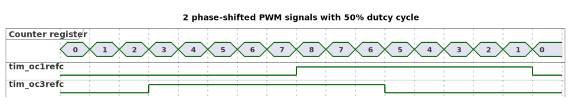

# __Example: *hal_tim_asymmetric_pwm*__

**Example version:** 2.0.0

How to configure the TIM peripheral to generate an Asymmetric PWM (Pulse Width Modulation) signal.
The PWM waveforms generated by the timer channels can be displayed using an oscilloscope.

## __1. Detailed scenario__

This scenario demonstrates how to configure the TIM peripheral in Asymmetric PWM mode, to generate 2 phase shifted PWM output signals.

__Initialization phase__: At main program start, the `mx_system_init()` function is called. It initializes the peripherals, nonvolatile memory (such as flash memory, NVM, or external memories), MPU regions (if applicable), the system clock, and the SysTick.

The application executes the following __example steps__:

__Step 1__: Initializes the timer's input clock, counter clock, output clock. Sets the output channel's duty cycles, and the GPIO pins.

__Step 2__: Starts the timer reference and the asymmetric PWM generation.

__End of example__: If no error occurs, the PWM signal is generated indefinitely.

## __2. Example configuration__

### __2.1. Timer configuration__

The goal is to use TIM to generate 2 PWM signals on output channels.

The *TIM* is configured as follows:

- The timer counter is configured in Center-aligned mode (up/down counting).
- Both output channels are configured in asymmetric PWM mode.
- The timer prescaler is configured to set the timer counter clock to 64 kHz.
- The PWM duty cycle is configured at 50% for both channels.
- The PWM frequency is configured at 4 kHz.

For asymmetric PWM (center-aligned), the counter counts up to the ARR value and then back down to zero, which effectively doubles the period of the PWM signal. To obtain 4kHz as PWM frequency, the ARR value is chosen as indicated below:

    PWM period = tim_cnt_ck period * (2 * ARR)
    PWM frequency = tim_cnt_ck frequency / (2 * ARR)
    ARR = (tim_cnt_ck frequency / (2 * PWM frequency))
    ARR = (64 kHz / (2 * 4 kHz))
    ARR = (64000 / 2 * 4000) = 8
    ARR = 8

While the frequency is determined by the value of the TIMx_ARR register, the duty cycle and the phase-shift are determined by a pair of TIMx_CCRx register. One register controls the PWM during up-counting, the second during down counting, so that PWM is adjusted every half PWM cycle:

- tim_oc1refc (or tim_oc2refc) is controlled by TIMx_CCR1 and TIMx_CCR2
- tim_oc3refc (or tim_oc4refc) is controlled by TIMx_CCR3 and TIMx_CCR4

In this example, we used the following configuration for the timer capture/compare registers to have an asymmetric PWM signal with 50% duty cycle:

- TIMx_CCR1 = 8
- TIMx_CCR2 = 0
- TIMx_CCR3 = 3
- TIMx_CCR4 = 5

  

This configuration demonstrates how the asymmetric PWM signals are generated:

Channel y: The signal has a 50% duty cycle, starting low at CNT = 0, going high at CNT = 8, and staying high until CNT resets to 0.

Channel z: The signal shows asymmetry by going high at CNT = 3 and low at CNT = 5, creating a phase-shifted PWM signal.

In this example, the delay (phase-shift) between both channels is calculated as follows :

- Tick period =  1 / tim_cnt_ck frequency
- Delay = (TIMx_CCR1 - TIMx_CCR3) * Tick period
- Delay = (8 - 3) * (1 / 64000) = 78.1 us

Note that the timer configuration depends on the timer peripheral input clock, which is derived from the system clock tree.
So, it is required to define the system clock configuration and to determine the timer input clock before defining the timer configuration.

The system clock configuration is specific to each STM32 MCU (see section [Hardware environment and setup](#3-hardware-environment-and-setup)).

### __2.2. GPIO configuration__

Two pins must be configured, one for each PWM signal: [see the specific boards setups](#32-specific-board-setups)

The GPIO pins are configured in:

- Alternate function as a timer output channel of its respective timer instance.
- Push-pull mode with no pull-up or pull-down resistors activated.

## __3. Hardware environment and setup__

### __3.1. Generic Setup__

The PWM signals generated by the timer channels can be displayed by connecting an oscilloscope to the corresponding board connectors.

### __3.2. Specific board setups__

  
On STM32C5 series.

  

    
Common configuration.

  Timer's counter clock configuration with prescalers and APB prescalers set to 1:

  - The AHB clock (HCLK) and system core clock are set to system clock (SYSCLK).
  - The timer's internal input clock (tim_ker_ck) is set to its respective APB clock (PCLK).

      tim_ker_ck = PCLK = HCLK = SYSCLK (system clock)

      So, tim_ker_ck = HCLK in Hz

  To obtain the timer's counter clock frequency (tim_cnt_ck), the timer prescaler register (TIM_PSC) is computed as follows:

      TIM_PSC = (HCLK / tim_cnt_ck ) - 1
    <!--
@startuml
@startditaa{doc/stm32c5_peripherals_clocks.png}
 +---------+
  | clock   |
  | source  |
  | control |
 +---+-----+
  |
    ++-\
  --+  |
  |  |
  |  |
  --+  |           +---------------+        +--------------+
  |  |  SYSCLCK  |  AHB          |  HCLK  |  APBx        |  PCLKx
  |  +-----------+  PRESC        +----+---+  PRESC       +--------------------------------
  --+  |           |  / 1,2,...512 |    |   | / 1,2,4,8,16 |          To APBx peripherals
  |  |           +---------------+    |   +--------------+
  |  |                                |
  --+  |                                +---------------------------------------------------
  |  |                                                                          To TIMx
    +--/
@endditaa
@enduml
-->
  

In this configuration:

- The HCLK is set to 144MHz.
- The timer counter clock is set to 64 KHz.

To obtain a timer counter clock at 64KHz with the APB prescaler set to 1 and the HCLK set to 144MHz, the timer prescaler must be:

      timer_prescaler = (144 MHz / 64 KHz) - 1 = 2249

  

  

    
On board NUCLEO-C542RC.

  |  MCU pin  |  Signal name  |  User Label   |
  |:---------:|:-------------:|:-------------:|
  |    PA5    |     GPIO      | MX_STATUS_LED |
  |    PH0    |  RCC_OSC_IN   |    OSC_IN     |
  |    PH1    |  RCC_OSC_OUT  |    OSC_OUT    |
  |    PA8    |   TIM1_CH1    |      PA8      |
  |   PA10    |   TIM1_CH3    |     PA10      |

  The selected timer is TIM1, with:

  - TIM1_CH1 for channel 1
  - TIM1_CH3 for channel 3

  

  

    
On board NUCLEO-C562RE.

  |  MCU pin  |  Signal name  |  User Label   |
  |:---------:|:-------------:|:-------------:|
  |    PA5    |     GPIO      | MX_STATUS_LED |
  |    PH0    |  RCC_OSC_IN   |    OSC_IN     |
  |    PH1    |  RCC_OSC_OUT  |    OSC_OUT    |
  |    PA8    |   TIM1_CH1    |      PA8      |
  |   PA10    |   TIM1_CH3    |     PA10      |

  The selected timer is TIM1, with:

  - TIM1_CH1 for channel 1
  - TIM1_CH3 for channel 3

  

  

    
On board NUCLEO-C5A3ZG.

  |  MCU pin  |  Signal name  |  User Label   |
  |:---------:|:-------------:|:-------------:|
  |    PA5    |     GPIO      | MX_STATUS_LED |
  |    PH0    |  RCC_OSC_IN   |  PH0_OSC_IN   |
  |    PH1    |  RCC_OSC_OUT  |  PH1_OSC_OUT  |
  |    PA8    |   TIM1_CH1    |      PA8      |
  |   PA10    |   TIM1_CH3    |     PA10      |

  The selected timer is TIM1, with:

  - TIM1_CH1 for channel 1
  - TIM1_CH3 for channel 3

  

## __4. Troubleshooting__

Here are the points of attention for this specific example:

__System clock__: The timer clock depends on the system clock configuration. Changing the CPU clock or the peripheral bus' clock affects the PWM frequency and duty cycle.

## __5. See Also__

You can also refer to this other example:

- hal_tim_pwm_output: demonstrates how to use the TIM peripheral to measure the frequency and duty cycle of a signal.

This [General-purpose timer cookbook for STM32 microcontrollers (ref. AN4776)](https://www.st.com/content/ccc/resource/technical/document/application_note/group0/91/01/84/3f/7c/67/41/3f/DM00236305/files/DM00236305.pdf/jcr:content/translations/en.DM00236305.pdf) provides a simple and clear description of the basic features and operating modes of the STM32 general-purpose timer peripherals.

This [STM32 cross-series timer overview (ref. AN4013)](https://www.st.com/content/ccc/resource/technical/document/application_note/54/0f/67/eb/47/34/45/40/DM00042534.pdf/files/DM00042534.pdf/jcr:content/translations/en.DM00042534.pdf) presents an overview of the timer peripherals for the STM32 product series.

More information about the STM32Cube Drivers can be found in the drivers' user manual of the STM32 series you are using.

For instance for the STM32C5 series: [HAL documentation](https://dev.st.com/stm32cube-docs/stm32c5xx-hal-drivers/latest/en/index.html).

More information about the STM32 ecosystem can be found in the [STM32 MCU Developer Zone](https://www.st.com/content/st_com/en/stm32-mcu-developer-zone/embedded-software.html).

## __6. License__

Copyright (c) 2026 STMicroelectronics.

This software is licensed under terms that can be found in the LICENSE file in the root directory
of this software component.
If no LICENSE file comes with this software, it is provided AS-IS.
