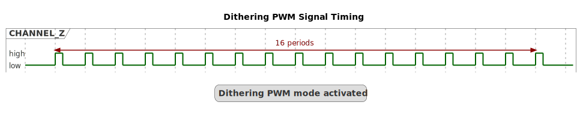
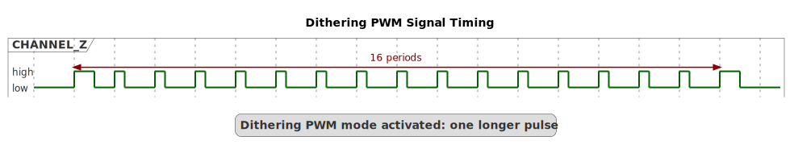
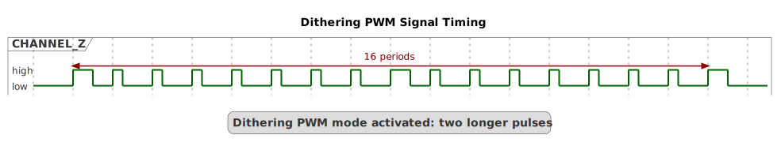
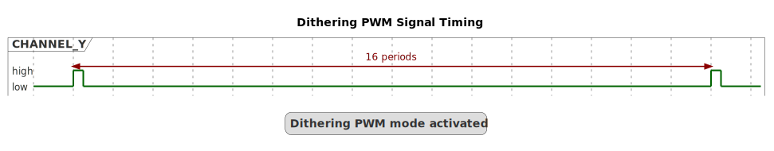
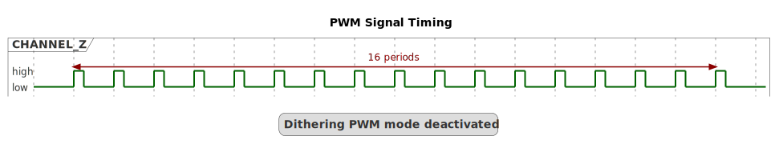
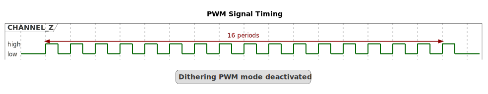
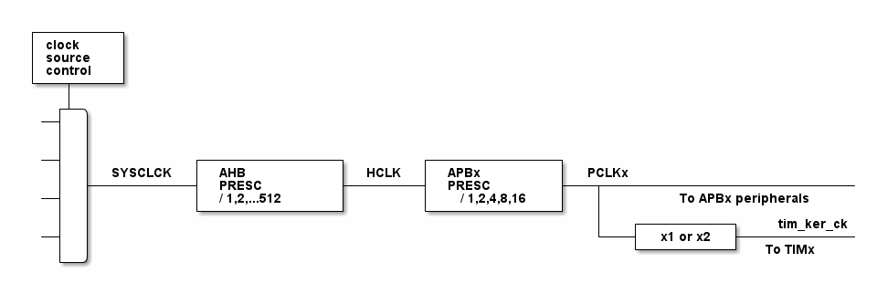

# __Example: *hal_tim_dithering_pwm*__

**Example version:** 2.0.0

How to configure the TIM peripheral in PWM (Pulse Width Modulation) with dithering mode.
The PWM waveforms with dithering generated by the timer CHANNEL_Y and CHANNEL_Z can be displayed using an oscilloscope.

## __1. Detailed scenario__

This scenario demonstrates how to configure a timer to generate several PWM signals with dithering mode.
User LED is connected to a timer's channel (CHANNEL_Z), so that brightness represent the mean of output signal.

__Initialization phase__: At main program start, the `mx_system_init()` function is called. It initializes the peripherals, nonvolatile memory (such as flash memory, NVM, or external memories), MPU regions (if applicable), the system clock, and the SysTick.

The application executes the following __example steps__:

__Step 1__: Initializes the timer's input clock, counter clock, output clock. Sets the output channels' duty cycles, and the GPIO pins.

__Step 2__: Activates dithering mode and starts the timer PWM generation for both channels:

- Increment CHANNEL_Z Pulse by 1 to reach Period Value.
- User LED brightness increases smoothly.

__Step 3__: Deactivates dithering mode and starts the timer PWM generation for both channels:

- Increment CHANNEL_Z Pulse by 1 to reach Period Value.
- User LED brightness increases roughly.

__End of example__: If no error occurs

- Repeat Step 2 and Step 3 indefinitely.

## __2. Example configuration__

### __2.1. Timer configuration__

The *TIM* is configured as follows:

- The timer channels (say 'y' and 'z') are configured as PWM generator in up counting PWM mode 1.
- The timer prescaler is configured to set the timer counter clock to 1.5 MHz.
- The PWM duty cycle is configured at 1% for channel y and 20% for channel z.

Note that the timer configuration depends on the timer peripheral input clock, which is derived from the system clock tree.
So, it is required to define the system clock configuration and to determine the timer input clock before defining the timer configuration.

The system clock configuration is specific to each STM32 MCU (see section [Hardware environment and setup](#3-hardware-environment-and-setup)).

#### __2.2. PWM frequency and duty cycles configuration:__

The timer's autoreload register (ARR) defines the PWM period in number of timer counter clock (tim_cnt_ck) cycles.
The ARR value is chosen as indicated below:

    PWM period = tim_cnt_ck period * (ARR + 1)
    PWM frequency = tim_cnt_ck frequency / (ARR + 1)
    ARR = (tim_cnt_ck frequency / PWM frequency) - 1

The timer's capture/compare channel is used to define the PWM duty cycle.
It is configured by setting the timer's Capture Compare Register (CCR).

The CCR defines the duration of the output active state in number of tim_cnt_ck cycles, and its value should be strictly lower than (ARR + 1).

The PWM duty cycle, expressed as a percentage, is calculated as the ratio of the output active state to the PWM period, multiplied by 100:

    duty_cycle_percent = (CCR / (ARR + 1)) * 100
    CCR = (duty_cyle_percent * (ARR + 1)) / 100

  
PWM with dithering

At initialization, period count (5 TIMER ticks) and pulse count (1 TIMER tick) are voluntarily very low,
so that dithering effect is easily visible on oscilloscope.
Dithering is activated but fractional part is null, thus there is only regular pulses with 1/5 = 20% duty cycle.
And User LED brightness is quite low (about 20% of max intensity).
PWM waveforms can be displayed using an oscilloscope.

  CHANNEL_Z

  

Then timer compare match is incremented regularly. This add 1 more cycle to x pulse out of 16 period (x fractional part = Compare modulo 16).
And User LED brightness is slightly increased.

Fractional part = 1 --> 1 pulse out of 16 periods is longer (1 more cycle). Dither duty cycle = (1+1)/5 = 40%:

  CHANNEL_Z

  

User LED brightness is slightly increased.

Fractional part = 2 --> 2 pulses out of 16 periods are longer (1 more cycle):

  CHANNEL_Z

  

User LED brightness is slightly increased.

When fractional part reach 15, 15 pulses out of 16 have 40% duty cycle, and only 1 out of 16 have 20% duty cycle.
Then compare match continue to be incremented, this means that integer part is incremented and fractional part is reset.
Thus all pulse are regular with a longer duration (40% duty cycle).
The cycle of fractional part increment restarts.
And User LED brightness continue to increased slightly until Pulse reaches Period.

With dithering User LED brightness increases smoothly with (dither * period_count) `16 * 5 = 80` intermediate steps.

When dithering is activated, timer's CHANNEL_Z is configured in PWM output with a pulse 1/16 so that oscilloscope can be synchronized.
Pulse on timer's CHANNEL_Y appear every 16 periods.

  CHANNEL_Y

  

When Pulse becomes longer than period, dithering is deactivated, pulse is reset to restart from the beginning, (User LED brightness very low).
User LED brightness increases roughly with only 5 intermediate steps (= period_count).

 CHANNEL_Z

  

 CHANNEL_Z

  

When Pulse becomes longer than period dithering is reactivated.

... and so on.

### __2.3. GPIO configuration__

Two pins must be configured, one for each PWM signal: [see the specific boards setups](#32-specific-board-setups)

The GPIO pins are configured in:

- Alternate function as a timer output channel of its respective timer instance.
- Push-pull mode with no pull-up or pull-down resistors activated.

## __3. Hardware environment and setup__

### __3.1. Generic Setup__

The PWM signals, with dithering, generated by the timer channels can be displayed by connecting an oscilloscope to the corresponding board connectors.

### __3.2. Specific board setups__

  
On STM32C5 series.

  

    
Common configuration.

  Timer's counter clock configuration with prescalers and APB prescalers set to 1:

  - The AHB clock (HCLK) and system core clock are set to system clock (SYSCLK).
  - The timer's internal input clock (tim_ker_ck) is set to its respective APB clock (PCLK).

      tim_ker_ck = PCLK = HCLK = SYSCLK (system clock)

      So, tim_ker_ck = HCLK in Hz

  To obtain the timer's counter clock frequency (tim_cnt_ck), the timer prescaler register (TIM_PSC) is computed as follows:

      TIM_PSC = (HCLK / tim_cnt_ck ) - 1

  Standard STM32V8xx MCUs' peripheral clocks diagram:
    <!--
@startuml
@startditaa{doc/stm32c5_peripherals_clocks.png}
 +---------+
  | clock   |
  | source  |
  | control |
 +---+-----+
  |
    ++-\
  --+  |
  |  |
  |  |
  --+  |           +---------------+        +--------------+
  |  |  SYSCLCK  |  AHB          |  HCLK  |  APBx        |  PCLKx
  |  +-----------+  PRESC        +--------+  PRESC       +---+----------------------------
  --+  |           |  / 1,2,...512 |        | / 1,2,4,8,16 |   |      To APBx peripherals
  |  |           +---------------+        +--------------+   |
  |  |                                                       |   +----------+   tim_ker_ck
  --+  |                                                       +---+ x1 or x2 +-------------
  |  |                                                           +----------+  To TIMx
    +--/
@endditaa
@enduml
-->
  

In this configuration:

- The HCLK is set to 144MHz.
- The timer counter clock is set to 1.5 MHz.

To obtain a timer counter clock at 1MHz with the APB prescaler set to 1 and the HCLK set to 144MHz, the timer prescaler must be:

      timer_prescaler = (144 MHz / 1.5 MHz) - 1 = 95

  

  

    
On board NUCLEO-C542RC.

  |  MCU pin  |  Signal name  |  User Label  |
  |:---------:|:-------------:|:------------:|
  |    PH0    |  RCC_OSC_IN   |    OSC_IN    |
  |    PH1    |  RCC_OSC_OUT  |   OSC_OUT    |
  |    PA9    |   TIM1_CH2    |     PA9      |
  |    PA5    |   TIM1_CH3    |     PA5      |

  

  

    
On board NUCLEO-C562RE.

  |  MCU pin  |  Signal name  |  User Label  |
  |:---------:|:-------------:|:------------:|
  |    PH0    |  RCC_OSC_IN   |    OSC_IN    |
  |    PH1    |  RCC_OSC_OUT  |   OSC_OUT    |
  |    PA9    |   TIM1_CH2    |     PA9      |
  |    PA5    |   TIM1_CH3    |     PA5      |

  The selected timer is TIM1, with:

  - TIM1_CH2 for channel y
  - TIM1_CH3 for channel z

  

  

    
On board NUCLEO-C5A3ZG.

  |  MCU pin  |  Signal name  |  User Label  |
  |:---------:|:-------------:|:------------:|
  |    PH0    |  RCC_OSC_IN   |  PH0_OSC_IN  |
  |    PH1    |  RCC_OSC_OUT  | PH1_OSC_OUT  |
  |    PA9    |   TIM1_CH2    |     PA9      |
  |    PA5    |   TIM1_CH3    |     PA5      |

  

## __4. Troubleshooting__

Here are the points of attention for this specific example:

__System clock__: The timer clock depends on the system clock configuration. Changing the CPU clock or the peripheral bus' clock affects the PWM frequency and duty cycle.

## __5. See Also__

You can also refer to this other example:

- hal_tim_dithering_pwm: demonstrates how to use the TIM peripheral and how to measure the frequency and duty cycle of a signal with dithering.

This [General-purpose timer cookbook for STM32 microcontrollers (ref. AN4776)](https://www.st.com/content/ccc/resource/technical/document/application_note/group0/91/01/84/3f/7c/67/41/3f/DM00236305/files/DM00236305.pdf/jcr:content/translations/en.DM00236305.pdf) provides a simple and clear description of the basic features and operating modes of the STM32 general-purpose timer peripherals.

This [STM32 cross-series timer overview (ref. AN4013)](https://www.st.com/content/ccc/resource/technical/document/application_note/54/0f/67/eb/47/34/45/40/DM00042534.pdf/files/DM00042534.pdf/jcr:content/translations/en.DM00042534.pdf) presents an overview of the timer peripherals for the STM32 product series.

More information about the STM32Cube Drivers can be found in the drivers' user manual of the STM32 series you are using.

For instance for the STM32C5 series: [HAL documentation](https://dev.st.com/stm32cube-docs/stm32c5xx-hal-drivers/latest/en/index.html).

More information about the STM32 ecosystem can be found in the [STM32 MCU Developer Zone](https://www.st.com/content/st_com/en/stm32-mcu-developer-zone/embedded-software.html).

## __6. License__

Copyright (c) 2026 STMicroelectronics.

This software is licensed under terms that can be found in the LICENSE file in the root directory
of this software component.
If no LICENSE file comes with this software, it is provided AS-IS.
