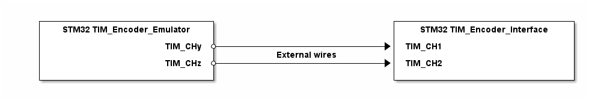
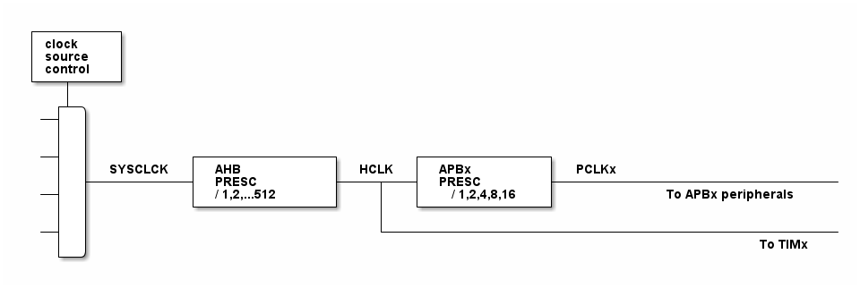

# __Example: *hal_tim_encoder*__

**Example version:** 2.0.0

[](https://dev.st.com/stm32cube-docs/examples/arch-v1/en/index.html "An offline version is also available in the STM32Cube firmware package.")

How to configure the TIM peripheral in encoder mode to determine the rotation direction.


## __1. Detailed scenario__

This scenario demonstrates how to configure a timer in encoder mode to determine the rotation direction.

__Initialization phase__: At main program start, the `mx_system_init()` function is called. It initializes the peripherals, nonvolatile memory (such as flash memory, NVM, or external memories), MPU regions (if applicable), the system clock, and the SysTick.

The application executes the following __example steps__:

__Step 1__: Configures both timers, one that emulate a quadrature encoder signal and the other as an encoder interface.

__Step 2__: Starts both timers, the timer to emulate quadrature encoder signals and the timer encoder interface.

__Step 3__: Update the emulated signals to toggle every 1s, between two phases (+90&deg; and -90&deg;) to emulate a Forward/Backward rotation.

__End of example__: Rotation direction can be monitored by putting "EncoderDirection" variable in the Live Watch window.
  When EncoderDirection = 0, rotation direction is Forward.
  When EncoderDirection = 1, rotation direction is Backward.

You can verify that the example runs properly via the status LED and the `ExecStatus` variable.

If you enable `USE_TRACE`, you can follow these execution steps in the terminal logs:

```text
[INFO] Step 1: Device initialization COMPLETED.
[INFO] Step 2: Emulation signals and encoder interface started.
[INFO] Step 3.1: Encoder interface is in Forward direction.
[INFO] Step 3.2: Encoder interface is in Backward direction.
[INFO] Step 3.1: Encoder interface is in Forward direction.
[INFO] Step 3.2: Encoder interface is in Backward direction.
...
```


## __2. Example configuration__

[](https://dev.st.com/stm32cube-docs/examples/arch-v1/en/configure/config_toc.html "An offline version is also available in the STM32Cube firmware package.")

### __2.1. Timer configuration__

The encoder interface *TIM*, it is the main timer, and configured as follows:

- The timer clock source is configured as encoder mode.
- The encoder mode is set as quadrature encoder x4.
**_NOTE:_** This encounter mode is set to detect rising and falling edge on both input channels
- The period is set at its maximal possible value.
- The counter mode is set as up.
- The timer uses two channels set as input capture with direct mode.
**_NOTE:_** On timers, only the channel 1 and channel 2 can be used with encoder mode.


The emulator encoder *TIM*, it is a second timer that only generate signals to simulate an encoder output. It is configured as follows:

- The timer channels (say 'x' and 'y') are configured in Output Compare Toggle mode.
- Both channels are configured to use the preload on the TIM_CCRx and TIM_CCRy registers.
- The timer prescaler is configured to set the timer counter clock to 1 MHz.
- The toggle frequency is twice the PWM frequency because the signal toggles twice per PWM period (once for the high phase and once for the low phase).
- The toggle of output signal frequency is configured at 10 kHz. Thus output signal frequency is 5 kHz.

- The TIMi_CCRx and TIMi_CCRy are set so that one signal is delayed relative to the other. This allows one signal to generate a rising edge before the other one.
**_NOTE:_** The CCR registers of the two used channels are switched during the run time to change the signal generating the first rising-edge. It is the order of the rising edges of the two signals that that simulate a Forward or a Backward direction of the encoder signals.


<details>

  <summary>Numerical calculations</summary>

  The timer's counter clock is set to 1MHz (see prescaler computation in section [Hardware environment and setup](#3-hardware-environment-and-setup)).

  To set a signal output frequency to 10 kHz with a 1 MHz timer counter clock:

    ARR = (1 MHz / 2 * 10 kHz) - 1
    ARR = (1000000 / 20000) - 1 = 49

  The delay between two signals is calculated as follows:

    Delay = (TIM_CCRx - TIM_CCRy) / tim_cnt_ck

  As the TIM_CCRx and TIM_CCRy are updated during the application run time, there are two different configurations:

  - Configuration 1:

        TIM_CCRx = 12
        TIM_CCRy = 37

        Delay = (12 - 37) / 1000000
        Delay = -25 us

      **_NOTE:_** With the corresponding wiring defined below, this correspond to a     Forward direction.

  - Configuration 2:

        TIM_CCRx = 37
        TIM_CCRy = 12

        Delay = (37 - 12) / 1000000
        Delay = +25 us

      **_NOTE:_** With the corresponding wiring defined below, this correspond to a Forward direction.

</details>

Note that the timer configuration depends on the timer peripheral input clock, which is derived from the system clock tree.
So, it is required to define the system clock configuration and to determine the timer input clock before defining the timer configuration.

The system clock configuration is specific to each STM32 MCU (see section [Hardware environment and setup](#3-hardware-environment-and-setup)).

### __2.2. GPIO configuration__

Two pins must be configured, one for each quadrature signal: [see the specific boards setups](#32-specific-board-setups)

The GPIO pins are configured in:

- Alternate function as a timer input/output channel of its respective timer instance.
- Push-pull mode with no pull-up or pull-down resistors activated.


## __3. Hardware environment and setup__

### __3.1. Generic Setup__

<!--
@startuml
@startditaa{doc/Encoder_interface_example_description.png}


    +----------------------------+                             +-----------------------------+
    | STM32 TIM_Encoder_Emulator |                             | STM32 TIM_Encoder_Interface |
    |                            |                             |                             |
    |                    TIM_CHy *--------------------------+->+ TIM_CH1                     |
    |                            |        External wires       |                             |
    |                    TIM_CHz *--------------------------+->+ TIM_CH2                     |
    |                            |                             |                             |
    +----------------------------+                             +-----------------------------+
@endditaa
@enduml
-->


### __3.2. Specific board setups__

<details>
  <summary>On STM32C5 series.</summary>
  <details>
    <summary>Common configuration.</summary>

  Timer's counter clock configuration with prescalers and APB prescalers set to 1:

  - The AHB clock (HCLK) and system core clock are set to system clock (SYSCLK).
  - The timer's internal input clock (tim_ker_ck) is set to its respective APB clock (PCLK).

      tim_ker_ck = PCLK = HCLK = SYSCLK (system clock)

      So, tim_ker_ck = HCLK in Hz

  To obtain the timer's counter clock frequency (tim_cnt_ck), the timer prescaler register (TIM_PSC) is computed as follows:

      TIM_PSC = (HCLK / tim_cnt_ck ) - 1
    <!--
@startuml
@startditaa{doc/stm32c5_peripherals_clocks.png}
 +---------+
  | clock   |
  | source  |
  | control |
 +---+-----+
  |
    ++-\
  --+  |
  |  |
  |  |
  --+  |           +---------------+        +--------------+
  |  |  SYSCLCK  |  AHB          |  HCLK  |  APBx        |  PCLKx
  |  +-----------+  PRESC        +----+---+  PRESC       +--------------------------------
  --+  |           |  / 1,2,...512 |    |   | / 1,2,4,8,16 |          To APBx peripherals
  |  |           +---------------+    |   +--------------+
  |  |                                |
  --+  |                                +---------------------------------------------------
  |  |                                                                          To TIMx
    +--/
@endditaa
@enduml
-->
  

In this configuration:

- The HCLK is set to 144MHz.
- The timer counter clock is set to 1 MHz.

To obtain a timer counter clock at 1MHz with the APB prescaler set to 1 and the HCLK set to 144MHz, the timer prescaler must be:

      timer_prescaler = (144 MHz / 1 MHz) - 1 = 143

  </details>
  <details>
    <summary>On board NUCLEO-C542RC.</summary>

  |  MCU pin  |  Signal name  |  User Label   |
  |:---------:|:-------------:|:-------------:|
  |    PA5    |     GPIO      | MX_STATUS_LED |
  |    PH0    |  RCC_OSC_IN   |    OSC_IN     |
  |    PH1    |  RCC_OSC_OUT  |    OSC_OUT    |
  |    PA2    |   USART2_TX   |      PA2      |
  |    PA8    |   TIM1_CH1    |      PA8      |
  |    PA9    |   TIM1_CH2    |      PA9      |
  |    PA0    |   TIM2_CH1    |      PA0      |
  |    PA1    |   TIM2_CH2    |      PA1      |

  </details>
  <details>
    <summary>On board NUCLEO-C562RE.</summary>

  |  MCU pin  |  Signal name  |  User Label   |
  |:---------:|:-------------:|:-------------:|
  |    PA5    |     GPIO      | MX_STATUS_LED |
  |    PH0    |  RCC_OSC_IN   |    OSC_IN     |
  |    PH1    |  RCC_OSC_OUT  |    OSC_OUT    |
  |    PA2    |   USART2_TX   |      PA2      |
  |    PA8    |   TIM1_CH1    |      PA8      |
  |    PA9    |   TIM1_CH2    |      PA9      |
  |    PA0    |   TIM2_CH1    |      PA0      |
  |    PA1    |   TIM2_CH2    |      PA1      |

  The selected timer is TIM1 as encoder interface, with:

  - TIM1_CH1
  - TIM1_CH2

  And TIM2 as encoder emulator, with:

  - TIM2_CH1 for channely
  - TIM2_CH2 for channelz

  </details>
  <details>
    <summary>On board NUCLEO-C5A3ZG.</summary>

  |  MCU pin  |  Signal name  |  User Label   |
  |:---------:|:-------------:|:-------------:|
  |    PA5    |     GPIO      | MX_STATUS_LED |
  |    PH0    |  RCC_OSC_IN   |  PH0_OSC_IN   |
  |    PH1    |  RCC_OSC_OUT  |  PH1_OSC_OUT  |
  |    PA2    |   USART2_TX   | DBGIN_VCP_TX  |
  |    PA8    |   TIM1_CH1    |      PA8      |
  |    PA9    |   TIM1_CH2    |      PA9      |
  |    PA0    |   TIM2_CH1    |      PA0      |
  |    PA1    |   TIM2_CH2    |      PA1      |

  </details>
</details>

## __4. Troubleshooting__

[](https://dev.st.com/stm32cube-docs/examples/arch-v1/en/debug/debug_toc.html "An offline version is also available in the STM32Cube firmware package.")

Here are the points of attention for this specific example:

__System clock__: Ensure the system clock is configured correctly to provide accurate timing for the encoder interface.

__HAL_Delay()__: Care must be taken when using HAL_Delay(), as it relies on the SysTick interrupt. Ensure the SysTick interrupt has a higher priority than the peripheral interrupt.

__Channels connections__: The connection between the two timers should be respected to be sure the encoder interface decode the right encoder signals.


## __5. See Also__

[](https://dev.st.com/stm32cube-docs/examples/arch-v1/en/more/more_toc.html "An offline version is also available in the STM32Cube firmware package.")

You can also refer to these other examples:

- hal_tim_pwm_input: demonstrates how to use the TIM peripheral to measure the frequency and duty cycle of a signal.
- hal_tim_oc_toggle: demonstrates how to use the TIM peripherla to generate an output toggling signal.

This [General-purpose timer cookbook for STM32 microcontrollers (ref. AN4776)](https://www.st.com/content/ccc/resource/technical/document/application_note/group0/91/01/84/3f/7c/67/41/3f/DM00236305/files/DM00236305.pdf/jcr:content/translations/en.DM00236305.pdf) provides a simple and clear description of the basic features and operating modes of the STM32 general-purpose timer peripherals.

This [STM32 cross-series timer overview (ref. AN4013)](https://www.st.com/content/ccc/resource/technical/document/application_note/54/0f/67/eb/47/34/45/40/DM00042534.pdf/files/DM00042534.pdf/jcr:content/translations/en.DM00042534.pdf) presents an overview of the timer peripherals for the STM32 product series.

More information about the STM32Cube Drivers can be found in the drivers' user manual of the STM32 series you are using.

For instance for the STM32C5 series: [HAL documentation](https://dev.st.com/stm32cube-docs/stm32c5xx-hal-drivers/latest/en/index.html).

More information about the STM32 ecosystem can be found in the [STM32 MCU Developer Zone](https://www.st.com/content/st_com/en/stm32-mcu-developer-zone/embedded-software.html).


## __6. License__

Copyright (c) 2026 STMicroelectronics.

This software is licensed under terms that can be found in the LICENSE file in the root directory of this software component. If no LICENSE file comes with this software, it is provided AS-IS.
