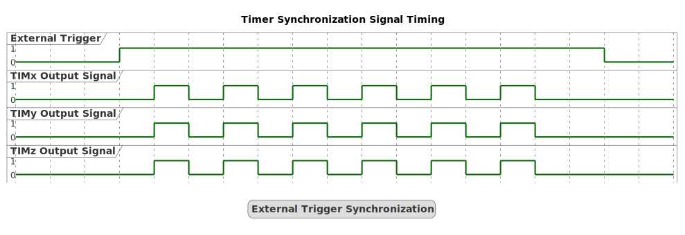
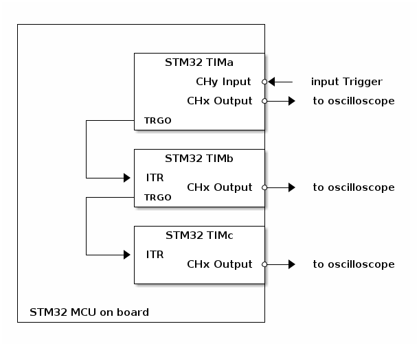
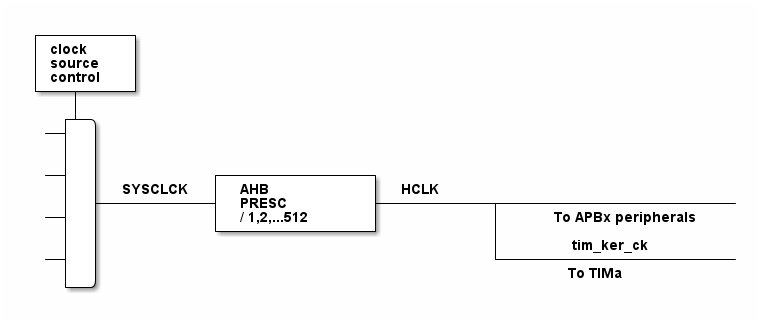

# __Example: *hal_tim_ext_trigger_synchro*__

**Example version:** 2.0.0

How to configure the TIM peripheral to synchronize three timer instances.

## __1. Detailed scenario__

__Initialization phase__: At main program start, the `mx_system_init()` function is called. It initializes the peripherals, nonvolatile memory (such as flash memory, NVM, or external memories), MPU regions (if applicable), the system clock, and the SysTick.

The application executes the following __example steps__:

__Step 1__: Initializes the three timer instances and their GPIO pins.

__Step 2__: Starts all three timers to generate synchronized signals when an external trigger occurs.

__End of example__: If no error occurs, the synchronized signals are generated indefinitely.

Overview of signal with external trigger synchronization :

  

## __2. Example configuration__

This configuration is particularly useful for applications requiring precise timing and coordination across multiple timers.

### __2.1. Timer configuration:__

This example demonstrates the following peripherals:

TIMa uses channel y as input and channel x as trigger output to synchronize TIMb, which then uses channel x to trigger TIMc.

__TIMa__:

 - Channel x is used as the Trigger Output, allowing TIMa to generate synchronization signals for other timers.

 - Channel y is used as the input pin (TIy), capturing external signals to be used as triggers for TIMa. Additionally, the timer operates in Gated Mode, meaning the start and stop of the timer are controlled by the external trigger signal, ensuring precise synchronization.

 - The timer prescaler is configured to set the timer counter clock to 1 MHz.
 - The timer channel y are configured as PWM generator in up counting PWM mode 1.
 - The PWM duty cycle is configured at 50% for channel y.
 - The PWM frequency is configured at 24 kHz.

__TIMb__:

The timer is configured as a secondary timer for TIMa and as a primary timer for TIMc.
It operates in Toggle Mode, where the output alternates between two states (high and low) at each update event.
TIMb uses the internal trigger (ITRx) as its input trigger, corresponding to TRGO from TIMa.
In Gated Mode, the start and stop of the TIMb counter are controlled by the trigger output signal from TIMa.

This configuration ensures that TIMb operates in synchronization with TIMa.

Additionally, TIMb generates its own trigger output signal, which is used to synchronize TIMc, maintaining a cascaded synchronization chain.

 - The timer channel x are configured as PWM generator in up counting PWM mode 1.
 - The timer prescaler is configured to set the timer counter clock to 1 MHz.
 - The PWM duty cycle is configured at 50% for channel y.
 - The PWM frequency is configured at 24 kHz.

__TIMc__:

The timer is configured as a secondary timer for TIMb. It operates in Toggle Mode, where the output changes state at each update event. TIMc uses the internal trigger (ITRy) as its input trigger, corresponding to TRGO from TIMb. In Gated Mode, the start and stop of the TIMc counter are controlled by the trigger output signal from TIMb. This setup ensures that TIMc operates in perfect synchronization with TIMb, continuing the cascaded synchronization chain initiated by TIMa.

 - The timer channel x are configured as PWM generator in up counting PWM mode 1.
 - The timer prescaler is configured to set the timer counter clock to 1 MHz.
 - The PWM duty cycle is configured at 50% for channel y.
 - The PWM frequency is configured at 24 kHz.

__GPIO__:

We configure the GPIO pin as a timer channel pin, thanks to the appropriate alternate function.

The system clock configuration is specific to each STM32 MCU (see section [Hardware environment and setup](#3-hardware-environment-and-setup)).

#### __2.2. PWM frequency and duty cycles configuration:__

The timer's autoreload register (ARR) defines the PWM period in number of timer counter clock (tim_cnt_ck) cycles.
The ARR value is chosen as indicated below:

    PWM period = tim_cnt_ck period * (ARR + 1)
    PWM frequency = tim_cnt_ck frequency / (ARR + 1)
    ARR = (tim_cnt_ck frequency / PWM frequency) - 1

The timer's capture/compare channel is used to define the PWM duty cycle.
It is configured by setting the timer's Capture Compare Register (CCR).

The CCR defines the duration of the output active state in number of tim_cnt_ck cycles, and its value should be strictly lower than (ARR + 1).

The PWM duty cycle, expressed as a percentage, is calculated as the ratio of the output active state to the PWM period, multiplied by 100:

    duty_cycle_percent = (CCR / (ARR + 1)) * 100
    CCR = (duty_cyle_percent * (ARR + 1)) / 100

  
Numerical calculations

  To set a PWM output frequency to 24kHz with a 1MHz timer counter clock:

    ARR = (1 MHz / 24 kHz) - 1
    ARR = (1000000 / 24000) - 1 = 40.66
    ARR = 40 (integer rounded down to fit into the register)

   To set the channel y's PWM duty cycle to 50%:

    CCRy = (50 / 100) * 41 = 20.5
    CCRy = 20 (integer rounded down to fit into the register)

## __3. Hardware environment and setup__

### __3.1. Generic Setup__

This section describes the hardware setup principles that apply to any board.

<!--
@startuml
@startditaa{doc/hardware_setup.png}
+-----------------------------------+
|                                   |
|                                   |
|                +------------------+
|                |    STM32 TIMa    |
|                |                  |
|                |        CHy Input *<-+- input Trigger
|                |                  |
|                |       CHx Output *-+-> to oscilloscope
|                |                  |
|         +------+ TRGO             |
|         |      +------------------+
|         |                         |
|         |      +------------------+
|         |      |    STM32 TIMb    |
|         |      |                  |
|         +---+->+ ITR              |
|                |       CHx Output *-+-> to oscilloscope
|         +------+ TRGO             |
|         |      +------------------+
|         |                         |
|         |      +------------------+
|         |      |    STM32 TIMc    |
|         |      |                  |
|         +---+->+ ITR              |
|                |       CHx Output *-+-> to oscilloscope
|                |                  |
|                +------------------+
|                                   |
|                                   |
| STM32 MCU on board                |
+-----------------------------------+
@endditaa
@enduml
-->

### __3.2. Specific board setups__

This section describes the exact hardware configurations of your project.
This example can run without external setup: in this case, the timer (TIM) can control the signal on the TIMa_CHy pin connected to the 3.3V pin.

  
On STM32C5 series.

  

    
Common configuration.

  The external signal is connected to the TIMa_CHy, and a rising edge on this input is used to trigger the timer.

  The PWM signal is output on the TIMa_CHx, TMa_CHx and TIMa_CHx.

  Timer's counter clock configuration with prescalers and APB prescalers set to 1:

  - The AHB clock (HCLK) and system core clock are set to system clock (SYSCLK).
  - The timer's internal input clock (tim_ker_ck) is set to its respective APB clock (PCLK).

      tim_ker_ck = PCLK = HCLK = SYSCLK (system clock)

      So, tim_ker_ck = HCLK in Hz

  To obtain the timer's counter clock frequency (tim_cnt_ck), the timer prescaler register (TIM_PSC) is computed as follows:

      TIM_PSC = (HCLK / tim_cnt_ck ) - 1

  Standard STM32C5xx MCUs' peripheral clocks diagram:
    <!--
@startuml
@startditaa{doc/stm32c5_peripherals_clocks.png}
 +---------+
  | clock   |
  | source  |
  | control |
 +---+-----+
  |
    ++-\
  --+  |
  |  |
  |  |
  --+  |           +---------------+      
  |  |  SYSCLCK  |  AHB          |  HCLK    
  |  +-----------+  PRESC        +-----------+------------------------
  --+  |           |  / 1,2,...512 |           |      To APBx peripherals
  |  |           +---------------+           |
  |  |                                       |      tim_ker_ck
  --+  |                                       +------------------------
  |  |                                              To TIMa
    +--/
@endditaa
@enduml
-->
  

In this configuration:

- The HCLK is set to 144MHz.
- The timer counter clock is set to 1 MHz.

To obtain a timer counter clock at 1MHz with the APB prescaler set to 1 and the HCLK set to 144MHz, the timer prescaler must be:

      timer_prescaler = (144 MHz / 1 MHz) - 1 = 143

  

  

    
On board NUCLEO-C542RC.

  |  MCU pin  |  Signal name  |  User Label   |
  |:---------:|:-------------:|:-------------:|
  |    PA5    |     GPIO      | MX_STATUS_LED |
  |    PH0    |  RCC_OSC_IN   |    OSC_IN     |
  |    PH1    |  RCC_OSC_OUT  |    OSC_OUT    |
  |    PA2    |   USART2_TX   |      PA2      |
  |    PA9    |   TIM1_CH2    |      PA9      |
  |    PA8    |   TIM1_CH1    |      PA8      |
  |    PA0    |   TIM2_CH1    |      PA0      |
  |   PB10    |   TIM8_CH1    |     PB10      |

  The selected timer is TIM1,TIM2 and TIM8, with:
     - TIM1_CH2 for TIMa_CHy
     - TIM1_CH1 for TIMa_CHx
     - TIM2_CH1 for TIMb_CHx
     - TIM8_CH1 for TIMc_CHx

  

  

    
On board NUCLEO-C562RE.

  |  MCU pin  |  Signal name  |  User Label   |
  |:---------:|:-------------:|:-------------:|
  |    PA5    |     GPIO      | MX_STATUS_LED |
  |    PH0    |  RCC_OSC_IN   |    OSC_IN     |
  |    PH1    |  RCC_OSC_OUT  |    OSC_OUT    |
  |    PA2    |   USART2_TX   |      PA2      |
  |    PA9    |   TIM1_CH2    |      PA9      |
  |    PA8    |   TIM1_CH1    |      PA8      |
  |    PA0    |   TIM2_CH1    |      PA0      |
  |   PB10    |   TIM8_CH1    |     PB10      |

  The selected timer is TIM1,TIM2 and TIM8, with:
     - TIM1_CH2 for TIMa_CHy
     - TIM1_CH1 for TIMa_CHx
     - TIM2_CH1 for TIMb_CHx
     - TIM8_CH1 for TIMc_CHx

  

  

    
On board NUCLEO-C5A3ZG.

  |  MCU pin  |  Signal name  |  User Label   |
  |:---------:|:-------------:|:-------------:|
  |    PA5    |     GPIO      | MX_STATUS_LED |
  |    PH0    |  RCC_OSC_IN   |  PH0_OSC_IN   |
  |    PH1    |  RCC_OSC_OUT  |  PH1_OSC_OUT  |
  |    PA2    |   USART2_TX   | DBGIN_VCP_TX  |
  |    PA9    |   TIM1_CH2    |      PA9      |
  |    PA8    |   TIM1_CH1    |      PA8      |
  |    PA0    |   TIM2_CH1    |      PA0      |
  |   PB10    |   TIM8_CH1    |     PB10      |

  The selected timer is TIM1,TIM2 and TIM8, with:
     - TIM1_CH2 for TIMa_CHy
     - TIM1_CH1 for TIMa_CHx
     - TIM2_CH1 for TIMb_CHx
     - TIM8_CH1 for TIMc_CHx

  

## __4. Troubleshooting__

Here are the points of attention for this specific example:

__System clock__: The timer clock depends on the system clock configuration. Changing the CPU clock or the peripheral bus' clock affects the frequency.

__Trigger as input__: The signal requires a trigger to be generated. If the signal is not generated, ensure that a trigger signal is provided as input on the timer's input channel.

## __5. See Also__

This [General-purpose timer cookbook for STM32 microcontrollers (ref. AN4776)](https://www.st.com/content/ccc/resource/technical/document/application_note/group0/91/01/84/3f/7c/67/41/3f/DM00236305/files/DM00236305.pdf/jcr:content/translations/en.DM00236305.pdf) provides a simple and clear description of the basic features and operating modes of the STM32 general-purpose timer peripherals.

This [STM32 cross-series timer overview (ref. AN4013)](https://www.st.com/content/ccc/resource/technical/document/application_note/54/0f/67/eb/47/34/45/40/DM00042534.pdf/files/DM00042534.pdf/jcr:content/translations/en.DM00042534.pdf) presents an overview of the timer peripherals for the STM32 product series.

More information about the STM32Cube Drivers can be found in the drivers' user manual of the STM32 series you are using.

For instance for the STM32C5 series: [HAL documentation](https://dev.st.com/stm32cube-docs/stm32c5xx-hal-drivers/latest/en/index.html).

More information about the STM32 ecosystem can be found in the [STM32 MCU Developer Zone](https://www.st.com/content/st_com/en/stm32-mcu-developer-zone/embedded-software.html).

## __6. License__

Copyright (c) 2026 STMicroelectronics.

This software is licensed under terms that can be found in the LICENSE file in the root directory
of this software component.
If no LICENSE file comes with this software, it is provided AS-IS.
