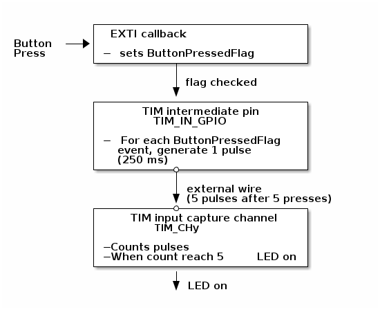

# __Example: *hal_tim_external_clock_mode1*__

**Example version:** 2.0.0

How to configure the TIM peripheral in external clock mode 1 and use the button as a clock source to light a LED after 5 presses.

## __1. Detailed scenario__

This scenario demonstrates how to configure a timer in external clock mode 1 using the button as external trigger source.

__Initialization phase__: At main program start, the `mx_system_init()` function is called. It initializes the peripherals, nonvolatile memory (such as flash memory, NVM, or external memories), MPU regions (if applicable), the system clock, and the SysTick.

The application executes the following __example steps__:

__Step 1__: Initializes the GPIO, the timer's input clock, counter clock, output clock. Configures the GPIO and the corresponding EXTI line.

__Step 2__: Starts the timer's output channel in interrupt mode, starts the EXTI line and waits for the interrupt.
            Waits for 5 button presses to trigger the output compare callback.

__End of example__: If no error occurs, the LED turns ON.

## __2. Example configuration__

### __2.1. Timer configuration__

__TIM__:
The *TIM* is configured as follows:

- The timer channel y is configured as input capture mode and select its trigger as a clock source (external clock mode 1).
- The timer channel z is configured in output compare mode, where the compare match event is used to turn on the LED.
- The channel z mode is set to frozen since no output pin signal is needed.
- The capture prescaler is not used for triggering, it is not necessary to configure it.
- The following configuration values are used for TIM:
      - Prescaler = 0
      - Repetition counter = 0
      - Autoreload = 5
      - Pulse (CCR1) = 5

### __2.2. GPIO configuration__

One pin must be configured, for PWM signal: [see the specific boards setups](#32-specific-board-setups)

__GPIO and EXTI__:

It requires a GPIO input:

- With a pin connected to an EXTI line,
- With a way to toggle the GPIO pin voltage from 0V to MCU power supply (or MCU power supply to 0V) with a button, jumper, or transistor switch.

The GPIO input pin is configured as follows:

- Mode set at external interrupt mode with rising edge trigger detection.
- Internal pull-up resistors deactivated.
- Associated IRQ activated with a high priority.

__TIM_IN_GPIO__:

To prevent button bounce, the button signal is not directly redirected to the timer input. The button pin is configured in interrupt mode for the rising edges.
Thanks to this event, a 250ms pulse is generated on an intermediate GPIO (TIM_IN_GPIO) and redirected to the timer input.
During this amount of time, no other button events are considered.
The TIM_IN_GPIO pin is configured as an output.

## __3. Hardware environment and setup__

### __3.1. Generic Setup__

The PWM signals generated by the timer channels can be displayed by connecting an oscilloscope to the corresponding board connectors.
<!--
@startditaa{doc/External_Clock_Mode1_example_description.png}

           +------------------------------+
           | EXTI callback                |
Button -+->+                              |
Press      | -sets ButtonPressedFlag      |
           +-----------+------------------+
                       |
                       |flag checked
                       v
           +-----------+------------------+
           |     TIM intermediate pin     |
           |        TIM_IN_GPIO           |
           |                              |
           | -For each ButtonPressedFlag  |
           |   event, generate 1 pulse    |
           |   (250 ms)                   |
           +-----------*------------------+
                       |
                       | external wire
                       v (5 pulses after 5 presses)
           +-----------*------------------+
           |   TIM input capture channel  |
           |        TIM_CHy               |
           |                              |
           | -Counts pulses               |
           | -When count reach 5   LED on |
           +------------------------------+
                       |
                       v LED on

@endditaa
-->

### __3.2. Specific board setups__

  
On STM32C5 series.

  

    
On board NUCLEO-C542RC.

  |  MCU pin  |  Signal name  |  User Label   |
  |:---------:|:-------------:|:-------------:|
  |    PA5    |     GPIO      | MX_STATUS_LED |
  |    PH0    |  RCC_OSC_IN   |    OSC_IN     |
  |    PH1    |  RCC_OSC_OUT  |    OSC_OUT    |
  |    PA9    |   TIM1_CH2    |      PA9      |
  |   PA10    |     GPIO      |       -       |
  |   PC13    |     GPIO      |       -       |

  The selected timer is TIM1, with:

  - TIM1_CH2 for channel y (input capture mode)
  - TIM_IN_GPIO serves as the intermediate pin between the button and channel y.
  - Connect the following pins together:
      - TIM1_CH2: PA9 (CN5-1)
      - TIM_IN_GPIO: PA10 (CN9-3)

  

  

    
On board NUCLEO-C562RE.

  |  MCU pin  |  Signal name  |  User Label   |
  |:---------:|:-------------:|:-------------:|
  |    PA5    |     GPIO      | MX_STATUS_LED |
  |    PH0    |  RCC_OSC_IN   |    OSC_IN     |
  |    PH1    |  RCC_OSC_OUT  |    OSC_OUT    |
  |    PA9    |   TIM1_CH2    |      PA9      |
  |   PA10    |     GPIO      |       -       |
  |   PC13    |     GPIO      |       -       |

  The selected timer is TIM1, with:

  - TIM1_CH2 for channel y (input capture mode)
  - TIM_IN_GPIO serves as the intermediate pin between the button and channel y.
  - Connect the following pins together:
      - TIM1_CH2: PA9 (CN5-1)
      - TIM_IN_GPIO: PA10 (CN9-3)

  

  

    
On board NUCLEO-C5A3ZG.

  |  MCU pin  |  Signal name  |  User Label   |
  |:---------:|:-------------:|:-------------:|
  |    PA5    |     GPIO      | MX_STATUS_LED |
  |    PH0    |  RCC_OSC_IN   |  PH0_OSC_IN   |
  |    PH1    |  RCC_OSC_OUT  |  PH1_OSC_OUT  |
  |    PA9    |   TIM1_CH2    |      PA9      |
  |   PA10    |     GPIO      |       -       |
  |   PC13    |     GPIO      |       -       |

  The selected timer is TIM1, with:

  - TIM1_CH2 for channel y (input capture mode)
  - TIM_IN_GPIO serves as the intermediate pin between the button and channel y.
  - Connect the following pins together:
      - TIM1_CH2: PA9 (CN5-1)
      - TIM_IN_GPIO: PA10 (CN9-3)

  

## __4. Troubleshooting__

Here are the points of attention for this specific example:

__System clock__: The timer clock depends on the system clock configuration. Changing the MCU clock or the peripheral bus clock affects the PWM frequency and duty cycle.

## __5. See Also__

You can also refer to this other example for more timer calculation details:

- hal_tim_pwm_output: demonstrates how to use the TIM peripheral to generate a PWM signal.

This [General-purpose timer cookbook for STM32 microcontrollers (ref. AN4776)](https://www.st.com/content/ccc/resource/technical/document/application_note/group0/91/01/84/3f/7c/67/41/3f/DM00236305/files/DM00236305.pdf/jcr:content/translations/en.DM00236305.pdf) provides a simple and clear description of the basic features and operating modes of the STM32 general-purpose timer peripherals.

This [STM32 cross-series timer overview (ref. AN4013)](https://www.st.com/content/ccc/resource/technical/document/application_note/54/0f/67/eb/47/34/45/40/DM00042534.pdf/files/DM00042534.pdf/jcr:content/translations/en.DM00042534.pdf) presents an overview of the timer peripherals for the STM32 product series.

More information about the STM32Cube Drivers can be found in the drivers' user manual of the STM32 series you are using.

For instance for the STM32C5 series: [HAL documentation](https://dev.st.com/stm32cube-docs/stm32c5xx-hal-drivers/latest/en/index.html).

More information about the STM32 ecosystem can be found in the [STM32 MCU Developer Zone](https://www.st.com/content/st_com/en/stm32-mcu-developer-zone/embedded-software.html).

## __6. License__

Copyright (c) 2026 STMicroelectronics.

This software is licensed under terms that can be found in the LICENSE file in the root directory
of this software component.
If no LICENSE file comes with this software, it is provided AS-IS.
