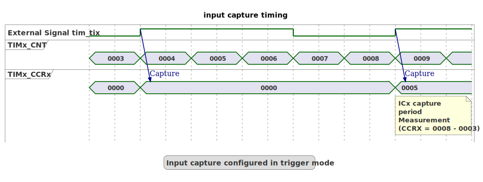
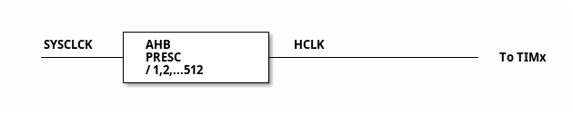

# __Example: *hal_tim_input_capture_dma*__

**Example version:** 2.0.0

[](https://dev.st.com/stm32cube-docs/examples/arch-v1/en/index.html "An offline version is also available in the STM32Cube firmware package.")

How to configure the TIM peripheral in input capture mode with DMA to measure the frequency of an external signal.


## __1. Detailed scenario__

The external signal is received on a timer's input pin and is routed to a capture/compare register CCRx, which measures the period of the signal.

__Initialization phase__: At main program start, the `mx_system_init()` function is called. It initializes the peripherals, nonvolatile memory (such as flash memory, NVM, or external memories), MPU regions (if applicable), the system clock, and the SysTick.

__Step 1__: Initializes the GPIO and the TIM for input capture measurement.

__Step 2__: Starts the timer in input capture mode for the channel, with DMA enabled for capture transfers.

__Step 3__: The DMA transfers successive capture values (CCRx) into a memory buffer. On DMA transfer-complete, the application computes the period between consecutive captured values over the buffer, then derives min/max/avg frequency values for the capture window.

__End of example__: As long as no error occurs, step 3 runs in an infinite loop.

You can verify that the example runs properly via the status LED and the `ExecStatus` variable.

If you enable `USE_TRACE`, you can follow these execution steps in the terminal logs:

```text
[INFO] Step 1: Device initialization COMPLETED.
[INFO] Step 2: Timer input capture started in DMA mode.
[INFO] Step 3: The measured frequency is: ... Hz.
...
```


## __2. Example configuration__

[](https://dev.st.com/stm32cube-docs/examples/arch-v1/en/configure/config_toc.html "An offline version is also available in the STM32Cube firmware package.")

### __2.1. Block Diagram__

The timer is configured in input capture mode with a single channel mapped to a GPIO for input capture.

The capture compare register (CCRx) is configured to trigger on the rising edge, capturing the current timer counter value without resetting it.

DMA is configured to transfer the captured CCRx values into a memory buffer. This allows the application to process captured timestamps in batches (for example on DMA half-transfer / transfer-complete events) instead of processing each capture value immediately in the application logic. In this example, the DMA buffer holds 10 capture values; on the DMA transfer-complete event the application computes min/max/avg frequency values over the capture window using consecutive captured values.

The period value is set to 0xFFFF as it is the maximal value possible for a timer with a 16bits counter.

In this example, the timer's internal input clock (tim_ker_ck) equals the system core clock:

> tim_ker_ck = SystemCoreClock

This is achieved by setting:

- The timer's input clock to its respective APB clock (PCLK)
- The AHB prescaler to 1
- The APB prescaler (depending on series) to 1

__GPIO__:

We configure the GPIO pin as a timer channel pin, thanks to the appropriate alternate function.

### __2.2. Input Signal frequency configuration:__

__Measurement principle__:

The purpose of the input capture configuration is to analyze an incoming signal frequency.

<details>
<summary>Input Capture Analysis Mode</summary>

  The timer's input channel receives the external signal through the associated GPIO.

  To measure the frequency of the input signal, we need to measure the time between two rising edges.
  When a rising edge is detected, the timer counter value (TIM_CNT) is saved into the capture compare register (TIM_CCRx).

  When the first rising edge occurs, the counter value is recorded. Another counter value is recorded after the second rising edge occurs. The difference between these two counter values is then calculated. This difference in the counter values will give us the frequency.

  Each rising edge produces a new capture value in CCRx. With DMA enabled, these CCRx values are automatically transferred into a memory buffer. The application uses two consecutive captured values from that buffer to compute the time difference (in timer counter ticks), and then derives the signal frequency.

  The timer's internal input clock (tim_ker_ck) is calculated based on the setup we have done for our timer. The frequency is equal to the reference clock divided by the difference. This is because the counter value depends on the timer clock.

  The measurements are made in number of the timer's counter clock cycles:

  - CCRx stores the current timer counter value. The application calculates the difference between two consecutive captured values to determine the period of the signal.

  This gives the following mathematical relations:

    Signal's period in seconds = period of the timer's counter in seconds * diff_Capture
    Signal's frequency in Hz = 1 / (period of the timer's counter in seconds * diff_Capture)

  And the frequency of the timer's counter in Hz is the timer's counter clock. So, this gives:

    Signal's frequency in Hz = timer's counter clock in Hz / diff_Capture

  

</details>

 __Measurement precision__:

The timer clock is limiting the measurable input frequency and measurement accuracy.

<details>
<summary>Input Capture Precision</summary>
  The measured frequency precision depends on the timer settings.
  The timer counts in number of counter's clock cycles (values stored in CCRx).
  The clock and the signal edge might not be perfectly aligned, leading to a potential counting error of +/- 1.

  The measurement precision is the ratio of the timer's counter clock frequency (tim_cnt_ck) to the frequency of the signal (F_m).

    precision = tim_cnt_ck / F_m

  The precision cannot exceed the resolution provided by the timer's clock frequency.
  For a measured frequency of F_m Hz, the precision in % is 100 / CCRx.

  For example, for an external PWM signal with a frequency of 40 MHz and the tim_cnt_ck set to 80 MHz:

  - The period of the PWM signal is 25 ns.
  - The period of the tim_cnt_ck is 12.5 ns.

  The period of the signal represents two timer's counter clock cycles (CCRx=2).
  This gives a precision of 50%.

  To achieve a precision p, the value of CCRx must be greater than 100 / p.

  For instance, to reach a high precision of 5%, CCRx must be greater than 100 / 5 = 20.

  To obtain this precision, the timer's counter clock frequency must be at least 20 times higher than the frequency of the external signal being measured.

  > **_CONCLUSION_**: By ensuring that the timer's clock frequency is much higher than the frequency of the signal, you can minimize the impact of the +/- 1 count uncertainty.

</details>

<details>
<summary>Minimal measurable signal frequency</summary>

  When the external signal is slow enough, the TIM counter can overflow between two captures.
  This example handles a *single* counter wrap-around between two consecutive captures, but it does not
  count multiple overflows (very low frequencies), so measurements become invalid below the limit.

  The time to reach the overflow is:

    Overflow period in seconds = (Max TIM_CNT value) / (tim_cnt_ck in Hz)
    Minimum measurable frequency (single-overflow assumption) = (tim_cnt_ck in Hz) / (Max TIM_CNT value)

   Maximum TIM_CNT value:

   - 32-bit timer: 0xFFFFFFFF

   - 16-bit timer: 0xFFFF
  Example calculation:

    For a 32-bit timer with tim_cnt_ck = 1 MHz:
    Minimum Measurable Frequency in Hz = 1000000 Hz / 0xFFFFFFFF
    This is approximately 0.00023 Hz
    For a 16-bit timer with tim_cnt_ck = 1 MHz:
    Minimum Measurable Frequency in Hz = 1000000 Hz / 0xFFFF
    This is approximately 15 Hz

</details>

<details>
<summary>Asynchronous Input Capture DMA Processing</summary>

In the context of input capture, "asynchronous" means that capture values are collected independently of the main program flow. With DMA, the transfer of CCRx values into memory happens in hardware, without blocking the CPU.

This asynchronous processing allows the system to respond to external events in real-time, ensuring precise measurement of signal characteristics.

</details>


## __3. Hardware environment and setup__

### __3.1. Generic Setup__

The timer configuration depends on the timer's input clock.
This clock is derived from the system clock tree.
So, the system clock configuration is a critical setup step.

### __3.2. Specific board setups__

<details>
  <summary>On STM32C5 series.</summary>
  <details>
    <summary>Common configuration.</summary>

  Timer's counter clock configuration with prescalers set to 1:

  - The AHB clock (HCLK) and system core clock are set to system clock (SYSCLK).
  - The timer's internal input clock (tim_ker_ck) is set to its respective APB clock (PCLK).

      tim_ker_ck = HCLK = SYSCLK (system clock)

      So, tim_ker_ck = HCLK in Hz

  To obtain the timer's counter clock frequency (tim_cnt_ck), the timer prescaler register (TIM_PSC) is computed as follows:

      TIM_PSC = (HCLK / tim_cnt_ck ) - 1
    <!--
@startuml
@startditaa{doc/stm32c5_peripherals_clocks.png}

           +---------------+
  SYSCLCK  |  AHB          |  HCLK
  ---------+  PRESC        +----+------------------ To TIMx
  |  / 1,2,...512 |
           +---------------+

@endditaa
@enduml
-->
  

In this configuration:

- The HCLK is set to 144MHz.
- The timer counter clock is set to 1 MHz.

To obtain a timer counter clock at 1MHz with the APB prescaler set to 1 and the HCLK set to 144MHz, the timer prescaler must be:

      timer_prescaler = (144 MHz / 1 MHz) - 1 = 143

  </details>

  <details>
    <summary>On board NUCLEO-C542RC.</summary>

  |  MCU pin  |  Signal name  |  User Label   |
  |:---------:|:-------------:|:-------------:|
  |    PA5    |     GPIO      | MX_STATUS_LED |
  |    PH0    |  RCC_OSC_IN   |    OSC_IN     |
  |    PH1    |  RCC_OSC_OUT  |    OSC_OUT    |
  |    PA2    |   USART2_TX   |      PA2      |
  |    PA8    |   TIM1_CH1    |      PA8      |

  </details>

  <details>
    <summary>On board NUCLEO-C562RE.</summary>

  |  MCU pin  |  Signal name  |  User Label   |
  |:---------:|:-------------:|:-------------:|
  |    PA5    |     GPIO      | MX_STATUS_LED |
  |    PH0    |  RCC_OSC_IN   |    OSC_IN     |
  |    PH1    |  RCC_OSC_OUT  |    OSC_OUT    |
  |    PA2    |   USART2_TX   |      PA2      |
  |    PA8    |   TIM1_CH1    |      PA8      |

  </details>

  <details>
    <summary>On board NUCLEO-C5A3ZG.</summary>

  |  MCU pin  |  Signal name  |  User Label   |
  |:---------:|:-------------:|:-------------:|
  |    PA5    |     GPIO      | MX_STATUS_LED |
  |    PH0    |  RCC_OSC_IN   |  PH0_OSC_IN   |
  |    PH1    |  RCC_OSC_OUT  |  PH1_OSC_OUT  |
  |    PA2    |   USART2_TX   | DBGIN_VCP_TX  |
  |    PA8    |   TIM1_CH1    |      PA8      |

  </details>
</details>


## __4. Troubleshooting__

[](https://dev.st.com/stm32cube-docs/examples/arch-v1/en/debug/debug_toc.html "An offline version is also available in the STM32Cube firmware package.")

Here are the points of attention for this specific example:

__System clock__: The timer clock depends on the system clock configuration. Changing the CPU clock or the peripheral bus' clock affects the frequency.


## __5. See Also__

[](https://dev.st.com/stm32cube-docs/examples/arch-v1/en/more/more_toc.html "An offline version is also available in the STM32Cube firmware package.")

You can also refer to this other example:

- hal_tim_pwm_output: demonstrates how to use the TIM peripheral in pwm mode.
- hal_tim_pwm_input: demonstrates how to use the TIM peripheral to measure the frequency of a signal.

This [General-purpose timer cookbook for STM32 microcontrollers (ref. AN4776)](https://www.st.com/content/ccc/resource/technical/document/application_note/group0/91/01/84/3f/7c/67/41/3f/DM00236305/files/DM00236305.pdf/jcr:content/translations/en.DM00236305.pdf) provides a simple and clear description of the basic features and operating modes of the STM32 general-purpose timer peripherals.

This [STM32 cross-series timer overview (ref. AN4013)](https://www.st.com/content/ccc/resource/technical/document/application_note/54/0f/67/eb/47/34/45/40/DM00042534.pdf/files/DM00042534.pdf/jcr:content/translations/en.DM00042534.pdf) presents an overview of the timer peripherals for the STM32 product series.

More information about the STM32Cube Drivers can be found in the drivers' user manual of the STM32 series you are using.

For instance for the STM32C5 series: [HAL documentation](https://dev.st.com/stm32cube-docs/stm32c5xx-hal-drivers/latest/en/index.html).

More information about the STM32 ecosystem can be found in the [STM32 MCU Developer Zone](https://www.st.com/content/st_com/en/stm32-mcu-developer-zone/embedded-software.html).


## __6. License__

Copyright (c) 2026 STMicroelectronics.

This software is licensed under terms that can be found in the LICENSE file in the root directory
of this software component.
If no LICENSE file comes with this software, it is provided AS-IS.
