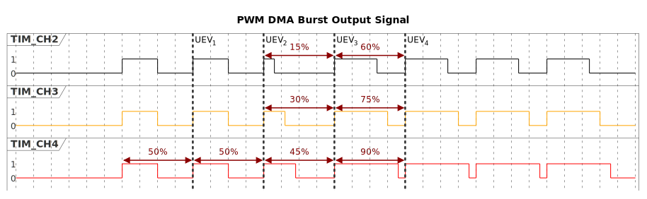

# __Example: *hal_tim_pwm_dma_burst*__

**Example version:** 2.0.0

How to configure the TIM peripheral in PWM (Pulse Width Modulation) mode using DMA burst to change duty cycle.
The PWM waveforms generated by the timer channels can be displayed using an oscilloscope.

## __1. Detailed scenario__

This scenario demonstrates how to configure a timer to generate PWM signal using DMA burst to change duty cycle.

__Initialization phase__: At main program start, the `mx_system_init()` function is called. It initializes the peripherals, nonvolatile memory (such as flash memory, NVM, or external memories), MPU regions (if applicable), the system clock, and the SysTick.

The application executes the following __example steps__:

__Step 1__: Initializes the DMA, the timer's input clock, counter clock, output clock. Sets the output channel duty cycles, and the GPIO pins.

__Step 2__: Starts the timer PWM generation with a default signal of 122 Hz and 50% duty cycle for 2 periods considering the CCRx preload. Then, the PWM signal's duty cycle is updated via DMA burst as follows: on the first update, 15% is applied to channel 2, 30% is applied to channel 3, and 45% is applied to channel 4; on the second update, 60% is applied to channel 2, 75% is applied to channel 3, and 90% is applied to channel 4.

__End of example__: If no error occurs, the PWM signal is generated indefinitely.

## __2. Example configuration__

### __2.1. Timer configuration__

The *TIM* is configured as follows:

- The timer channel is configured as PWM generator in up counting PWM mode 1.
- The timer prescaler is configured to set the timer counter clock to 8 MHz.

Upon an update DMA request, the DMA controller performs a sequence of three words transfers directly into the timer's registers, starting from the Capture Compare Register (CCR2). Because the DMA burst length is 3 and the number of data to transfer is 6 (in DMA), the CCRx registers will be updated twice.
With a buffer in the RAM containing data1, data2, data3, data4, data5, and data6, the data is transferred to the CCRx registers as follows:

- The data1 value `0x2666` is written into the Capture/Compare Register CCR2, setting the duty cycle for the Channel 2's to 15%.

- The data2 value `0x4CCC` is written into the Capture/Compare Register CCR3, setting the duty cycle for the Channel 2's to 30%.

- The data3 value `0x7333` is written into the Capture/Compare Register CCR4, setting the duty cycle for the Channel 2's to 45%.

On the second update DMA request:

- The data4 value `0x9999` is written into the Capture/Compare Register CCR2, setting the duty cycle for the Channel 2's to 60%.

- The data5 value `0xBFFF` is written into the Capture/Compare Register CCR3, setting the duty cycle for the Channel 2's to 75%.

- The data6 value `0xE666` is written into the Capture/Compare Register CCR4, setting the duty cycle for the Channel 2's to 90%.

Following update DMA requests will have no effect.

This DMA burst mechanism ensures synchronized and efficient updates of the timer's duty cycle on every update event, minimizing CPU intervention and enabling precise PWM signal modulation.

    The TIM Frequency = TIM counter clock / (ARR + 1)
                      = 8 MHz / 65535 = 122 Hz

The timer's capture/compare channel is used to define the PWM duty cycle. It is configured by setting the timer's Capture Compare Register (CCR).
To set the channel's PWM duty cycle to 15%:

    duty_cycle_percent = (CCR / (ARR + 1)) * 100
    CCR = (duty_cyle_percent * (ARR + 1)) / 100
        = (15 / 100) * 65535 = 9830.25
        = 9830 (integer rounded down to fit into the register)

To set the channel's PWM duty cycle to 30%:

    CCR = (duty_cyle_percent * (ARR + 1)) / 100
        = (30 / 100) * 65535 = 19660.5
        = 19660 (integer rounded down to fit into the register)

To set the channel's PWM duty cycle to 45%:

    CCR = (duty_cyle_percent * (ARR + 1)) / 100
        = (45 / 100) * 65535 = 29490.75
        = 29490 (integer rounded down to fit into the register)

To set the channel's PWM duty cycle to 60%:

    CCR = (duty_cyle_percent * (ARR + 1)) / 100
        = (60 / 100) * 65535 = 39321
        = 29490 (integer rounded down to fit into the register)

To set the channel's PWM duty cycle to 75%:

    CCR = (duty_cyle_percent * (ARR + 1)) / 100
        = (75 / 100) * 65535 = 49151.25
        = 49151 (integer rounded down to fit into the register)

To set the channel's PWM duty cycle to 90%:

    CCR = (duty_cyle_percent * (ARR + 1)) / 100
        = (90 / 100) * 65535 = 58981.5
        = 58981 (integer rounded down to fit into the register)

Note that the timer configuration depends on the timer peripheral input clock, which is derived from the system clock tree.
So, it is required to define the system clock configuration and to determine the timer input clock before defining the timer configuration.

The system clock configuration is specific to each STM32 MCU (see section [Hardware environment and setup](#3-hardware-environment-and-setup)).

The DMA is configured to transfer data from the memory to the TIM registers upon TIM request. The data is stored in a buffer containing 6 data, and the DMA operates in normal mode.
The DMA burst is configured with the following parameters:

- Destination address: Base address of the Capture/Compare Register CCR2 in the timer peripheral, marking the starting point for the burst transfer.

- Source: Update event trigger (UPD), which initiates the DMA burst transfer upon a timer update event.

- Transfer length: 3 words transfers, corresponding to consecutive writes into the Capture/Compare Register 2 (CCR2), Capture/Compare Register 3 (CCR3) and Capture/Compare Register 4 (CCR4).

This configuration allows the DMA controller to efficiently update multiple timer registers in a single burst transaction triggered by the timer's update event, ensuring synchronized and low-latency updates of the PWM duty cycle.

UEV_1:

- First DMA burst transfer, CCRx preload values (data1, data2, data3) will be loaded in the active register at the next update event.

UEV_2:

- CCRx preload values (data1, data2, data3) are loaded in the active register.
- Second DMA burst transfer, CCRx preload values (data4, data5, data6) will be loaded in the active register at the next update event.

UEV_3:

- CCRx preload values (data4, data5, data6) are loaded in the active register.
- No more DMA burst transfer, so same duty cycles for CCRx endlessly.

UEV_4:

- No more changes.

### __2.2. GPIO configuration__

One pin must be configured, for PWM signal: [see the specific boards setups](#32-specific-board-setups)

The GPIO pins are configured in:

- Alternate function as a timer output channel of its respective timer instance.
- Push-pull mode with no pull-up or pull-down resistors activated.

## __3. Hardware environment and setup__

### __3.1. Generic Setup__

The PWM signals generated by the timer channels can be displayed by connecting an oscilloscope to the corresponding board connectors.

### __3.2. Specific board setups__

  
On STM32C5 series.

  

    
Common configuration.

  Timer's counter clock configuration with prescalers and APB prescalers set to 1:

  - The AHB clock (HCLK) and system core clock are set to system clock (SYSCLK).
  - The timer's internal input clock (tim_ker_ck) is set to its respective APB clock (PCLK).

      tim_ker_ck = PCLK = HCLK = SYSCLK (system clock)

      So, tim_ker_ck = HCLK in Hz

  To obtain the timer's counter clock frequency (tim_cnt_ck), the timer prescaler register (TIM_PSC) is computed as follows:

      TIM_PSC = (HCLK / tim_cnt_ck ) - 1

  Standard STM32C5xx MCUs' peripheral clocks diagram:
    <!--
@startuml
@startditaa{doc/stm32c5_peripherals_clocks.png}
  +---------+
  | clock   |
  | source  |
  | control |
  +---+-----+
  |
  ++-\
--+  |
  |  |
  |  |
--+  |           +---------------+        +--------------+
  |  |  SYSCLCK  |  AHB          |  HCLK  |  APBx        |  PCLKx
  |  +-----------+  PRESC        +----+---+  PRESC       +--------------------------------
--+  |           |  / 1,2,...512 |    |   | / 1,2,4,8,16 |          To APBx peripherals
  |  |           +---------------+    |   +--------------+
  |  |                                |
--+  |                                +---------------------------------------------------
  |  |                                                                          To TIMx
  +--/
@endditaa
@enduml
-->
  

In this configuration:

- The HCLK is set to 144MHz.
- The timer counter clock is set to 8 MHz.

To obtain a timer counter clock at 8 MHz with the APB prescaler set to 1 and the HCLK set to 144MHz, the timer prescaler must be:

      timer_prescaler = (144 MHz / 8 MHz) - 1 = 17

- At startup, the timer is configured to generate a PWM signal with a default frequency of 122 Hz and a duty cycle of 50%. These initial values are set before the DMA burst updates the duty cycle to new values.

The timer channel rising edge can be use as trigger for oscilloscope capture in order to see the first periods and duty cycle changes.

  

  

    
On board NUCLEO-C542RC.

  |  MCU pin  |  Signal name  |  User Label   |
  |:---------:|:-------------:|:-------------:|
  |    PA5    |     GPIO      | MX_STATUS_LED |
  |    PH0    |  RCC_OSC_IN   |    OSC_IN     |
  |    PH1    |  RCC_OSC_OUT  |    OSC_OUT    |
  |    PA9    |   TIM1_CH2    |      PA9      |
  |   PA10    |   TIM1_CH3    |     PA10      |
  |   PA11    |   TIM1_CH4    |   USB_FS_N    |

  The selected timer is TIM1, with:

  - TIM1_CH2 for channel 2
  - TIM1_CH3 for channel 3
  - TIM1_CH4 for channel 4

  

  

    
On board NUCLEO-C562RE.

  |  MCU pin  |  Signal name  |  User Label   |
  |:---------:|:-------------:|:-------------:|
  |    PA5    |     GPIO      | MX_STATUS_LED |
  |    PH0    |  RCC_OSC_IN   |    OSC_IN     |
  |    PH1    |  RCC_OSC_OUT  |    OSC_OUT    |
  |    PA9    |   TIM1_CH2    |      PA9      |
  |   PA10    |   TIM1_CH3    |     PA10      |
  |   PA11    |   TIM1_CH4    |   USB_FS_N    |

  The selected timer is TIM1, with:

  - TIM1_CH2 for channel 2
  - TIM1_CH3 for channel 3
  - TIM1_CH4 for channel 4

  

  

    
On board NUCLEO-C5A3ZG.

  |  MCU pin  |  Signal name  |  User Label   |
  |:---------:|:-------------:|:-------------:|
  |    PA5    |     GPIO      | MX_STATUS_LED |
  |    PH0    |  RCC_OSC_IN   |  PH0_OSC_IN   |
  |    PH1    |  RCC_OSC_OUT  |  PH1_OSC_OUT  |
  |    PA9    |   TIM1_CH2    |      PA9      |
  |   PA10    |   TIM1_CH3    |     PA10      |
  |   PA11    |   TIM1_CH4    |   USB_FS_N    |

  The selected timer is TIM1, with:

  - TIM1_CH2 for channel 2
  - TIM1_CH3 for channel 3
  - TIM1_CH4 for channel 4

  

## __4. Troubleshooting__

Here are the points of attention for this specific example:

__System clock__: The timer clock depends on the system clock configuration. Changing the CPU clock or the peripheral bus' clock affects the PWM frequency and duty cycle.

## __5. See Also__

You can also refer to this other example for more timer calculation details:

- hal_tim_pwm_output: demonstrates how to use the TIM peripheral to generate a PWM signal.

This [General-purpose timer cookbook for STM32 microcontrollers (ref. AN4776)](https://www.st.com/content/ccc/resource/technical/document/application_note/group0/91/01/84/3f/7c/67/41/3f/DM00236305/files/DM00236305.pdf/jcr:content/translations/en.DM00236305.pdf) provides a simple and clear description of the basic features and operating modes of the STM32 general-purpose timer peripherals.

This [STM32 cross-series timer overview (ref. AN4013)](https://www.st.com/content/ccc/resource/technical/document/application_note/54/0f/67/eb/47/34/45/40/DM00042534.pdf/files/DM00042534.pdf/jcr:content/translations/en.DM00042534.pdf) presents an overview of the timer peripherals for the STM32 product series.

More information about the STM32Cube Drivers can be found in the drivers' user manual of the STM32 series you are using.

More information about the STM32 ecosystem can be found in the [STM32 MCU Developer Zone](https://www.st.com/content/st_com/en/stm32-mcu-developer-zone/embedded-software.html).

## __6. License__

Copyright (c) 2026 STMicroelectronics.

This software is licensed under terms that can be found in the LICENSE file in the root directory
of this software component.
If no LICENSE file comes with this software, it is provided AS-IS.
