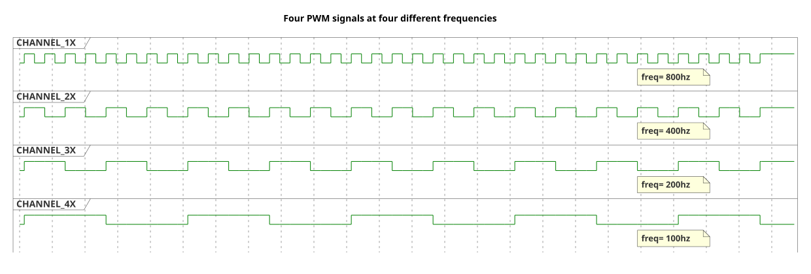
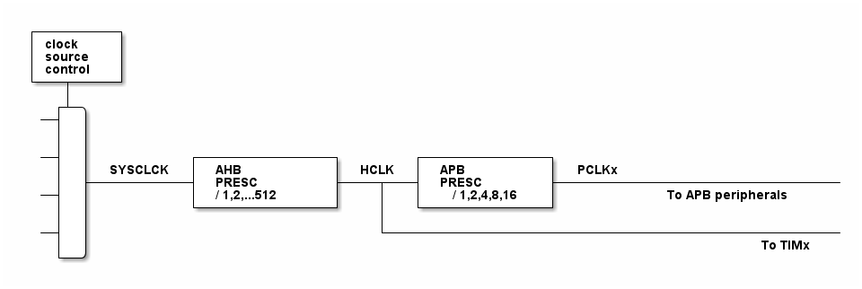

# __Example: *hal_tim_single_instance_multi_out_freq*__

**Example version:** 2.0.0

## __1. Detailed scenario__

This scenario demonstrates how to configure one timer instance to generate four output signals on four channels, with different frequencies.

__Initialization phase__: At main program start, the `mx_system_init()` function is called. It initializes the peripherals, nonvolatile memory (such as flash memory, NVM, or external memories), MPU regions (if applicable), the system clock, and the SysTick.

The application executes the following __example steps__:

__Step 1__: Initializes the timer clock, counter base, four output compare channels, and the GPIO pins.

__Step 2__: Starts the four output compare channels in interrupt mode, then starts the timer counter.

__End of example__: If no error occurs, four continuous output waveforms are generated indefinitely at different frequencies.

## __2. Example configuration__

### __2.1. Timer configuration:__

The *TIM* is configured as follows:

- The four channels of one timer instance are configured in Output Compare Toggle mode.
- The timer prescaler is configured to set the timer counter clock to 1 MHz.
- The timer period (ARR) is configured to 0xFFFF.
- Each channel frequency is defined by a compare increment value (initial compare step):
  - CCR1 increment = 625  for 800 Hz output
  - CCR2 increment = 1250 for 400 Hz output
  - CCR3 increment = 2500 for 200 Hz output
  - CCR4 increment = 5000 for 100 Hz output
- These values are not fixed absolute compare timestamps. In the compare callback, the next compare value is re-scheduled each time by adding the corresponding increment to the current compare value (with wrap-around at ARR).
- The resulting output waveforms are square waves (50% duty cycle), which is intrinsic to toggle mode.

 _Note that:_

  - The timer configuration depends on the timer peripheral input clock, which is derived from the system clock tree.
  - In Output Compare Toggle mode, compare values and compare increments must remain consistent with the configured ARR to guarantee periodic toggling.
  - The frequency is set by the timer counter clock and the compare increment value used for each channel.

So, it is required to define the system clock configuration and determine the timer counter clock before defining the output frequencies.

The system clock configuration is specific to each STM32 MCU (see section [Hardware environment and setup](#3-hardware-environment-and-setup)).

#### __2.1.1. Output Compare Toggle frequency configuration:__

In this example, Output Compare Toggle mode uses a per-channel compare increment value (CCR) to set the output frequency.

For each channel, the compare register is continuously updated as follows:

  CCR_next = (CCR_current + CCR_increment) mod ARR

The output signal toggles each time the counter reaches the programmed compare value. Since one full square-wave period requires two toggles:

  Output period = 2 * CCR * tim_cnt_ck period

  Output frequency = tim_cnt_ck frequency / (2 * CCR)

Output compare toggle timing diagram:

PUML source illustrating the dynamic compare update behavior:

- [Dynamic compare update timing source](internal/single_instance_multi_out_freq_ccr_update_diagram.puml)

  
Numerical calculations:

    The timer's counter clock is set to 1MHz (see prescaler computation in section [Hardware environment and setup](#3-hardware-environment-and-setup))
    With tim_cnt_ck = 1MHz:

      f(CH1X) = 1MHz / (2 * 625)  = 800 Hz
      f(CH2X) = 1MHz / (2 * 1250) = 400 Hz
      f(CH3X) = 1MHz / (2 * 2500) = 200 Hz
      f(CH4X) = 1MHz / (2 * 5000) = 100 Hz

    The configured timer period is ARR = 0xFFFF, which is compatible with these compare increments.

 _Note that:_

  - _A counter counts clock cycles from 0 to the ARR value, so (ARR + 1) clock cycles are counted._
  - _A Prescaler register allows to divide a clock like tim_cnt_ck by 1 to 65536 but can only have values from 0 to 65535. So, when the TIM_PSC register value is N, the clock is divided by N + 1._

## __3. Hardware environment and setup__

### __3.1. Generic Setup__

The PWM signals generated by the timer channels can be displayed by connecting an oscilloscope to the corresponding board connectors.

### __3.2. Specific board setups__

This section focuses on the clock settings, which are critical to obtain the expected output frequencies in compare toggle mode.

  
On STM32C5 series.

  

    
Common configuration.

  Timer's counter clock configuration with prescalers and APB prescalers set to 1:

  - The AHB clock (HCLK) and system core clock are set to system clock (SYSCLK).
  - The timer's internal input clock (tim_ker_ck) is set to its respective APB clock (PCLK).

      tim_ker_ck = PCLK = HCLK = SYSCLK (system clock)

      So, tim_ker_ck = HCLK in Hz

  To obtain the timer's counter clock frequency (tim_cnt_ck), the timer prescaler register (TIM_PSC) is computed as follows:

      TIM_PSC = (HCLK / tim_cnt_ck ) - 1
<!--
@startuml
@startditaa{doc/stm32c5_peripherals_clocks.png}
  +---------+
  | clock   |
  | source  |
  | control |
  +---+-----+
  |
 ++-\
--+  |
  |  |
  |  |
--+  |           +---------------+        +--------------+
  |  |  SYSCLCK  |  AHB          |  HCLK  |  APBx        |  PCLKx
  |  +-----------+  PRESC        +----+---+  PRESC       +--------------------------------
--+  |           |  / 1,2,...512 |    |   | / 1,2,4,8,16 |          To APBx peripherals
  |  |           +---------------+    |   +--------------+
  |  |                                |
--+  |                                +---------------------------------------------------
  |  |                                                                          To TIMx
  +--/
@endditaa
@enduml
-->
  

In this configuration:

- The HCLK is set to 144MHz.
- The timer counter clock is set to 1 MHz.

To obtain a timer counter clock at 1MHz with the APB prescaler set to 1 and the HCLK set to 144MHz, the timer prescaler must be:

      timer_prescaler = (144 MHz / 1 MHz) - 1 = 143

  

  

    
On board NUCLEO-C542RC.

  |  MCU pin  |  Signal name  |  User Label   |
  |:---------:|:-------------:|:-------------:|
  |    PA5    |     GPIO      | MX_STATUS_LED |
  |    PH0    |  RCC_OSC_IN   |    OSC_IN     |
  |    PH1    |  RCC_OSC_OUT  |    OSC_OUT    |
  |    PA8    |   TIM1_CH1    |     PA8       |
  |    PA9    |   TIM1_CH2    |     PA9       |
  |   PA10    |   TIM1_CH3    |     PA10      |
  |   PA11    |   TIM1_CH4    |   USB_FS_N    |

  The selected timer is TIM1, with:

  - TIM1_CH1 for channel 1X
  - TIM1_CH2 for channel 2X
  - TIM1_CH3 for channel 3X
  - TIM1_CH4 for channel 4X

  

  

    
On board NUCLEO-C562RE.

  |  MCU pin  |  Signal name  |  User Label   |
  |:---------:|:-------------:|:-------------:|
  |    PA5    |     GPIO      | MX_STATUS_LED |
  |    PH0    |  RCC_OSC_IN   |    OSC_IN     |
  |    PH1    |  RCC_OSC_OUT  |    OSC_OUT    |
  |    PA8    |   TIM1_CH1    |     PA8       |
  |    PA9    |   TIM1_CH2    |     PA9       |
  |   PA10    |   TIM1_CH3    |     PA10      |
  |   PA11    |   TIM1_CH4    |   USB_FS_N    |

  The selected timer is TIM1, with:

  - TIM1_CH1 for channel 1X
  - TIM1_CH2 for channel 2X
  - TIM1_CH3 for channel 3X
  - TIM1_CH4 for channel 4X

  

  

    
On board NUCLEO-C5A3ZG.

  |  MCU pin  |  Signal name  |  User Label   |
  |:---------:|:-------------:|:-------------:|
  |    PA5    |     GPIO      | MX_STATUS_LED |
  |    PH0    |  RCC_OSC_IN   |  PH0_OSC_IN   |
  |    PH1    |  RCC_OSC_OUT  |  PH1_OSC_OUT  |
  |    PA8    |   TIM1_CH1    |     PA8       |
  |    PA9    |   TIM1_CH2    |     PA9       |
  |   PA10    |   TIM1_CH3    |     PA10      |
  |   PA11    |   TIM1_CH4    |   USB_FS_N    |

  The selected timer is TIM1, with:

  - TIM1_CH1 for channel 1X
  - TIM1_CH2 for channel 2X
  - TIM1_CH3 for channel 3X
  - TIM1_CH4 for channel 4X

  

## __4. Troubleshooting__

Here are the points of attention for this specific example:

- The timer clock depends on the clock configuration. Changing the CPU clock or peripheral bus clock affects all four output frequencies.

## __5. See Also__

You can also refer to this other example for more timer calculation details:

- hal_tim_pwm_output: demonstrates how to use the TIM peripheral to generate a PWM signal.

This [General-purpose timer cookbook for STM32 microcontrollers (ref. AN4776)](https://www.st.com/content/ccc/resource/technical/document/application_note/group0/91/01/84/3f/7c/67/41/3f/DM00236305/files/DM00236305.pdf/jcr:content/translations/en.DM00236305.pdf) provides a simple and clear description of the basic features and operating modes of the STM32 general-purpose timer peripherals.

This [STM32 cross-series timer overview (ref. AN4013)](https://www.st.com/content/ccc/resource/technical/document/application_note/54/0f/67/eb/47/34/45/40/DM00042534.pdf/files/DM00042534.pdf/jcr:content/translations/en.DM00042534.pdf) present an overview of the timer peripherals for the STM32 product series.

More information about the STM32 Cube Drivers can be found in the drivers' user manual of the STM32 series you are using.

For instance for the STM32C5 series: [HAL documentation](https://dev.st.com/stm32cube-docs/stm32c5xx-hal-drivers/latest/en/index.html).

More information about the STM32 ecosystem can be found in the [STM32 MCU Developer Zone](https://www.st.com/content/st_com/en/stm32-mcu-developer-zone/embedded-software.html).

## __6. License__

Copyright (c) 2026 STMicroelectronics.

This software is licensed under terms that can be found in the LICENSE file in the root directory
of this software component.
If no LICENSE file comes with this software, it is provided AS-IS.
