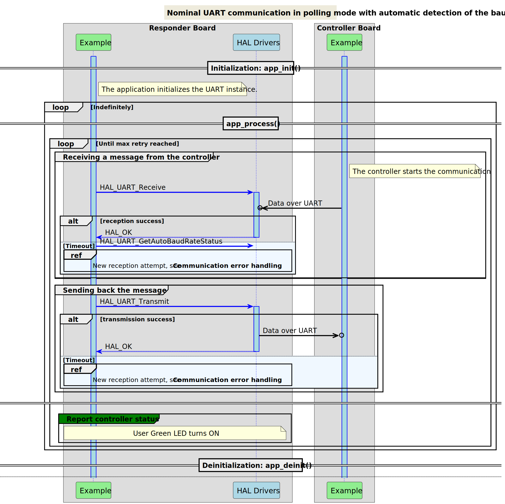

# __Example: *hal_uart_auto_baud_detect*__

**Example version:** 2.0.0

The communication consists of an infinite number of receive-transmit transactions of changing message,
the scenario includes a detection of the auto baud rate after receiving the data.

## __1. Detailed scenario__

__Initialization phase__: At main program start, the `mx_system_init()` function is called. It initializes the peripherals, nonvolatile memory (such as flash memory, NVM, or external memories), MPU regions (if applicable), the system clock, and the SysTick.

The application executes the following __example steps__:

__Step 1__: Configures and initializes the UART instance.
            Enables the auto baud rate feature of the UART

__Step 2__: The responder expects to receive a message as a null-terminated string from the controller board, in polling mode. A counter of attempts is reset when initiating the communication loop.

__Step 3__: Verifies that the auto baud rate detection status completed successfully.

__Step 4__: The responder sends back the received message in polling mode.
            Returns to step 2 indefinitely if no error occurs.

The communication status is reported via the status LED and the variable ExecStatus.

__End of example__: if no error occurs, the data is transferred infinitely between the controller and the responder. If the maximum number of attempts is reached, the data transfer is stopped by reporting an error status.

The following **message sequence chart** is used to describe the UART communication behavior of the responder board with detection of the Baud rate.

## __2. Example configuration__

The example demonstrates the following peripheral:

__UART__:

We select an UART with accessible Tx and Rx signals on the board so that we can wire it to the controller board.

The UART is configured with the following settings:

- The baud rate is set to 115200.
- The word length is set to 8 bits.
- Stop bits are set to 1 bit.
- Parity is set to NONE.

<!--
@startuml
@startditaa{doc/ASCII_data_frame.png} -E -S

    The UART data frame of the current configuration:

      /--------------------------------------\
      |  /------+-----------------+-------\  |
      |  |  SB  |   8 bits data   |  STB  |  |
      |  \------+-----------------+-------/  |
      \--------------------------------------/

      /---------------\
      | SB:  Start Bit|
      | STB: Stop Bit |
      \=--------------/
@endditaa
@enduml
-->

__AUTO_BAUD_RATE_DETECTION__:

In this example, we configure the auto_baud_rate_mode to HAL_UART_AUTO_BAUD_RATE_ON_START_BIT to use the auto baud rate detection mode based on the start bit. However, this setting can be adjusted to other available modes as needed.
There are four modes of the auto baud rate detection:

- Mode 0: Auto Baud Rate detection on start bit.
- Mode 1: Auto Baud Rate detection on falling edge.
- Mode 2: Auto Baud Rate detection on 0x7F frame detection.
- Mode 3: Auto Baud Rate detection on 0x55 frame detection.

It's important to note that the auto baud rate feature is not supported for LPUART instances.

## __3. Hardware environment and setup__

### __3.1. Generic Setup__

This section describes the hardware setup principles that apply to any board.

<!--
@startuml
@startditaa{doc/ASCII_uart_two_boards.png} -E -S
    /-------------------------\                     /-------------------------\
    |          /--------------+                     +--------------\          |
    |          | STM32 USARTi |                     | STM32 USARTi |          |
    |          |              |                     |              |          |
    |          |    USARTi_TX *---------------------* USARTi_RX    |          |
    |          |              |                     |              |          |
    |          |              |                     |              |          |
    |          |              |                     |              |          |
    |          |    USARTi_RX *---------------------* USARTi_TX    |          |
    |          |              |                     |              |          |
    |          \--------------+                     +--------------/          |
    |                         |                     |                         |
    |                     GND *---------------------* GND                     |
    |                         |                     |                         |
    |  /------------------\   |                     |  /-----------------\    |
    |  | STM32 Responder  |   |                     |  | STM32 Controller|    |
    |  | Board            |   |                     |  | Board           |    |
    |  \------------------/   |                     |  \-----------------/    |
    \-------------------------/                     \-------------------------/
@endditaa
@enduml
-->

### __3.2. Specific board setups__

This section describes the exact hardware configurations of your project.

<!-- YOUR BOARDS ADDED HERE BY README GENERATION -->

  
On STM32C5 series.

  

    
On board NUCLEO-C542RC.

  |  MCU pin  |  Signal name  |  User Label   |
  |:---------:|:-------------:|:-------------:|
  |    PA5    |     GPIO      | MX_STATUS_LED |
  |    PH0    |  RCC_OSC_IN   |    OSC_IN     |
  |    PH1    |  RCC_OSC_OUT  |    OSC_OUT    |
  |   PB15    |   USART1_RX   |     PB15      |
  |   PB14    |   USART1_TX   |     PB14      |

  

  

    
On board NUCLEO-C562RE.

  |  MCU pin  |  Signal name  |  User Label   |
  |:---------:|:-------------:|:-------------:|
  |    PA5    |     GPIO      | MX_STATUS_LED |
  |    PH0    |  RCC_OSC_IN   |    OSC_IN     |
  |    PH1    |  RCC_OSC_OUT  |    OSC_OUT    |
  |   PB15    |   USART1_RX   |     PB15      |
  |   PB14    |   USART1_TX   |     PB14      |

  

  

    
On board NUCLEO-C5A3ZG.

  |  MCU pin  |  Signal name  |  User Label   |
  |:---------:|:-------------:|:-------------:|
  |    PA5    |     GPIO      | MX_STATUS_LED |
  |    PH0    |  RCC_OSC_IN   |  PH0_OSC_IN   |
  |    PH1    |  RCC_OSC_OUT  |  PH1_OSC_OUT  |
  |    PD6    |   USART2_RX   |      PD6      |
  |    PD5    |   USART2_TX   |      PD5      |

  

### __3.3. Testing the Example__

This example can be tested in two different ways:

__3.3.1. Using Another STM32 Board as Controller
You can use one of the following examples to act as the controller that sends messages to the responder:

hal_uart_two_boards_com_polling_controller: The controller side in a polling mode UART communication.
hal_uart_two_boards_com_it_controller: The controller side in an interrupt mode UART communication.
hal_uart_two_boards_com_dma_controller: The controller side in a DMA mode UART communication.

## __4. Troubleshooting__

Find below the points of attention for this specific example.

__Communication Buffers__: Make sure that the size, in bytes, of the responder's reception buffer is equal to the size of the controller's transmission buffer.

## __5. See Also__

You can also refer to these examples to go further with the UART peripheral:

- hal_uart_two_boards_com_polling_controller: The controller side in a polling mode UART communication.
- hal_uart_two_boards_com_polling_responder: The responder side in a polling mode UART communication.
- hal_uart_echo_polling: retargeting of the C library input and output functions to operate on the UART peripheral.
- hal_uart_two_boards_com_it_controller: The controller side in an interrupt mode UART communication.

More information about the STM32Cube Drivers can be found in the drivers' user manual of the STM32 series you are using.

For instance for the STM32C5 series: [HAL documentation](https://dev.st.com/stm32cube-docs/stm32c5xx-hal-drivers/latest/en/index.html).

More information about the STM32 ecosystem can be found in the [STM32 MCU Developer Zone](https://www.st.com/content/st_com/en/stm32-mcu-developer-zone/embedded-software.html).

## __6. License__

Copyright (c) 2026 STMicroelectronics.

This software is licensed under terms that can be found in the LICENSE file in the root directory
of this software component.
If no LICENSE file comes with this software, it is provided AS-IS.
