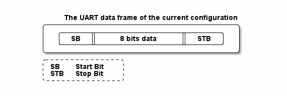

# __Example: *hal_uart_echo_polling*__

**Example version:** 2.0.0

How to re-target the C library I/O functions to UART.

## __1. Detailed scenario__

This example retargets the C library `printf` and `getchar` functions to operate on the UART peripheral.
The HAL UART transmission and reception APIs are used in polling to implement an __echo feature__ through a terminal emulator.

__Initialization phase__: At main program start, the `mx_system_init()` function is called. It initializes the peripherals, nonvolatile memory (such as flash memory, NVM, or external memories), MPU regions (if applicable), the system clock, and the SysTick.

The application executes the following __example steps__:

__Step 1__: Configures and initializes the UART instance.

__Step 2__: Receives characters from the terminal input until a new line (`\n`), a carriage return (`\r`), or a backspace character (`\b`) is detected.

__Step 3__: Echoes the received data on the terminal.
Returns to step 2 indefinitely if no error occurs.

__End of example__: As long as no error occurs, the characters received are sent back to the user through the terminal emulator.

## __2. Example configuration__

The example demonstrates the following peripheral:

__UART__:

The UART is configured with the following settings:

- The baud rate is set to 115200.
- The word length is set to 8 bits.
- Stop bits are set to 1 bit.
- Parity is set to NONE.

<!--
@startuml
@startditaa{doc/ASCII_data_frame.png}

    The UART data frame of the current configuration:

      /--------------------------------------\
      |  /------+-----------------+-------\  |
      |  |  SB  |   8 bits data   |  STB  |  |
      |  \------+-----------------+-------/  |
      \--------------------------------------/

      /---------------\
      | SB:  Start Bit|
      | STB: Stop Bit |
      \=--------------/
@endditaa
@enduml
-->

The terminal emulator must be configured accordingly.

## __3. Hardware environment and setup__

### __3.1. Generic Setup__

This section describes the hardware setup principles that apply to any board.

Select the STM32 UART instance connected to the embedded ST-LINK on your board. The ST-LINK provides a virtual COM port over USB, which is mounted on the host PC and ready for use with a terminal emulator.

<!--
@startuml
@startditaa{doc/ASCII_Board_PC.png}

STM32 board connected to the host PC.

    /--------------------------------------------------\           /----------------\
    |  /--------------\      /-------------------------+           |                |
    |  |STM32 MCU     |      |ST-LINK                  |           |                |
    |  |  /-----------+      +-----------\             |           |                |
    |  |  |USART      |      |USART      |             |           |                |
    |  |  |           |      |           |             |           |                |
    |  |  | USARTi_TX *------* USARTi_RX |   /---------+           +---------\      |
    |  |  |           |      |           |   |   USB   +-----------+   USB   |      |
    |  |  | USARTi_RX *------* USARTi_TX |   \---------+           +---------/      |
    |  |  |           |      |           |             |           |                |
    |  |  \-----------+      +-----------/             |           |                |
    |  |              |      |                         |           |                |
    |  \--------------/      \-------------------------+           |                |
    |                                                  |           |                |
    |  /-------------\                                 |           +---------\      |
    |  | STM32 Board |                                 |           | Host PC |      |
    \--+-------------+---------------------------------/           \---------+------/
@endditaa
@enduml
-->

### __3.2. Specific board setups__

This section describes the exact hardware configurations of your project.

  
On STM32C5 series.

  

    
On board NUCLEO-C542RC.

  |  MCU pin  |  Signal name  |  User Label   |
  |:---------:|:-------------:|:-------------:|
  |    PA5    |     GPIO      | MX_STATUS_LED |
  |    PH0    |  RCC_OSC_IN   |    OSC_IN     |
  |    PH1    |  RCC_OSC_OUT  |    OSC_OUT    |
  |    PA3    |   USART2_RX   |      PA3      |
  |    PA2    |   USART2_TX   |      PA2      |

  

  

    
On board NUCLEO-C562RE.

  |  MCU pin  |  Signal name  |  User Label   |
  |:---------:|:-------------:|:-------------:|
  |    PA5    |     GPIO      | MX_STATUS_LED |
  |    PH0    |  RCC_OSC_IN   |    OSC_IN     |
  |    PH1    |  RCC_OSC_OUT  |    OSC_OUT    |
  |    PA3    |   USART2_RX   |      PA3      |
  |    PA2    |   USART2_TX   |      PA2      |

  

  

    
On board NUCLEO-C5A3ZG.

  |  MCU pin  |  Signal name  |  User Label   |
  |:---------:|:-------------:|:-------------:|
  |    PA5    |     GPIO      | MX_STATUS_LED |
  |    PH0    |  RCC_OSC_IN   |  PH0_OSC_IN   |
  |    PH1    |  RCC_OSC_OUT  |  PH1_OSC_OUT  |
  |    PA3    |   USART2_RX   | DBGIN_VCP_RX  |
  |    PA2    |   USART2_TX   | DBGIN_VCP_TX  |

  

## __4. Troubleshooting__

Find below the points of attention for this specific example.

__Host PC settings__: Configure your terminal emulator with the following settings:

1. Set the UART parameters to match the required configuration.

2. Ensure the stop bits are correctly set, taking into account whether they are included in the data length.

3. Local echo enabled, so that you can see the characters you type.

4. New-line mode set to {}LF{} (Line Feed) so that the application can detect the end of line correctly.

## __5. See Also__

You can also refer to these examples and utility to go further with the UART peripheral:

- hal_uart_two_boards_com_polling_controller: the controller side in a polling mode UART communication between two boards.
- hal_uart_two_boards_com_polling_responder: the responder side in a polling mode UART communication between two boards.
- basic_stdio utility: a basic trace service (`printf`-like) to report information from STM32 devices to a terminal.

More information about the STM32Cube Drivers can be found in the drivers' user manual of the STM32 series you are using.

For instance for the STM32C5 series: [HAL documentation](https://dev.st.com/stm32cube-docs/stm32c5xx-hal-drivers/latest/en/index.html).

More information about the STM32 ecosystem can be found in the [STM32 MCU Developer Zone](https://www.st.com/content/st_com/en/stm32-mcu-developer-zone/embedded-software.html).

## __6. License__

Copyright (c) 2026 STMicroelectronics.

This software is licensed under terms that can be found in the LICENSE file in the root directory of this software component.
If no LICENSE file comes with this software, it is provided AS-IS.
