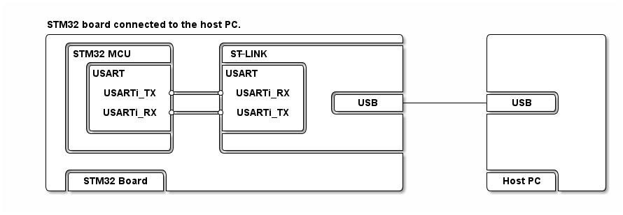

# __Example: *hal_uart_reception_to_idle_circular_dma*__

**Example version:** 2.0.0

How to receive a certain amount of data in DMA mode till either the expected number of data is received or an IDLE event occurs.

## __1. Detailed scenario__

This example demonstrates the UART transmission in polling mode and UART reception to IDLE event in circular DMA mode between a board and a serial terminal emulator PC application.

In this example, the CPU and a DMA share a buffer to manage the data.
On an STM32 device with data cache enabled, it is mandatory to ensure that the buffer is never cached, as this scenario does not include data cache maintenance operations.
To do so, we place the buffer in the `.non_cacheable_variables` memory section and apply the appropriate MPU settings during system initialization in `mx_system_init()`.

__Initialization phase__: At the beginning of the `main()` function, the `mx_system_init()` function is called to initialize the peripherals, the flash interface, the system clock, and the SysTick.

The application executes the following __example steps__:

__Step 1__: Configures and initializes the UART instance.
            Registers the user callbacks for UART interrupts: RX transfer completed and transfer error.

__Step 2__: Sends an information message to the user via the serial communication port (PC Com port).

__Step 3__: Starts continuous data reception via UART using DMA till either the expected number of data items is received or an IDLE event occurs.
            The Rx callback implementation aims to echo received characters to HyperTerminal.

__Step 4__: Waits for one of these UART interrupts: read transfer complete or transfer error.

__Step 5__: The received data are sent back on UART Tx (loopback)

The communication status is reported via the status LED and the variable ExecStatus.

__End of example__: If no error occurs, this example is repeated endlessly (step 2 to step 5 are executed in loop). If the maximum number of attempts is reached, the data transfer is stopped and an error status is reported to the main function. The `error_handler()` function is called when the maximum number of attempts is reached.

## __2. Example configuration__

The example demonstrates the following peripheral:

__UART__:

The UART is configured with the following settings:

- The baud rate is set to 115200.
- The word length is set to 8 bits.
- Stop bits are set to 1 bit.
- Parity is set to NONE.

<!--
@startuml
@startditaa{doc/ASCII_data_frame.png}

    The UART data frame of the current configuration:

      /--------------------------------------\
      |  /------+-----------------+-------\  |
      |  |  SB  |   8 bits data   |  STB  |  |
      |  \------+-----------------+-------/  |
      \--------------------------------------/

      /---------------\
      | SB:  Start Bit|
      | STB: Stop Bit |
      \=--------------/
@endditaa
@enduml
-->

The terminal emulator must be configured accordingly.

__DMA__:

The DMA peripheral is used to manage data transfers.

The DMA channel UART Rx is configured as indicated below:
The DMA receive channel is configured in peripheral to memory mode and is associated to UART RX on Circular mode. The data is loaded from the UART receive data register to an SRAM area incrementally.

For UART Rx DMA channel, the corresponding NVIC line is configured and enabled.

__IDLE Process__:

It allows the UART to receive data continuously until an IDLE line detection occurs (i.e., a pause in the data stream).
The IDLE line is detected when there is no data on the RX line for 1 frame time (the time it takes to transmit one full frame, including start, data, parity, and stop bits).
This 1 frame time duration depends on the baud rate and frame
Total bits per frame: 1 (start) + 8 (data) + 1 (stop) = 10 bits
Baud rate: 115200
so frame time = 10 / 115200 = 86.8 us

The time between keystrokes (even if you type very fast) is much longer than a single frame time.
So The UART will detect an IDLE condition after each character you type, because the gap between characters is much greater than the frame time.

## __3. Hardware environment and setup__

### __3.1. Generic Setup__

This section describes the hardware setup principles that apply to any board.

Select the STM32 UART instance connected to the embedded ST-LINK on your board. The ST-LINK provides a virtual COM port over USB, which is mounted on the host PC and ready for use with a terminal emulator.

<!--
@startuml
@startditaa{doc/ASCII_Board_PC.png}

STM32 board connected to the host PC.

    /--------------------------------------------------\           /----------------\
    |  /--------------\      /-------------------------+           |                |
    |  |STM32 MCU     |      |ST-LINK                  |           |                |
    |  |  /-----------+      +-----------\             |           |                |
    |  |  |USART      |      |USART      |             |           |                |
    |  |  |           |      |           |             |           |                |
    |  |  | USARTi_TX *------* USARTi_RX |   /---------+           +---------\      |
    |  |  |           |      |           |   |   USB   +-----------+   USB   |      |
    |  |  | USARTi_RX *------* USARTi_TX |   \---------+           +---------/      |
    |  |  |           |      |           |             |           |                |
    |  |  \-----------+      +-----------/             |           |                |
    |  |              |      |                         |           |                |
    |  \--------------/      \-------------------------+           |                |
    |                                                  |           |                |
    |  /-------------\                                 |           +---------\      |
    |  | STM32 Board |                                 |           | Host PC |      |
    \--+-------------+---------------------------------/           \---------+------/
@endditaa
@enduml
-->

### __3.2. Specific board setups__

This section describes the exact hardware configurations of your project.

  
On STM32C5 series.

  

    
On board NUCLEO-C562RE.

  |  MCU pin  |  Signal name  |  User Label   |
  |:---------:|:-------------:|:-------------:|
  |    PA5    |     GPIO      | MX_STATUS_LED |
  |    PH0    |  RCC_OSC_IN   |    OSC_IN     |
  |    PH1    |  RCC_OSC_OUT  |    OSC_OUT    |
  |    PA3    |   USART2_RX   |      PA3      |
  |    PA2    |   USART2_TX   |      PA2      |

  

## __4. Troubleshooting__

Find below the points of attention for this specific example.

__Host PC settings__: Configure your terminal emulator with the following settings:

1. Set the UART parameters to match the required configuration.

2. Ensure the stop bits are correctly set, considering whether they are included in the data length.

3. Local echo is enabled, so that you can see the characters you type.

## __5. See Also__

You can also refer to these examples and utility to go further with the UART peripheral:

- hal_uart_two_boards_com_polling_controller: the controller side in a polling mode UART communication between two boards.
- hal_uart_two_boards_com_polling_responder: the responder side in a polling mode UART communication between two boards.
- basic_stdio utility: a basic trace service (`printf`-like) to report information from STM32 devices to a terminal.

More information about the STM32Cube Drivers can be found in the drivers' user manual of the STM32 series you are using.

For instance for the STM32C5 series: [HAL documentation](https://dev.st.com/stm32cube-docs/stm32c5xx-hal-drivers/latest/en/index.html).

More information about the STM32 ecosystem can be found in the [STM32 MCU Developer Zone](https://www.st.com/content/st_com/en/stm32-mcu-developer-zone/embedded-software.html).

## __6. License__

Copyright (c) 2026 STMicroelectronics.

This software is licensed under terms that can be found in the LICENSE file in the root directory of this software component.
If no LICENSE file comes with this software, it is provided AS-IS.
