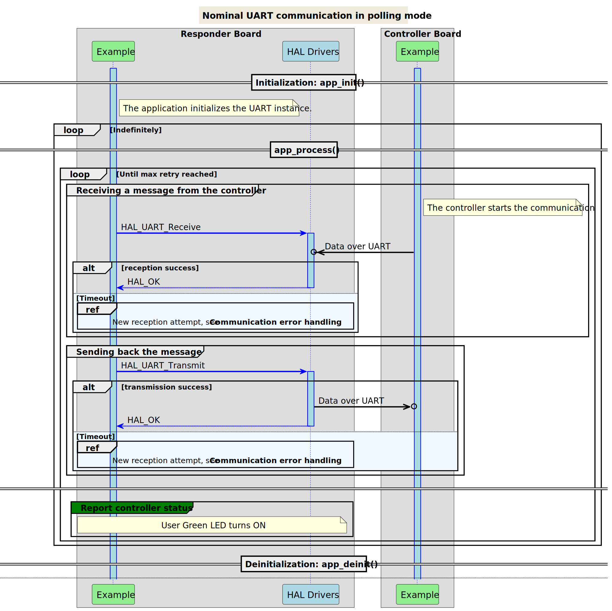
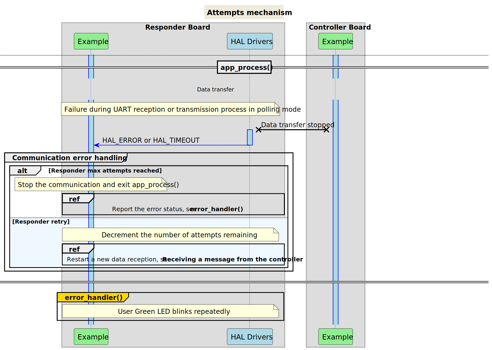
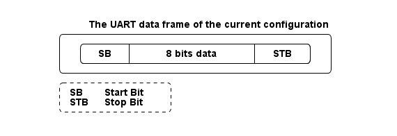
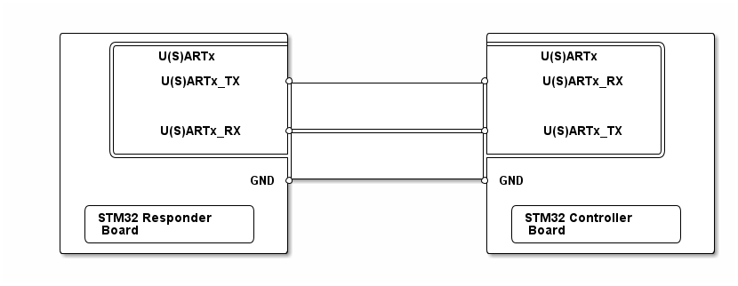

# __Example: *hal_uart_two_boards_com_polling_responder*__

**Example version:** 2.0.0

How to respond in a polling mode UART communication, driven by the controller, using the HAL API.
The scenario consists of an infinite number of receive-transmit transactions of changing messages.

## __1. Detailed scenario__

__Initialization phase__: At main program start, the `mx_system_init()` function is called. It initializes the peripherals, nonvolatile memory (such as flash memory, NVM, or external memories), MPU regions (if applicable), the system clock, and the SysTick.

The application executes the following __example steps__:

__Step 1__: The application configures and initializes the UART instance.

__Step 2__: The responder expects to receive a message from the controller board, in blocking mode, within a specific timeout period. A counter of attempts is reset at the beginning of the communication loop.

__Step 3__: The responder sends back the received message within the specified timeout period, in blocking mode. It returns to step 2 indefinitely if no error occurs.

> **_NOTE:_** when an error occurs in the reception or transmission process, the responder restarts the reception process. The error_handler() function is called when the maximum number of attempts is reached.

The communication status is reported via the status LED and the variable ExecStatus.

__End of example__: If no error occurs, the data is transferred infinitely between the controller and the responder. If the maximum number of attempts is reached, the data transfer is stopped by reporting an error status.

The following **message sequence chart** is used to describe the UART communication behavior between the controller board and the responder board.

 Expand this tab to visualize the sequence chart diagram of the communication attempts' mechanism. 

## __2. Example configuration__

The example demonstrates the following peripheral:

__UART__:

We select a UART with accessible Tx and Rx signals on the board so that we can wire it to the controller board.

The UART is configured with the following settings:

- The baud rate is set to 115200.
- The word length is set to 8 bits.
- Stop bits are set to 1 bit.
- Parity is set to NONE.

<!--
@startuml
@startditaa{doc/ASCII_data_frame.png}

    The UART data frame of the current configuration:

      /--------------------------------------\
      |  /------+-----------------+-------\  |
      |  |  SB  |   8 bits data   |  STB  |  |
      |  \------+-----------------+-------/  |
      \--------------------------------------/

      /---------------\
      | SB:  Start Bit|
      | STB: Stop Bit |
      \=--------------/
@endditaa
@enduml
-->

## __3. Hardware environment and setup__

### __3.1. Generic Setup__

This section describes the hardware setup principles that apply to any board.

<!--
@startuml
@startditaa{doc/ASCII_uart_two_boards.png}
    /-------------------------\                     /-------------------------\
    |     /-------------------+                     +-------------------\     |
    |     |    U(S)ARTx       |                     |     U(S)ARTx      |     |
    |     |                   |                     |                   |     |
    |     |    U(S)ARTx_TX    *---------------------*     U(S)ARTx_RX   |     |
    |     |                   |                     |                   |     |
    |     |                   |                     |                   |     |
    |     |                   |                     |                   |     |
    |     |    U(S)ARTx_RX    *---------------------*     U(S)ARTx_TX   |     |
    |     |                   |                     |                   |     |
    |     \-------------------+                     +-------------------/     |
    |                         |                     |                         |
    |                     GND *---------------------* GND                     |
    |                         |                     |                         |
    |  /------------------\   |                     |  /------------------\   |
    |  | STM32 Responder  |   |                     |  | STM32 Controller |   |
    |  | Board            |   |                     |  | Board            |   |
    |  \------------------/   |                     |  \------------------/   |
    \-------------------------/                     \-------------------------/
@endditaa
@enduml
-->

U(S)ART can refer to either UART or USART depending on the STM32 series being used.

### __3.2. Specific board setups__

This section describes the exact hardware configurations of your project.

<!-- YOUR BOARDS ADDED HERE BY README GENERATION -->

  
On STM32C5 series.

  

    
On board NUCLEO-C542RC.

  |  MCU pin  |  Signal name  |  User Label   |
  |:---------:|:-------------:|:-------------:|
  |    PA5    |     GPIO      | MX_STATUS_LED |
  |    PH0    |  RCC_OSC_IN   |    OSC_IN     |
  |    PH1    |  RCC_OSC_OUT  |    OSC_OUT    |
  |   PB15    |   USART1_RX   |     PB15      |
  |   PB14    |   USART1_TX   |     PB14      |

  

  

    
On board NUCLEO-C562RE.

  |  MCU pin  |  Signal name  |  User Label   |
  |:---------:|:-------------:|:-------------:|
  |    PA5    |     GPIO      | MX_STATUS_LED |
  |    PH0    |  RCC_OSC_IN   |    OSC_IN     |
  |    PH1    |  RCC_OSC_OUT  |    OSC_OUT    |
  |   PB15    |   USART1_RX   |     PB15      |
  |   PB14    |   USART1_TX   |     PB14      |

  &gt; **_NOTE:_**
    - USART1 is the UART instance used for the communication between the Nucleo boards.

  

  

    
On board NUCLEO-C5A3ZG.

  |  MCU pin  |  Signal name  |  User Label   |
  |:---------:|:-------------:|:-------------:|
  |    PA5    |     GPIO      | MX_STATUS_LED |
  |    PH0    |  RCC_OSC_IN   |  PH0_OSC_IN   |
  |    PH1    |  RCC_OSC_OUT  |  PH1_OSC_OUT  |
  |    PD6    |   USART2_RX   |      PD6      |
  |    PD5    |   USART2_TX   |      PD5      |

  

## __4. Troubleshooting__

Find below the points of attention for this specific example.

__Communication Buffers__: Make sure that the size, in bytes, of the responder's reception buffer is equal to the size of the controller's transmission buffer.

## __5. See Also__

You can also refer to these examples to go further with the UART peripheral:

- hal_uart_two_boards_com_polling_controller: The controller side in a polling mode UART communication.
- hal_uart_echo_polling: retargeting of the C library input and output functions to operate on the UART peripheral.

More information about the STM32Cube Drivers can be found in the drivers' user manual of the STM32 series you are using.

For instance for the STM32C5 series: [HAL documentation](https://dev.st.com/stm32cube-docs/stm32c5xx-hal-drivers/latest/en/index.html).

More information about the STM32 ecosystem can be found in the [STM32 MCU Developer Zone](https://www.st.com/content/st_com/en/stm32-mcu-developer-zone/embedded-software.html).

## __6. License__

Copyright (c) 2026 STMicroelectronics.

This software is licensed under terms that can be found in the LICENSE file in the root directory
of this software component.
If no LICENSE file comes with this software, it is provided AS-IS.
