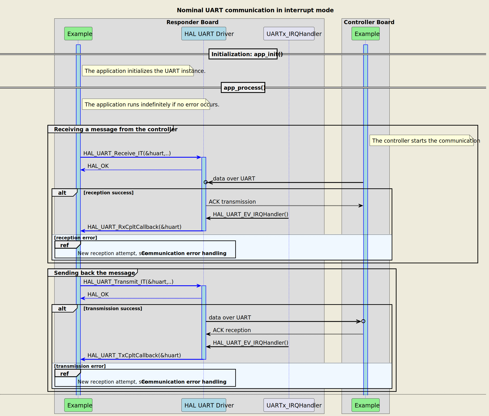
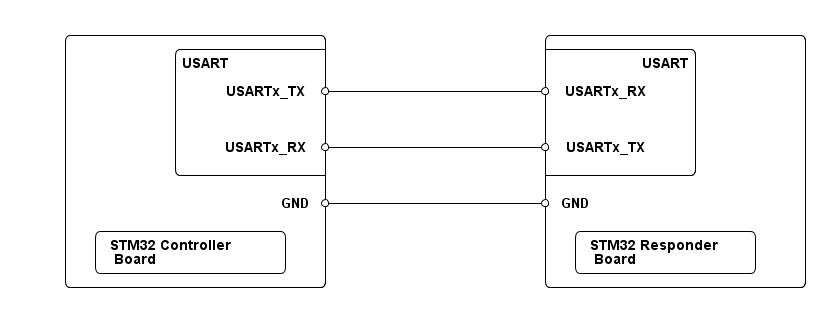

# __Example: *hal_uart_wakeup_from_stop*__

**Example version:** 2.0.0

The communication consists of an infinite number of receive-transmit transactions of changing message,
the scenario includes entering STOP mode to save power when there is no ongoing transmission or reception.

## __1. Detailed scenario__

__Initialization phase__: At main program start, the `mx_system_init()` function is called. It initializes the peripherals, nonvolatile memory (such as flash memory, NVM, or external memories), MPU regions (if applicable), the system clock, and the SysTick.

The application executes the following __example steps__:

__Step 1__: configures and initializes the UART instance and the NVIC.
            Registers the user callbacks for UART interrupts: TX/RX transfer completed and transfer error.

__Step 2__: the responder expects to receive a message as a null-terminated string from the controller board, in interrupt mode. A counter of attempts is reset when initiating the communication loop.

__Step 3__: the MCU will enter STOP mode and one or several UART interrupts will be able to wake it up.

__Step 4__: the responder sends back the received message in interrupt mode. UART communication wakes the MCU up, and the clock is re-configured.

__Step 5__: waits for one of these UART interrupts: write transfer complete or transfer error. If no transmission or reception is occurring, the MCU enters STOP mode.
            Returns to step 2 indefinitely if no error occurs.

The communication status is reported via the status LED and the variable ExecStatus.

__End of example__: if no error occurs, the data is transferred infinitely between the controller and the responder. If the maximum number of attempts is reached, the data transfer is stopped by reporting an error status.

The following **message sequence chart** is used to describe the UART communication behavior between the controller board and the responder board.

The Low Power status of the MCU can be checked via the status wakeup pin. This pin is activated to indicate the wakeup status of the MCU.
MCU turns on this LED in RUN mode and turns it off in STOP mode.

 Expand this tab to visualize the sequence chart diagram in case of a data transmission error. 

## __2. Example configuration__

The example demonstrates the following peripheral:

__UART__:

We select an UART with accessible Tx and Rx signals on the board so that we can wire it to the controller board.

The UART is configured with the following settings:

- The baud rate is set to 115200.
- The word length is set to 8 bits.
- Stop bits are set to 1 bit.
- Parity is set to NONE.

<!--
@startuml
@startditaa{doc/ASCII_data_frame.png} -E -S

    The UART data frame of the current configuration:

      /--------------------------------------\
      |  /------+-----------------+-------\  |
      |  |  SB  |   8 bits data   |  STB  |  |
      |  \------+-----------------+-------/  |
      \--------------------------------------/

      /---------------\
      | SB:  Start Bit|
      | STB: Stop Bit |
      \=--------------/
@endditaa
@enduml
-->

## __3. Hardware environment and setup__

### __3.1. Generic Setup__

This section describes the hardware setup principles that apply to any board.

<!--
@startuml
@startditaa{doc/ASCII_uart_two_boards.png} -E -S
    /-------------------------\                     /-------------------------\
    |          /--------------+                     +--------------\          |
    |          | STM32 USARTi |                     | STM32 USARTi |          |
    |          |              |                     |              |          |
    |          |    USARTi_TX *---------------------* USARTi_RX    |          |
    |          |              |                     |              |          |
    |          |              |                     |              |          |
    |          |              |                     |              |          |
    |          |    USARTi_RX *---------------------* USARTi_TX    |          |
    |          |              |                     |              |          |
    |          \--------------+                     +--------------/          |
    |                         |                     |                         |
    |                     GND *---------------------* GND                     |
    |                         |                     |                         |
    |  /------------------\   |                     |  /-----------------\    |
    |  | STM32 Responder  |   |                     |  | STM32 Controller|    |
    |  | Board            |   |                     |  | Board           |    |
    |  \------------------/   |                     |  \-----------------/    |
    \-------------------------/                     \-------------------------/
@endditaa
@enduml
-->

### __3.2. Specific board setups__

This section describes the exact hardware configurations of your project.

<!-- YOUR BOARDS ADDED HERE BY README GENERATION -->

  
On STM32C5 series.

  

    
On board NUCLEO-C542RC.

  |  MCU pin  |  Signal name  |  User Label   |
  |:---------:|:-------------:|:-------------:|
  |    PA5    |     GPIO      | MX_STATUS_LED |
  |    PH0    |  RCC_OSC_IN   |    OSC_IN     |
  |    PH1    |  RCC_OSC_OUT  |    OSC_OUT    |
  |   PB15    |   USART1_RX   |     PB15      |
  |   PB14    |   USART1_TX   |     PB14      |
  |    PB0    |     GPIO      |       -       |

  

  

    
On board NUCLEO-C562RE.

  |  MCU pin  |  Signal name  |  User Label   |
  |:---------:|:-------------:|:-------------:|
  |    PA5    |     GPIO      | MX_STATUS_LED |
  |    PH0    |  RCC_OSC_IN   |    OSC_IN     |
  |    PH1    |  RCC_OSC_OUT  |    OSC_OUT    |
  |   PB15    |   USART1_RX   |     PB15      |
  |   PB14    |   USART1_TX   |     PB14      |
  |    PB0    |     GPIO      |       -       |

  **_NOTE:_**
    - USART1 is the UART instance used for the communication between the Nucleo boards.
    - USART1 is clocked by HSIK
    - UART transmission interrupts (TX) cannot wake up the MCU from STOP mode. Only UART reception (RX) can.
    - **During UART transmission, Sleep mode is used (not Stop mode) to allow proper wake-up by UART TX interrupts, due to a hardware limitation on STM32C5.**

  

  

    
On board NUCLEO-C5A3ZG.

  |  MCU pin  |  Signal name  |  User Label   |
  |:---------:|:-------------:|:-------------:|
  |    PA5    |     GPIO      | MX_STATUS_LED |
  |    PH0    |  RCC_OSC_IN   |  PH0_OSC_IN   |
  |    PH1    |  RCC_OSC_OUT  |  PH1_OSC_OUT  |
  |    PD6    |   USART2_RX   |      PD6      |
  |    PD5    |   USART2_TX   |      PD5      |
  |    PB0    |     GPIO      |       -       |

  

### __3.3. Testing the Example__

This example can be tested in two different ways:

__3.3.1. Using Another STM32 Board as Controller
You can use one of the following examples to act as the controller that sends messages to wake up the responder:

hal_uart_two_boards_com_polling_controller: The controller side in a polling mode UART communication.
hal_uart_two_boards_com_it_controller: The controller side in an interrupt mode UART communication.
hal_uart_two_boards_com_dma_controller: The controller side in a DMA mode UART communication.
These examples will send UART messages to the responder, which will wake up from STOP mode upon receiving these messages.

__3.3.2. Using a Terminal on a PC**
Alternatively, you can test this example by connecting the STM32 board to a PC via the STLink UART interface.
To do this, you need to change the UART pins from USART2 (PD6 and PD5) to USART1 (PA9 and PA10), which are connected to the STLink.
This allows you to send UART messages from a terminal on the PC to wake up the responder.

## __4. Troubleshooting__

Find below the points of attention for this specific example.

__Communication Buffers__: Make sure that the size, in bytes, of the responder's reception buffer is equal to the size of the controller's transmission buffer.
__System Clock__: When exiting from Stop mode, the system clock must be configured (see the RCC peripheral section in the reference manual of your MCU).

## __5. See Also__

You can also refer to these examples to go further with the UART peripheral:

- hal_uart_two_boards_com_polling_controller: The controller side in a polling mode UART communication.
- hal_uart_two_boards_com_polling_responder: The responder side in a polling mode UART communication.
- hal_uart_echo_polling: retargeting of the C library input and output functions to operate on the UART peripheral.
- hal_uart_two_boards_com_it_controller: The controller side in an interrupt mode UART communication.

More information about the STM32Cube Drivers can be found in the drivers' user manual of the STM32 series you are using.

More information about the STM32 ecosystem can be found in the [STM32 MCU Developer Zone](https://www.st.com/content/st_com/en/stm32-mcu-developer-zone/embedded-software.html).

## __6. License__

Copyright (c) 2026 STMicroelectronics.

This software is licensed under terms that can be found in the LICENSE file in the root directory
of this software component.
If no LICENSE file comes with this software, it is provided AS-IS.
