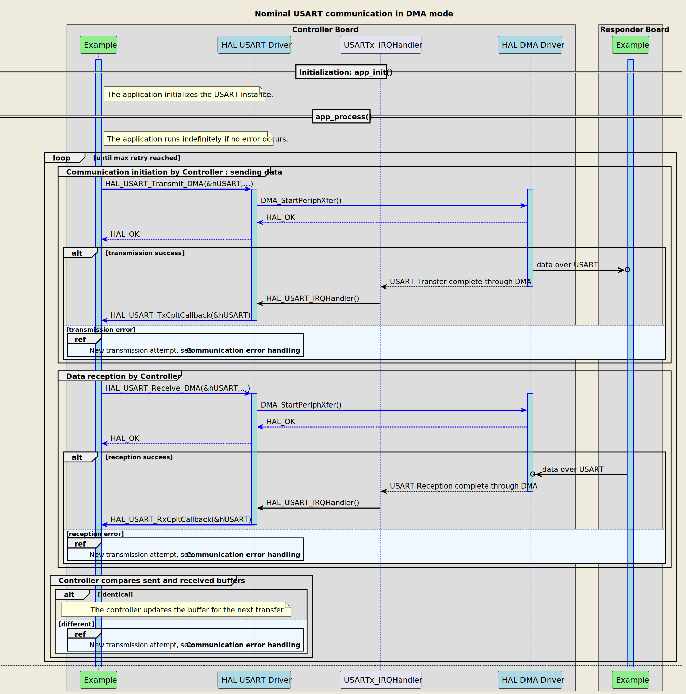
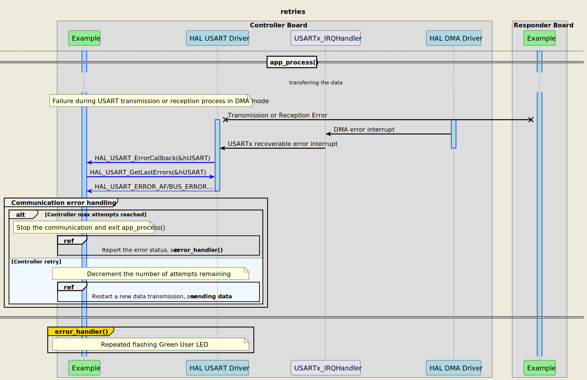
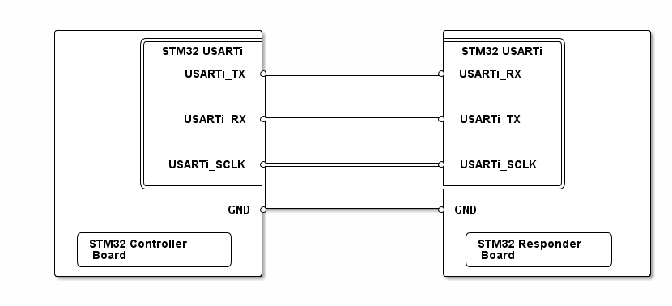

# __Example: *hal_usart_two_boards_com_dma_controller*__

**Example version:** 2.0.0

How to handle an infinite number of transmit-receive transactions between two boards based on the USART-bus protocol with the HAL API, in DMA mode.

The example implements the controller's code.

## __1. Detailed scenario__

__Initialization phase__: At main program start, the `mx_system_init()` function is called. It initializes the peripherals, nonvolatile memory (such as flash memory, NVM, or external memories), MPU regions (if applicable), the system clock, and the SysTick.

The application executes the following __example steps__:

__Step 1__: configures and initializes the USART instance.
            Registers the user callbacks for USART interrupts: TX/RX transfer completed and transfer error.

__Step 2__: The controller starts the communication, in DMA mode, by sending a message to the responder. A counter of attempts is reset when initiating the communication loop.

__Step 3__: waits for one of these USART interrupts: write transfer complete or transfer error.

__Step 4__: The controller expects to receive the message back in DMA mode.

__Step 5__: waits for one of these USART interrupts: read transfer complete or transfer error.

__Step 6__: The controller checks that the sent and received buffers match.
            Returns to step 2 indefinitely if no error occurs.

If the data transmit or receive operation fails or the exchanged buffers are different, the controller restarts the communication by sending again the same message. The `error_handler()` function is called when the maximum number of attempts is reached.

The communication status is reported via the status LED and the variable ExecStatus.

__End of example__: If no error occurs, the data is transferred infinitely between the controller and the responder. If the maximum number of attempts is reached, the data transfer is stopped and an error status is reported to the main function.

The following **message sequence chart** is used to describe the USART communication behavior between the controller board and the responder board.

 Expand this tab to visualize the sequence chart diagram in case of a data transmission error. 

## __2. Example configuration__

The example demonstrates the following peripheral:

__USART__:

We select a USART with accessible TX, RX, and SCLK signals on the board so that we can wire it to the responder board.

The USART is configured with the following settings:

- The baud rate is set to 115200.
- The word length is set to 8 bits.
- Stop bits are set to 1 bit.
- Parity is set to NONE.
- Clock polarity is set to LOW.
- Clock phase is set to 1 EDGE.
- Clock last bit is ENABLED.
- Mode is set to MASTER.

__DMA__: is used to manage data transfers.

- Two DMA channels USART Tx and USART Rx are enabled and configured, respectively, as indicated below:
  - The DMA transmit channel is configured in memory to peripheral mode with an incremented source address and a fixed destination address.
    After each byte transfer, the DMA automatically increments the source address to copy the next byte from an SRAM area to the USART transmit data register.
  - The DMA receive channel is configured in peripheral to memory mode with a fixed source address and an incremented destination address.
    The data is loaded from the USART receive data register to an SRAM area incrementally.
- For each DMA channel (USART Tx and Rx), the corresponding NVIC line is configured and enabled.

## __3. Hardware environment and setup__

### __3.1. Generic Setup__

This section describes the hardware setup principles that apply to any board.

<!--
@startuml
@startditaa{doc/ASCII_usart_two_boards.png}
    /-------------------------\                     /-------------------------\
    |          /--------------+                     +--------------\          |
    |          | STM32 USARTi |                     | STM32 USARTi |          |
    |          |              |                     |              |          |
    |          |    USARTi_TX *---------------------* USARTi_RX    |          |
    |          |              |                     |              |          |
    |          |              |                     |              |          |
    |          |              |                     |              |          |
    |          |    USARTi_RX *---------------------* USARTi_TX    |          |
    |          |              |                     |              |          |
    |          |              |                     |              |          |
    |          |              |                     |              |          |
    |          |  USARTi_SCLK *---------------------* USARTi_SCLK  |          |
    |          |              |                     |              |          |
    |          \--------------+                     +--------------/          |
    |                         |                     |                         |
    |                     GND *---------------------* GND                     |
    |                         |                     |                         |
    |  /------------------\   |                     |  /-----------------\    |
    |  | STM32 Controller |   |                     |  | STM32 Responder |    |
    |  | Board            |   |                     |  | Board           |    |
    |  \------------------/   |                     |  \-----------------/    |
    \-------------------------/                     \-------------------------/
@endditaa
@enduml
-->

### __3.2. Specific board setups__

This section describes the exact hardware configurations of your project.

<!-- YOUR BOARDS ADDED HERE BY README GENERATION -->

  
On STM32C5 series.

  

    
On board NUCLEO-C542RC.

  |  MCU pin  |  Signal name  |  User Label   |
  |:---------:|:-------------:|:-------------:|
  |    PA5    |     GPIO      | MX_STATUS_LED |
  |    PH0    |  RCC_OSC_IN   |    OSC_IN     |
  |    PH1    |  RCC_OSC_OUT  |    OSC_OUT    |
  |   PC12    |   USART2_CK   |     PC12      |
  |   PC11    |   USART2_RX   |     PC11      |
  |   PC10    |   USART2_TX   |     PC10      |

  

  

    
On board NUCLEO-C562RE.

  |  MCU pin  |  Signal name  |  User Label   |
  |:---------:|:-------------:|:-------------:|
  |    PA5    |     GPIO      | MX_STATUS_LED |
  |    PH0    |  RCC_OSC_IN   |    OSC_IN     |
  |    PH1    |  RCC_OSC_OUT  |    OSC_OUT    |
  |   PC12    |   USART3_CK   |     PC12      |
  |   PC11    |   USART3_RX   |     PC11      |
  |   PC10    |   USART3_TX   |     PC10      |

  

  

    
On board NUCLEO-C5A3ZG.

  |  MCU pin  |  Signal name  |  User Label   |
  |:---------:|:-------------:|:-------------:|
  |    PA5    |     GPIO      | MX_STATUS_LED |
  |    PH0    |  RCC_OSC_IN   |  PH0_OSC_IN   |
  |    PH1    |  RCC_OSC_OUT  |  PH1_OSC_OUT  |
  |   PC12    |   USART3_CK   |     PC12      |
  |   PC11    |   USART3_RX   |     PC11      |
  |   PC10    |   USART3_TX   |     PC10      |

  

## __4. Troubleshooting__

Find below the points of attention for this specific example.

__Communication Buffers__: Make sure that the size, in bytes, of the responder's reception buffer is equal to the size of the controller's transmission buffer.

During USART transmission, a value of 0xF is sent after the main message to maintain the clock signal, allowing the responder device to respond correctly.

## __5. See Also__

This [application note](https://www.st.com/resource/en/application_note/an5701-stm32cube-mcu-package-examples-for-stm32u5-series-stmicroelectronics.pdf)
explains further this XXX feature.

The documentation of the drivers of the relevant STM32 series contains more detailed information.

For instance for the STM32C5 series: [HAL documentation](https://dev.st.com/stm32cube-docs/stm32c5xx-hal-drivers/latest/en/index.html).

More information about the STM32 ecosystem can be found in the [STM32 MCU Developer Zone](https://www.st.com/content/st_com/en/stm32-mcu-developer-zone/embedded-software.html).

## __6. License__

Copyright (c) 2026 STMicroelectronics.

This software is licensed under terms that can be found in the LICENSE file in the root directory
of this software component.
If no LICENSE file comes with this software, it is provided AS-IS.
