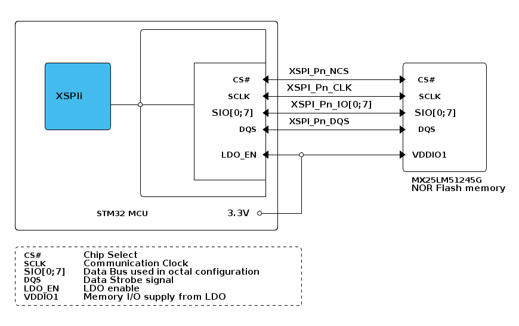

# __Example: *hal_xspi_nor_mem_mapped_dtr_mx25lm51245g*__

**Example version:** 2.0.0

[](https://dev.st.com/stm32cube-docs/examples/arch-v1/en/read/read_toc.html "An offline version is also available in the STM32Cube firmware package.")

How to program and read the MX25LM51245G Octo-SPI NOR flash memory, in Octal-SPI DTR and memory-mapped modes, using the HAL API.


## __1. Detailed scenario__

__Initialization phase__: At main program start, the `mx_system_init()` function is called. It initializes the peripherals, nonvolatile memory (such as flash memory, NVM, or external memories), MPU regions (if applicable), the system clock, and the SysTick.

The application executes the following __example steps__:

__Step 1__: configures and initializes the XSPI instance.

__Step 2__: configures the MX25LM51245G NOR memory in Octal SPI-DTR (double-transfer-rate) mode by enabling the write operation in Single-SPI mode,
then switching the device to Octal DTR mode.

__Step 3__: erases the first 4Kbyte sector of the memory, in automatic polling mode, by executing the Sector Erase command.

__Step 4__: enables the memory-mapped mode for octal read and write operations.

__Step 5__: configures the memory-mapped mode and starts it. The MX25LM51245G device is seen as an internal memory.

__Step 6__: writes the TX buffer to the first page of the MX25LM512G device.

__Step 7__: reads back the written TxBuffer from the memory first page and check data correctness.

__Step 8__: stops the memory-mapped mode.

__Step 9__: deinitializes the XSPI instance.

__End of example__: reports the outcome of the data transfer via the variable `ExecStatus` and the status LED.

If you enable `USE_TRACE`, you can follow these execution steps in the terminal logs:
```text
[INFO] Step 1: Device initialization COMPLETED.
[INFO] Step 2: Memory configuration in DTR mode COMPLETED.
[INFO] Step 3: Memory erasing COMPLETED.
[INFO] Step 4: Memory configured for octal read/write in memory-mapped mode.
[INFO] Step 5: Memory-mapped mode STARTED.
[INFO] Step 6: Page program operation COMPLETED.
[INFO] Step 7: Memory read COMPLETED. Data written and read match.
[INFO] Step 8: Memory-mapped mode STOPPED.
[INFO] Step 9: de-init
```


## __2. Example configuration__

[](https://dev.st.com/stm32cube-docs/examples/arch-v1/en/index.html "An offline version is also available in the STM32Cube firmware package.")

This example demonstrates the following peripherals:

__XSPI__:

XSPI is the abbreviation of eXpanded Serial Peripheral Interface. This interface supports most external serial memories, particularly the MX25LM51245G serial NOR flash memory.
In this example, it drives the Octo-SPI interface.

It is configured as indicated below:

- The OCTOSPI hardware interface is configured in Octo-SPI mode.

- The clock mode is configured to low. The clock polarity is configured to high.

- Any prescaler can be used as long as the XSPI bus frequency stays below the maximum frequency supported by the external memory.

- The OCTOSPI interface operates in the regular-command protocol. It communicates with the memory device by using commands including up to five phases.

- The FIFO threshold is set to 4.

- The selected GPIO pins support the OCTOSPI alternate function. They are configured in push-pull mode with no internal pull-up or pull-down activation. A pull-up resistor is required only on the NCS pin, which must remain high when inactive.

- The GPIO speed for the XSPI data lines must be configured to High (or Very High) to ensure correct operation at the configured XSPI clock frequency.

__DLYB__:

It is configured for the Octo-SPI interface to insert delays between data and CLK signals during data read operations to compensate for data propagation delays.

In this example, the delay block is enabled, automatic delay evaluation is disabled, and a fixed delay value of 4 is applied.


## __3. Hardware environment and setup__

### __3.1. Generic Setup__

This section describes the hardware setup principles that apply to any board.

The MX25LM51245G external NOR flash supports a maximum clock frequency of 133 MHz.

<!--
```text
@startuml
@startditaa{doc/example_xspi_nor_mem_mapped_dtr_mx25lm51245g-setup.png} -E  -S
/-------------------------------------------\
|                    /--------------------+ |
|                    |                    | |
|                    |                    | |
|                    |                    | |
|    /----------\    |        +-----------+ |                    /-------------\
|    |          |    |        |           | | XSPI_Pn_NCS        |             |
|    |          |    |        |      CS#  <-+------------------+->  CS#        |
|    |          |    |        |           | | XSPI_Pn_CLK        |             |
|    | XSPIi    |    |        |     SCLK  <-+------------------+->  SCLK       |
|    |          +----*-+------+           | | XSPI_Pn_IO[0;7]    |             |
|    |          |    |        |  SIO[0;7] <-+------------------+-> SIO[0;7]    |
|    | c4BE     |    |        |           | | XSPI_Pn_DQS        |             |
|    \----------/    |        |       DQS <-+------------------+->  DQS        |
|                    |        |           | |                    |             |
|                    |        |           | |                    |             |
|                    |        |    LDO_EN <-+---*--------------+-> VDDIO1      |
|                    |        |           | |   |                |             |
|                    |        |           | |   |                \-------------/
|                    |        +-----------+ |   |                  MX25LM51245G
|                    |                    | |   |                  NOR Flash memory
|                    \--------------------+ |   |
|                                           |   |
|             STM32 MCU             3.3V *--+---+
|                                           |
\-------------------------------------------/

/-----------------------------------------------\
| CS#       Chip Select                         |
| SCLK      Communication Clock                 |
| SIO[0;7]  Data Bus used in octal configuration|
| DQS       Data Strobe signal                  |
| LDO_EN    LDO enable                          |
| VDDIO1    Memory I/O supply from LDO          |
\-=---------------------------------------------+

@endditaa
@endumldd
```
-->


**_NOTE:_**

- LDO_EN is not always available, its presence depends on the specific board. For more details, refer to the corresponding **Specific board setups** section.

- When using external memories, ensure that all required power supplies are enabled (for example  VDDIO). The exact ways to enable them are described in each **Specific board setups** section.

### __3.2. Specific board setups__

This section describes the exact hardware configurations of your project.

<details>
<summary>On STM32C5 series.</summary>
<details>
  <summary>On board NUCLEO-C5A3ZG.</summary>

  | Board connector   | MCU pin | Signal name       | ARDUINO <br> connector pin |
  | :---:             | :---:   | :---:             | :---:                      |
  | ---NA---          | PF9     | XSPI_IO0          | ------------NA--------     |
  | ---NA---          | PF8     | XSPI_IO1          | ------------NA--------     |
  | ---NA---          | PF7     | XSPI_IO2          | ------------NA--------     |
  | ---NA---          | PF6     | XSPI_IO3          | ------------NA--------     |
  | ---NA---          | PE7     | XSPI_IO4          | ------------NA--------     |
  | ---NA---          | PE8     | XSPI_IO5          | ------------NA--------     |
  | ---NA---          | PE9     | XSPI_IO6          | ------------NA--------     |
  | ---NA---          | PE10    | XSPI_IO7          | ------------NA--------     |
  | ---NA---          | PB2     | XSPI_DQS          | ------------NA--------     |
  | ---NA---          | PF10    | XSPI_CLK          | ------------NA--------     |
  | ---NA---          | PE11    | XSPI_NCS          | ------------NA--------     |
  | ---NA---          | NRST    | NRST              | ------------NA--------     |
  | ---NA---          | PG9     | LDO_EN            | ------------NA--------     |
  | ---NA---          | PA5     | ARDUINO LED LD1   | ARDUINO CONNECTOR - D13    |

**XSPI clock frequency**: in this board configuration, the XSPI clock is set to 144 MHz. The DLYB is configured to synchronize with the memory and to clock the receive data without exceeding the maximum frequency supported by the MX25LM51245G.

**Power supplies for M.2 (Key A) SERIALMEMORY**: Make sure the power supply is enabled before running XSPI NOR Flash examples on this board:

- The memory module VDDIO1 is supplied through the on-board LDO. This LDO must be enabled via the LDO_EN signal, which is driven by pin PG9 (NUCLEO-C5A3ZG) through the M.2 connector.

- To enable LDO_EN, pin PG9 (CN11-25) is driven high to 3.3V by the example to power on the memory module, no external wiring of this pin is needed.

</details>
</details>


## __4. Troubleshooting__

[](https://dev.st.com/stm32cube-docs/examples/arch-v1/en/debug/debug_toc.html "An offline version is also available in the STM32Cube firmware package.")

Find below the points of attention for this specific example.

__Connection and power supply__:
Make sure that the external memory is connected to the STM32 pins used by the configured XSPI/OCTOSPI instance, and that it is correctly powered: if not, review the related power supply configuration of the external memory.


## __5. See Also__

[](https://dev.st.com/stm32cube-docs/examples/arch-v1/en/more/more_toc.html "An offline version is also available in the STM32Cube firmware package.")

This [application note](https://community.st.com/ysqtg83639/attachments/ysqtg83639/stm32-mcu-products-forum/63143/1/MX25LM51245G,%203V,%20512Mb,%20v1.0.pdf)
explains how to use the Octo-SPI interface on STM32 microcontrollers.

You can also refer to this example:

- hal_xspi_nor_write_read_mx25lm51245g: demonstrates how to use the MX25LM51245G flash in auto-polling mode.

- hal_xspi_nor_mem_mapped_mx25lm51245g: demonstrates how to use the MX25LM51245G flash in memory-mapped mode.

More information about the MX25LM51245G Octo-SPI NOR flash memory can be found in this [datasheet](https://community.st.com/ysqtg83639/attachments/ysqtg83639/stm32-mcu-products-forum/63143/1/MX25LM51245G,%203V,%20512Mb,%20v1.0.pdf).

More information about the STM32Cube Drivers can be found in the drivers' user manual of the STM32 series you are using.

More information about the STM32 ecosystem can be found in the [STM32 MCU Developer Zone](https://www.st.com/content/st_com/en/stm32-mcu-developer-zone/embedded-software.html).


## __6. License__

Copyright (c) 2026 STMicroelectronics.

This software is licensed under terms that can be found in the LICENSE file in the root directory
of this software component.
If no LICENSE file comes with this software, it is provided AS-IS.

