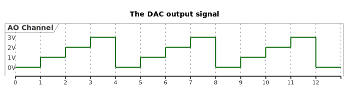

# __Example: *ll_dac_simple_conversion_trig_sw*__

**Example version:** 2.0.0

How to use the DAC LL API to generate signals using the software trigger feature.

## __1. Detailed scenario__

__Initialization phase__: At main program start, the `mx_system_init()` function is called. It initializes the peripherals, nonvolatile memory (such as flash memory, NVM, or external memories), MPU regions (if applicable), the system clock, and the SysTick.

The application executes the following __example steps__:

- __Step 1__: The DAC is initialized, calibrated and started.

__Step 2__: At each call, the DAC outputs the following voltage. The DAC conversion is triggered by using the software trigger feature.
The __Step2__ is executed indefinitely if no error occurs.

__End of example__: The DAC conversion is repeated endlessly (step 2 is running in a loop)
as long as there is no error.
The example status is reported via the variable **ExecStatus**,
and the status LED remains turned on in case of success.

## __2. Example configuration__

__DAC__: one output of the DAC is configured as below:

  - Software trigger selected.
  - 8-bits DAC data are used with right alignment.
  - Output buffer is enabled.

## __3. Hardware environment and setup__

### __3.1. Generic Setup__

The DAC output signal can be displayed by connecting an oscilloscope to the corresponding board connectors.

### __3.2. Specific board setups__

This section describes the exact hardware configurations of your project.

  
On STM32C5 series.

  

    
On board NUCLEO-C542RC.

  |  Board connector  |  MCU pin  |  Signal name  |  ARDUINO   connector pin |  User Label  |
  |:-----------------:|:---------:|:-------------:|:----------------------------:|:------------:|
  |       CN8-3       |    PA4    |   DAC1_OUT1   |              -               |     PA4      |

  

  

    
On board NUCLEO-C562RE.

  |  Board connector  |  MCU pin  |  Signal name  |  ARDUINO   connector pin |  User Label  |
  |:-----------------:|:---------:|:-------------:|:----------------------------:|:------------:|
  |       CN8-3       |    PA4    |   DAC1_OUT1   |              -               |     PA4      |

  

  

    
On board NUCLEO-C5A3ZG.

  |  Board connector  |  MCU pin  |  Signal name  |  ARDUINO   connector pin |  User Label  |
  |:-----------------:|:---------:|:-------------:|:----------------------------:|:------------:|
  |       CN8-3       |    PA4    |   DAC1_OUT1   |              -               |     PA4      |

  

## __4. Troubleshooting__

Using the buffer feature of the DAC can impact its accuracy. To have further information about the DAC accuracy, you can
check the datasheet and the reference manual corresponding to your MCU.

## __5. See Also__

You can also refer to this other example:

- hal_dac_simple_conversion_trig_sw: same example with HAL.

- [Application Note AN4566](https://www.st.com/content/ccc/resource/technical/document/application_note/6f/35/61/e9/8a/28/48/8c/DM00129215.pdf/files/DM00129215.pdf/jcr:content/translations/en.DM00129215.pdf): How to improve DAC performance in STM32 microcontrollers.

- [Application Note AN3126](https://www.st.com/content/ccc/resource/technical/document/application_note/05/fb/41/91/39/02/4d/1e/CD00259245.pdf/files/CD00259245.pdf/jcr:content/translations/en.CD00259245.pdf): How to use DAC for audio and waveform generation in STM32 products.

The documentation of the drivers of the relevant STM32 series contains more detailed information.

For instance for the STM32C5 series: [HAL documentation](https://dev.st.com/stm32cube-docs/stm32c5xx-hal-drivers/latest/en/index.html).

More information about the STM32 ecosystem can be found in the [STM32 MCU Developer Zone](https://www.st.com/content/st_com/en/stm32-mcu-developer-zone/embedded-software.html).

## __6. License__

Copyright (c) 2026 STMicroelectronics.

This software is licensed under terms that can be found in the LICENSE file in the root directory
of this software component.
If no LICENSE file comes with this software, it is provided AS-IS.
