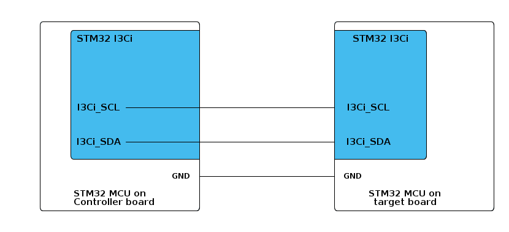

# __Example: *ll_i3c_direct_polling_target*__

**Example version:** 2.0.0

How to monitor the assigned dynamic address and validate the MRL/MWL update flags (DAUPD/MRLUPD/MWLUPD) using the I3C bus protocol in direct polling mode with the LL (Low-Layer) API.

## __1. Detailed scenario__

In this example, the target application waits for its dynamic address update, then validates the MRL/MWL update flags (MRLUPD/MWLUPD) using polling in direct mode.

__Initialization phase__: At main program start, the `mx_system_init()` function is called. It initializes the peripherals, nonvolatile memory (such as flash memory, NVM, or external memories), MPU regions (if applicable), the system clock, and the SysTick.

The application executes the following __example steps__:

__Step 1__: Configures and initializes the I3C target instance.

__Step 2__: Waits for the Dynamic Address Update flag (DAUPD), optionally verifies the assigned dynamic address when error handling is enabled, then clears the flag.

__Step 3__: Waits for the Max Read Length (MRLUPD) and Max Write Length (MWLUPD) updates, validates the received values, and clears the update flags after validation.

The communication status is reported via the status LED and the variable `ExecStatus`.

__End of example__: If a mismatch is detected on MRL or MWL, or on the dynamic address when `USE_LL_APP_ERROR` is enabled, the application reports an error status and enters the error handler (status LED blinking).

You can verify that the example runs properly via the status LED and the `ExecStatus` variable.

## __2. Example configuration__

This example demonstrates the following peripherals.

__I3C__: is configured as indicated below:

- The I3C-bus timings are calculated by STM32CubeMX2 by referring to the I3C initialization section in the reference manual.

- The I3C bus is configured to run at the maximum supported speed to demonstrate its highest performance.
  See `__I3C maximum speed__` in section [3.2 Specific board setups](#32-specific-board-setups).

-  ENTDAA (Dynamic Address Assignment) for the I3C target is configured with identifier 0xC6 and MIPI identifier 0x01

To test this example with the controller, you can use the corresponding *ll_i3c_direct_polling_controller* example pack.

## __3. Hardware environment and setup__

### __3.1. Generic Setup__

- The controller board is connected to the target board through the two I3C lines and a common GND.

<!--
@startuml
@startditaa{doc/example_ll_i3c_direct_polling_target-setup.png} -E -S
    /-------------------------\                     /-------------------------\
    |    /--------------------+                     +--------------\          |
    |    |STM32 I3Ci          |                     |  STM32 I3Ci  |          |
    |    |                    |                     |              |          |
    |    |                    |                     |              |          |
    |    |                    |                     |              |          |
    |    |                    |                     |              |          |
    |    |                    |                     |              |          |
    |    |                    |                     |              |          |
    |    |                    |                     |              |          |
    |    |                    |                     |              |          |
    |    |I3Ci_SCL------------+---------------------+ I3Ci_SCL     |          |
    |    |                    |                     |              |          |
    |    |                    |                     |              |          |
    |    |                    |                     |              |          |
    |    |I3Ci_SDA------------+---------------------+ I3Ci_SDA     |          |
    |    |               c4BE |                     |       c4BE   |          |
    |    \--------------------+                     +--------------/          |
    |                         |                     |                         |
    |                     GND +---------------------+ GND                     |
    |                         |                     |                         |
    |     STM32 MCU on        |                     |     STM32 MCU on        |
    |     Controller board    |                     |     target board        |
    \-------------------------/                     \-------------------------/

@endditaa
@endumldd
-->

### __3.2. Specific board setups__

The I3C serial clock (SCL) and data (SDA) lines can be observed by connecting an oscilloscope or a logic analyzer to the corresponding board connectors.

This section describes the exact hardware configurations of your project.

On STM32C5 series.

  
I3C maximum speed

The maximum speed configured for these series is 12,5MHz.

    
On board NUCLEO-C542RC.

  | Board connector | MCU pin | Signal name | ARDUINO   connector pin |    User Label     |
  |:---------------:|:-------:|:-----------:|:---------------------------:|:-----------------:|
  |     CN5-10      |   PB6   |  I3C1_SCL   |  ARDUINO CONNECTOR - D15    |       PB6         |
  |     CN5-9       |   PB7   |  I3C1_SDA   |  ARDUINO CONNECTOR - D14    |       PB7         |

  
On board NUCLEO-C562RE.

  | Board connector | MCU pin | Signal name | ARDUINO   connector pin |    User Label     |
  | :-------------: | :-----: | :---------: | :------------------------: |:-----------------:|
  |      CN5-10     |   PB6   |  I3C1_SCL   |  ARDUINO CONNECTOR - D15   |       PB6         |
  |      CN5-9      |   PB7   |  I3C1_SDA   |  ARDUINO CONNECTOR - D14   |       PB7         |

  
On board NUCLEO-C5A3ZG.

  | Board connector | MCU pin | Signal name | ARDUINO   connector pin |    User Label     |
  | :-------------: | :-----: | :---------: | :------------------------: |:-----------------:|
  |      CN10-3     |   PB6   |  I3C1_SCL   |  ARDUINO CONNECTOR - D15   |       PB6         |
  |      CN10-5     |   PB7   |  I3C1_SDA   |  ARDUINO CONNECTOR - D14   |       PB7         |

## __4. Troubleshooting__

Here are the points of attention for this specific example:

  1. __Dynamic Address Assignment (DAA)__: DAA is started by the controller using the `ENTDAA` command, one of the I3C Common Command Codes (CCC), standard broadcast commands used to manage devices on the bus. The controller enumerates each target, which responds with its identification payload (PID, BCR, DCR). The controller then assigns a unique dynamic address to each target, which is used for all further private transfers.
  In this example, the target checks the dynamic address update using polling (see Step 2).

  2. If there are no I3C signals observed, remember to check these points first:
     - The GND pins of the controller and target boards are connected.
     - Use the shortest possible wires between the boards to improve signal integrity.

  3. For correct synchronization, always run the target application before running the controller. This ensures the target is ready to respond to the controller's DAA request.

__Error handling__: In LL examples, error handling is controlled by the USE_LL_APP_ERROR constant in the application files to reduce code footprint. This compilation flag is disabled by default. If the example does not behave as expected, enable error handling for debugging by setting USE_LL_APP_ERROR to 1 in ll_example.h.

## __5. See Also__

- You can find the application note AN5879 related to the I3C MANUAL on the [AN5879](https://www.st.com/resource/en/application_note/an5879-introduction-to-i3c-for-stm32-mcus-stmicroelectronics.pdf) website if you want to go further on some technical details of the I3C bus

The documentation of the drivers of the relevant STM32 series contains more detailed information.

For instance for the STM32C5 series: [HAL documentation](https://dev.st.com/stm32cube-docs/stm32c5xx-hal-drivers/latest/en/index.html).

More information about the STM32 ecosystem can be found in the [STM32 MCU Developer Zone](https://www.st.com/content/st_com/en/stm32-mcu-developer-zone/embedded-software.html).

## __6. License__

Copyright (c) 2026 STMicroelectronics.

This software is licensed under terms that can be found in the LICENSE file in the root directory
of this software component.
If no LICENSE file comes with this software, it is provided AS-IS.
