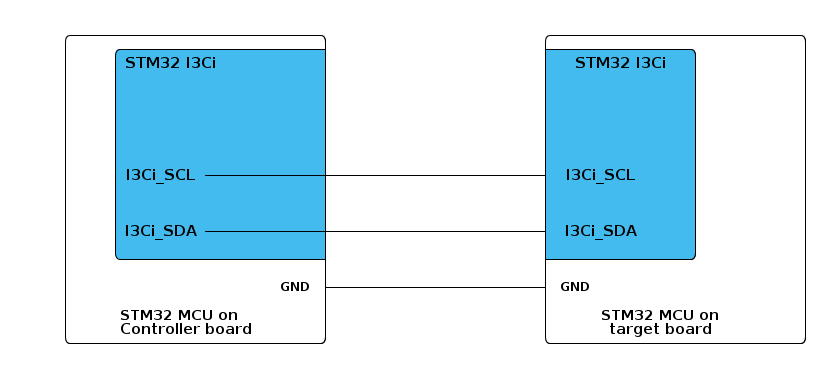

# __Example: *ll_i3c_hotjoin_it_target*__

**Example version:** 2.0.0

How to an I3C target using the LL API in interrupt (IT) mode to HotJoin an active communication via I3C bus.

This example implements the target code for the HotJoin mechanism with the controller side, using interrupts (IT).

**Note that the terminology Controller/Target characterizes the role taken by each device in the I3C communication, corresponding respectively to the I3C master and I3C slave in legacy terminology.**

## __1. Detailed scenario__

The HotJoin is the process that allows an I3C Target device to dynamically attach to an already active I3C bus and announce its presence to the I3C Controller without requiring a bus reset or power-cycle.
This example demonstrates how multiple target application participates in a I3C communication via a HotJoin principle using the STM32 LL API in interrupt-driven (IT) mode.

__Initialization phase__: At main program start, the `mx_system_init()` function is called. It initializes the peripherals, nonvolatile memory (such as flash memory, NVM, or external memories), MPU regions (if applicable), the system clock, and the SysTick.

The application executes the following __example steps__:

__Step 1__: Configures and initializes the I3C instance.

__Step 2__: Send HotJoin request to the Controller and waits for DAA completion.

The communication status is reported via the status LED and the variable `ExecStatus`.

__End of example__: If no error occurs, the target successfully receives and validates its dynamic address. If an ENTDAA error occurs, the process stops and an error status is reported.

## __2. Example configuration__

This example demonstrates the following peripherals.

__I3C__: is configured as indicated below:

- The I3C-bus timings are calculated by STM32CubeMX2 by referring to the I3C initialization section in the reference manual.

- The I3C bus is configured to run at the maximum supported speed to demonstrate its highest performance.
  See `__I3C maximum speed__` in section [3.2 Specific board setups](#32-specific-board-setups).

-  ENTDAA (Dynamic Address Assignment) for the I3C target is configured with identifier 0xC6 and MIPI identifier 0x01

- The event and error interrupts of the I3C instance are configured and enabled in the NVIC.

To test this example with the controller, you can use the corresponding *ll_i3c_hotjoin_it_controller* example pack.

__Multi-target setup and preparation__:

To simulate multiple I3C targets for HotJoin, prepare each board as follows:

- Before connecting to the I3C bus, set a unique MIPI identifier for each target.

## __3. Hardware environment and setup__

### __3.1. Generic Setup__

- The controller board is connected to the target board through the two I3C lines and a common GND.

<!--
@startuml
@startditaa{doc/example_ll_i3c_hotjoin_it_target-setup.png} -E -S
    /-------------------------\                     /-------------------------\
    |    /--------------------+                     +--------------\          |
    |    |STM32 I3Ci          |                     |  STM32 I3Ci  |          |
    |    |                    |                     |              |          |
    |    |                    |                     |              |          |
    |    |                    |                     |              |          |
    |    |                    |                     |              |          |
    |    |                    |                     |              |          |
    |    |                    |                     |              |          |
    |    |                    |                     |              |          |
    |    |                    |                     |              |          |
    |    |                    |                     |              |          |
    |    |                    |                     |              |          |
    |    |                    |                     |              |          |
    |    |                    |                     |              |          |
    |    |                    |                     |              |          |
    |    |                    |                     |              |          |
    |    |                    |                     |              |          |
    |    |I3Ci_SCL------------+---------------------+ I3Ci_SCL     |          |
    |    |                    |                     |              |          |
    |    |                    |                     |              |          |
    |    |                    |                     |              |          |
    |    |I3Ci_SDA------------+---------------------+ I3Ci_SDA     |          |
    |    |               c4BE |                     |       c4BE   |          |
    |    \--------------------+                     +--------------/          |
    |                         |                     |                         |
    |                     GND +---------------------+ GND                     |
    |                         |                     |                         |
    |     STM32 MCU on        |                     |     STM32 MCU on        |
    |     Controller board    |                     |     target board        |
    \-------------------------/                     \-------------------------/

@endditaa
@endumldd
-->

### __3.2. Specific board setups__

The I3C serial clock (SCL) and data (SDA) lines can be observed by connecting an oscilloscope or a logic analyzer to the corresponding board connectors.

This section describes the exact hardware configurations of your project.

  
On STM32C5 series.

  

    
I3C maximum speed

  The maximum speed configured for these series is 12,5MHz.

  

  

    
On board NUCLEO-C542RC.

  |  MCU pin  |  Signal name  |  User Label   |
  |:---------:|:-------------:|:-------------:|
  |    PH0    |  RCC_OSC_IN   |    OSC_IN     |
  |    PH1    |  RCC_OSC_OUT  |    OSC_OUT    |
  |    PB6    |   I3C1_SCL    |      PB6      |
  |    PB7    |   I3C1_SDA    |      PB7      |
  |    PA5    |     GPIO      | MX_STATUS_LED |

  

  

    
On board NUCLEO-C562RE.

  |  MCU pin  |  Signal name  |  User Label   |
  |:---------:|:-------------:|:-------------:|
  |    PH0    |  RCC_OSC_IN   |    OSC_IN     |
  |    PH1    |  RCC_OSC_OUT  |    OSC_OUT    |
  |    PB6    |   I3C1_SCL    |      PB6      |
  |    PB7    |   I3C1_SDA    |      PB7      |
  |    PA5    |     GPIO      | MX_STATUS_LED |

  

  

    
On board NUCLEO-C5A3ZG.

  |  MCU pin  |  Signal name  |  User Label   |
  |:---------:|:-------------:|:-------------:|
  |    PH0    |  RCC_OSC_IN   |  PH0_OSC_IN   |
  |    PH1    |  RCC_OSC_OUT  |  PH1_OSC_OUT  |
  |    PB6    |   I3C1_SCL    |      PB6      |
  |    PB7    |   I3C1_SDA    |      PB7      |
  |    PA5    |     GPIO      | MX_STATUS_LED |

  

## __4. Troubleshooting__

Here are the points of attention for this specific example:

  1. If there are no I3C signals observed, remember to check these points first:
     - The GND pins of the controller and target boards are connected.
     - Use the shortest possible wires between the boards to improve signal integrity.

  2. For correct synchronization, always run the target application before running the controller. This ensures the target is ready to respond to the controller's DAA request.

  3. A short delay is provided before starting the DAA process to allow the target to initialize and be ready for address assignment.

__Error handling__: In LL examples, error handling is controlled by the USE_LL_APP_ERROR constant in the application files to reduce code footprint. This compilation flag is disabled by default. If the example does not behave as expected, enable error handling for debugging by setting USE_LL_APP_ERROR to 1 in ll_example.h.

## __5. See Also__

- You can find the application note AN5879 related to the I3C MANUAL on the [AN5879](https://www.st.com/resource/en/application_note/an5879-introduction-to-i3c-for-stm32-mcus-stmicroelectronics.pdf) website if you want to go further on some technical details of the I3C bus

- You can see the application note [AN5593](https://www.st.com/resource/en/application_note/an5593-how-to-use-the-gpdma-for-stm32-mcus-stmicroelectronics.pdf) to get further explanation about DMA port allocation.

The documentation of the drivers of the relevant STM32 series contains more detailed information.

For instance for the STM32C5 series: [HAL documentation](https://dev.st.com/stm32cube-docs/stm32c5xx-hal-drivers/latest/en/index.html).

More information about the STM32 ecosystem can be found in the [STM32 MCU Developer Zone](https://www.st.com/content/st_com/en/stm32-mcu-developer-zone/embedded-software.html).

## __6. License__

Copyright (c) 2026 STMicroelectronics.

This software is licensed under terms that can be found in the LICENSE file in the root directory
of this software component.
If no LICENSE file comes with this software, it is provided AS-IS.
