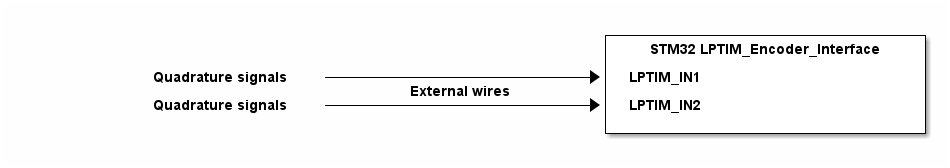

# __Example: *ll_lptim_encoder*__

**Example version:** 2.0.0

How to configure the Low-Power Timer (LPTIM) peripheral in encoder mode to determine the rotation direction with minimal energy consumption.

## __1. Detailed scenario__

__Initialization phase__: At program start, the `mx_system_init()` function is called. It initializes peripherals, nonvolatile memory (flash, NVM, or external memories), MPU regions (if applicable), the system clock, and SysTick.

The application executes the following __example steps__:

__Step 1__: The application code initializes the LPTIM peripheral.

__Step 2__: Start the low-power timer encoder interface.

__End of example__: After step 2, the example is completed. However, the LPTIM encoder interface remains enabled and continues running autonomously.

## __2. Example configuration__

### __2.1. LPTIM configuration__

The encoder interface *LPTIM* is configured as follows:

- Encoder (quadrature) mode on IN1/IN2.
- External counter source; edges on inputs drive count (up or down) autonomously.
- Period set to 0xFFFF (full 16-bit range).

**_NOTE:_** LPTIM encoder mode detects transitions on both input channels to infer direction.

## __3. Hardware environment and setup__

### __3.1. Generic Setup__

To visualize the rotation direction, you need to provide a quadrature signal on `LPTIM_IN1` and `LPTIM_IN2`. (Optional functional: if no encoder hardware is available, you can generate a quadrature pattern by manually toggling two GPIO pins with a 90 phase shift.)

<!--
@startuml
@startditaa{doc/STMicroelectronics.example_ll_lptim_encoder-setup.png}

                                                          +-------------------------------+
                                                          | STM32 LPTIM_Encoder_Interface |
                                                          |                               |
           Quadrature signals -------------------------+->+ LPTIM_IN1                     |
                                     External wires       |                               |
           Quadrature signals -------------------------+->+ LPTIM_IN2                     |
                                                          |                               |
                                                          +-------------------------------+
@endditaa
@enduml
-->

### __3.2. Specific board setups__

This section describes the exact hardware configurations of your project.

  
On STM32C5 series.

  

    
On board NUCLEO-C542RC.

  | Board pin  | MCU pin | Signal name      | ARDUINO pin |
  | :---:      | :---:   | :---:            | :---:       |
  | CN5-6      | PA5     | MX_STATUS_LED    | -           |
  | -          | PA1     | LPTIM_IN1        | CN12-26     |
  | -          | PD11    | LPTIM_IN2        | CN12-13     |

  

  

    
On board NUCLEO-C562RE.

  | Board pin  | MCU pin | Signal name      | ARDUINO pin |
  | :---:      | :---:   | :---:            | :---:       |
  | CN5-6      | PA5     | MX_STATUS_LED    | -           |
  | -          | PA1     | LPTIM_IN1        | CN12-26     |
  | -          | PD11    | LPTIM_IN2        | CN12-13     |

  

  

    
On board NUCLEO-C5A3ZG.

  | Board pin  | MCU pin | Signal name      | ARDUINO pin |
  | :---:      | :---:   | :---:            | :---:       |
  | CN5-6      | PA5     | MX_STATUS_LED    | -           |
  | -          | PA1     | LPTIM_IN1        | CN12-26     |
  | -          | PD11    | LPTIM_IN2        | CN12-13     |

  

## __4. Troubleshooting__

Here are the points of attention for this specific example:

__System clock__: Ensure the system clock is configured correctly to provide accurate timing for the encoder interface.

## __5. See Also__

- [Application Note AN2834](https://www.st.com/content/ccc/resource/technical/document/application_note/group0/3f/4c/a4/82/bd/63/4e/92/CD00211314/files/CD00211314.pdf/jcr:content/translations/en.CD00211314.pdf): How to get the best ADC accuracy in STM32 microcontrollers

- [Application Note AN3116](https://www.st.com/content/ccc/resource/technical/document/application_note/c4/63/a9/f4/ae/f2/48/5d/CD00258017.pdf/files/CD00258017.pdf/jcr:content/translations/en.CD00258017.pdf): STM32's ADC modes and their applications

- [Application Note AN4195](https://www.st.com/resource/en/application_note/an4195-stm32f30x-adc-modes-and-application-stmicroelectronics.pdf): STM32F30x ADC modes and application

- [Application Note AN5346](https://www.st.com/content/ccc/resource/technical/document/application_note/group1/02/ba/86/7e/6c/d7/4e/08/DM00625282/files/DM00625282.pdf/jcr:content/translations/en.DM00625282.pdf): STM32G4 ADC use tips and recommendations

- [Application Note AN2668](https://www.st.com/content/ccc/resource/technical/document/application_note/c5/24/7d/f6/98/7f/4c/f3/CD00177113.pdf/files/CD00177113.pdf/jcr:content/translations/en.CD00177113.pdf): Improving STM32F1 series, STM32F3 series and STM32Lx series
 ADC resolution by oversampling

- [Application Note AN4073](https://www.st.com/content/ccc/resource/technical/document/application_note/a0/71/3e/e4/8f/b6/40/e6/DM00050879.pdf/files/DM00050879.pdf/jcr:content/translations/en.DM00050879.pdf): How to improve ADC accuracy when using STM32F2xx and STM32F4xx microcontrollers

- [Application Note AN4629](https://www.st.com/content/ccc/resource/technical/document/application_note/33/e1/e4/5c/aa/67/4c/74/DM00150423.pdf/files/DM00150423.pdf/jcr:content/translations/en.DM00150423.pdf): ADC hardware oversampling for microcontrollers of the STM32L0 and L4 series

- [Application Note AN5354](https://www.st.com/content/ccc/resource/technical/document/application_note/group1/11/72/be/05/cd/94/44/5b/DM00628458/files/DM00628458.pdf/jcr:content/translations/en.DM00628458.pdf): Getting started with the STM32H7 series MCU 16-bit ADC

- [Training](https://www.st.com/content/ccc/resource/training/technical/product_training/1e/0f/65/34/7e/b0/4e/ca/STM32L4_Analog_ADC.pdf/files/STM32L4_Analog_ADC.pdf/jcr:content/translations/en.STM32L4_Analog_ADC.pdf): STM32L4-Analog-ADC(ADC)

- [Training](https://www.st.com/content/ccc/resource/training/technical/product_training/group0/0b/e4/af/01/4a/92/44/dc/STM32F7_Analog_ADC/files/STM32F7_Analog_ADC.pdf/jcr:content/translations/en.STM32F7_Analog_ADC.pdf): STM32F7_Analog_ADC

The documentation of the drivers of the relevant STM32 series contains more detailed information.

More information about the STM32 ecosystem can be found in the [STM32 MCU Developer Zone](https://www.st.com/content/st_com/en/stm32-mcu-developer-zone/embedded-software.html).

## __6. License__

Copyright (c) 2026 STMicroelectronics.

This software is licensed under terms that can be found in the LICENSE file in the root directory of this software component. If no LICENSE file comes with this software, it is provided AS-IS.
