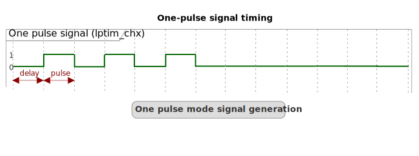

# __Example: *ll_lptim_one_pulse_it*__

**Example version:** 2.0.0

How to generate a finite sequence of pulses with precise timing control, followed by a permanent reset of the output signal using LL API.

## __1. Detailed scenario__

__Initialization phase__: At main program start, the `mx_system_init()` function is called. It initializes the peripherals, nonvolatile memory (such as flash memory, NVM, or external memories), MPU regions (if applicable), the system clock, and the SysTick.

The application executes the following __example steps__:

__Step 1__: Initializes the LPTIM instance and starts the LPTIM and its output channel in interrupt mode.

__Step 2__: Waits for the low-power timer's repetition counter underflow event, then  verifies that the number of output pulses generated matches the expected count, signaling an error if there is a mismatch.

__End of example__: If no error occurs, 3 positive pulses are generated on the LPTIM output channel and then the status LED is toggled.

## __2. Example configuration__

### __2.1. LP-Timer configuration__

The *LPTIM* is configured as follows:

  - The LPTIM is clocked from an internal clock source (selectable through the RCC).

  - The LPTIM operates in one-pulse mode. In **one-pulse mode**, the timer output initially behaves similarly to a PWM signal, producing a series of pulses. However, unlike continuous PWM operation, the output in this mode is limited to a finite number of pulses defined by the **repetition counter** setting. Specifically, the total number of pulses generated is:

        N = Repetition Counter + 1

  - The prescaler and the period values are configured to generate a signal with a 1 ms period.

  - The LPTIM output channel (LPTIM_CHx) is set to output mode with the output polarity configured as HIGH.

  - The pulse value is set to achieve a 50% positive duty cycle, corresponding to a positive pulse duration of 500 microseconds.

  - No external trigger is configured; therefore, the timer is started using a **software trigger**.

The waveform generated on the LP-Timer output is illustrated below:

  

- **Pulse Delay (delay)**: This is the initial delay before the pulse starts and is set by the compare register
  value (TIMx_CCR1). It defines the time interval from the timer start to the rising edge of the output pulse.

- **Pulse Duration (pulse)**: This is the active pulse width, defined as the difference between the auto-reload
  register (TIMx_ARR) and the compare register (TIMx_CCR1):

  

    
Pulse calculation details

        tPULSE = TIMx_ARR - TIMx_CCR1

  

### __2.2. GPIO configuration__

One pin must be configured for the LPTIM output channel: [see the specific boards setups](#32-specific-board-setups)

The GPIO pin is configured in:

- Alternate function as a LPTIM output channel of its respective LPTIM instance.

- Push-pull mode with no pull-up or pull-down resistors activated.

## __3. Hardware environment and setup__

### __3.1. Generic Setup__

The PWM signals generated on the LPTIM channel can be displayed by connecting an oscilloscope to the corresponding board connectors.

### __3.2. Specific board setups__

  
On STM32C5 series.

  

    
LPTIM PWM Signal Generation: Frequency and Duty Cycle Configuration

  

    
Clock Setup and Prescaler Configuration

- **System Clock (SYSCLK)** is set to 144 MHz.
- **AHB clock (HCLK)** and **APB clock (PCLK)** prescalers are both set to 1, so:

    HCLK = PCLK = SYSCLK = 144 MHz

- The **LPTIM kernel clock** (lptim_ker_ck) is sourced from the APB clock:

    lptim_ker_ck = PCLK = HCLK = SYSCLK = 144 MHz

- The **LPTIM prescaler (PRESC)** is fixed at division by 4:

    PRESC = 1/4

- Therefore, the **LPTIM counter clock frequency** (lptim_cnt_ck) is:

    lptim_cnt_ck = lptim_ker_ck / PRESC = 144 MHz / 4 = 36 MHz

  

  

    
Calculating the PWM Period (ARR)

- To generate a PWM signal of frequency fPWM, the **period** value programmed into the Auto-Reload Register (ARR) is:

    period = (lptim_cnt_ck / fPWM) - 1

- For example, to get a **1 kHz PWM** signal:

    period = (36 000 000 / 1 000) - 1 = 36 000 - 1 = 35 999

  

  

    
Calculating the PWM Pulse (CCR) for Duty Cycle

- The **pulse value** programmed into the Compare Register (CCR) determines the PWM duty cycle D (expressed as a fraction between 0 and 1):

      pulse = D x (period + 1)

- For a **50% duty cycle** (D = 0.5):

      pulse = 0.5 x (35 999 + 1) = 0.5 x (36 000) = 18 000

  

  
Summary Table

| Parameter                | Value / Formula                      | Example (1 kHz, 50%)     |
|--------------------------|--------------------------------------|--------------------------|
| System Clock (SYSCLK)    | Fixed                                | 144 MHz                  |
| LPTIM Kernel Clock       | lptim_ker_ck = SYSCLK$               | 144 MHz                  |
| LPTIM Prescaler (PRESC)  | Fixed division by 4                  | /4                       |
| LPTIM Counter Clock      | lptim_cnt_ck = lptim_ker_ck / 4      | 36 MHz                   |
| PWM Period (ARR)         | lptim_cnt_ck / fPWM- 1               | 35,999                   |
| PWM Pulse (CCR)          | D x (period+ 1)                      | 18 000 (for 50% duty)    |

To generate a PWM signal with a different frequency or duty cycle, replace $f_{PWM}$ and $D$ in the formulas accordingly.

  

  

  

    
On board NUCLEO-C542RC.

  |  Board connector  |  MCU pin  |  Signal name  |  ARDUINO   connector pin  |  User Label  |
  |:-----------------:|:---------:|:-------------:|:----------------------------:|:------------:|
  | CN10-30           |    PB13   | LPTIM1_CH1    |              -               |      -       |

  

  

    
On board NUCLEO-C562RE.

  |  Board connector  |  MCU pin  |  Signal name  |  ARDUINO   connector pin  |  User Label  |
  |:-----------------:|:---------:|:-------------:|:----------------------------:|:------------:|
  | CN10-30           |    PB13   | LPTIM1_CH1    |              -               |      -       |

  

  

    
On board NUCLEO-C5A3ZG.

  |  Board connector  |  MCU pin  |  Signal name  |  ARDUINO   connector pin  |  User Label  |
  |:-----------------:|:---------:|:-------------:|:----------------------------:|:------------:|
  | CN10-30           |    PB13   | LPTIM1_CH1    |              -               |      -       |

  

## __4. Troubleshooting__

Here are the points of attention for this specific example:

__Clock after Stop mode__: When exiting from STOP mode, the system clock must be reconfigured (see the RCC peripheral section in the reference manual of your MCU).

__Systick interruption__: Any peripheral interrupt occurring when the AHB/APB clocks are present (if peripheral vector enabled in the NVIC) can wake up the system from STOP mode (not only EXTI).

__Clock accuracy__: The LPTIM may use the LSI clock as input clock. If used, the accuracy of this one can impact the real timeout value.

## __5. See Also__

This [application note](https://www.st.com/content/ccc/resource/technical/document/application_note/group0/bd/16/1d/53/4a/ef/4e/0e/DM00290631/files/DM00290631.pdf/jcr:content/translations/en.DM00290631.pdf)
explains common LPTIM usages, including timeout.

You can also refer to this other example:

- hal_lptim_one_pulse_it: same example in hal.

The documentation of the drivers of the relevant STM32 series contains more detailed information.

More information about the STM32 ecosystem can be found in the [STM32 MCU Developer Zone](https://www.st.com/content/st_com/en/stm32-mcu-developer-zone/embedded-software.html).

## __6. License__

Copyright (c) 2026 STMicroelectronics.

This software is licensed under terms that can be found in the LICENSE file in the root directory
of this software component.
If no LICENSE file comes with this software, it is provided AS-IS.
