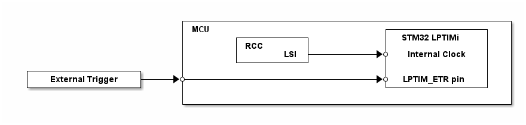

# __Example: *ll_lptim_timeout*__

**Example version:** 2.0.0

How to implement a timeout to wake-up the system using the Low-Power Timer (LPTIM), through the LL LPTIM API.

## __1. Detailed scenario__

__Initialization phase__: At main program start, the `mx_system_init()` function is called. It initializes the peripherals, nonvolatile memory (such as flash memory, NVM, or external memories), MPU regions (if applicable), and the system clock.

The application executes the following __example steps__:

__Step 1__: Initializes the LPTIM instance to operate in the deepest possible low power mode and start it in interrupt mode.

__Step 2__: The device goes in low power mode and waits for an interrupt: Trigger or Timeout. The first trigger edge raises an interruption and starts the timeout. Any successive trigger resets the timeout. If no trigger appears during the programmed timeout, CompareMatch interruption will occur.

__End of example__: If no error occurs, the device enters in low power mode indefinitely and each time the timer reaches the timeout value, the status LED is toggled.

## __2. Example configuration__

__LPTIM__: The LPTIM is configured with these specific parameters:

  - internal clock source
  - timeout mode
  - period counter value should be greater than the pulse value

The LPTIM uses the following features:

  - external trigger input on rising and falling edge to use a GPIO as trigger to reset the LPTIM counter. It allows to firstly start the timeout, and secondly reset the counter and thus prevent the compare match.
  - pulse value is set to have a 1s as timeout

The *LPTIM* may need additional clock configuration to be able to function in low power mode.

- The RCC is configured to keep the LPTIM internal clock while in low power mode.

  

    
Pulse calculation details

      Timeout = CMP / LPTIM_CLK
      CMP = Timeout * LPTIM_CLK

  

## __3. Hardware environment and setup__

### __3.1. Generic Setup__

Please find below the hardware setup principle that applies to any board.

<!--
@startuml
@startditaa{doc/example_ll_lptim_timeout-setup.png}

                            +------------------------------------------------------+
                            | MCU                             +----------------+   |
                            |        +-----------+            | STM32 LPTIMi   |   |
                            |        | RCC       |            |                |   |
                            |        |       LSI +---------+->* Internal Clock |   |
                            |        +-----------+            |                |   |
  +------------------+      |                                 |                |   |
  | External Trigger +---+->*------------------------------+->* LPTIM_ETR pin  |   |
  +------------------+      |                                 +----------------+   |
                            |                                                      |
                            +------------------------------------------------------+

@endditaa
@enduml
-->

### __3.2. Specific board setups__

This section describes the exact hardware configurations of your project.

  
On STM32C5 series.

 **Compare register numerical application**:

  The LPTIM is clocked by the LSI which is equal to 32 kHz for the STM32C5 series. The purpose is to get a 1s as timeout, so:

    CMP = Timeout * LPTIM_CLK
    CMP = 1 s * 32000 Hz
    CMP = 32000
  

    
On board NUCLEO-C542RC.

  |  MCU pin  |  Signal name  |  User Label   |
  |:---------:|:-------------:|:-------------:|
  |    PH0    |  RCC_OSC_IN   |    OSC_IN     |
  |    PH1    |  RCC_OSC_OUT  |    OSC_OUT    |
  |   PA15    |  LPTIM1_ETR   |   NetR16_2    |
  |    PA5    |     GPIO      | MX_STATUS_LED |

  

  

    
On board NUCLEO-C562RE.

  |  MCU pin  |  Signal name  |  User Label   |
  |:---------:|:-------------:|:-------------:|
  |    PH0    |  RCC_OSC_IN   |    OSC_IN     |
  |    PH1    |  RCC_OSC_OUT  |    OSC_OUT    |
  |   PA15    |  LPTIM1_ETR   |   NetR16_2    |
  |    PA5    |     GPIO      | MX_STATUS_LED |

  

  

    
On board NUCLEO-C5A3ZG.

  |  MCU pin  |  Signal name  |  User Label   |
  |:---------:|:-------------:|:-------------:|
  |    PH0    |  RCC_OSC_IN   |  PH0_OSC_IN   |
  |    PH1    |  RCC_OSC_OUT  |  PH1_OSC_OUT  |
  |   PA15    |  LPTIM1_ETR   |   NetR53_2    |
  |    PA5    |     GPIO      | MX_STATUS_LED |

  

## __4. Troubleshooting__

Here are the points of attention for this specific example:

__Interruption management__: The interruption due to the compare match is not the only one to appear. The external trigger interruption also occurs and wakes the device up.

__Clock after Stop mode__: When exiting from STOP mode, the system clock must be reconfigured (see the RCC peripheral section in the reference manual of your MCU).

__Clock accuracy__: The LPTIM may use the LSI clock as input clock. If used, the accuracy of this one can impact the real timeout value.

__Error handling__: In LL examples, error handling is controlled by the USE_LL_APP_ERROR constant in the application files to reduce code footprint. This compilation flag is disabled by default. If the example does not behave as expected, enable error handling for debugging by setting USE_LL_APP_ERROR to 1 in ll_example.h.

__Timeout management__: Polling flag instructions can cause the example to enter an infinite loop. To prevent this, a timeout mechanism is implemented. When the timeout is reached, the program exits the loop and reports the error at the application level. This mechanism is controlled by the USE_LL_APP_TIMEOUT compilation flag, which is disabled by default to reduce code footprint. If the example execution appears to be stuck in an infinite loop, enable this mechanism for debugging by setting USE_LL_APP_TIMEOUT to 1 in ll_example.h.

## __5. See Also__

This [application note](https://www.st.com/content/ccc/resource/technical/document/application_note/group0/bd/16/1d/53/4a/ef/4e/0e/DM00290631/files/DM00290631.pdf/jcr:content/translations/en.DM00290631.pdf)
explains common LPTIM usages, including timeout.

You can also refer to this other example:

- ll_pwr_stop1: demonstrates the STOP1 mode

The documentation of the drivers of the relevant STM32 series contains more detailed information.

For instance for the STM32C5 series: [HAL documentation](https://dev.st.com/stm32cube-docs/stm32c5xx-hal-drivers/latest/en/index.html).

More information about the STM32 ecosystem can be found in the [STM32 MCU Developer Zone](https://www.st.com/content/st_com/en/stm32-mcu-developer-zone/embedded-software.html).

## __6. License__

Copyright (c) 2026 STMicroelectronics.

This software is licensed under terms that can be found in the LICENSE file in the root directory
of this software component.
If no LICENSE file comes with this software, it is provided AS-IS.
