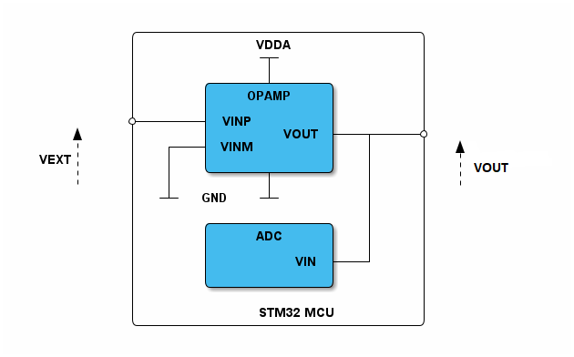

# __Example: *ll_opamp_follower*__

**Example version:** 2.0.0

How to configure, with the HAL API, an embedded amplifier (OPAMP) in follower mode.

An op-amp follower, also known as a voltage follower, is a type of operational amplifier circuit that outputs the same voltage that is input to it.
Even though it doesn't change the voltage, it is used for:

- Impedance Matching: Prevents the previous circuit from being affected by the next one.
- Voltage Buffering: Ensures the signal remains the same without any changes.
- Isolation: Isolates different stages of a circuit, preventing interaction between them.

## __1. Detailed scenario__

__Initialization phase__: At the beginning of the `main()` function, the `mx_system_init()` function is called to initialize the peripherals, the flash interface, the system clock, and the SysTick.

The application executes the following __example steps__:

__Step 1__: configures the OPAMP peripheral.

__Step 2__: Start the OPAMP instance.

__End of example__: If no error occurs, the OPAMP is generated indefinitely.

## __2. Example configuration__

This example demonstrates the **OPAMP** peripheral configured as indicated below:

__OPAMP__ is configured in follower mode.
Its low-power mode is disabled and the device speed is set to high.

## __3. Hardware environment and setup__

### __3.1. Generic Setup__

This section describes the hardware setup principles that apply to any board.
To use this example, apply an external analogic signal on the input pin of the OPAMP (VEXT).
You can measure the output signal on the output pin with an oscilloscope (VOUT).
Since it is an OPAMP follower, VOUT will be equal to VEXT.

<!--
@startuml
@startditaa{doc/example_ll_opamp_follower-setup.png}

            /-------------------------------\
            |             VDDA              |
            |             -+-               |
            |              |                |
            |       /------+------\         |
            |       |    OPAMP    |         |
            |       |             |         |
         ---*-------+ VINP        |         |
      ^     |       |        VOUT +---+-----*---
      |     |   +---+ VINM        |         |   ^
  VEXT:     |   |   |        c4BE |         |   :VOUT
      |     |   |   \------+------/         |   |
      |     |   |          |                |   |
            |  -+-  GND   -+-               |
            |                               |
            |          STM32 MCU            |
            \-------------------------------/
@endditaa
@enduml
-->

### __3.2. Specific board setups__

This section describes the exact hardware configurations of your project.

  
On STM32C5 series.

  

    
On board NUCLEO-C542RC.

  |  MCU pin  |  Signal name  |  User Label   |
  |:---------:|:-------------:|:-------------:|
  |    PH0    |  RCC_OSC_IN   |    OSC_IN     |
  |    PH1    |  RCC_OSC_OUT  |    OSC_OUT    |
  |    PA1    | OPAMP1_VINP0  |      PA1      |
  |    PA6    |  OPAMP1_VOUT  |      PA6      |
  |    PA5    |     GPIO      | MX_STATUS_LED |

  

## __4. Troubleshooting__

Find below the points of attention for this specific example.

__Calibration__: This example uses factory trimming values.
However, calibration can be performed to adjust the values to your working environment.

__filtering__: Adding capacitors can provide filtering features to the circuit.

__Voltage Range__: The OPAMP delivers a voltage between 0V and VDDA (not always 3.3 V).
Be careful when using 1.8 V boards.

__Comparator Use-Case__: Although an OPAMP can be used as a standalone comparator, it is recommended to use a COMP IP
 instead, as it offers more features.

## __5. See Also__

This [application note](https://www.st.com/resource/en/application_note/an5306-operational-amplifier-opamp-usage-in-stm32g4-series-stmicroelectronics.pdf)
explains further the OPAMP application for analog circuits.

You can also refer to these other examples:

- hal_opamp_calibration: demonstrates the calibration of the OPAMP.
- hal_opamp_interconnect: integrates this peripheral with DAC and ADC.

The documentation of the drivers of the relevant STM32 series contains more detailed information.

For instance for the STM32C5 series: [HAL documentation](https://dev.st.com/stm32cube-docs/stm32c5xx-hal-drivers/latest/en/index.html).

More information about the STM32 ecosystem can be found in the [STM32 MCU Developer Zone](https://www.st.com/content/st_com/en/stm32-mcu-developer-zone/embedded-software.html).

## __6. License__

Copyright (c) 2026 STMicroelectronics.

This software is licensed under terms that can be found in the LICENSE file in the root directory
of this software component.
If no LICENSE file comes with this software, it is provided AS-IS.
